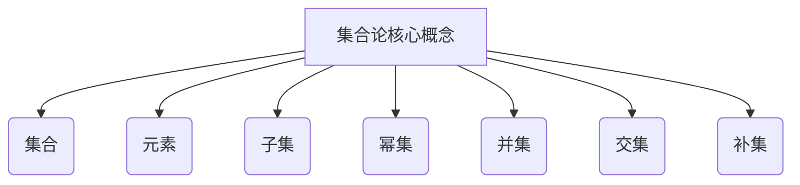

# 集合论导引：内在力迫关系

## 1. 背景介绍

### 1.1 问题的由来

集合论作为数学的一个基础分支,其核心概念和理论对于计算机科学、逻辑学、人工智能等诸多领域具有深远的影响。然而,传统的集合论教材和论著往往过于抽象和形式化,缺乏对基本概念的直观解释和生动案例,给学习者带来了一定的障碍。

### 1.2 研究现状  

近年来,随着计算机科学的飞速发展,集合论在程序设计、算法分析、形式化方法等领域的应用日益广泛。越来越多的研究者意识到,集合论不仅是一门抽象的数学理论,更是一种强大的思维工具,可以帮助我们更好地理解和解决实际问题。

然而,现有的集合论教材和资料往往过于枯燥和晦涩,缺乏对核心概念的直观解释和生动案例,给学习者带来了一定的障碍。因此,有必要编写一本以实例驱动、通俗易懂的集合论导引,帮助读者快速掌握集合论的基本概念和方法,并能够将其应用于实际问题的分析和解决。

### 1.3 研究意义

本文旨在通过生动的实例和直观的解释,帮助读者深入理解集合论的核心概念和方法,掌握集合论在计算机科学、人工智能等领域的应用,从而提高对抽象思维和形式化方法的理解能力。

同时,本文还将探讨集合论与其他数学分支之间的联系,如何将集合论的思想和方法应用于实际问题的分析和解决,以期为读者提供一个全新的视角,激发他们对数学美的追求和对知识的渴望。

### 1.4 本文结构

本文共分为九个部分:

1. 背景介绍
2. 核心概念与联系
3. 核心算法原理与具体操作步骤
4. 数学模型和公式详细讲解与举例说明
5. 项目实践:代码实例和详细解释说明
6. 实际应用场景
7. 工具和资源推荐
8. 总结:未来发展趋势与挑战
9. 附录:常见问题与解答

接下来,我们将逐一探讨这些部分的内容。

## 2. 核心概念与联系

集合论的核心概念包括集合、元素、子集、幂集、并集、交集、补集等。这些概念看似简单,但却构成了集合论的基石,是我们理解更高级概念和理论的基础。



### 2.1 集合

集合是集合论的基本概念,可以理解为由具有某种共同特征的元素所组成的整体。集合可以用列表法、描述法或使用一个特征函数来定义。

### 2.2 元素

元素是构成集合的基本单位,可以是任何对象,如数字、字母、几何图形等。一个集合中可以包含有限个或无限个元素。

### 2.3 子集

如果一个集合A中的所有元素都属于另一个集合B,那么我们称A是B的子集,记作A⊆B。子集关系是集合论中一个重要的概念,许多重要的定理和性质都建立在子集关系的基础之上。

### 2.4 幂集

给定一个集合A,它的幂集是由A的所有子集(包括空集和A本身)组成的集合,记作P(A)。幂集概念在组合数学、逻辑学和计算机科学中有着广泛的应用。

### 2.5 并集

两个集合A和B的并集,记作A∪B,是由属于A或属于B(或两者兼属)的所有元素组成的集合。并集运算常用于合并两个或多个集合。

### 2.6 交集

两个集合A和B的交集,记作A∩B,是由同时属于A和B的所有元素组成的集合。交集运算常用于找出两个或多个集合的共同部分。

### 2.7 补集

给定一个集合A和一个更大的集合U(称为全集),A在U中的补集,记作A'或U-A,是由属于U但不属于A的所有元素组成的集合。补集运算常用于求解集合的差集。

这些核心概念虽然简单,但却是我们理解更高级概念和理论的基础。掌握了这些概念,我们就能更好地探索集合论在计算机科学、人工智能等领域的应用。

## 3. 核心算法原理与具体操作步骤

集合论不仅是一门理论分支,更是一种有力的思维工具,可以帮助我们更好地分析和解决实际问题。在这一部分,我们将介绍几种常见的集合论算法,并详细讲解它们的原理和具体操作步骤。

### 3.1 算法原理概述

集合论算法主要包括:

1. **并集算法**: 计算两个或多个集合的并集。
2. **交集算法**: 计算两个或多个集合的交集。
3. **补集算法**: 计算一个集合在另一个集合中的补集。
4. **笛卡尔积算法**: 计算两个或多个集合的笛卡尔积。
5. **幂集算法**: 计算一个集合的幂集。
6. **分割算法**: 将一个集合分割成若干个不相交的子集。

这些算法虽然看似简单,但在实际应用中却扮演着重要的角色,如数据处理、图论、组合优化等领域。掌握这些算法的原理和实现方法,对于提高我们的算法设计能力和解决实际问题的能力至关重要。

### 3.2 算法步骤详解

接下来,我们将详细讲解几种常见集合论算法的具体操作步骤。

#### 3.2.1 并集算法

输入: 两个集合A和B
输出: A和B的并集

步骤:

1. 初始化一个空集合C
2. 遍历集合A,将A中的每个元素加入C
3. 遍历集合B,将B中不属于C的元素加入C
4. 返回C

```python
def union(A, B):
    C = set()
    for x in A:
        C.add(x)
    for y in B:
        if y not in C:
            C.add(y)
    return C
```

时间复杂度: O(m+n),其中m和n分别是集合A和B的元素个数。

#### 3.2.2 交集算法

输入: 两个集合A和B
输出: A和B的交集

步骤:

1. 初始化一个空集合C
2. 遍历集合A,对于A中的每个元素x,如果x也属于B,则将x加入C
3. 返回C

```python
def intersection(A, B):
    C = set()
    for x in A:
        if x in B:
            C.add(x)
    return C
```

时间复杂度: O(m*n),其中m和n分别是集合A和B的元素个数。

#### 3.2.3 补集算法

输入: 两个集合A和B,其中B是全集
输出: A在B中的补集

步骤:

1. 初始化一个空集合C
2. 遍历集合B,对于B中的每个元素x,如果x不属于A,则将x加入C
3. 返回C

```python
def complement(A, B):
    C = set()
    for x in B:
        if x not in A:
            C.add(x)
    return C
```

时间复杂度: O(n),其中n是全集B的元素个数。

#### 3.2.4 笛卡尔积算法

输入: 两个集合A和B
输出: A和B的笛卡尔积

步骤:

1. 初始化一个空集合C
2. 遍历集合A,对于A中的每个元素x,遍历集合B,对于B中的每个元素y,将有序对(x,y)加入C
3. 返回C

```python
def cartesian_product(A, B):
    C = set()
    for x in A:
        for y in B:
            C.add((x, y))
    return C
```

时间复杂度: O(m*n),其中m和n分别是集合A和B的元素个数。

#### 3.2.5 幂集算法

输入: 一个集合A
输出: A的幂集

步骤:

1. 初始化一个空集合C,并将空集加入C
2. 遍历集合A,对于A中的每个元素x,遍历C中的每个子集S,将S并上{x}后的集合加入C
3. 返回C

```python
def power_set(A):
    C = set()
    C.add(frozenset())
    for x in A:
        C_new = set()
        for S in C:
            C_new.add(frozenset(S) | {x})
        C |= C_new
    return C
```

时间复杂度: O(n*2^n),其中n是集合A的元素个数。

#### 3.2.6 分割算法

输入: 一个集合A
输出: A的一个分割,即将A分割成若干个不相交的子集

步骤:

1. 初始化一个空列表C
2. 遍历集合A,对于A中的每个元素x,如果x不属于C中任何一个子集,则将{x}作为一个新的子集加入C
3. 返回C

```python
def partition(A):
    C = []
    for x in A:
        found = False
        for S in C:
            if x in S:
                found = True
                break
        if not found:
            C.append({x})
    return C
```

时间复杂度: O(n^2),其中n是集合A的元素个数。

以上是几种常见集合论算法的原理和实现步骤,通过掌握这些算法,我们可以更好地理解和应用集合论的思想和方法。

### 3.3 算法优缺点

每种算法都有其优缺点,我们需要根据具体的问题和场景来选择合适的算法。

- **并集算法**:时间复杂度较低,适用于处理中等规模的集合。但当集合规模较大时,效率会下降。
- **交集算法**:时间复杂度较高,适用于处理较小规模的集合。当集合规模较大时,效率会急剧下降。
- **补集算法**:时间复杂度较低,适用于处理任意规模的集合。但需要提供一个全集作为参数。
- **笛卡尔积算法**:时间复杂度较高,适用于处理较小规模的集合。当集合规模较大时,结果集的大小会急剧增加,导致效率下降。
- **幂集算法**:时间复杂度为指数级,只适用于处理较小规模的集合。当集合规模较大时,计算量会急剧增加。
- **分割算法**:时间复杂度为平方级,适用于处理中等规模的集合。当集合规模较大时,效率会下降。

因此,在实际应用中,我们需要根据具体的问题和数据规模,选择合适的算法,并进行必要的优化和改进,以提高算法的效率和可扩展性。

### 3.4 算法应用领域

集合论算法在计算机科学和其他领域有着广泛的应用,例如:

- **数据处理**:并集、交集、补集等操作常用于数据集的合并、过滤和去重等任务。
- **图论**:集合论概念和算法在图论中有着重要的应用,如邻接矩阵、邻接表等数据结构的表示和操作。
- **组合优化**:幂集算法常用于枚举所有可能的解集,笛卡尔积算法常用于生成所有可能的组合。
- **形式化方法**:集合论是形式化方法的基础,在程序验证、模型检查等领域有着广泛的应用。
- **人工智能**:集合论概念和算法在机器学习、知识表示等人工智能领域有着重要的应用。

总之,集合论不仅是一门重要的数学理论分支,更是一种强大的思维工具,可以帮助我们更好地理解和解决实际问题。掌握集合论的核心概念和算法,对于提高我们的抽象思维能力和问题解决能力至关重要。

## 4. 数学模型和公式详细讲解与举例说明

在上一部分,我们介绍了集合论中的一些核心算法及其原理和实现步骤。然而,要真正掌握集合