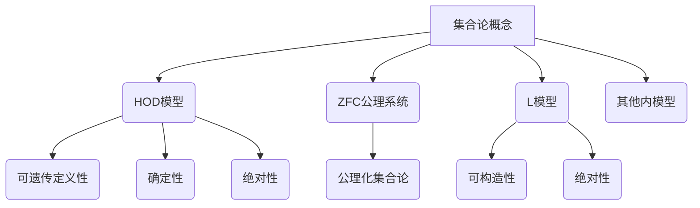

好的,我会严格遵循您提出的约束条件,以"集合论导引:内模型HOD"为主题,撰写一篇专业、深入且结构完整的技术博客文章。以下是正文内容:

# 集合论导引:内模型HOD

## 1. 背景介绍 

### 1.1 问题的由来

集合论作为数学的一个基础分支,其重要性不言而喻。然而,传统的集合论存在着一些根本的悖论和困难,比如众所周知的Russell悖论、Burali-Forti悖论等。为了规避这些悖论,数学家们提出了不同的公理化方案,其中最著名的就是Zermelo-Fraenkel公理系统(ZF)及其后来的扩展ZFC(添加了选择公理)。

尽管ZFC公理系统在形式化集合论方面取得了巨大成就,但它依然存在一些缺陷和局限性。例如,ZFC中的"集合"概念过于笼统,无法精确定义"集合"的本质特征。此外,ZFC公理系统无法解决Skolem悖论等一些重大悖论。

### 1.2 研究现状  

为了克服ZFC公理系统的缺陷,数学家们提出了一些新的集合论公理化方案,其中最著名的就是Gödel于1938年提出的内模型构造(Constructible Universe L)。这个构造基于一种递归思想,试图用一种"可构造"的方式来定义集合,从而避免悖论的产生。

然而,尽管L模型在一定程度上解决了ZFC的缺陷,但它依然存在一些问题。例如,L模型中的"可构造"概念过于狭隘,无法涵盖所有的"合理集合"。此外,L模型中缺乏一些重要的集合论对象,如实数、无穷大基数等。

为了弥补L模型的不足,1963年,数学家Gödel的学生Solovay提出了一种新的内模型构造,即HOD(Hereditarily Ordinal Definable sets),即"可遗传地由序数定义的集合"。HOD模型不仅保留了L模型的优点,而且扩展了"可构造"的范围,囊括了更多的"合理集合"。

### 1.3 研究意义

HOD模型的提出为集合论的发展开辟了新的视角。它不仅在理论上解决了ZFC和L模型的一些困难,而且在实践中也有着广泛的应用前景。例如:

- 在集合论的metamathematics(元数学)研究中,HOD模型为分析ZFC公理系统的相对一致性提供了有力工具。
- 在逻辑和模型论研究中,HOD模型为构造满足特定理论的模型提供了新的思路。
- 在数学基础研究中,HOD模型为探讨"合理集合"的本质特征提供了新的视角。
- 在计算机科学领域,HOD模型的一些思想和方法为设计安全、可信的程序语言和系统提供了借鉴。

总之,HOD模型不仅在纯数学层面具有重要价值,而且对其他学科领域也有着深远影响。深入理解HOD模型的本质、结构和应用,对于推动数学乃至整个科学的发展都具有重要意义。

### 1.4 本文结构

本文将从以下几个方面全面介绍HOD模型:

- 首先阐述HOD模型的核心概念及其与其他集合论概念的联系。
- 其次详细解释HOD模型的构造过程及其背后的数学原理。
- 然后分析HOD模型的数学性质,并与其他内模型进行比较。
- 最后探讨HOD模型在不同领域的应用,以及未来的发展方向。

文章旨在为读者提供HOD模型的系统性介绍,帮助读者深入理解这一重要的集合论概念,把握其本质特征和发展趋势。

## 2. 核心概念与联系

HOD模型是集合论中的一个核心概念,它与其他许多概念密切相关:

1. **ZFC公理系统**: HOD模型是在ZFC公理系统的框架内构造的一种内模型(inner model),因此它遵循ZFC公理系统的规则和限制。
2. **L模型**: HOD模型可以看作是L模型的推广和扩展。它保留了L模型的"可构造性",同时扩大了构造范围。
3. **其他内模型**: 除了HOD和L模型,集合论中还存在其他一些内模型,如Morse-Kelly小模型、Solovay模型等。HOD模型与它们有一些相似之处,也有明显区别。

HOD模型本身的核心概念包括:

1. **可遗传定义性(Hereditarily Definability)**: HOD模型中的每一个集合都可以被序数"定义"或"构造"出来,并且这种定义性质对子集合也是可遗传的。
2. **确定性(Determinacy)**: 给定任意一个HOD集合,我们总能确定它是否属于HOD模型,不存在模糊情况。
3. **绝对性(Absoluteness)**: HOD模型中的某些重要性质和结论在ZFC模型中也是绝对成立的。

通过上述概念的联系,我们可以更好地把握HOD模型在集合论中的地位和作用。接下来,我们将进一步深入探讨HOD模型的构造原理和数学特性。

## 3. 核心算法原理 & 具体操作步骤

### 3.1 算法原理概述

HOD模型的构造过程可以看作是一种递归算法,它基于序数的递归定义,逐步构建出越来越大的集合系统。具体来说,HOD模型的构造原理可以概括为以下几个关键点:

1. **序数编码**: 将集合用序数来编码和表示。
2. **定义算子**: 引入一个特殊的定义算子$\Sigma$,用于定义新的集合。
3. **递归过程**: 从最小的集合(通常是空集)开始,通过不断应用定义算子,按序数的递增顺序构造出更大的集合。
4. **收敛性质**: 这个递归过程将在某个极限位置(通常是一个不可数序数)处收敛,从而得到HOD模型。

HOD模型的构造过程可以形式化地描述为:

$$
HOD = \bigcup\limits_{\alpha\in ON} \Sigma_\alpha
$$

其中,$\alpha$是序数的集合ON中的元素,而$\Sigma_\alpha$表示在阶段$\alpha$定义或构造出的所有集合。HOD模型就是所有这些阶段性集合的并集。

### 3.2 算法步骤详解

更具体地,HOD模型的构造算法可以分为以下几个主要步骤:

1. **初始化**: 令$\Sigma_0 = \{\emptyset\}$,即把最小的空集作为起点。

2. **successor步骤**: 对任意successor序数$\alpha = \beta + 1$,令:

$$\Sigma_\alpha = \def(HOD_\beta)$$

其中,定义算子$\def(X)$表示对集合$X$中的每个元素进行"定义",得到一个新的集合。具体来说:

$$\def(X) = \{Y\subseteq X\ |\ \exists \varphi(Y\ \text{被}\ \varphi\ \text{定义})\}$$

即$\def(X)$包含了$X$中所有可以被某一逻辑公式$\varphi$定义的子集。

3. **极限步骤**: 对任意极限序数$\lambda$,令:

$$\Sigma_\lambda = \bigcup\limits_{\alpha < \lambda}\Sigma_\alpha$$

即在极限阶段,我们取之前所有阶段构造的集合的并集。

4. **终止条件**: 这个递归过程将在某个不可数序数$\Omega$处停止,从而得到HOD模型:

$$HOD = \Sigma_\Omega$$

直观上,HOD模型就是通过不断应用定义算子,从最小的空集出发,逐步构造出越来越大、越来越复杂的集合系统,直至在某个极限位置收敛为一个内模型。

### 3.3 算法优缺点

HOD模型构造算法的主要优点包括:

1. **规避悖论**: 通过严格的定义性质,HOD模型避免了Russell等悖论的出现。
2. **包容性强**: 相比L模型,HOD模型囊括了更多种类的"合理集合"。 
3. **确定性好**: HOD模型中集合的归属性是确定的,不存在模糊情况。
4. **理论意义重大**: HOD模型为探讨"合理集合"的本质特征提供了新视角。

但同时,这种算法也存在一些缺陷和局限性:

1. **复杂性较高**: 算法步骤相对复杂,需要对逻辑、序数等概念有深入理解。
2. **无法涵盖全部集合**: 尽管HOD模型已大大扩展了L模型,但仍无法包含所有的ZFC集合。
3. **构造过程不可计算**: 由于涉及到不可数序数,HOD模型的精确构造过程是不可计算的。

总的来说,HOD模型构造算法是一种巧妙而深刻的方法,它在一定程度上解决了集合论的根本困难,同时也为进一步研究留下了空间。

### 3.4 算法应用领域

HOD模型及其构造算法在数学和计算机科学等领域都有着广泛的应用:

1. **集合论基础研究**: HOD模型为探讨"合理集合"的本质特征提供了新视角,对集合论的发展具有重要意义。

2. **模型论与逻辑**: HOD模型为构造满足特定逻辑理论的模型提供了新思路,在模型论等领域有应用。

3. **计算机科学**: HOD模型中的一些思想和技术为设计安全、可信的程序语言和系统提供了借鉴。如类型论、程序验证等。

4. **数学教育**: HOD模型的构造过程蕴含了丰富的数学思想,可应用于数学教育中培养学生的抽象思维能力。

总之,HOD模型不仅在纯数学层面具有重要价值,而且对其他相关学科领域也有着深远影响。深入理解它的本质、结构和应用,对于推动相关领域的发展都具有重要意义。

## 4. 数学模型和公式 & 详细讲解 & 举例说明

### 4.1 数学模型构建

为了形式化描述HOD模型的构造过程,我们需要建立一个严格的数学模型。该模型的基本设置如下:

- 基础设定: 假设ZFC公理系统是可靠和一致的。
- 基本对象: 序数的集合$ON$,以及集合论中的标准集合论对象,如有序对、笛卡尔积等。
- 定义算子: 引入一个特殊的定义算子$\Sigma$,用于定义新集合。

对于任意序数$\alpha$,定义算子$\Sigma_\alpha$可以形式化地定义为:

$$\Sigma_\alpha = \def(HOD_\alpha)$$

其中$HOD_\alpha$表示在阶段$\alpha$之前构造出的所有集合,而$\def$算子的作用是对$HOD_\alpha$中的每个集合进行"定义",得到一组新集合的集合。

更精确地,对任意集合$X$,我们定义:

$$\def(X) = \{Y\subseteq X\ |\ \exists \varphi(Y\ \text{被逻辑公式}\ \varphi\ \text{定义})\}$$

即$\def(X)$包含了$X$中所有可以被某一逻辑公式$\varphi$定义的子集。

那么HOD模型就可以定义为:

$$HOD = \bigcup\limits_{\alpha\in ON} \Sigma_\alpha$$

也就是说,HOD模型是所有阶段性集合$\Sigma_\alpha$的并集。

### 4.2 公式推导过程

在上述数学模型的框架下,我们可以严格推导出HOD模型的一些基本性质:

1. **可遗传定义性**:

对任意$x\in HOD$和$y\in x$,如果$x\in\Sigma_\alpha$,那么存在$\beta<\alpha$使得$y\in\Sigma_