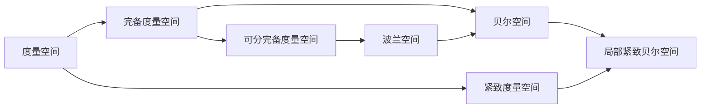

# 集合论导引：贝尔空间与波兰空间

关键词：贝尔空间、波兰空间、紧致性、度量空间、拓扑空间、完备度量空间、分离性公理、乌瑞松引理

## 1. 背景介绍

### 1.1  问题的由来

集合论是现代数学的基础,在拓扑学、实变函数论、泛函分析等众多数学分支中有着广泛而深刻的应用。贝尔空间和波兰空间作为集合论中两类重要的拓扑空间,有着丰富的数学结构和良好的性质,是泛函分析、描述集论等领域的重要研究对象。

### 1.2  研究现状

关于贝尔空间和波兰空间的研究由来已久。早在20世纪初,法国数学家 Fréchet 就引入了度量空间的概念,为后来贝尔空间和波兰空间的研究奠定了基础。波兰数学家 Banach 和 Mazur 等人在此基础上引入了波兰空间的概念。之后,Kuratowski、Ulam、Oxtoby 等数学家对波兰空间的性质做了深入研究。贝尔空间作为波兰空间的推广,由美国数学家 Bell 于1937年提出。近年来,随着描述集论等领域的发展,贝尔空间和波兰空间得到了广泛关注,在随机过程、算子代数、动力系统等领域都有重要应用。

### 1.3  研究意义

深入研究贝尔空间和波兰空间的性质,对于拓扑学、实变函数论、泛函分析等数学分支的发展具有重要意义。同时,这两类空间在概率论、算子代数、动力系统等应用领域也扮演着关键角色。因此,全面了解贝尔空间和波兰空间的定义、性质及其相互联系,对于开展相关领域的研究工作至关重要。

### 1.4  本文结构

本文将首先介绍贝尔空间和波兰空间的基本概念和定义,然后探讨它们之间的关系以及与其他重要拓扑空间(如紧致度量空间、完备度量空间等)的联系。在此基础上,重点阐述贝尔空间和波兰空间的重要性质,如分离性、紧致性、完备性等,并给出相关定理的证明过程。此外,本文还将举例说明这两类空间在实际问题中的应用,介绍相关的数学工具和研究资源,并展望贝尔空间和波兰空间理论未来的发展方向和挑战。

## 2. 核心概念与联系

贝尔空间和波兰空间是两类重要的拓扑空间。它们有许多共同点,但也有一些关键的区别。

贝尔空间(Baire space)是指任意两个开集的交非空的 T1 完备度量空间。更准确地说,度量空间 $(X,d)$ 称为贝尔空间,如果它满足:
1. $X$ 是T1空间,即任意一点集都是闭集;
2. $(X,d)$ 是完备的,即每个 Cauchy 序列都收敛于 $X$ 中的一点;
3. 任意两个开集 $U,V\subset X$ 的交 $U\cap V$ 非空。

波兰空间(Polish space)是指可分的完备度量空间。即度量空间 $(X,d)$ 称为波兰空间,如果:
1. $(X,d)$ 是完备的;
2. $X$ 有可数稠密子集,即存在 $D\subset X$ 使得 $\overline{D}=X$ 且 $D$ 至多可数。

由定义可见,波兰空间一定是贝尔空间,但贝尔空间未必是波兰空间(因为贝尔空间不一定可分)。

贝尔空间和波兰空间都是度量空间,因此也都是T2 的(即Hausdorff 空间)。进一步地,它们还都是T3 的(即正则空间)。

另一方面,每个波兰空间(从而每个贝尔空间)都同胚于某个完备可分度量空间的 $G_\delta$ 子集。特别地,每个非空波兰空间要么只含一个点,要么同胚于 Cantor 空间或 Baire 空间。

贝尔空间和波兰空间在分离性公理、紧致性等方面也有许多重要性质,这些性质将在后面章节中详细讨论。

下面是贝尔空间和波兰空间及其与其他空间关系的 Mermaid 流程图:

## 3. 核心算法原理 & 具体操作步骤

### 3.1  算法原理概述

判断一个度量空间是否为贝尔空间或波兰空间,需要验证其完备性、可分性以及分离性等性质。这通常需要利用度量空间的完备化方法(如 Cauchy 序列法)以及可分性的判别方法(如证明存在可数稠密子集)。同时,还需利用拓扑空间的一些重要定理,如 Baire 范畴定理、Cantor-Bendixson 定理等。

### 3.2  算法步骤详解

1. 判断完备性:对于度量空间 $(X,d)$,验证其中任意 Cauchy 序列 $\\{x_n\\}$ 是否收敛于 $X$ 中的点。常见方法包括:
   - 直接利用 Cauchy 序列的定义,证明极限点存在且属于 $X$。
   - 利用 $X$ 的闭子集的性质,证明 $\\{x_n\\}$ 的极限点属于每个包含 $\\{x_n\\}$ 的闭集,从而属于 $X$。
   - 对 $X$ 进行完备化,证明 $X$ 与其完备化空间同胚。

2. 判断可分性:对于度量空间 $(X,d)$,寻找一个至多可数的子集 $D\subset X$,使得 $D$ 在 $X$ 中稠密。常见方法包括:
   - 直接构造这样的子集,如有理数在实数中稠密。
   - 利用 $X$ 的基或子基,在每个基元或子基元中取一点,构成稠密子集。
   - 对于紧度量空间,利用紧致性依次取有限覆盖的元素构成稠密子集。

3. 判断分离性:验证度量空间满足 $T_1$ 或 $T_2$ 公理。这通常从度量的性质直接得到。

4. 利用已知定理:一些重要定理可以直接判断出某些空间是贝尔空间或波兰空间,如:
   - 每个完备度量空间都是贝尔空间。
   - 每个可分完备度量空间都是波兰空间。
   - 贝尔空间和波兰空间都是绝对 Borel 集,即它们在每个包含它们的度量空间中都是 Borel 集。

5. 构造同胚映射:证明某个空间是贝尔空间或波兰空间的另一个方法是,构造它到已知的贝尔空间或波兰空间的同胚映射。

### 3.3  算法优缺点

判断贝尔空间和波兰空间的算法优点是:
- 步骤清晰,易于实现。
- 利用了度量空间和拓扑空间的多种性质,从不同角度刻画了贝尔空间和波兰空间。
- 与多个重要定理相联系,可以利用已有结论简化判断过程。

算法的缺点是:
- 对于一般的度量空间,判断完备性和可分性并不容易,需要具体问题具体分析。
- 有些重要的贝尔空间和波兰空间,其完备性和可分性的直接验证并不容易。

### 3.4  算法应用领域

判断贝尔空间和波兰空间的算法在如下领域有重要应用:
- 泛函分析:许多重要的函数空间,如连续函数空间 $C(X)$、$L^p$ 空间、Sobolev 空间等都是波兰空间。
- 描述集论:波兰空间是可分完备度量空间上的 Borel 集,因此在描述集论中扮演基础角色。
- 随机过程论:状态空间为波兰空间的随机过程有许多良好性质。
- 算子代数:von Neumann 代数和 C* 代数的许多重要结果都是在其单位球面(通常是波兰空间)上得到的。

## 4. 数学模型和公式 & 详细讲解 & 举例说明

### 4.1  数学模型构建

贝尔空间和波兰空间作为特殊的度量空间,其数学模型可以表示为 $(X,d)$,其中 $X$ 是非空集合,$d$ 是 $X$ 上的度量,即 $d: X\times X\to [0,+\infty)$ 满足:
1. $d(x,y)\geq 0$,且 $d(x,y)=0$ 当且仅当 $x=y$;
2. $d(x,y)=d(y,x)$;
3. $d(x,z)\leq d(x,y) + d(y,z)$.

如果 $(X,d)$ 还满足:
1. 任意 Cauchy 序列 $\\{x_n\\}\subset X$ 都收敛于 $X$ 中的点,即 $(X,d)$ 是完备的;
2. 任意两个开集 $U,V\subset X$ 都有 $U\cap V\neq\emptyset$;

则称 $(X,d)$ 为贝尔空间。

如果 $(X,d)$ 满足:
1. $(X,d)$ 是完备的;
2. 存在至多可数的子集 $D\subset X$ 在 $X$ 中稠密;

则称 $(X,d)$ 为波兰空间。

### 4.2  公式推导过程

下面我们推导一些贝尔空间和波兰空间的重要性质。

**定理1:** 贝尔空间 $(X,d)$ 是 T3 空间,即 $X$ 中的任意闭集 $F$ 和不含于 $F$ 的点 $x$ 可以用不交的开集分离。

证明: 由于 $F$ 是闭集,故 $U=X\setminus F$ 是开集。又因为 $x\notin F$,故 $x\in U$。由贝尔空间的定义,存在开集 $V$ 使得 $x\in V\subset\overline{V}\subset U$。从而 $F$ 和 $\\{x\\}$ 可以被不交的开集 $U$ 和 $V$ 分离。

**定理2:** 波兰空间 $(X,d)$ 的任意 $G_\delta$ 子集(可数个开集的交)也是波兰空间。

证明: 设 $\\{U_n\\}$ 是 $X$ 的开子集,且 $G=\bigcap_{n=1}^\infty U_n$。由于 $X$ 是完备的,故其任意闭子集也完备,因此 $G$ 完备。另一方面,设 $\\{x_k\\}$ 是 $X$ 的可数稠密子集,则 $\\{x_k: x_k\in G\\}$ 在 $G$ 中稠密。因为可数个可数集的并仍可数,所以 $G$ 可分。综上,$G$ 是波兰空间。

**定理3:** (Cantor-Bendixson 定理) 设 $(X,d)$ 是波兰空间,则 $X$ 要么有孤立点,要么同胚于 Cantor 空间。

证明: 若 $X$ 没有孤立点,则 $X$ 的每个单点集都不开,因此 $X$ 的每个开集都不可数。设 $\\{x_n\\}$ 为 $X$ 的稠密子集,令 $U_0=X\setminus\\{x_n\\}$,则 $U_0$ 开且每个点都不孤立。对 $U_0$ 重复上述过程得到开集 $U_1\subset U_0$。归纳下去得到开集序列 $\\{U_n\\}$,使得 $\overline{U_{n+1}}\subset U_n$。令 $C=\bigcap_{n=0}^\infty U_n$,则 $C$ 是 Cantor 空间。由 Cantor-Bendixson 定理,$X\setminus C$ 至多可数,因此存在从 $C$ 到 