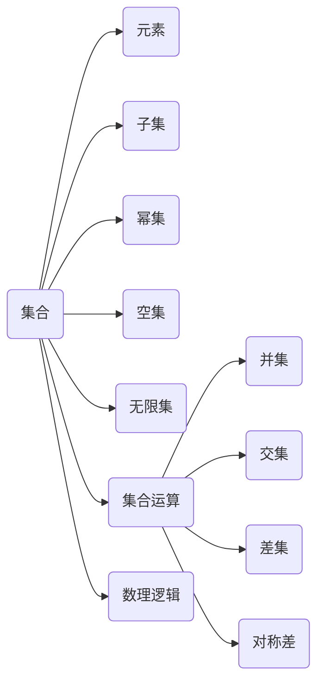

# 集合论导引：集合论语言

关键词：集合论、数学基础、逻辑语言、悖论、ZFC公理化集合论

## 1. 背景介绍
### 1.1 问题的由来
集合论是现代数学的基础,它为数学的各个分支提供了统一的语言和工具。然而,在集合论的发展历程中,曾经出现过诸如罗素悖论等一系列悖论和困难,严重威胁到了整个数学大厦的根基。为了解决这些问题,数学家们付出了巨大的努力,提出了多种集合论的公理化体系。

### 1.2 研究现状  
目前公认的标准集合论是ZFC公理化集合论,它由Zermelo-Fraenkel公理系统和选择公理(Axiom of Choice)组成。ZFC集合论在数理逻辑、代数、拓扑等数学分支中得到了广泛应用。同时,围绕ZFC公理化集合论,数学家们还提出了多种相容、独立的公理,如巨基数公理等,极大地拓展了集合论的研究范围。

### 1.3 研究意义
深入理解集合论语言的内涵,对于学习和研究现代数学、计算机科学等具有重要意义。集合论为数学提供了坚实的逻辑基础,其相关思想对于拓展数学思维、培养逻辑推理能力大有裨益。同时,作为数学的基础,集合论也是计算机科学的理论基石,在形式语言与自动机、数据库理论等领域有着广泛应用。

### 1.4 本文结构
本文将首先介绍集合论的核心概念,包括集合的定义、表示、运算等,并阐明集合论语言与数理逻辑的密切联系。然后,重点讲解ZFC公理化集合论的公理系统、基本定理及其证明思路。接着,通过经典案例分析集合论语言的应用。最后,探讨集合论的研究前沿、发展趋势及其面临的挑战。

## 2. 核心概念与联系
集合论的核心概念包括:
- 集合:由一些确定的、互不相同的对象组成的整体。 
- 元素:组成集合的对象。
- 子集:A是B的子集,当且仅当A的每个元素都是B的元素。
- 幂集:一个集合的所有子集组成的集合。
- 空集:不含任何元素的集合。
- 无限集:元素个数无限的集合。

集合论引入了一系列的集合运算:
- 并集:$A\cup B=\{x|x\in A \vee x\in B\}$ 
- 交集:$A\cap B=\{x|x\in A \wedge x\in B\}$
- 差集:$A-B=\{x|x\in A \wedge x\notin B\}$
- 对称差:$A\oplus B=(A-B)\cup (B-A)$

集合论与数理逻辑有着密切的联系。集合论可以看作是一阶逻辑的语言,其中的集合是一阶逻辑的个体,谓词则刻画了集合之间的关系。同时,数理逻辑也为集合论的公理化奠定了基础。



## 3. 核心算法原理 & 具体操作步骤
### 3.1 算法原理概述
ZFC公理化集合论是目前最为完备的集合论公理系统,它避免了早期集合论中的悖论,为集合论提供了可靠的逻辑基础。ZFC由Zermelo-Fraenkel公理系统(ZF)和选择公理(AC)组成。ZF公理系统包括了外延性公理、空集公理、配对公理、并集公理、幂集公理、无限公理、分离公理和替换公理。

### 3.2 算法步骤详解
1. 外延性公理:两个集合相等,当且仅当它们具有相同的元素。即 $\forall A \forall B [\forall x(x\in A \leftrightarrow x\in B) \rightarrow A=B]$
2. 空集公理:存在一个不包含任何元素的集合,称为空集。即 $\exists B \forall x(x\notin B)$  
3. 配对公理:对于任意两个集合,存在一个集合,它的元素恰好是这两个集合。即 $\forall A \forall B \exists C \forall x[x\in C\leftrightarrow (x=A \vee x=B)]$
4. 并集公理:对于任意一族集合,存在一个集合,它的元素恰好是那一族集合的每一个元素。
5. 幂集公理:对于每一个集合,存在一个集合,它的元素恰好是前一个集合的全体子集。
6. 无限公理:存在一个集合 I,它包含空集,且对于它的每一个元素 x,集合 $x\cup \{x\}$ 也是它的元素。
7. 分离公理:对于任意的集合和任意的性质,存在一个集合,它的元素是前一个集合中满足该性质的所有元素。
8. 替换公理:设 $\varphi(x,y)$ 是一个性质,对于任意的集合 A,如果对每一个 $x\in A$ 存在唯一的 y 使 $\varphi(x,y)$ 成立,那么就存在集合 B,它的元素是所有这样的 y。

### 3.3 算法优缺点
ZFC公理系统的优点在于:
1. 避免了集合论的悖论,如罗素悖论等。
2. 可以推导出集合论中的大多数重要定理。
3. 为现代数学的各个分支提供了坚实的逻辑基础。

但ZFC公理系统仍存在一些局限性:
1. 公理相对复杂,初学者理解起来有一定难度。 
2. 存在一些相容的、独立于ZFC的命题,如连续统假设等。
3. 难以回答一些更深层次的问题,如究竟存在多少个基数等。

### 3.4 算法应用领域
ZFC公理系统在数学的众多分支中得到了广泛应用,如数理逻辑、代数、拓扑、实分析、泛函分析等。同时,作为数学的基础,集合论的思想和方法也深刻影响了计算机科学,如形式语言与自动机理论、数据库理论、人工智能等领域。

## 4. 数学模型和公式 & 详细讲解 & 举例说明
### 4.1 数学模型构建
在ZFC公理化集合论中,我们可以构建一些重要的数学结构,如自然数、实数等。以自然数为例,我们可以用集合来定义自然数:
- 0 定义为空集 $\emptyset$
- 1 定义为 $\{\emptyset\}$,即 $\{\{\}\}$
- 2 定义为 $\{\emptyset,\{\emptyset\}\}$,即 $\{\{\},\{\{\}\}\}$
- ...
- $n+1$ 定义为 $n\cup\{n\}$

### 4.2 公式推导过程
基于上述定义,我们可以推导出自然数的一些基本性质。例如,任给自然数 $m,n$,我们可以证明:

$$
\begin{aligned}
m=n &\Leftrightarrow \forall x(x\in m \leftrightarrow x\in n) \\
m\in n &\Leftrightarrow m\subset n \wedge m\neq n
\end{aligned}
$$

进而,我们可以在自然数集上定义加法、乘法等二元运算,构建出自然数系统 $(\mathbb{N},+,\cdot)$。

### 4.3 案例分析与讲解
下面我们通过一个具体的案例来说明集合论语言的应用。考虑以下命题:

命题:存在一个集合 $\Omega$,对于任意集合 $A$,都有 $A\notin A$,且 $\Omega\in A$ 或 $A\in \Omega$。

我们可以用集合论语言来分析该命题。假设命题成立,取 $A=\Omega$,则有 $\Omega\notin \Omega$。又因为 $\Omega\in \Omega$ 或 $\Omega\in \Omega$,所以必有 $\Omega\in \Omega$,矛盾!因此,该命题不成立,这样的集合 $\Omega$ 不存在。

### 4.4 常见问题解答
问题1:什么是康托尔悖论?它对集合论有何影响?

康托尔悖论指出:全体集合的集合(即所有集合组成的集合)是不存在的。因为假设存在全体集合的集合 $V$,则它的幂集 $\mathcal{P}(V)$ 也是一个集合,但可以证明 $|\mathcal{P}(V)|>|V|$,即幂集的基数大于原集合的基数,这与 $\mathcal{P}(V)\in V$ 矛盾。

康托尔悖论表明,集合的概念不能无限制地扩张,否则会导致矛盾。这促使数学家们重新审视集合的定义,寻求集合论的公理化,最终导致了ZFC公理系统的建立。

## 5. 项目实践：代码实例和详细解释说明
### 5.1 开发环境搭建
集合论属于数学的理论基础,一般无需特定的开发环境。但是,在计算机科学领域,我们可以用编程语言来模拟和实现集合论的某些概念和运算。常见的支持集合论运算的编程语言包括Python、Java、C++等。

以Python为例,我们可以直接使用其内置的集合类型(set)及其相关方法。

### 5.2 源代码详细实现
下面我们用Python代码来实现集合的基本运算:

```python
A = {1, 2, 3, 4}
B = {3, 4, 5, 6}

# 并集
print(A | B)  # {1, 2, 3, 4, 5, 6}

# 交集 
print(A & B)  # {3, 4}

# 差集
print(A - B)  # {1, 2}

# 对称差
print(A ^ B)  # {1, 2, 5, 6}
```

我们还可以用Python代码来模拟集合的一些性质,如检查一个集合是否是另一个集合的子集:

```python
A = {1, 2, 3}
B = {1, 2, 3, 4, 5}

# 检查子集
print(A.issubset(B))  # True
print(B.issubset(A))  # False
```

### 5.3 代码解读与分析
在Python中,集合是一种无序的、不重复的元素集。通过集合类型及其方法,我们可以方便地进行集合的各种运算。这些运算的时间复杂度一般为 $O(len(A)+len(B))$,其中 $A$ 和 $B$ 是进行运算的两个集合。

Python中的集合底层实现采用了哈希表的数据结构。哈希表支持快速的元素查找、插入和删除操作,时间复杂度为 $O(1)$。因此,Python中的集合运算总体上是高效的。

### 5.4 运行结果展示
运行上述Python代码,我们可以得到如下输出结果:

```
{1, 2, 3, 4, 5, 6}
{3, 4}
{1, 2}
{1, 2, 5, 6}
True
False
```

这与我们预期的集合运算结果是一致的。

## 6. 实际应用场景
集合论作为数学的基础,在许多领域都有着重要的应用。
- 在数据库领域,关系代数的理论基础就是集合论。
- 在人工智能领域,模糊集合论被用于处理不确定性信息。
- 在形式语言与自动机理论中,语言被定义为字母表上的符号串集合。
- 在概率论中,事件空间被刻画为一个集合,事件则对应于事件空间的子集。
- 在拓扑学中,开集、闭集、邻域等都是建立在集合概念之上的。

### 6.4 未来应用展望
随着数学和计算机科学的发展,集合论的应用领域还将不断拓展。一方面,集合论与数理逻辑的结合,为计算机科学的理论研究提供了强大的工具和方法;另一方面,集合论与其他数