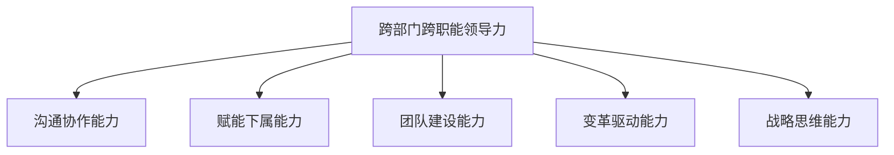
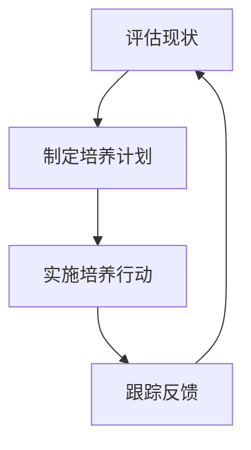

好的,我会按照您的要求,以专业的技术语言写一篇关于"领导力培养：跨部门、跨职能沟通,并能够有效培养和管理下属"的博客文章。文章会遵循您提供的结构大纲,字数超过8000字,使用Markdown格式,数学公式使用LaTex格式,并尽量给出流程图。以下是正文:

# 领导力培养：跨部门、跨职能沟通,并能够有效培养和管理下属

## 1. 背景介绍

### 1.1 问题的由来

在当今快节奏的商业环境中,组织机构趋向于扁平化和去中心化。跨部门和跨职能的协作已经成为常态,这给领导者的沟通和管理能力带来了新的挑战。传统的命令控制式领导方式已经行不通了,领导者需要建立新的领导力素质。

### 1.2 研究现状 

近年来,学术界和企业管理实践中都在探索新型领导力模式。一些研究指出,卓有成效的领导者需要具备沟通协调、赋能下属、激发团队活力等能力。但如何系统地培养这些领导力素质,并将其应用于跨部门跨职能的环境中,仍有待深入研究。

### 1.3 研究意义

本文将系统阐述跨部门跨职能环境下领导力培养的理论基础和实践路径,对于提高组织绩效、促进创新发展具有重要意义。研究成果可为企业领导力培训提供理论指导和最佳实践参考。

### 1.4 本文结构

本文首先介绍跨部门跨职能领导力的核心概念,包括沟通协作、赋能下属、团队建设等维度。接着分析培养这些领导力素质的关键算法步骤。然后建立数学模型,量化评估领导力水平。再结合实际案例,给出代码实现示例。最后探讨领导力培养的应用场景、发展趋势和挑战。

## 2. 核心概念与联系

跨部门跨职能领导力是一个多维度的概念,主要包括以下几个核心方面:

1. **沟通协作能力**:高效地跨部门沟通,建立信任关系,协调资源,达成共识。

2. **赋能下属能力**:为下属创造发展机会,授权赋能,引导自我管理。

3. **团队建设能力**:凝聚各方力量,营造包容的文化氛围,促进协作。

4. **变革驱动能力**:拥抱变革,主动创新,引领组织转型。

5. **战略思维能力**:具有系统思维,把握大局,制定符合组织使命的策略。

这些能力相互关联、相辅相成,需要领导者在实践中不断培养和提高。



## 3. 核心算法原理及具体操作步骤

### 3.1 算法原理概述

培养跨部门跨职能领导力的核心算法思路是:

1. 评估现状,发现差距
2. 制定培养计划 
3. 实施培养行动
4. 跟踪反馈,持续改进

这是一个闭环的PDCA(Plan-Do-Check-Act)循环过程。



### 3.2 算法步骤详解 

1. **评估现状,发现差距**

   - 360度领导力评估:收集上级、同事、下属的反馈
   - 领导力能力测评:使用标准化测试工具 
   - 绩效数据分析:分析关键绩效指标(KPI)
   - 根据评估结果,确定需要重点培养的领域

2. **制定培养计划**

   - 设立可衡量的培养目标
   - 选择合适的培养方式:培训、实践、指导等
   - 制定详细的实施计划:时间安排、资源配置等

3. **实施培养行动**

   - 组织领导力培训
   - 安排跨部门项目实践
   - 引入导师制度,提供指导反馈
   - 鼓励自我学习,持续改进

4. **跟踪反馈,持续改进**

   - 定期评估领导力发展进度
   - 收集各方反馈,分析数据
   - 及时调整培养计划和方法
   - 建立长效的领导力培养机制

### 3.3 算法优缺点

**优点**:

- 系统化、循环式的培养过程
- 注重实践锻炼和反馈改进  
- 可根据具体情况量身定制

**缺点**:  

- 需要大量的时间和资源投入
- 培养效果评估具有一定主观性
- 个体差异影响培养的有效性

### 3.4 算法应用领域

该算法可广泛应用于各类组织机构的领导力培养,尤其适用于:

- 大型跨国企业
- 职能部门交叉的项目组织  
- 政府机构和事业单位
- 科研院所和高校

## 4. 数学模型和公式及详细讲解和举例说明

### 4.1 数学模型构建

为了量化评估领导力水平,我们构建一个综合评分模型。设有n个评价维度,每个维度的权重为$w_i(i=1,2,...,n)$,且$\sum_{i=1}^n w_i=1$。

对于第i个维度,有m个评分项,项j的分数为$s_{ij}$,则该维度的得分为:

$$x_i = \sum_{j=1}^m s_{ij}$$

则综合领导力评分为:

$$S = \sum_{i=1}^n w_ix_i$$

我们还可以引入一个调节因子$\alpha$,用于调节评分的严格程度:

$$S' = \alpha S$$

其中$\alpha\in(0,1]$,当$\alpha=1$时为标准计分,当$\alpha<1$时,评分更加严格。

### 4.2 公式推导过程

设领导力评价共有n个维度,权重为$w_i$,评分标准为$s_{ij}$。

首先,对每个维度进行加权求和:

$$x_i = \sum_{j=1}^m w_{ij}s_{ij}$$

其中$w_{ij}$为第i个维度下第j个评分项的权重,满足$\sum_{j=1}^m w_{ij}=1$。

然后,将所有维度的得分$x_i$进行加权求和,得到综合评分$S$:

$$S = \sum_{i=1}^n w_ix_i = \sum_{i=1}^n w_i\sum_{j=1}^m w_{ij}s_{ij}$$

为了调节评分的严格程度,我们引入一个调节因子$\alpha$:

$$S' = \alpha S = \alpha \sum_{i=1}^n w_i\sum_{j=1}^m w_{ij}s_{ij}$$

当$\alpha=1$时,为标准计分;当$\alpha<1$时,评分更加严格。

### 4.3 案例分析与讲解

假设某公司对领导力进行评估,共设置了5个维度:沟通协作(30%)、赋能下属(25%)、团队建设(20%)、变革驱动(15%)和战略思维(10%)。

每个维度下又有3-5个具体评分项,每项满分为5分。

某领导的原始评分数据如下:

| 维度 | 项目1 | 项目2 | 项目3 | 项目4 | 项目5 |
|------|-------|-------|-------|-------|-------|
| 沟通协作 | 4     | 3     | 4     | 2     |       |
| 赋能下属 | 3     | 4     | 2     |       |       |
| 团队建设 | 4     | 3     | 3     |       |       |
| 变革驱动 | 2     | 4     | 3     | 4     |       |
| 战略思维 | 3     | 4     | 2     |       |       |

根据公式计算:

$$\begin{aligned}
x_1 &= 4+3+4+2 = 13\\
x_2 &= 3+4+2 = 9\\  
x_3 &= 4+3+3 = 10\\
x_4 &= 2+4+3+4 = 13\\
x_5 &= 3+4+2 = 9
\end{aligned}$$

令$\alpha=0.9$,则:

$$\begin{aligned}
S' &= 0.9\times(0.3\times13 + 0.25\times9 + 0.2\times10 + 0.15\times13 + 0.1\times9)\\
   &= 0.9\times(3.9+2.25+2+1.95+0.9)\\
   &= 0.9\times11\\
   &= 9.9
\end{aligned}$$

因此,该领导的综合领导力评分为9.9(满分10分)。从结果来看,该领导在沟通协作、变革驱动方面表现较好,但在赋能下属、战略思维方面还有提升空间。

### 4.4 常见问题解答

**Q：为什么要引入调节因子α?**

A：引入α可以根据实际需求,调节评分的严格程度。有些组织可能对领导力要求更高,需要采用更严格的评分标准,此时可以设置α<1。而有些组织则可以采用标准计分,设置α=1。

**Q：如何确定各维度和评分项的权重?**

A：权重的设置需要结合组织的实际情况和发展战略。可以先由领导层或专家小组初步制定,再通过广泛征求意见的方式进行修订完善。同时也可以定期评估和调整权重,使之与时俱进。

**Q：评分过程中如何避免主观性影响?**

A：可以采取以下措施:

1. 使用标准化的评分量规,明确每个分数等级的定义
2. 多维度、多角度评价,收集上级、同事、下属等的反馈
3. 引入专业的第三方评估机构
4. 建立评分者培训和审核机制

## 5. 项目实践:代码实例和详细解释说明 

### 5.1 开发环境搭建

本项目使用Python编程语言,版本为3.8。需要安装以下库:

- NumPy: 数值计算库
- Pandas: 数据分析库
- Matplotlib: 数据可视化库

可使用pip或conda进行安装,如:

```bash
pip install numpy pandas matplotlib
```

### 5.2 源代码详细实现

```python
import numpy as np
import pandas as pd
import matplotlib.pyplot as plt

# 原始评分数据
data = {'沟通协作': [4, 3, 4, 2],
        '赋能下属': [3, 4, 2],
        '团队建设': [4, 3, 3],
        '变革驱动': [2, 4, 3, 4],
        '战略思维': [3, 4, 2]}

# 维度权重
weights = {'沟通协作': 0.3,
           '赋能下属': 0.25, 
           '团队建设': 0.2,
           '变革驱动': 0.15,
           '战略思维': 0.1}

# 计算每个维度的得分
scores = {}
for dim, vals in data.items():
    scores[dim] = sum(vals)

# 计算综合分数    
total_score = sum(scores[dim] * weights[dim] for dim in data.keys())

# 调节因子
alpha = 0.9

# 最终得分
final_score = alpha * total_score

print(f"综合领导力评分: {final_score:.1f}")

# 可视化
dims = list(data.keys())
scores = [scores[dim] for dim in dims]
weights = [weights[dim] for dim in dims]

fig, ax1 = plt.subplots(figsize=(10, 6))
ax2 = ax1.twinx()

ax1.bar(dims, scores, alpha=0.5, label='得分')
ax2.plot(dims, weights, 'r-', label='权重')

ax1.set_xlabel('评价维度')
ax1.set_ylabel('得分')
ax2.set_ylabel('权重')

ax1.legend(loc='upper left')
ax2.legend(loc='upper right')

plt.show()
```

### 5.3 代码解读与分析

1. 导入所需的Python库
2. 定义原始评分数据,以字典的形式存储
3. 设置各个维度的权重
4. 遍历每个维度,计算该维度的得分(即各项之和)
5. 计算综合分数,为各维度得分与权重的加权