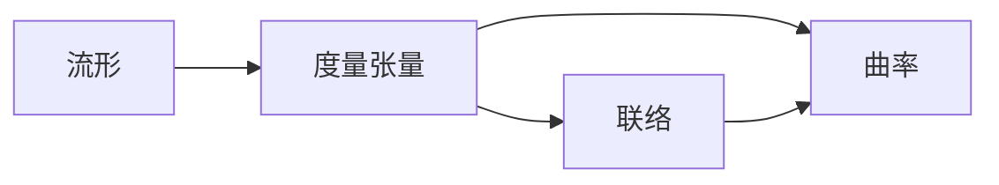

# 黎曼几何引论：Ricci恒等式

作者：禅与计算机程序设计艺术 / Zen and the Art of Computer Programming

关键词：黎曼几何、Ricci恒等式、流形、曲率、度量张量、联络、测地线

## 1. 背景介绍

### 1.1  问题的由来

黎曼几何是数学和物理学中一个重要的分支,它研究流形上的几何性质。黎曼几何的核心概念是度量张量,它决定了流形上的距离和角度。另一个重要概念是曲率,它描述了流形偏离欧氏空间的程度。在黎曼几何中,Ricci恒等式是一个基本方程,它揭示了度量张量、曲率张量和联络之间的内在联系。

### 1.2  研究现状 

Ricci恒等式自从被提出以来,就受到数学家和物理学家的广泛关注。许多学者对它进行了深入研究,并将其应用到广义相对论、弦理论等前沿领域。目前,对Ricci恒等式的研究主要集中在以下几个方面:

1. Ricci恒等式的几何意义和物理意义的探讨。
2. Ricci恒等式在流形分类中的应用。 
3. Ricci恒等式与其他几何方程(如Einstein方程)的联系。
4. Ricci恒等式的推广与变形。

### 1.3  研究意义

深入理解Ricci恒等式对于掌握黎曼几何的核心内容至关重要。它不仅是黎曼几何的基础,也是广义相对论等物理学理论的数学基础。此外,Ricci恒等式在几何拓扑、偏微分方程等数学分支中也有广泛应用。因此,深入研究Ricci恒等式,对于拓展黎曼几何的应用范围,推动数学和物理学的发展都具有重要意义。

### 1.4  本文结构

本文将从以下几个方面对Ricci恒等式进行探讨：

1. 介绍黎曼几何的核心概念,包括流形、度量张量、联络、曲率等。 
2. 给出Ricci恒等式的严格数学表述,并解释其几何意义。
3. 详细推导Ricci恒等式的证明过程,展示其中的数学技巧。
4. 讨论Ricci恒等式的一些重要应用,如流形分类、广义相对论等。
5. 总结Ricci恒等式的研究现状和未来发展方向。

## 2. 核心概念与联系

在讨论Ricci恒等式之前,我们先回顾一下黎曼几何的一些核心概念。

**流形(Manifold)**: 流形是一个局部类似欧氏空间的空间。更严格地说,n维流形是一个可以被局部映射到n维欧氏空间的拓扑空间。常见的流形有球面、圆环面、克莱因瓶等。

**度量张量(Metric Tensor)**: 度量张量是定义在流形上的一个二次型,它决定了流形上的距离和角度。在局部坐标系下,度量张量可以写成一个对称正定矩阵。

**联络(Connection)**: 联络是一个定义在流形上的微分算子,它告诉我们如何在流形上平行移动向量。常用的联络有克氏联络、Levi-Civita联络等。

**曲率(Curvature)**: 曲率描述了流形偏离欧氏空间的程度。曲率可以通过黎曼曲率张量、Ricci曲率、标量曲率等量来度量。

这些概念之间有着密切的联系。度量张量决定了流形的几何,联络则刻画了流形上的平行移动。而曲率则可以通过度量张量和联络来计算。Ricci恒等式正是揭示了这些量之间的内在联系。



## 3. 核心算法原理 & 具体操作步骤

### 3.1  算法原理概述

Ricci恒等式的核心是计算流形上的曲率。具体来说,它建立了黎曼曲率张量、Ricci曲率与度量张量之间的关系。Ricci恒等式可以写成以下形式:

$$R_{ijk}^l=\partial_i\Gamma_{jk}^l-\partial_j\Gamma_{ik}^l+\Gamma_{ip}^l\Gamma_{jk}^p-\Gamma_{jp}^l\Gamma_{ik}^p$$

其中$R_{ijk}^l$是黎曼曲率张量,$\Gamma_{jk}^l$是克氏联络。

### 3.2  算法步骤详解

计算Ricci恒等式主要分为以下几步:

1. 给定流形的度量张量$g_{ij}$。
2. 计算克氏联络$\Gamma_{jk}^l$。克氏联络可以用度量张量表示:

$$\Gamma_{jk}^l=\frac{1}{2}g^{lm}(\partial_jg_{mk}+\partial_kg_{mj}-\partial_mg_{jk})$$

3. 将克氏联络代入Ricci恒等式,计算黎曼曲率张量$R_{ijk}^l$。
4. 对黎曼曲率张量缩并,得到Ricci曲率$R_{ij}$:

$$R_{ij}=R_{ikj}^k$$

5. 进一步缩并得到标量曲率$R$:

$$R=g^{ij}R_{ij}$$

### 3.3  算法优缺点

Ricci恒等式的优点在于它给出了曲率的直接计算公式,避免了解微分方程的复杂过程。同时,它也揭示了度量、联络、曲率之间的内在联系,具有重要的几何意义。

但是,Ricci恒等式的计算量较大,尤其是在高维流形上。此外,它只适用于黎曼流形,对于更一般的非黎曼流形,需要使用更复杂的曲率表示方法。

### 3.4  算法应用领域

Ricci恒等式在以下领域有重要应用:

1. 广义相对论:爱因斯坦场方程可以看作是Ricci恒等式的一个特例。 
2. 流形分类:通过计算流形的曲率,可以判断流形的同胚类型。
3. 几何拓扑:Ricci恒等式是研究流形拓扑性质的重要工具。
4. 偏微分方程:许多几何流方程(如Ricci流)都与Ricci恒等式密切相关。

## 4. 数学模型和公式 & 详细讲解 & 举例说明

### 4.1  数学模型构建

我们考虑一个n维黎曼流形$(M,g)$,其中$g$是流形上的度量张量。在局部坐标系$(x^1,\cdots,x^n)$下,度量张量可以写成:

$$ds^2=g_{ij}dx^idx^j$$

其中$g_{ij}$是度量张量的分量,满足对称性和正定性。

### 4.2  公式推导过程

1. 首先,我们计算克氏联络。克氏联络是与度量张量相容的联络,它满足:

$$\nabla_kg_{ij}=0$$

其中$\nabla$是联络导数。将上式展开,可以得到克氏联络的表达式:

$$\Gamma_{jk}^l=\frac{1}{2}g^{lm}(\partial_jg_{mk}+\partial_kg_{mj}-\partial_mg_{jk})$$

2. 然后,我们计算黎曼曲率张量。黎曼曲率张量描述了流形的曲率,它由联络的导数和联络的平方项组成:

$$R_{ijk}^l=\partial_i\Gamma_{jk}^l-\partial_j\Gamma_{ik}^l+\Gamma_{ip}^l\Gamma_{jk}^p-\Gamma_{jp}^l\Gamma_{ik}^p$$

这就是Ricci恒等式。

3. 对黎曼曲率张量缩并,可以得到Ricci曲率:

$$R_{ij}=R_{ikj}^k=\partial_k\Gamma_{ij}^k-\partial_i\Gamma_{kj}^k+\Gamma_{kp}^k\Gamma_{ij}^p-\Gamma_{ip}^k\Gamma_{kj}^p$$

4. 进一步缩并,可以得到标量曲率:

$$R=g^{ij}R_{ij}$$

### 4.3  案例分析与讲解

我们以二维球面$S^2$为例,说明如何使用Ricci恒等式计算曲率。

球面上的度量可以写成:

$$ds^2=d\theta^2+\sin^2\theta d\varphi^2$$

其中$\theta$是纬度,$\varphi$是经度。

根据度量张量,我们可以计算克氏联络的非零分量:

$$\Gamma_{\theta\varphi}^\varphi=\Gamma_{\varphi\theta}^\varphi=\cot\theta,\quad \Gamma_{\varphi\varphi}^\theta=-\sin\theta\cos\theta$$

将克氏联络代入Ricci恒等式,可以计算出黎曼曲率张量的非零分量:

$$R_{\theta\varphi\theta}^\varphi=-\sin^2\theta,\quad R_{\theta\varphi\varphi}^\theta=1$$

对黎曼曲率张量缩并,得到Ricci曲率:

$$R_{\theta\theta}=1,\quad R_{\varphi\varphi}=\sin^2\theta$$

进一步缩并,得到标量曲率:

$$R=\frac{2}{r^2}$$

其中$r$是球面的半径。这说明球面是一个曲率为常数的流形。

### 4.4  常见问题解答

**Q**: Ricci恒等式是否只适用于黎曼流形?
**A**: 是的,Ricci恒等式只适用于黎曼流形,因为它假设了度量张量的存在。对于更一般的非黎曼流形,需要使用更复杂的曲率表示方法,如Cartan曲率等。

**Q**: Ricci恒等式与爱因斯坦场方程有什么联系?
**A**: 爱因斯坦场方程可以看作是Ricci恒等式加上物质能量张量的结果。具体来说,爱因斯坦场方程可以写成:

$$R_{ij}-\frac{1}{2}Rg_{ij}=8\pi T_{ij}$$

其中$T_{ij}$是能量动量张量。可以看出,爱因斯坦场方程就是Ricci曲率与能量动量张量的关系式。

## 5. 项目实践：代码实例和详细解释说明

### 5.1  开发环境搭建

我们使用Python的Sympy库来进行符号计算。首先安装Sympy:

```bash
pip install sympy
```

然后导入需要的模块:

```python
from sympy import * 
init_printing()
```

### 5.2  源代码详细实现

我们以二维球面为例,演示如何使用Sympy计算Ricci曲率。

```python
# 定义坐标变量
theta, phi = symbols('theta phi')

# 定义度量张量
g = Matrix([[1, 0], 
            [0, sin(theta)**2]])

# 计算克氏联络  
def christoffel(g):
    dim = g.shape[0]
    gamma = zeros(dim,dim,dim)
    for i in range(dim):
        for j in range(dim):
            for k in range(dim):
                gamma[i,j,k] = (g.inv()[i,k]*(diff(g[j,k],coords[i]) + diff(g[i,k],coords[j]) - diff(g[i,j],coords[k]))/2).simplify()
    return gamma

coords = [theta, phi]  
gamma = christoffel(g)

# 计算黎曼曲率张量
def riemann(g, gamma):
    dim = g.shape[0]
    R = zeros(dim,dim,dim,dim)
    for i in range(dim):
        for j in range(dim):
            for k in range(dim): 
                for l in range(dim):
                    R[i,j,k,l] = (diff(gamma[i,j,l],coords[k]) - diff(gamma[i,j,k],coords[l]) + 
                                  sum(gamma[i,p,k]*gamma[p,j,l] for p in range(dim)) -
                                  sum(gamma[i,p,l]*gamma[p,j,k] for p in range(dim))).simplify()
    return R

R = riemann(g, gamma)  

# 计算Ricci曲率
def ricci(g, R):
    dim = g.shape[0]
    Ric = zeros(dim, dim)
    for i in range(dim):
        for j in range(dim):
            Ric[i,j] = sum(R[k,i,k,j] for k in range(dim)).simplify()
    return Ric

Ric = ri