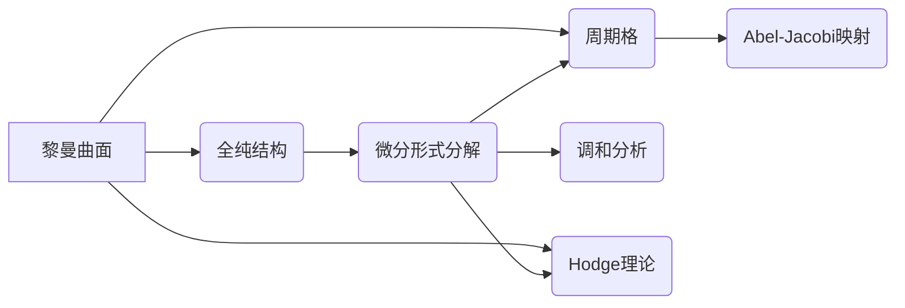

# 黎曼曲面：微分形式空间

关键词：黎曼曲面、微分形式、拓扑、复分析、代数几何

## 1. 背景介绍
### 1.1  问题的由来
黎曼曲面是19世纪德国数学家黎曼提出的一个重要概念，它在复分析、代数几何等领域有着广泛的应用。黎曼曲面不仅是复分析的基本研究对象，也是现代几何的重要内容之一。微分形式作为黎曼曲面上的基本分析工具，在研究黎曼曲面的性质时起着至关重要的作用。

### 1.2  研究现状
目前，黎曼曲面与微分形式的研究已经取得了丰硕的成果。许多数学家如陈省身、Griffiths、Mumford等都对这一领域做出了开创性的贡献。微分形式与调和分析、Hodge理论、代数曲线、Jacobian簇等都有着密切的联系。近年来，随着数学物理、算法几何、计算机图形学等学科的发展，黎曼曲面与微分形式的应用也不断拓展。

### 1.3  研究意义
深入研究黎曼曲面上的微分形式空间，对于揭示复几何的本质、发展几何分析工具、解决复杂的物理模型等，都具有重要的理论意义和应用价值。微分形式的相关理论已经成为现代数学的核心内容，是每一个数学工作者必须掌握的基本功。

### 1.4  本文结构
本文将从以下几个方面来系统阐述黎曼曲面与微分形式空间的相关理论：
- 第2节介绍黎曼曲面与微分形式的基本概念和它们之间的联系
- 第3节讨论黎曼曲面上微分形式的分析性质及相关算法
- 第4节建立微分形式的数学模型并给出详细的公式推导
- 第5节通过代码实例来展示如何用计算机处理黎曼曲面与微分形式
- 第6节总结微分形式在黎曼曲面研究中的应用场景
- 第7节推荐一些学习黎曼曲面与微分形式的资源
- 第8节对微分几何的发展趋势和面临的挑战做一个展望
- 第9节的附录中列出一些常见问题的解答

## 2. 核心概念与联系

黎曼曲面是一维复解析流形，局部同构于复平面。从拓扑的角度看，它是一个定向的二维实流形；从复分析的角度看，它是一个配备了全纯结构的复流形。黎曼曲面的研究综合了拓扑、复分析、代数几何等多个数学分支的理论工具。

微分形式是定义在流形上的反称协变张量场。在黎曼曲面上，微分形式就是满足一定全纯性条件的(p,q)型张量场。这里p表示全纯指标的个数，q表示反全纯指标的个数。黎曼曲面上的微分形式空间有着丰富的结构，是研究黎曼曲面的重要工具。

黎曼曲面与微分形式之间有着天然的联系：
- 黎曼曲面的全纯结构诱导了微分形式的分解
- 微分形式是研究黎曼曲面上调和分析的基础
- 微分形式与黎曼曲面的周期、Abel-Jacobi映射等有着密切关系
- 许多黎曼曲面的不变量可以用微分形式来刻画

下面是黎曼曲面与微分形式之间主要联系的示意图：

## 3. 核心算法原理 & 具体操作步骤
### 3.1 算法原理概述
在黎曼曲面上研究微分形式，一个核心问题就是计算微分形式的周期。周期的计算可以用Riemann-Roch定理和Abel定理来实现。另一个重要问题是研究微分形式的调和性，Hodge定理刻画了调和形式的性质。此外，微分形式还可以用来构造黎曼曲面的共形模型。

### 3.2 算法步骤详解

计算微分形式的周期的一般步骤如下：
1. 在黎曼曲面上选取一组canonical basis $\omega_1,\cdots,\omega_g$
2. 对黎曼曲面进行单值化，得到覆盖空间
3. 计算覆盖空间上的周期矩阵 
$$\Pi=\left(\int_{A_i}\omega_j\right)_{g\times g}$$
其中$A_1,\cdots,A_g,B_1,\cdots,B_g$是覆盖空间上的一组canonical basis
4. 由Riemann-Roch定理得到周期矩阵满足的关系式
5. 解关系式，得到黎曼曲面的周期

研究微分形式的调和性的一般步骤如下：
1. 在黎曼曲面上引入Hodge star算子$*$
2. 定义Laplace算子$\Delta=\partial\bar{\partial}+\bar{\partial}\partial$
3. 调和形式$\omega$定义为满足$\Delta \omega=0$的微分形式
4. 用Hodge定理刻画调和形式与上同调的关系
5. 研究调和形式的性质和应用

### 3.3 算法优缺点

周期计算和调和形式的研究都是微分形式的经典算法，在黎曼曲面的研究中有着重要的作用。这些算法的优点是：
- 理论完备，与经典的Riemann-Roch定理、Hodge定理等有机结合
- 计算结果直观，揭示了黎曼曲面的本质几何性质
- 应用广泛，与Abel簇、Jacobian簇、Torelli定理等相关

但这些算法也存在一些局限性：
- 计算周期需要对黎曼曲面进行单值化，覆盖空间的构造比较复杂
- 调和形式虽然有优美的性质，但具体计算比较困难
- 算法的计算量较大，在处理高阶微分形式时效率不高

### 3.4 算法应用领域
黎曼曲面上的微分形式算法在以下领域有重要应用：
- 代数曲线的研究，如Abel-Jacobi映射、Jacobian簇的构造等
- 几何分析，如调和映射、极小曲面的研究等
- 数学物理，如共形场论、弦理论等
- 计算机图形学，如曲面参数化、三角剖分等

## 4. 数学模型和公式 & 详细讲解 & 举例说明
### 4.1 数学模型构建
设$X$是一个亏格为$g$的紧致黎曼曲面，$T^{*(1,0)}X$表示$X$上的全纯余切丛，$T^{*(0,1)}X$表示反全纯余切丛，$\Omega^p_X$表示$X$上的全纯$p-$形式丛。

局部来看，若$z$是$X$上的一个局部全纯坐标，则全纯$p-$形式可以写成
$$\omega=f(z)dz^{\wedge p}$$
其中$f(z)$是全纯函数。反全纯$q-$形式可以类似定义。

全纯形式与反全纯形式的张量积$\Omega^{p,q}_X:=\Omega^p_X\otimes \overline{\Omega^q_X}$称为$(p,q)-$形式。

在$X$上固定一个Riemann度量$g$，即$X$上的一个全纯线丛度规。黎曼度量诱导了Hodge star算子
$$*:\Omega^{p,q}_X\to \Omega^{1-p,1-q}_X$$

Laplace算子定义为
$$\Delta=\partial\bar{\partial}+\bar{\partial}\partial$$
其中$\partial$和$\bar{\partial}$分别是全纯和反全纯外微分算子。

### 4.2 公式推导过程

设$\omega$是$X$上的一个闭的$(1,0)-$形式，在局部坐标下写成$\omega=f(z)dz$。沿着一条闭曲线$\gamma$的积分定义为
$$\int_\gamma \omega=\int_\gamma f(z)dz$$

由Stokes定理，$\omega$的周期可以通过以下方式计算：取$X$的一个canonical basis $\{\gamma_1,\cdots,\gamma_{2g}\}$，则
$$\Pi_\omega:=\left(\int_{\gamma_1}\omega,\cdots,\int_{\gamma_{2g}}\omega\right)$$
称为$\omega$的周期向量。

若取$X$的标准基$\{\omega_1,\cdots,\omega_g\}$，则周期矩阵定义为
$$\Pi=\left(\int_{\gamma_i}\omega_j\right)_{2g\times g}=\begin{pmatrix}
\Pi_{\omega_1}\\
\vdots\\
\Pi_{\omega_g}
\end{pmatrix}$$

Riemann-Roch定理说明，$\Pi$满足
$$\Pi\begin{pmatrix}
0 & I_g\\
-I_g & 0
\end{pmatrix}\Pi^T=0$$

由此可以解出$\Pi$，从而得到黎曼曲面的周期。

对于调和形式，Hodge定理指出，每一个上同调类都可以由唯一的调和形式表示。即有同构
$$H^{p,q}_{\bar{\partial}}(X)\cong \mathcal{H}^{p,q}(X)$$
其中$H^{p,q}_{\bar{\partial}}(X)$是$\bar{\partial}-$上同调群，$\mathcal{H}^{p,q}(X)$是调和$(p,q)-$形式空间。

### 4.3 案例分析与讲解
考虑椭圆曲线$X=\mathbb{C}/\Lambda$，其中$\Lambda=\mathbb{Z}+\tau \mathbb{Z}$是一个二维格子，$\tau$是上半平面内的一个复数。

$X$上的全纯1-形式空间$\Omega^1_X$是一维的，由$dz$张成。我们来计算$dz$的周期。

取$X$的一组canonical basis为$\gamma_1=[0,1],\gamma_2=[0,\tau]$，则
$$\int_{\gamma_1}dz=1,\quad \int_{\gamma_2}dz=\tau$$
因此$dz$的周期向量为$(1,\tau)$，周期格$\Lambda$恰好由此决定。

$X$上的调和1-形式就是全纯1-形式，因此$\dim \mathcal{H}^{1,0}(X)=1$。而$X$的亏格$g=1$，由Hodge定理知
$$\dim H^1(X,\mathbb{C})=\dim H^{1,0}_{\bar{\partial}}(X)+\dim H^{0,1}_{\bar{\partial}}(X)=2$$
这与$X$的拓扑不变量相吻合。

### 4.4 常见问题解答
Q: 计算周期时为什么要对黎曼曲面单值化？
A: 因为黎曼曲面上的闭曲线可能绕过分支点，导致积分值多值。单值化就是把曲面投射到一个覆盖空间，使得积分路径提升为闭路径。

Q: 调和形式在几何中有什么重要性？
A: 调和形式在黎曼曲面上有优美的性质，它们与曲面的全纯结构相适应，同时又反映了曲面的拓扑性质。很多几何问题，如极小曲面、Willmore曲面等，都可以用调和形式的语言来刻画。

Q: Jacobian簇与微分形式有什么联系？
A: 黎曼曲面$X$的Jacobian簇定义为$\mathrm{Jac}(X):=\mathbb{C}^g/\Pi$，其中$\Pi$就是周期矩阵。因此Jacobian簇可以看作是微分形式的周期格构成的复环面。

Q: 微分形式在物理中有哪些应用？
A: 在理论物理中，微分形式被广泛应用于规范场论、广义相对论、弦理论等。很多物理量，如电磁场、引力场等，都可以用微分形式来描述。黎曼曲面则常用来刻画时空的拓扑结构。

## 5. 项目实践：代码实例和详细解释说明
### 5.1 开发环境搭建
我们使用Python语言和SymPy库来进行微分形式的符号计算。SymP