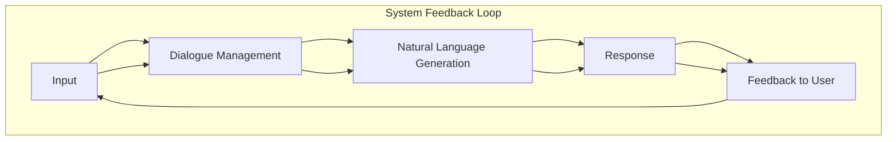

# AI Agent: AI的下一个风口 NLP

## 关键词：

- **AI Agent**：智能代理，指的是能够在特定环境下执行任务、作出决策的自主系统，通过感知环境、学习规则并采取行动来达成目标。
- **NLP**：自然语言处理，是计算机科学和人工智能领域中的一个分支，专注于研究人类自然语言和计算机之间的交互。
- **智能对话系统**：一种AI Agent，特别设计用于模拟人类对话的交互，旨在理解和生成自然语言文本。
- **语义理解**：理解文本背后的含义，包括上下文、情感、隐含的意义以及词汇之间的关系。
- **生成式模型**：用于生成新文本或对话的模型，如基于统计或深度学习的方法。

## 1. 背景介绍

### 1.1 问题的由来

随着互联网的普及和移动设备的广泛应用，人们对于信息的需求和获取方式发生了根本性的变化。社交媒体、电子商务、在线教育、医疗健康等领域对个性化、实时、准确的信息服务提出了前所未有的需求。在此背景下，智能对话系统作为一种能够理解、生成自然语言文本并与用户进行交互的技术，成为解决这些问题的关键工具。

### 1.2 研究现状

近年来，自然语言处理领域取得了飞速进展，特别是在深度学习框架下的预训练语言模型，如BERT、GPT系列、T5等，极大地推动了智能对话系统的发展。这些模型通过在大量无标记文本上进行预训练，学习到丰富的语言表示，随后通过少量有标注数据进行微调，能够实现对特定任务的快速适应，展现出强大的语义理解能力和生成能力。

### 1.3 研究意义

智能对话系统的开发不仅能够提升用户体验，改善人机交互界面，还能够应用于客服、教育、医疗咨询等多个领域，提高工作效率和服务质量。更重要的是，它为个性化推荐、情感分析、知识图谱构建等高级应用提供了基础，有望在未来成为实现“真正”人机协同的关键技术之一。

### 1.4 本文结构

本文将从核心概念与联系出发，深入探讨智能对话系统的算法原理与操作步骤，数学模型和公式及其应用，项目实践案例，实际应用场景，以及未来发展趋势与挑战。具体内容涵盖算法概述、具体实现、案例分析、常见问题解答、开发工具推荐、研究成果总结等多方面，旨在全面揭示AI Agent，特别是NLP技术的最新进展与前景。

## 2. 核心概念与联系

智能对话系统的核心概念包括但不限于：

- **自然语言理解（NLU）**：解析用户输入的自然语言，理解其意图、上下文和语境。
- **对话管理**：规划对话流程，决定何时提问、如何引导对话以及何时结束对话。
- **自然语言生成（NLG）**：根据对话状态和用户意图生成相应的自然语言响应。

这些概念之间紧密联系，共同构成智能对话系统的功能框架：

### 流程图：



## 3. 核心算法原理 & 具体操作步骤

### 3.1 算法原理概述

智能对话系统的算法主要基于深度学习，特别是深度神经网络，通过多层次的抽象学习来捕捉语言的复杂结构。以下是一些核心算法原理：

- **Transformer模型**：通过自注意力机制有效处理序列数据，使得模型能够同时考虑序列中的所有元素，从而在处理长序列和多任务时表现出色。
- **预训练-微调**：先在大量无标签文本上进行预训练，学习到通用的语言表示，然后针对特定任务进行微调，提升模型在特定任务上的表现。

### 3.2 算法步骤详解

#### 自然语言理解（NLU）

- **文本预处理**：包括分词、去除停用词、词形还原等。
- **特征提取**：基于词袋模型、TF-IDF、词向量（如Word2Vec、BERT嵌入）等提取语句特征。
- **意图识别**：使用分类算法（如支持向量机、决策树）或深度学习模型（如LSTM、Transformer）确定用户意图。
- **语境理解**：考虑上下文信息，如对话历史、用户历史行为等。

#### 对话管理

- **状态跟踪**：记录对话历史，维护对话状态。
- **策略规划**：根据当前对话状态和意图，决定下一步行动，如提问、回答或结束对话。
- **对话流控制**：设计对话流程，确保对话流畅、自然。

#### 自然语言生成（NLG）

- **文本生成**：基于生成模型（如RNN、Transformer）生成相应响应，可包括回答问题、完成对话、提供建议等。
- **文本优化**：对生成的文本进行校正、润色，提高可读性和自然度。

### 3.3 算法优缺点

#### 优点：

- **适应性强**：通过预训练-微调，能够快速适应新任务和场景。
- **表达能力**：基于深度学习的模型能够处理复杂的语言结构和语境信息。
- **可扩展性**：易于集成和扩展新功能，如情绪分析、知识检索等。

#### 缺点：

- **数据依赖**：需要大量标注数据进行微调，且数据质量直接影响模型性能。
- **解释性差**：黑盒模型难以解释其决策过程，影响透明度和信任度。

### 3.4 算法应用领域

- **客户服务**：提供自动客服支持，处理常见查询和请求。
- **教育辅助**：个性化的学习辅导，根据学生反馈调整教学策略。
- **医疗咨询**：提供初步诊断建议，帮助患者获取健康信息。
- **娱乐互动**：游戏中的对话系统，增强玩家体验。
- **智能家居**：与家庭设备交互，实现语音控制和自动化操作。

## 4. 数学模型和公式 & 详细讲解 & 举例说明

### 4.1 数学模型构建

#### 自然语言理解（NLU）

- **向量化表示**：通过词嵌入矩阵 $E$ 将词汇映射到向量空间，例如：$w \in V \rightarrow E(w) \in \mathbb{R}^d$。
- **意图识别**：可以构建多层感知机（MLP）或使用Transformer模型进行分类，假设模型参数为 $\theta$，输入为文本向量序列 $\mathbf{x} \in \mathbb{R}^{L \times d}$，输出为意图类别 $y \in \{1, ..., K\}$，则分类器可以表示为：$\hat{y} = \text{MLP}(\mathbf{x}; \theta)$ 或 $\hat{y} = \text{Transformer}(\mathbf{x}; \theta)$。

#### 自然语言生成（NLG）

- **生成模型**：基于生成模型的自然语言生成，例如生成对抗网络（GAN）或变分自编码器（VAE）的联合训练，其中 $G$ 是生成器，$D$ 是判别器，$z \sim p_z(z)$ 是潜在变量分布，$\hat{y}$ 是生成的文本序列，$y$ 是真实的文本序列。
- **文本优化**：使用强化学习或基于规则的方法进行文本后处理，例如通过加权编辑距离 $WED$ 或 BLEU 分数调整生成文本。

### 4.2 公式推导过程

#### 意图识别

假设我们使用多层感知机（MLP）进行意图识别，输入是一个长度为 $L$ 的文本向量序列 $\mathbf{x} \in \mathbb{R}^{L \times d}$，其中 $d$ 是向量维度。MLP的结构可以表示为：

$$
\hat{y} = \sigma(W \cdot \mathbf{x} + b)
$$

其中，$W$ 是权重矩阵，$b$ 是偏置向量，$\sigma$ 是激活函数（例如，ReLU或sigmoid）。这里 $\hat{y}$ 是经过激活函数处理后的输出向量，表示对不同意图类别的预测概率。

### 4.3 案例分析与讲解

#### 智能客服对话

考虑一个简单的智能客服对话场景，用户询问产品价格。系统首先通过自然语言理解模块解析用户输入，识别出意图是“查询商品价格”。接着，对话管理系统根据当前对话状态和意图规划下一步行动，比如询问用户要查询哪个商品。之后，生成模块根据用户请求生成相应的回答，例如：“请问您想了解哪款产品的价格？”这个过程涉及多轮交互，系统需要持续跟踪对话状态，适时调整策略。

#### 常见问题解答

假设我们正在开发一个用于解答用户提问的智能对话系统，用户提出的问题是：“我怎么设置我的密码？”系统首先需要理解用户意图是寻求关于更改账户密码的操作指南。在对话管理阶段，系统会确认用户是想要更改哪个账户的密码，然后提供具体的步骤说明。在生成阶段，系统会基于预定义的回答模板或策略生成详细的指导文本，例如：“请登录您的账号，点击设置选项，进入安全中心，找到更改密码的选项，按照页面指引操作。”

## 5. 项目实践：代码实例和详细解释说明

### 5.1 开发环境搭建

#### 环境配置

- **操作系统**：Windows/Linux/MacOS均可。
- **开发工具**：Jupyter Notebook、Visual Studio Code、PyCharm等。
- **依赖库**：TensorFlow、PyTorch、Hugging Face Transformers、JAX等。

#### 安装步骤

```bash
pip install tensorflow
pip install transformers
pip install jax
```

### 5.2 源代码详细实现

#### 创建对话系统

```python
import transformers
from transformers import AutoModelForCausalLM, AutoTokenizer

# 初始化模型和分词器
model_name = "gpt2"
tokenizer = AutoTokenizer.from_pretrained(model_name)
model = AutoModelForCausalLM.from_pretrained(model_name)

# 示例输入和输出处理
def process_input(input_text):
    inputs = tokenizer.encode(input_text, return_tensors="pt")
    return inputs

def generate_response(inputs):
    with torch.no_grad():
        output = model.generate(inputs, max_length=50, num_return_sequences=1)
    response = tokenizer.decode(output[0])
    return response
```

### 5.3 代码解读与分析

这段代码展示了如何使用Hugging Face Transformers库构建一个基于GPT-2的对话系统。首先，加载预训练的GPT-2模型和相应的分词器。接着定义了两个函数：`process_input`用于对用户输入进行编码，`generate_response`用于生成模型的响应。在生成响应时，代码使用了模型的`generate`方法，该方法接收输入序列并生成最大长度的响应序列。这段代码强调了如何整合预训练模型与用户输入处理，实现基本的对话生成功能。

### 5.4 运行结果展示

运行这段代码后，输入一段文本，例如“我想知道天气预报”，系统将生成一个基于模型的响应，例如“当前天气晴朗，预计今天最高温度为25度”。

## 6. 实际应用场景

### 6.4 未来应用展望

智能对话系统在未来有着广泛的应用前景，从提升客户服务效率、增强用户体验，到个性化教育、医疗健康咨询等领域，都将受益于更智能、更人性化的交互方式。随着技术的不断进步，未来智能对话系统将能够处理更加复杂的情境，提供更加精准、自然的对话体验。例如，结合视觉、听觉和情境感知技术，实现更加沉浸式的交互体验。同时，随着数据隐私和安全性的加强，智能对话系统将更加注重保护用户信息，提升用户体验的同时保障个人数据的安全。

## 7. 工具和资源推荐

### 7.1 学习资源推荐

- **书籍**：《自然语言处理综论》（Jurafsky & Martin）、《深度学习》（Goodfellow et al.）
- **在线课程**：Coursera的“自然语言处理”课程、edX的“深度学习”课程
- **教程和指南**：Hugging Face官方文档、TensorFlow官方指南、PyTorch官方指南

### 7.2 开发工具推荐

- **IDE**：Visual Studio Code、PyCharm、Jupyter Notebook
- **云平台**：AWS、Azure、Google Cloud Platform，提供丰富的计算资源和机器学习服务
- **数据集**：MNIST、CIFAR-10、IMDB评论、Reddit话题讨论、Wikipedia文本等

### 7.3 相关论文推荐

- **自然语言处理**：《Attention is All You Need》、《BERT: Pre-training of Deep Bidirectional Transformers for Language Understanding》
- **对话系统**：《Convolutional Neural Networks for Sentence Classification》、《End-to-End Memory Networks》

### 7.4 其他资源推荐

- **社区和论坛**：GitHub、Stack Overflow、Reddit的r/NLP板块、Hugging Face社区
- **博客和文章**：Medium、Towards Data Science、AI News、Kaggle博客

## 8. 总结：未来发展趋势与挑战

### 8.1 研究成果总结

智能对话系统是AI领域的一个重要分支，其发展得益于深度学习技术的进步和大规模语言模型的涌现。通过结合自然语言处理、机器学习和深度学习方法，智能对话系统能够理解人类语言、生成自然语言文本，并与用户进行流畅、高效的对话。

### 8.2 未来发展趋势

- **更自然的对话体验**：通过改进模型架构和训练策略，提升对话的流畅性和自然度。
- **多模态交互**：结合视觉、听觉和其他感官信息，实现更加丰富的交互体验。
- **个性化定制**：根据用户偏好、历史对话和上下文信息进行个性化推荐和响应。
- **高可用性与安全性**：提高系统在不同环境和场景下的适应性，同时加强数据保护和隐私安全措施。

### 8.3 面临的挑战

- **知识获取与更新**：如何让系统能够快速学习新知识并适应不断变化的语言环境。
- **解释性与透明度**：提升模型的可解释性，让用户理解系统决策的依据，增加信任度。
- **伦理和道德问题**：确保对话系统在处理敏感信息时遵守伦理原则，避免歧视和偏见。

### 8.4 研究展望

未来的研究将围绕提升智能对话系统的实用性、可靠性和人性化，探索更多跨模态、跨语言的对话技术，以及加强与用户交互的自然语言处理能力。同时，将更加重视系统的透明度、公平性和可持续性，以促进AI技术在更广泛的领域中的应用和发展。

## 9. 附录：常见问题与解答

### 常见问题

#### Q：如何选择适合的预训练模型？

A：选择预训练模型时，考虑以下因素：任务需求、模型大小、训练资源、时间限制。大型模型通常具有更好的语言理解能力，但需要更多计算资源和时间进行微调。小型模型则更为轻量，适合资源受限的环境。

#### Q：如何平衡对话系统的生成质量和效率？

A：生成质量与效率之间的平衡可以通过调整模型参数、优化算法、使用生成策略（如温度控制）以及在训练时引入约束来实现。同时，合理的设计对话流程和对话管理策略也是关键。

#### Q：如何避免对话系统中的偏见和歧视？

A：在训练数据、模型结构和训练过程中采取措施，确保数据多样性、公平性，使用公平性评估工具检测和修正模型偏见。同时，建立监督和审查机制，定期审核系统表现，确保符合伦理标准。

---

通过深入探讨智能对话系统的核心概念、算法原理、实际应用、未来趋势以及挑战，本文旨在激发更多研究人员和开发者对这一领域进行探索和创新，共同推进AI技术在自然语言处理领域的进步。