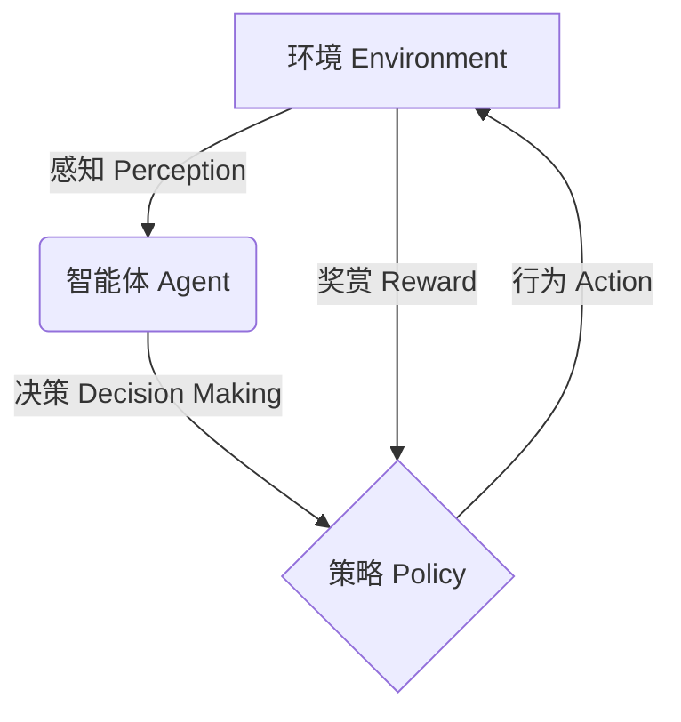

# AI Agent: AI的下一个风口 展望：安全、发展、边界和挑战

## 1. 背景介绍

### 1.1 问题的由来

在过去几十年中,人工智能(AI)技术取得了长足的进步,从最初的专家系统和机器学习,到如今的深度学习和强化学习等前沿技术。AI已经广泛应用于各个领域,如计算机视觉、自然语言处理、决策支持系统等,极大地提高了工作效率,优化了决策过程。然而,随着AI系统的复杂度不断增加,人们对其安全性、可解释性和可控性等方面提出了更高的要求。

AI Agent作为一种新兴的AI技术,旨在解决传统AI系统存在的一些问题。AI Agent是一种具有自主性、交互性和智能性的软件实体,能够感知环境、做出决策并执行相应的行为。与传统AI系统相比,AI Agent具有更强的自主性和适应性,可以根据环境的变化自主地调整行为策略,从而更好地满足复杂环境下的需求。

### 1.2 研究现状

目前,AI Agent技术正处于快速发展阶段,已经在一些领域得到了初步应用,如智能助理、游戏AI、机器人控制等。但是,AI Agent技术仍然面临着诸多挑战,例如:

1. **安全性**:如何确保AI Agent在执行任务时不会产生意外或危险的行为?
2. **可解释性**:AI Agent的决策过程是否可以被人类理解和解释?
3. **可控性**:如何有效地控制AI Agent的行为,使其符合预期目标?
4. **伦理道德**:AI Agent在执行任务时如何遵循伦理道德准则?
5. **隐私保护**:如何保护AI Agent处理的数据隐私和用户隐私?

### 1.3 研究意义

AI Agent技术的发展将为人工智能系统带来全新的发展机遇,有望解决传统AI系统存在的一些问题,提高AI系统的安全性、可解释性和可控性。同时,AI Agent技术也将推动人工智能在更多领域的应用,为社会发展带来新的动力。因此,研究AI Agent技术的安全性、发展趋势、边界和挑战具有重要的理论意义和现实意义。

### 1.4 本文结构

本文将从以下几个方面对AI Agent技术进行深入探讨:

1. 核心概念与联系
2. 核心算法原理与具体操作步骤
3. 数学模型和公式详细讲解与案例分析
4. 项目实践:代码实例和详细解释说明
5. 实际应用场景和未来展望
6. 工具和资源推荐
7. 总结:未来发展趋势与挑战
8. 附录:常见问题与解答

## 2. 核心概念与联系

AI Agent是一种具有自主性、交互性和智能性的软件实体,它能够感知环境、做出决策并执行相应的行为。AI Agent技术的核心概念包括:

1. **智能体(Agent)**:智能体是指能够感知环境、做出决策并执行行为的实体。在AI Agent技术中,智能体通常指具有一定智能的软件实体。

2. **环境(Environment)**:环境是指智能体所处的外部世界,包括物理环境和虚拟环境。智能体需要从环境中获取信息,并对环境产生影响。

3. **感知(Perception)**:感知是指智能体从环境中获取信息的过程,包括视觉、听觉、触觉等多种感知方式。

4. **决策(Decision Making)**:决策是指智能体根据感知到的环境信息和内部状态,选择执行何种行为的过程。

5. **行为(Action)**:行为是指智能体对环境产生影响的方式,包括物理行为和虚拟行为。

6. **奖赏(Reward)**:奖赏是指智能体执行某种行为后,环境给予的正面或负面反馈。奖赏函数是评估智能体行为好坏的标准。

7. **策略(Policy)**:策略是指智能体在不同状态下选择执行何种行为的规则或函数。

这些核心概念相互关联,构成了AI Agent技术的基础框架。智能体通过感知环境信息,根据决策策略选择执行何种行为,并根据环境反馈的奖赏来调整策略,形成一个闭环过程。

## 3. 核心算法原理与具体操作步骤

AI Agent技术的核心算法主要包括强化学习、规划算法和多智能体系统等。

### 3.1 算法原理概述

#### 3.1.1 强化学习

强化学习是AI Agent技术中最重要的算法之一,它允许智能体通过与环境的交互来学习如何执行最优策略。强化学习算法的核心思想是:智能体在环境中执行一系列行为,根据环境反馈的奖赏信号来调整策略,最终找到能够获得最大累积奖赏的最优策略。

强化学习算法主要包括以下几个关键要素:

1. **状态(State)**:描述环境的当前状态。
2. **行为(Action)**:智能体可以执行的一系列行为。
3. **奖赏函数(Reward Function)**:定义了在执行某个行为后,环境给予的奖赏或惩罚。
4. **状态转移概率(State Transition Probability)**:描述在执行某个行为后,环境从一个状态转移到另一个状态的概率。
5. **策略(Policy)**:定义了在每个状态下,智能体应该执行何种行为的规则或函数。
6. **价值函数(Value Function)**:估计在执行某个策略后,能够获得的累积奖赏。

强化学习算法的目标是找到一个最优策略,使得在执行该策略时,能够获得最大的累积奖赏。常见的强化学习算法包括Q-Learning、Sarsa、Deep Q-Network(DQN)、Proximal Policy Optimization(PPO)等。

#### 3.1.2 规划算法

规划算法是AI Agent技术中另一类重要的算法,它旨在为智能体找到从初始状态到目标状态的最优路径或行为序列。规划算法通常基于对环境的完整模型,利用搜索或优化技术来寻找最优解。

常见的规划算法包括:

1. **A*算法**:一种基于启发式搜索的算法,广泛应用于路径规划和游戏AI等领域。
2. **RRT(Rapidly-exploring Random Tree)**:一种基于随机采样的算法,常用于机器人运动规划。
3. **POMDP(Partially Observable Markov Decision Process)**:一种用于部分可观测环境的规划算法,能够处理环境状态不确定性。

#### 3.1.3 多智能体系统

多智能体系统是指由多个智能体组成的系统,智能体之间可以相互协作或竞争。多智能体系统常见于分布式问题求解、协作控制、博弈论等领域。

多智能体系统中的关键问题包括:

1. **协作机制**:如何设计智能体之间的协作机制,以实现系统目标?
2. **通信协议**:智能体之间如何进行信息交换和协调?
3. **资源分配**:如何在智能体之间公平分配资源?
4. **稳定性和收敛性**:如何保证多智能体系统的稳定性和收敛性?

常见的多智能体算法包括:

1. **分布式约束优化(Distributed Constraint Optimization)**
2. **联盟形成(Coalition Formation)**
3. **博弈论算法(Game Theoretic Algorithms)**

### 3.2 算法步骤详解

以Q-Learning算法为例,详细介绍强化学习算法的具体步骤:

1. **初始化**:初始化智能体的状态、行为空间、奖赏函数和Q值函数(或神经网络)。
2. **观测环境状态**:智能体观测当前环境状态$s_t$。
3. **选择行为**:根据当前Q值函数(或神经网络),选择在状态$s_t$下执行的行为$a_t$,通常采用$\epsilon$-贪婪策略。
4. **执行行为**:智能体执行选择的行为$a_t$,环境转移到新的状态$s_{t+1}$,并返回奖赏$r_{t+1}$。
5. **更新Q值函数**:根据贝尔曼方程,更新Q值函数:

$$Q(s_t, a_t) \leftarrow Q(s_t, a_t) + \alpha \left[ r_{t+1} + \gamma \max_a Q(s_{t+1}, a) - Q(s_t, a_t) \right]$$

其中$\alpha$是学习率,$\gamma$是折现因子。
6. **重复步骤2-5**:重复观测、选择行为、执行行为和更新Q值函数的过程,直到收敛或达到终止条件。

Q-Learning算法的核心思想是通过不断与环境交互,学习状态-行为对的价值函数Q(s,a),最终找到一个最优策略,使得在执行该策略时,能够获得最大的累积奖赏。

### 3.3 算法优缺点

#### 3.3.1 强化学习算法

**优点**:

1. 无需事先了解环境的完整模型,可以通过与环境交互来学习最优策略。
2. 具有很强的通用性,可以应用于各种决策过程和控制问题。
3. 能够处理连续状态和行为空间,适用于复杂环境。

**缺点**:

1. 需要大量的交互数据来训练,训练过程可能非常耗时。
2. 存在样本效率低下的问题,需要探索大量无用的状态-行为对。
3. 算法收敛性和稳定性难以保证,特别是在连续空间中。
4. 奖赏函数的设计对算法性能影响很大,但奖赏函数的设计往往依赖于领域知识。

#### 3.3.2 规划算法

**优点**:

1. 基于已知的环境模型,能够快速找到最优解或近似最优解。
2. 算法过程可解释,决策过程透明。
3. 对于确定性环境,能够保证找到最优解。

**缺点**:

1. 需要事先获得环境的完整模型,对于复杂环境,建模过程可能非常困难。
2. 计算复杂度较高,在大规模问题中可能难以求解。
3. 难以处理不确定性和动态环境。
4. 缺乏在线学习和自适应的能力。

#### 3.3.3 多智能体系统

**优点**:

1. 能够解决单个智能体难以解决的复杂问题。
2. 具有更强的鲁棒性和容错能力。
3. 可以实现任务的并行化和分布式处理,提高效率。
4. 智能体之间可以相互学习和协作,提高整体性能。

**缺点**:

1. 智能体之间的通信和协调机制复杂,可能导致效率低下。
2. 存在资源分配、利益冲突等问题,需要设计合理的协作机制。
3. 系统的稳定性和收敛性难以保证。
4. 缺乏统一的理论框架和设计方法。

### 3.4 算法应用领域

AI Agent技术的核心算法广泛应用于以下领域:

1. **机器人控制**:强化学习和规划算法被广泛应用于机器人的运动控制、路径规划和决策过程。
2. **自动驾驶**:强化学习和规划算法是自动驾驶系统中的关键技术,用于感知环境、决策和控制。
3. **游戏AI**:强化学习和多智能体系统是游戏AI的核心技术,用于训练智能体玩家和非玩家角色。
4. **智能助理**:强化学习和规划算法被应用于智能助理的决策和对话管理。
5. **网络优化**:强化学习被应用于网络路由、资源分配和流量控制等网络优化问题。
6. **金融决策**:强化学习被应用于投资组合优化、交易策略和风险管理等金融决策问题。
7. **供应链优化**:多智能体系统被应用于供应链中的协作、竞争和资源分配问题。

## 4. 数学模型和公式详细讲解与举例说明

AI Agent技术中的数学模型和公式主要来自