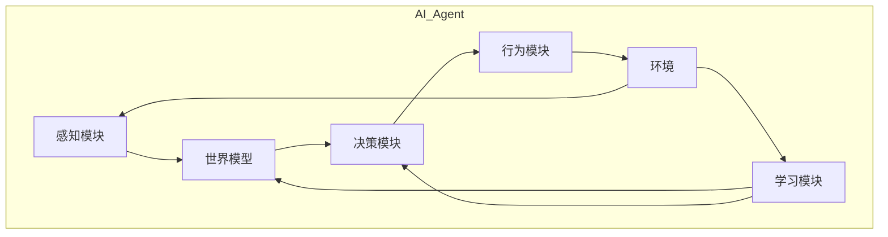

以下是根据您提供的主题和要求，撰写的技术博客文章正文内容：

# AI Agent: AI的下一个风口 解决方案与研究方向

## 1. 背景介绍

### 1.1 问题的由来

在过去几十年中,人工智能(AI)技术取得了长足的进步,尤其是在计算机视觉、自然语言处理、推理决策等领域。但传统的AI系统大多是针对特定任务进行训练和部署,缺乏通用性和自主性。随着技术的发展和应用场景的多样化,人们对AI系统提出了更高的要求,期望AI能够像人一样具备通用的认知能力、学习能力和交互能力,并能自主地完成复杂任务。

### 1.2 研究现状  

为了实现真正的通用人工智能(AGI),研究人员提出了AI Agent的概念。AI Agent被设计为一种具有自主性、交互性和学习能力的智能体,能够感知环境、做出决策并执行行为,并通过与环境的交互不断学习和提升自身能力。目前,AI Agent的研究主要集中在以下几个方面:

1. **智能体架构**:设计可扩展、模块化的智能体架构,支持多模态感知、决策和行为控制。
2. **机器学习算法**:开发新的机器学习算法,实现高效的环境建模、规划和强化学习。
3. **知识表示与推理**:构建统一的知识表示形式,支持符号推理和连续推理。
4. **人机交互**:探索自然语言交互、多模态交互等技术,提高人机协作效率。

### 1.3 研究意义

AI Agent技术的发展将为人工智能系统带来革命性的变化,使其能够在复杂、动态的环境中自主运行,并与人类进行自然的交互和协作。这将极大地扩展AI的应用范围,如智能助理、智能机器人、自动驾驶、智能制造等,为解决人类社会面临的重大挑战提供新的解决方案。

### 1.4 本文结构

本文将全面介绍AI Agent的核心概念、关键技术及研究方向。第2部分阐述AI Agent的核心概念及其与传统AI系统的区别;第3部分重点讲解AI Agent的核心算法原理和实现步骤;第4部分深入探讨AI Agent所涉及的数学模型和公式推导;第5部分通过代码实例说明AI Agent的具体实现;第6部分分析AI Agent在不同领域的应用场景;第7部分推荐相关学习资源和开发工具;第8部分总结AI Agent的发展趋势和面临的挑战;最后的附录部分解答常见问题。

## 2. 核心概念与联系

AI Agent是一种具备感知、决策和行为能力的智能体系统。它能够从环境中获取信息,基于所获取的信息做出决策,并在环境中执行相应的行为,从而达成特定的目标。与传统的AI系统相比,AI Agent具有以下三个核心特征:

1. **自主性(Autonomy)**: AI Agent能够自主地感知环境、做出决策并执行行为,而不需要人工干预。
2. **交互性(Interactivity)**: AI Agent与环境是相互作用的,它的决策和行为会影响环境的状态,同时环境的变化也会影响它的感知和决策。
3. **学习能力(Learning Capability)**: 通过与环境的持续交互,AI Agent能够不断获取新的经验,并更新其内部模型和决策策略,从而提高自身的能力。

AI Agent系统通常由以下几个核心模块组成:

1. **感知模块(Perception Module)**: 从环境中获取各种形式的数据,如视觉、语音、传感器等,并对获取的数据进行预处理和特征提取。
2. **世界模型(World Model)**: 基于感知到的数据,构建对环境的内部表示,包括环境的状态、规则和动态变化等。
3. **决策模块(Decision Module)**: 根据世界模型和目标,通过规划、推理或学习等方式,选择合适的行为序列。
4. **行为模块(Action Module)**: 执行决策模块选择的行为序列,并将行为的结果反馈到环境中。
5. **学习模块(Learning Module)**: 通过分析行为的结果和环境的反馈,不断更新世界模型和决策策略。

上图展示了AI Agent系统的基本架构和模块之间的交互关系。AI Agent通过感知模块获取环境数据,构建世界模型;决策模块根据世界模型选择行为序列;行为模块执行选择的行为,并将结果反馈到环境;学习模块基于行为结果和环境反馈,更新世界模型和决策策略。这种闭环的交互过程使AI Agent能够不断学习和提升自身能力。

## 3. 核心算法原理 & 具体操作步骤

### 3.1 算法原理概述

AI Agent的核心算法主要包括以下几个方面:

1. **感知与状态估计(Perception and State Estimation)**: 从环境数据中提取有用的特征,并估计当前的环境状态。常用的算法有计算机视觉、语音识别、卡尔曼滤波等。

2. **规划与决策(Planning and Decision Making)**: 根据当前状态和目标,生成行为序列。常用的算法有启发式搜索、马尔可夫决策过程、强化学习等。

3. **行为控制(Action Control)**: 执行规划出的行为序列,并根据反馈调整行为。常用的算法有PID控制、运动规划等。

4. **学习与知识获取(Learning and Knowledge Acquisition)**: 从与环境的交互中获取新知识,并更新内部模型和决策策略。常用的算法有监督学习、无监督学习、强化学习等。

5. **知识表示与推理(Knowledge Representation and Reasoning)**: 构建统一的知识表示形式,支持符号推理和连续推理。常用的方法有本体论、逻辑规则、概率图模型等。

这些算法相互关联、相互作用,共同驱动AI Agent系统的运行。下面将详细介绍其中的核心算法原理和实现步骤。

### 3.2 算法步骤详解

#### 3.2.1 感知与状态估计

感知与状态估计算法的主要目标是从环境数据中提取有用的特征,并估计当前的环境状态。以计算机视觉为例,其基本步骤如下:

1. **图像预处理**: 对输入图像进行去噪、增强、校正等预处理,提高图像质量。
2. **特征提取**: 使用手工设计或深度学习等方法,从图像中提取有用的特征,如边缘、角点、纹理等。
3. **目标检测**: 基于提取的特征,检测图像中感兴趣的目标,如人脸、车辆、文字等。
4. **语义分割**: 将图像按像素级别分割为不同的语义类别,如道路、建筑物、天空等。
5. **状态估计**: 将检测和分割的结果融合,估计当前环境的状态,如目标位置、运动轨迹等。

对于其他感知模态,如语音、传感器等,也有类似的特征提取和状态估计算法。这些算法为后续的决策和规划提供了关键的输入。

#### 3.2.2 规划与决策

规划与决策算法的目标是根据当前状态和目标,生成一系列的行为序列。常用的算法包括:

1. **启发式搜索(Heuristic Search)**: 通过评估函数(Heuristic Function)来指导搜索,快速找到近似最优解。如A*算法、IDA*算法等。

2. **马尔可夫决策过程(Markov Decision Process, MDP)**: 将决策问题建模为马尔可夫过程,通过动态规划或强化学习等方法求解最优策略。

3. **强化学习(Reinforcement Learning)**: 通过与环境的交互,学习一个能够最大化累积奖励的策略。常用算法有Q-Learning、策略梯度等。

4. **层次规划(Hierarchical Planning)**: 将复杂任务分解为多个层次,在高层决定抽象行为,在低层决定具体动作。

5. **基于模型的规划(Model-based Planning)**: 利用对环境的模型,通过模拟推演来生成行为序列。

6. **多智能体规划(Multi-agent Planning)**: 在存在多个智能体时,需要考虑它们之间的协作和竞争关系。

以马尔可夫决策过程为例,其基本步骤如下:

1. **建模**: 将决策问题形式化为一个马尔可夫决策过程 $\langle\mathcal{S}, \mathcal{A}, \mathcal{P}, \mathcal{R}\rangle$,其中 $\mathcal{S}$ 是状态集合, $\mathcal{A}$ 是行为集合, $\mathcal{P}$ 是状态转移概率, $\mathcal{R}$ 是奖励函数。

2. **求解**: 使用动态规划或强化学习等算法,求解最优策略 $\pi^*(s)$,即在每个状态 $s$ 下应该执行的最优行为。

3. **执行**: 根据当前状态 $s_t$ 和最优策略 $\pi^*(s_t)$,执行相应的行为 $a_t$。

4. **更新**: 观测执行行为后的新状态 $s_{t+1}$ 和获得的奖励 $r_{t+1}$,并更新状态。重复执行第3步。

通过上述步骤,AI Agent可以根据当前状态和目标,生成一系列合理的行为序列。

#### 3.2.3 行为控制

行为控制算法的目标是执行规划出的行为序列,并根据反馈调整行为。常用的算法包括:

1. **PID控制(Proportional-Integral-Derivative Control)**: 一种经典的反馈控制算法,广泛应用于工业控制系统。

2. **运动规划(Motion Planning)**: 为机器人或机械臂等运动系统规划出无碰撞的运动轨迹。常用算法有RRT、CHOMP等。

3. **模型预测控制(Model Predictive Control, MPC)**: 利用系统模型,通过优化求解未来一段时间内的最优控制序列。

4. **自适应控制(Adaptive Control)**: 能够自动调整控制器参数以适应系统变化或外部扰动。

5. **鲁棒控制(Robust Control)**: 设计能够抵抗模型不确定性和外部干扰的控制器。

以PID控制为例,其基本原理是根据偏差(误差)的大小、持续时间和变化率,对执行器(如电机)的输出做出相应的调整。数学表达式如下:

$$u(t) = K_p e(t) + K_i \int_{0}^{t} e(\tau) d\tau + K_d \frac{d}{dt}e(t)$$

其中,

- $u(t)$ 是控制器的输出
- $e(t)$ 是偏差,即期望值与实际值之差
- $K_p$、$K_i$、$K_d$ 分别是比例、积分和微分系数

通过调节这三个系数,可以使控制系统快速收敛到稳定状态,并抑制振荡。PID控制算法简单高效,被广泛应用于工业控制领域。

#### 3.2.4 学习与知识获取

学习与知识获取算法的目标是从与环境的交互中获取新知识,并更新内部模型和决策策略。常用的算法包括:

1. **监督学习(Supervised Learning)**: 从标注的训练数据中学习出一个映射函数,如分类、回归等。

2. **无监督学习(Unsupervised Learning)**: 在无标注数据的情况下,发现数据的内在模式和结构,如聚类、降维等。

3. **强化学习(Reinforcement Learning)**: 通过与环境交互获得奖励信号,学习出一个最大化累积奖励的策略。

4. **迁移学习(Transfer Learning)**: 将在一个领域或任务中学习到的知识迁移到另一个相关领域或任务。

5. **在线学习(Online Learning)**: 能够在新数据到来时持续地学习和更新模型,而不需要重新训练。

6. **元学习(Meta Learning)**: 