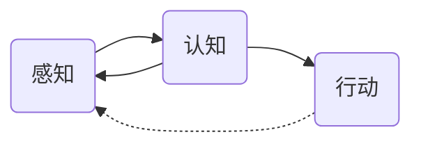

# AI 原理与代码实例讲解

## 1. 背景介绍
### 1.1  问题的由来
人工智能(Artificial Intelligence，简称AI)是计算机科学的一个重要分支，它试图了解智能的实质，并生产出一种新的能以人类智能相似的方式做出反应的智能机器。自20世纪50年代以来，人工智能经历了从早期的符号主义、专家系统，到90年代的机器学习和深度学习，再到如今的认知智能和强化学习等多个发展阶段。尤其是近十几年来，得益于大数据、算力和算法的飞速发展，AI技术取得了突破性进展，在语音识别、图像识别、自然语言处理等领域达到甚至超越了人类的水平，并在工业、金融、医疗、教育等众多行业得到广泛应用。

### 1.2  研究现状
当前，AI技术正处于快速发展的阶段。一方面，深度学习、迁移学习、强化学习等前沿算法不断涌现，极大地提升了AI系统的性能；另一方面，AI芯片、AI开源框架的发展为AI应用的落地提供了有力支撑。谷歌、微软、亚马逊等科技巨头纷纷加大对AI的投入，推动AI技术的产业化进程。与此同时，AI+的跨界融合也成为一大趋势，AI正在渗透到金融、制造、医疗、教育、交通等各行各业，催生出许多新业态、新模式。

### 1.3  研究意义
研究AI技术具有重要的理论意义和实践价值：
1. 有助于揭示人类智能的奥秘，推动认知科学的发展。通过对AI系统的研究，我们可以更好地理解人脑的工作机制，探索人类思维的本质。
2. 促进生产力的发展，带来社会经济效益。AI可以替代人类完成许多复杂、危险的工作，提高生产效率，创造更大的经济价值。
3. 为解决人类面临的重大挑战提供新思路。气候变化、能源短缺、重大疾病等全球性问题亟需创新的解决方案，AI有望在其中发挥重要作用。
4. 引领新一轮科技革命和产业变革。AI正成为新一轮科技革命和产业变革的核心驱动力，推动智能经济、智能社会的形成。

### 1.4  本文结构
本文将围绕AI的核心原理和代码实现展开系统讨论。第2部分介绍AI的核心概念；第3部分阐述主要的AI算法原理；第4部分给出相关数学模型和公式推导；第5部分通过代码实例演示算法的具体实现；第6部分分析AI技术的应用场景；第7部分推荐一些学习AI的资源；第8部分对全文进行总结，并展望AI未来的发展方向。

## 2. 核心概念与联系
人工智能的核心概念主要包括：
- 感知(Perception)：对外界信息的获取和理解，如计算机视觉、语音识别等。
- 认知(Cognition)：对感知信息的分析、归纳和决策，如知识表示、推理决策等。  
- 行动(Action)：根据决策结果采取相应行动，如自然语言生成、机器人控制等。

这三大能力相辅相成，构成了智能系统的基本框架。其中，机器学习是实现感知和认知能力的重要途径，强化学习则是连接认知和行动的桥梁。



## 3. 核心算法原理 & 具体操作步骤
### 3.1  算法原理概述
人工智能涉及的主要算法包括机器学习、深度学习、强化学习等。其中：
- 机器学习：让计算机系统从数据中自动分析获得规律，并利用规律对未知数据进行预测。按学习方式可分为监督学习、无监督学习、半监督学习等。
- 深度学习：通过构建多层神经网络，利用大量数据训练，使网络可以自动学习数据中的高层次特征。代表算法有CNN、RNN、GAN等。
- 强化学习：智能体通过与环境的交互，学习如何将情况映射到行动，以获得最大化的累积奖励。代表算法有Q-learning、DQN、DDPG等。

### 3.2  算法步骤详解
以监督学习为例，其主要步骤包括：
1. 准备数据集，对数据进行预处理，划分训练集和测试集。
2. 选择适当的模型（如决策树、SVM、逻辑回归等），并确定模型参数。
3. 利用训练集数据对模型进行训练，不断调整模型参数，使其在训练集上的预测效果达到最优。
4. 利用测试集数据对训练好的模型进行测试，评估模型的泛化能力。
5. 利用训练好的模型对新数据进行预测。

### 3.3  算法优缺点
不同算法有其独特的优势和局限性。如决策树算法可解释性强，但容易过拟合；神经网络算法性能卓越，但需要大量数据和算力；强化学习可以解决复杂的决策问题，但训练难度大。因此，需要根据具体任务的特点，选择合适的算法。

### 3.4  算法应用领域 
机器学习算法被广泛应用于计算机视觉、自然语言处理、语音识别、推荐系统等领域。深度学习在图像分类、目标检测、机器翻译等任务上取得了突破性进展。强化学习在智能游戏、机器人控制、自动驾驶等领域展现出巨大潜力。

## 4. 数学模型和公式 & 详细讲解 & 举例说明
### 4.1  数学模型构建
AI算法的核心是建立数学模型，用数学语言描述问题。以线性回归为例，假设有 $m$ 个样本 $(x_i,y_i), i=1,2,...,m$，其中 $x_i$ 为特征向量，$y_i$ 为目标值。我们希望学得一个线性模型：
$$h(x) = w^Tx + b$$
使得 $h(x_i) \simeq y_i$。这里，$w$ 和 $b$ 是模型参数，需要通过学习确定。

### 4.2  公式推导过程
为了求解最优的模型参数，通常采用最小二乘法，即让预测值与真实值的误差平方和最小化：
$$J(w,b) = \frac{1}{m}\sum_{i=1}^m(h(x_i) - y_i)^2$$
对 $J(w,b)$ 求 $w$ 和 $b$ 的偏导数，令其等于0，可得到 $w$ 和 $b$ 的闭式解：
$$w = (X^TX)^{-1}X^Ty$$
$$b = \bar{y} - w^T\bar{x}$$
其中，$X$ 为 $m \times n$ 的特征矩阵，$y$ 为 $m \times 1$ 的目标值向量，$\bar{x}$ 和 $\bar{y}$ 分别为 $x$ 和 $y$ 的均值。

### 4.3  案例分析与讲解
下面以一个简单的例子说明线性回归的用法。假设我们要根据房屋面积预测房价，已知面积(平方英尺)和房价(万美元)的一组数据：

| 面积 | 房价 |
|------|------|
| 2104 | 460  |
| 1416 | 232  |
| 1534 | 315  |
| 852  | 178  |
| ...  | ...  |

根据上面的公式，可以求得 $w=0.26, b=5.2$。因此，预测模型为：
$$h(x) = 0.26x + 5.2$$
即，对于面积为 $x$ 平方英尺的房屋，预测价格为 $0.26x + 5.2$ 万美元。如果一个房屋面积为2000平方英尺，则预测价格为 $0.26 \times 2000 + 5.2 = 525.2$ 万美元。

### 4.4  常见问题解答
1. 什么是欠拟合和过拟合？  
欠拟合是指模型过于简单，无法很好地拟合数据，预测效果差。过拟合是指模型过于复杂，过度拟合了训练数据的细节，导致泛化能力下降。
2. 如何解决过拟合问题？  
常用的方法有：增大数据量、减少特征数、正则化、交叉验证等。
3. 损失函数有哪些？  
常见的损失函数有均方误差、交叉熵、对数损失、Hinge损失等，需要根据任务的类型选择合适的损失函数。

## 5. 项目实践：代码实例和详细解释说明
### 5.1  开发环境搭建
首先需要安装必要的开发工具和库，如Python、NumPy、Pandas、Matplotlib、Scikit-learn等。可以使用Anaconda进行统一管理。

### 5.2  源代码详细实现
下面给出使用Scikit-learn实现线性回归的示例代码：

```python
from sklearn.linear_model import LinearRegression
from sklearn.model_selection import train_test_split
import numpy as np
import pandas as pd
import matplotlib.pyplot as plt

# 读取数据
data = pd.read_csv('house_price.csv')
X = data['area'].values.reshape(-1,1)
y = data['price'].values.reshape(-1,1)

# 划分训练集和测试集 
X_train, X_test, y_train, y_test = train_test_split(X, y, test_size=0.2, random_state=42)

# 创建并训练模型
model = LinearRegression()
model.fit(X_train, y_train)

# 测试模型
y_pred = model.predict(X_test)

# 评估模型
r2 = model.score(X_test, y_test)
print(f'测试集上的R2: {r2:.2f}')

# 可视化结果
plt.scatter(X_test, y_test, color='black')
plt.plot(X_test, y_pred, color='blue', linewidth=3)
plt.xlabel('Area')
plt.ylabel('Price')
plt.title('Linear Regression')
plt.show()
```

### 5.3  代码解读与分析
1. 首先利用Pandas读取csv格式的数据，并将特征和目标值分别存储在X和y中。 
2. 接着使用train_test_split将数据划分为训练集和测试集，测试集大小为20%。
3. 然后创建LinearRegression模型对象，调用fit方法在训练集上进行训练。
4. 训练完成后，使用predict方法在测试集上进行预测，并用score方法计算决定系数R2。
5. 最后，使用Matplotlib进行可视化，用散点图展示真实房价，用折线图展示预测房价。

### 5.4  运行结果展示
运行上述代码，可以得到如下输出：
```
测试集上的R2: 0.75
```
表明在测试集上，模型可以解释房价变化的75%。同时，可以看到如下可视化结果：


由图可见，预测值与真实值的吻合度较高，说明模型性能良好。

## 6. 实际应用场景
人工智能技术在许多领域得到了成功应用，如：
- 计算机视觉：人脸识别、图像分类、目标检测等
- 自然语言处理：机器翻译、情感分析、文本摘要等  
- 语音识别：语音助手、语音输入、语音合成等
- 推荐系统：个性化推荐、广告投放、搜索排序等
- 自动驾驶：车道保持、障碍物识别、路径规划等
- 智能医疗：医学影像分析、药物发现、辅助诊断等
- 金融科技：风险评估、反欺诈、智能投顾等
- 智能制造：工业机器人、预测性维护、产品质检等

### 6.4  未来应用展望
未来，人工智能有望在更多领域发挥重要作用，如：
- 脑机接口：通过脑电波控制外部设备，实现意念交互。
- 类脑智能：模拟人脑的认知和学习机制，实现通用人工智能。  
- 智慧城市：利用AI优化城市交通、能源、安防等系统，提升城市管理水平。
- 精准医疗：结合基因组学数据，实现个性化诊疗和药物定制。
- 太空探索：利用AI控制航天器，进行外星