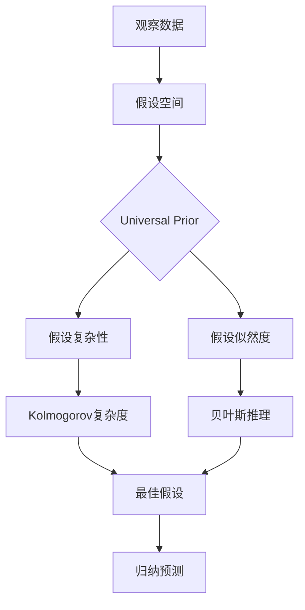

# AI 大模型计算机科学家群英传：所罗门诺夫归纳法（Solomonoff Induction）

关键词：所罗门诺夫归纳法、算法信息论、归纳推理、概率预测、机器学习

## 1. 背景介绍

### 1.1 问题的由来

在人工智能和机器学习领域,如何让机器具备从有限观察数据中学习和归纳出一般规律的能力,一直是一个核心难题。传统的归纳推理方法,如贝叶斯推理,在面对复杂环境和海量数据时往往捉襟见肘。20世纪60年代,美国数学家雷·所罗门诺夫(Ray Solomonoff)受到算法信息论的启发,提出了一种全新的归纳推理框架——所罗门诺夫归纳法(Solomonoff Induction),为解决机器归纳学习难题提供了全新思路。

### 1.2 研究现状

自所罗门诺夫归纳法提出以来,在理论计算机科学和人工智能领域引起了广泛关注。许多学者在此基础上进行了深入研究和拓展,如Hutter提出了基于所罗门诺夫归纳法的AIXI模型,用于通用人工智能系统的理论框架。Schmidhuber等人将深度学习与所罗门诺夫归纳法相结合,提出了基于深度学习的归纳推理方法。近年来,随着大数据和计算能力的飞速发展,所罗门诺夫归纳法在实际应用中展现出了巨大潜力,如谷歌DeepMind的AlphaGo系统就借鉴了所罗门诺夫归纳思想。

### 1.3 研究意义 

深入研究所罗门诺夫归纳法,对于推动人工智能从专用智能向通用智能发展具有重要意义。一方面,所罗门诺夫归纳为机器归纳学习提供了理论基础,有助于设计和优化机器学习算法。另一方面,所罗门诺夫归纳思想为构建类人的通用人工智能系统提供了可能的途径。此外,将所罗门诺夫归纳与其他学科交叉融合,有望催生更多原创性成果。因此,深入研究所罗门诺夫归纳法,对于人工智能的理论突破和实际应用都具有重要价值。

### 1.4 本文结构

本文将围绕所罗门诺夫归纳法展开深入探讨。第2部分介绍所罗门诺夫归纳的核心概念及其与其他理论的联系。第3部分重点阐述所罗门诺夫归纳的算法原理和操作步骤。第4部分建立数学模型,推导相关公式,并举例说明。第5部分给出具体的代码实现和详解。第6部分讨论所罗门诺夫归纳在实际场景中的应用。第7部分推荐相关学习资源和工具。第8部分总结全文,展望未来发展趋势和挑战。第9部分列举常见问题解答。

## 2. 核心概念与联系

所罗门诺夫归纳法的核心思想是将归纳问题转化为在给定观察数据下,寻找一个生成这些数据的最佳概率模型。其数学基础是算法信息论和贝叶斯推理:

- 算法信息论关注计算机程序产生特定输出的最短长度,即Kolmogorov复杂度。所罗门诺夫归纳利用算法信息论来度量假设的复杂性。

- 贝叶斯推理根据已知数据和先验知识,计算不同假设的后验概率。所罗门诺夫归纳在此基础上引入了"Universal Prior"的概念,即所有可计算概率分布的加权平均,作为先验概率。

所罗门诺夫归纳与其他归纳推理方法的主要区别在于:

- 考虑了所有可计算的假设,而不局限于参数化的假设空间。这使得它能够处理任意复杂的问题。

- 引入了对假设复杂性的惩罚,倾向于选择更简单的解释。这符合奥卡姆剃刀原则。 

- 可以在有限的观察数据下进行归纳预测,不依赖于大规模数据和计算资源。

下图展示了所罗门诺夫归纳法的核心概念及其联系:

## 3. 核心算法原理 & 具体操作步骤

### 3.1 算法原理概述

所罗门诺夫归纳法的核心是计算不同假设 $\mathcal{H}_i$ 在观察数据 $D$ 下的后验概率 $P(\mathcal{H}_i|D)$,并选择后验概率最大的假设作为最佳解释。根据贝叶斯定理,后验概率可分解为:

$$
P(\mathcal{H}_i|D) = \frac{P(D|\mathcal{H}_i)P(\mathcal{H}_i)}{\sum_j P(D|\mathcal{H}_j)P(\mathcal{H}_j)}
$$

其中,$P(D|\mathcal{H}_i)$ 是假设 $\mathcal{H}_i$ 生成数据 $D$ 的似然度,$P(\mathcal{H}_i)$ 是假设 $\mathcal{H}_i$ 的先验概率。

所罗门诺夫归纳的创新在于引入了Universal Prior $\xi$作为先验概率:

$$
\xi(\mathcal{H}_i) = 2^{-K(\mathcal{H}_i)}
$$

其中,$K(\mathcal{H}_i)$ 表示假设 $\mathcal{H}_i$ 的Kolmogorov复杂度,即能够生成 $\mathcal{H}_i$ 的最短程序长度。直观上,Universal Prior 给复杂度更低的假设更高的先验概率。

结合Universal Prior,最佳假设 $\mathcal{H}^*$ 可表示为:

$$
\mathcal{H}^* = \arg\max_{\mathcal{H}_i} P(D|\mathcal{H}_i)\xi(\mathcal{H}_i)
$$

### 3.2 算法步骤详解

输入:观察数据 $D$,假设空间 $\mathcal{H}$
输出:最佳假设 $\mathcal{H}^*$

1. 枚举假设空间 $\mathcal{H}$ 中的所有假设 $\mathcal{H}_i$。

2. 对每个假设 $\mathcal{H}_i$:
   
   a. 计算 $\mathcal{H}_i$ 的Kolmogorov复杂度 $K(\mathcal{H}_i)$
   
   b. 计算Universal Prior $\xi(\mathcal{H}_i) = 2^{-K(\mathcal{H}_i)}$
   
   c. 计算似然度 $P(D|\mathcal{H}_i)$
   
   d. 计算 $\mathcal{H}_i$ 的得分 $P(D|\mathcal{H}_i)\xi(\mathcal{H}_i)$

3. 选择得分最高的假设作为最佳假设 $\mathcal{H}^*$

4. 用 $\mathcal{H}^*$ 对新数据进行归纳预测

### 3.3 算法优缺点

所罗门诺夫归纳法的主要优点有:

- 能够在任意复杂的假设空间中进行归纳,具有很强的普适性
- 通过惩罚假设复杂度,有效地平衡了拟合数据和避免过拟合
- 在有限数据下也能进行归纳预测,不依赖大数据

同时,它也存在一些局限:

- 假设空间巨大,难以穷举
- Kolmogorov复杂度不可计算,只能近似
- 似然度的计算也是个难题,尤其是对于复杂模型

### 3.4 算法应用领域

尽管所罗门诺夫归纳法更多是一种理论框架,但其思想对许多领域产生了重要影响,例如:

- 机器学习:为归纳推理和概率预测提供了原则性指导
- 人工智能:AIXI等通用智能模型的理论基础
- 信息论:研究信息压缩和复杂度的重要工具
- 因果推理:用最简洁的因果模型解释数据

## 4. 数学模型和公式 & 详细讲解 & 举例说明

### 4.1 数学模型构建

我们考虑一个二元预测问题:根据历史0/1序列,预测下一个比特位。假设空间 $\mathcal{H}$ 由所有可能生成0/1序列的概率模型组成,每个模型对应一个生成序列的概率分布。

给定观察数据 $D=(x_1,\dots,x_n),x_i\in\{0,1\}$,目标是找到后验概率最大的模型 $\mathcal{H}^*$:

$$
\mathcal{H}^* = \arg\max_{\mathcal{H}_i\in\mathcal{H}} P(\mathcal{H}_i|D) 
$$

根据贝叶斯定理和Universal Prior,上式等价于:

$$
\mathcal{H}^* = \arg\max_{\mathcal{H}_i\in\mathcal{H}} P(D|\mathcal{H}_i)2^{-K(\mathcal{H}_i)}
$$

其中,$K(\mathcal{H}_i)$ 是 $\mathcal{H}_i$ 的Kolmogorov复杂度。

### 4.2 公式推导过程

为了计算似然度 $P(D|\mathcal{H}_i)$,我们假设数据是独立同分布的,则:

$$
P(D|\mathcal{H}_i) = \prod_{j=1}^n P(x_j|\mathcal{H}_i)
$$

其中,$P(x_j|\mathcal{H}_i)$ 是模型 $\mathcal{H}_i$ 生成第 $j$ 个比特为 $x_j$ 的概率。

对于Kolmogorov复杂度 $K(\mathcal{H}_i)$,我们可以用 $\mathcal{H}_i$ 的最短描述长度来近似:

$$
K(\mathcal{H}_i) \approx L(\mathcal{H}_i) = -\log_2 P(\mathcal{H}_i)
$$

其中,$P(\mathcal{H}_i)$ 是 $\mathcal{H}_i$ 在所有可能模型上的先验概率分布。

结合似然度和复杂度,最佳模型 $\mathcal{H}^*$ 可表示为:

$$
\mathcal{H}^* = \arg\max_{\mathcal{H}_i\in\mathcal{H}} \prod_{j=1}^n P(x_j|\mathcal{H}_i)2^{\log_2 P(\mathcal{H}_i)}
$$

化简得:

$$
\mathcal{H}^* = \arg\max_{\mathcal{H}_i\in\mathcal{H}} P(\mathcal{H}_i)\prod_{j=1}^n P(x_j|\mathcal{H}_i)
$$

### 4.3 案例分析与讲解

我们考虑一个简单的例子。假设观察到的数据是 $D=(0,1,0,1,0)$,假设空间 $\mathcal{H}$ 包含3个模型:

- $\mathcal{H}_1$:始终预测0,即 $P(x_j=0|\mathcal{H}_1)=1,P(x_j=1|\mathcal{H}_1)=0$
- $\mathcal{H}_2$:始终预测1,即 $P(x_j=0|\mathcal{H}_2)=0,P(x_j=1|\mathcal{H}_2)=1$
- $\mathcal{H}_3$:交替预测0和1,即 $P(x_j=0|\mathcal{H}_3)=1(j\text{为奇数}),P(x_j=1|\mathcal{H}_3)=1(j\text{为偶数})$

我们假设这3个模型的先验概率相等,即 $P(\mathcal{H}_1)=P(\mathcal{H}_2)=P(\mathcal{H}_3)=\frac{1}{3}$。

对于 $\mathcal{H}_1$,似然度 $P(D|\mathcal{H}_1)=0$,因为 $\mathcal{H}_1$ 无法生成1。

对于 $\mathcal{H}_2$,似然度 $P(D|\mathcal{H}_2)=0$,因为 $\mathcal{H}_2$ 无法生成0。

对于 $\mathcal{H}_3$