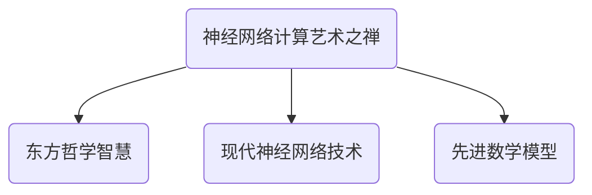
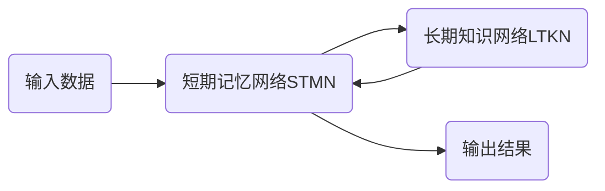

以下是根据您提供的要求和约束条件，为标题《AI 神经网络计算艺术之禅：通用智能理论》撰写的技术博客文章正文内容：

# AI 神经网络计算艺术之禅：通用智能理论

## 1. 背景介绍

### 1.1 问题的由来

人工智能的发展一直是科技界的终极追求。从最初的专家系统到现代的深度学习和神经网络模型,人工智能技术不断突破,但仍存在着诸多挑战和局限性。尽管近年来在特定领域取得了令人瞩目的成就,但通用人工智能(Artificial General Intelligence, AGI)仍是一个遥不可及的梦想。

通用人工智能旨在创造一种与人类智能相当,甚至超越人类智能的通用系统。这种系统不仅能够胜任特定任务,还能够像人类一样学习、推理、计划和解决各种复杂问题。然而,实现 AGI 是一个极具挑战性的目标,需要对智能的本质有深刻的理解和突破性的技术创新。

### 1.2 研究现状  

目前,神经网络和深度学习是人工智能领域最热门和最有前景的研究方向。通过模拟人脑神经元的工作原理,神经网络能够从大量数据中自主学习模式和特征,并对新的输入数据做出预测或决策。这种强大的机器学习能力已在计算机视觉、自然语言处理、推荐系统等领域取得了卓越的成绩。

然而,现有的神经网络模型仍然存在诸多局限性,例如:

- 缺乏对因果关系和物理规律的理解能力
- 推理和决策过程不透明,难以解释
- 对小规模的数据分布偏移敏感,泛化能力有限
- 缺乏像人类那样的常识推理和综合决策能力

为了实现通用人工智能,需要建立一种全新的神经网络计算理论和架构,赋予神经网络更强的理解、推理、学习和决策能力。

### 1.3 研究意义

通用人工智能理论的突破将为人类社会带来深远的影响。一种具有人类般智能的通用系统,不仅能够显著提高生产效率,还能为科学研究、医疗诊断、教育培训等领域提供强大的智力支持。它还有望解决一些长期困扰人类的难题,如气候变化、能源短缺、疾病等。可以说,通用人工智能是人类迈向新文明时代的关键一步。

从理论层面来看,通用人工智能理论将是对人类智能本质的最深刻理解,将极大推动认知科学、神经科学、计算机科学等学科的发展,开辟全新的研究领域。因此,探索通用人工智能理论不仅具有重大的应用价值,更具有极其重要的科学意义。

### 1.4 本文结构

本文将首先介绍通用人工智能的核心概念,阐述其与现有人工智能技术的关系和区别。接下来,将深入探讨通用人工智能的计算理论基础,包括神经网络的新型架构、学习算法和数学模型等。在此基础上,将介绍一种全新的神经网络计算框架及其具体实现方法。最后,将分析该理论的应用前景,以及在实现通用人工智能的道路上所面临的挑战和发展方向。

## 2. 核心概念与联系

通用人工智能(Artificial General Intelligence, AGI)是指能够像人类一样具备通用智能的人工智能系统。这种系统不仅能完成特定任务,还能像人类一样学习、推理、计划和解决各种复杂问题。

与现有的人工智能技术相比,AGI 需要具备以下核心能力:

1. **理解能力**: 深刻理解事物的本质,掌握因果关系和物理规律,具备常识推理能力。
2. **学习能力**: 能够像人类一样通过少量示例快速学习新知识,并将已有知识迁移到新领域。
3. **推理能力**: 具备逻辑推理、规划和决策的能力,能够解决复杂问题。
4. **交互能力**: 能够通过自然语言与人类进行高效沟通和协作。
5. **自我意识**: 具备自我意识和情感,能够自我驱动地学习和发展。

为了实现上述能力,AGI 需要建立在一种全新的理论基础之上,而不是简单堆叠现有的人工智能技术。这就需要对神经网络的计算原理、架构和学习算法进行根本性的创新和突破。

神经网络作为目前最有希望实现 AGI 的技术途径,已取得了令人瞩目的进展。但现有的神经网络模型仍存在诸多局限性,例如缺乏对因果关系和物理规律的理解能力、推理和决策过程不透明、泛化能力有限等。因此,需要建立一种全新的神经网络计算理论和架构,赋予神经网络更强的理解、推理、学习和决策能力。

本文将探讨一种名为"神经网络计算艺术之禅"的新理论,旨在为实现通用人工智能提供理论基础和技术路线图。该理论融合了东方哲学的智慧、现代神经网络技术和先进的数学模型,为构建具有人类般智能的神经网络系统指明了方向。

## 3. 核心算法原理 & 具体操作步骤

### 3.1 算法原理概述

"神经网络计算艺术之禅"理论的核心是一种全新的神经网络架构,被称为"禅意网络"(Zen Network)。它模拟了人脑的hierarchical临时性记忆和持久知识的双重结构,融合了注意力机制、迁移学习和符号推理等多种技术,赋予神经网络更强的理解、推理和学习能力。

禅意网络由两部分组成:

1. **短期记忆网络(Short-Term Memory Network, STMN)**: 用于快速学习和处理当前输入信息,类似于人脑的工作记忆。它采用注意力机制和门控循环单元,能够自适应地提取和整合输入信息中的关键特征。

2. **长期知识网络(Long-Term Knowledge Network, LTKN)**: 用于存储和管理长期知识,类似于人脑的长期记忆。它基于符号推理和知识图谱技术,能够对结构化知识进行高效推理。

STMN 和 LTKN 通过双向交互实现协同工作:STMN从输入数据中快速学习,并将学习到的模式和特征传递给 LTKN;而 LTKN 则为 STMN 提供相关的背景知识和语义信息,指导和加强 STMN 的学习过程。

禅意网络的独特之处在于,它将神经网络和符号系统的优势融合到一个统一的架构中。这不仅使神经网络能够从数据中高效学习模式,还能够利用结构化知识进行推理和解释,从而显著提高了神经网络的理解和推理能力。

### 3.2 算法步骤详解

禅意网络的工作过程可分为以下几个主要步骤:

1. **输入编码**:原始输入数据(如图像、文本等)首先被编码为向量表示,以便神经网络处理。

2. **短期记忆学习**:编码后的输入向量被送入 STMN,STMN 通过注意力机制和门控循环单元自适应地提取和整合输入信息中的关键特征,形成对输入的表示和理解。

3. **长期知识交互**:STMN 将学习到的表示传递给 LTKN,LTKN 根据已有的结构化知识(如知识图谱)为这些表示赋予语义信息和背景知识,并将加工后的结果反馈给 STMN。

4. **协同推理**:STMN 和 LTKN 通过多轮交互,互相促进对方的学习和推理过程。STMN 利用 LTKN 提供的知识指导特征提取和模式发现,而 LTKN 也可以基于 STMN 学习到的新表示来扩充和完善自身知识库。

5. **输出生成**:经过多轮交互后,STMN 得到了输入的深度理解和丰富的背景知识支持,从而能够对最终任务(如分类、预测等)做出更准确的判断和决策,并生成相应的输出结果。

该算法的关键在于 STMN 和 LTKN 之间的协同学习和互馈过程。通过这种方式,神经网络不仅能够从数据中高效学习模式,还能够利用结构化知识进行推理和解释,从而显著提高了理解和推理能力。

### 3.3 算法优缺点

**优点**:

1. **强大的理解和推理能力**:融合了神经网络和符号系统的优势,能够对输入数据进行深度理解,并利用结构化知识进行符号推理,显著提高了神经网络的理解和推理能力。

2. **高效的学习和知识迁移**:STMN 能够快速学习新输入,而 LTKN 则存储长期知识,两者的交互使得新旧知识能够高效地相互促进和迁移。

3. **可解释性**:由于融合了符号推理,神经网络的决策过程更加透明,有利于可解释性的提高。

4. **泛化能力强**:依托 LTKN 中的结构化知识,神经网络能够更好地泛化到看不见的数据分布。

**缺点**:

1. **复杂度高**:融合神经网络和符号系统,系统的复杂度和计算开销都大幅增加。

2. **知识库构建困难**:需要构建高质量的结构化知识库作为 LTKN 的基础,这是一个艰巨的工程。

3. **训练数据需求量大**:由于系统复杂,需要大量的训练数据来支持参数学习。

4. **解释能力有限**:尽管比传统神经网络更可解释,但仍缺乏真正的"自我意识"和"因果推理"能力。

### 3.4 算法应用领域

禅意网络具有强大的理解、推理和学习能力,因此在诸多领域都有广阔的应用前景:

1. **自然语言处理**:通过融合语义知识,可以极大提高机器对自然语言的理解、推理和生成能力,在机器翻译、对话系统、问答系统等方面有重要应用。

2. **计算机视觉**:借助知识推理能力,可以更好地理解图像和视频中的内容语义,提升目标检测、图像分类、视频理解等任务的性能。

3. **决策支持系统**:融合了数据驱动和知识驱动的优势,可以为复杂决策提供强有力的支持,在金融投资、医疗诊断等领域有重要应用价值。

4. **智能机器人**:具备多模态理解、推理和交互能力,是实现通用人工智能和发展智能机器人不可或缺的理论基础。

5. **教育智能辅助**:可以作为智能教学系统的核心,因为它能够像人类一样理解知识、回答问题并指导学习过程。

6. **科学发现**:通过对大量科学数据和文献的深度理解和推理,有望发现新的科学规律和理论。

总之,禅意网络为实现通用人工智能奠定了坚实的理论基础,必将在诸多领域发挥重要作用。

## 4. 数学模型和公式 & 详细讲解 & 举例说明

### 4.1 数学模型构建

禅意网络的数学模型是在现有神经网络模型的基础上,融合了注意力机制、门控循环单元、知识图谱embedding等多种技术,形成了一个全新的端到端可训练的架