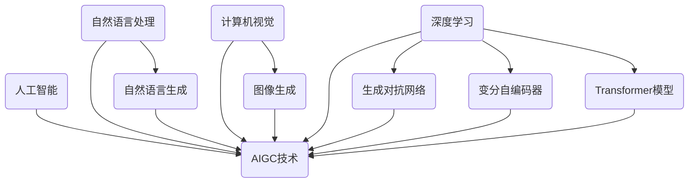
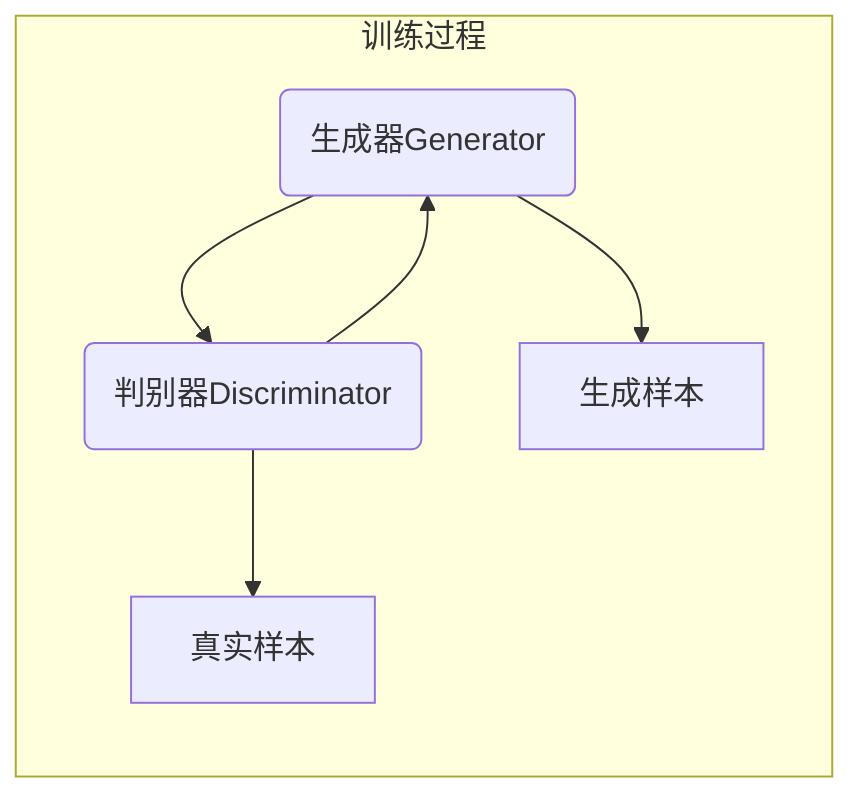
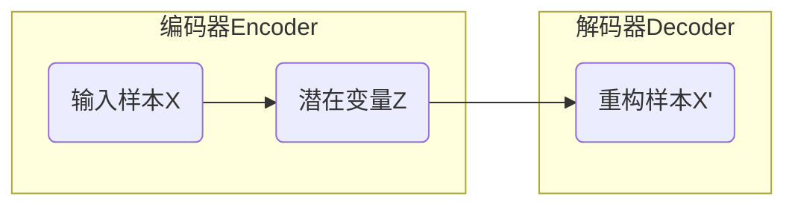
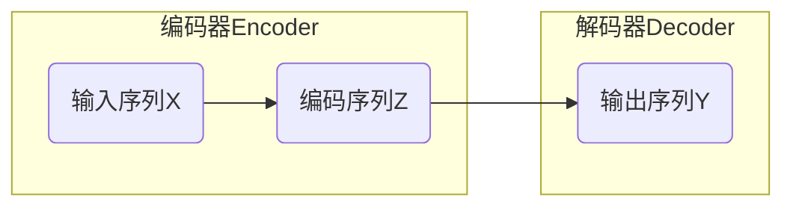

# AIGC从入门到实战：AIGC的发展历程

## 1. 背景介绍

### 1.1 问题的由来

在过去的几十年里,人工智能(AI)技术取得了长足的进步,并在多个领域得到了广泛应用。然而,传统的人工智能系统存在一些固有的局限性,例如缺乏创造力、无法生成新颖和多样化的内容等。为了解决这些问题,人工智能生成内容(AIGC)技术应运而生。

AIGC(AI-Generated Content)是指利用人工智能算法和模型自动生成文本、图像、视频、音频等多种形式的内容。与传统的人工智能系统不同,AIGC系统具有更强的创造力和生成能力,可以根据用户需求生成全新的、多样化的内容。

### 1.2 研究现状

近年来,AIGC技术取得了飞速发展,在多个领域得到了广泛应用。以下是一些典型的应用场景:

- 内容创作:AIGC可以自动生成文章、小说、诗歌、脚本等文本内容,为创作者提供灵感和辅助。
- 视觉设计:AIGC可以生成图像、插画、动画等视觉内容,为设计师提供创意和素材。
- 营销广告:AIGC可以生成个性化的广告文案和视觉内容,提高广告的吸引力和转化率。
- 客户服务:AIGC可以生成自然语言对话,为客户提供智能化的问答和服务。

然而,AIGC技术也面临一些挑战,例如版权问题、内容质量控制、算法偏差等,需要进一步的研究和探索。

### 1.3 研究意义

AIGC技术的发展将带来深远的影响,不仅可以提高内容生产的效率和质量,还可以促进创意产业的发展,为人类创造力提供新的助力。同时,AIGC也将对教育、娱乐、医疗等多个领域产生影响。

因此,深入研究AIGC技术的原理、算法和应用,对于推动人工智能技术的发展、促进创新创意、提高生产效率等方面都具有重要意义。

### 1.4 本文结构

本文将全面介绍AIGC技术的发展历程,包括以下几个方面:

1. 核心概念与联系:介绍AIGC技术的核心概念,以及与其他相关技术的联系。
2. 核心算法原理与具体操作步骤:详细阐述AIGC技术中常用的算法原理和具体操作步骤。
3. 数学模型和公式:介绍AIGC技术中使用的数学模型和公式,并进行详细讲解和案例分析。
4. 项目实践:提供AIGC技术的代码实例,并进行详细解释和运行结果展示。
5. 实际应用场景:介绍AIGC技术在各个领域的实际应用场景,并展望未来的发展趋势。
6. 工具和资源推荐:推荐AIGC技术的学习资源、开发工具、相关论文等。
7. 总结:总结AIGC技术的研究成果、未来发展趋势和面临的挑战。
8. 附录:解答AIGC技术中常见的问题。

## 2. 核心概念与联系

AIGC技术是一个交叉学科,涉及多个领域的知识,包括人工智能、自然语言处理、计算机视觉、深度学习等。下面介绍AIGC技术中的一些核心概念及其与其他技术的联系。

- **人工智能(AI)**: AIGC技术是人工智能的一个重要分支,利用人工智能算法和模型来生成内容。
- **自然语言处理(NLP)**: NLP技术是AIGC技术的基础,用于理解和生成自然语言文本。其中,自然语言生成(NLG)技术是AIGC文本生成的核心。
- **计算机视觉(CV)**: CV技术是AIGC技术中图像生成的基础,用于理解和生成图像、视频等视觉内容。
- **深度学习(DL)**: 深度学习是AIGC技术中常用的算法和模型,如生成对抗网络(GAN)、变分自编码器(VAE)、Transformer等。
- **生成对抗网络(GAN)**: GAN是一种常用的深度学习模型,可以生成逼真的图像、视频等内容。
- **变分自编码器(VAE)**: VAE是另一种常用的深度学习模型,可以学习数据的潜在分布,并生成新的内容。
- **Transformer模型**: Transformer是一种基于注意力机制的序列到序列模型,在自然语言处理和计算机视觉等领域表现出色,也被广泛应用于AIGC技术中。

AIGC技术融合了多个领域的知识,是一个交叉学科。它与人工智能、自然语言处理、计算机视觉、深度学习等技术密切相关,并且相互借鉴和促进。

## 3. 核心算法原理 & 具体操作步骤

### 3.1 算法原理概述

AIGC技术中常用的算法主要包括以下几种:

1. **生成对抗网络(GAN)**
2. **变分自编码器(VAE)**
3. **Transformer模型**
4. **其他算法(如LSTM、GRU等)**

下面分别介绍这些算法的原理。

#### 3.1.1 生成对抗网络(GAN)

生成对抗网络(Generative Adversarial Networks, GAN)是一种基于对抗训练的深度学习模型,由两个网络组成:生成器(Generator)和判别器(Discriminator)。

生成器的目标是生成逼真的样本,以欺骗判别器;而判别器的目标是区分生成的样本和真实样本。两个网络相互对抗,不断提高自身的能力,最终达到生成器生成的样本无法被判别器区分的状态。这种对抗训练的方式使得生成器能够学习到真实数据的分布,从而生成逼真的内容。

GAN在图像生成、视频生成等领域表现出色,但也存在训练不稳定、模式崩溃等问题。

#### 3.1.2 变分自编码器(VAE)

变分自编码器(Variational Autoencoder, VAE)是一种基于深度学习的生成模型,它可以学习数据的潜在分布,并从该分布中采样生成新的样本。

VAE由两部分组成:编码器(Encoder)和解码器(Decoder)。编码器将输入样本X映射到潜在空间中的潜在变量Z,解码器则将潜在变量Z解码为重构样本X'。通过最小化输入样本X和重构样本X'之间的差异,VAE可以学习到数据的潜在分布。

在生成新样本时,VAE从学习到的潜在分布中采样一个潜在变量Z,然后将其输入解码器,即可生成新的样本。VAE在文本生成、图像生成等领域有广泛应用。

#### 3.1.3 Transformer模型

Transformer是一种基于注意力机制的序列到序列模型,最初被提出用于机器翻译任务。由于其出色的性能和高度的并行化能力,Transformer模型后来也被广泛应用于自然语言处理、计算机视觉等多个领域,包括AIGC技术。

Transformer模型由编码器(Encoder)和解码器(Decoder)组成。编码器将输入序列X编码为潜在表示Z,解码器则根据Z生成输出序列Y。注意力机制使得模型可以自适应地关注输入序列中的不同部分,从而更好地捕获长距离依赖关系。

在AIGC技术中,Transformer模型可以用于文本生成、图像描述生成等任务。例如,GPT(Generative Pre-trained Transformer)模型就是一种基于Transformer的大型语言模型,可以生成高质量的自然语言文本。

### 3.2 算法步骤详解

接下来,我们详细介绍上述算法在AIGC技术中的具体操作步骤。

#### 3.2.1 生成对抗网络(GAN)

1. **数据准备**:收集并预处理要生成的内容类型的数据集,如图像、视频等。
2. **网络设计**:设计生成器和判别器网络的结构,包括网络层数、激活函数、损失函数等。
3. **模型训练**:
    - 初始化生成器和判别器的参数。
    - 对判别器进行训练,目标是能够正确区分真实样本和生成样本。
    - 对生成器进行训练,目标是生成足够逼真的样本以欺骗判别器。
    - 重复上述两个步骤,直到模型收敛。
4. **生成新样本**:使用训练好的生成器生成新的样本。

#### 3.2.2 变分自编码器(VAE)

1. **数据准备**:收集并预处理要生成的内容类型的数据集。
2. **网络设计**:设计编码器和解码器网络的结构,包括网络层数、激活函数、损失函数等。
3. **模型训练**:
    - 初始化编码器和解码器的参数。
    - 将输入样本X输入编码器,获得潜在变量Z的分布。
    - 从Z的分布中采样,将采样值输入解码器,获得重构样本X'。
    - 计算输入样本X和重构样本X'之间的reconstruction loss,以及Z的分布与标准正态分布之间的KL divergence。
    - 优化编码器和解码器的参数,最小化总损失。
    - 重复上述步骤,直到模型收敛。
4. **生成新样本**:从学习到的潜在分布中采样一个潜在变量Z,将其输入解码器,即可生成新的样本。

#### 3.2.3 Transformer模型

1. **数据准备**:收集并预处理要生成的内容类型的数据集,如文本、图像等。
2. **网络设计**:设计Transformer模型的结构,包括编码器、解码器、注意力机制等模块。
3. **模型训练**:
    - 初始化模型参数。
    - 将输入序列X输入编码器,获得编码序列Z。
    - 将Z输入解码器,生成输出序列Y。
    - 计算Y与目标序列之间的损失函数,如交叉熵损失。
    - 优化模型参数,最小化损失函数。
    - 重复上述步骤,直到模型收敛。
4. **生成新样本**:将输入序列X输入训练好的Transformer模型,即可生成对应的输出序列Y。

### 3.3 算法优缺点

#### 3.3.1 生成对抗网络(GAN)

**优点**:
- 可以生成逼真的样本,尤其在图像、视频生成方面表现出色。
- 无需明确建模数据分布,而是通过对抗训练的方式学习数据分布。
- 生成的样本多样性较高,可以生成全新的内容。

**缺点**:
- 训练过程不稳定,容易出现模式崩溃、梯度消失等问题。
- 生成的样本质量受到训练数据的限制,难以生成超出训练数据分布的样本。
- 评估生成样本的质量较为困难,缺乏统一的评价指标。

#### 3.3.2 变分自编码器(VAE)

**优点**: