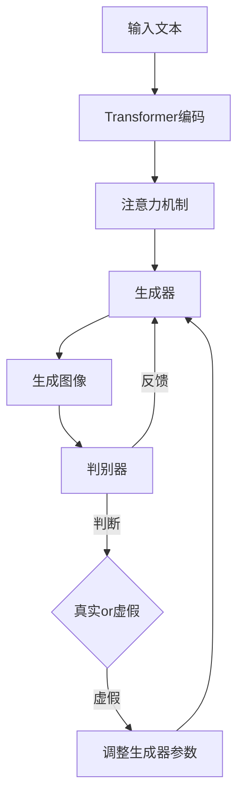

# AIGC从入门到实战：启动：AIGC 工具中的明星产品 Midjourney

## 1. 背景介绍

### 1.1 问题的由来

人工智能生成内容(AIGC)在近年来得到了飞速的发展，特别是在图像生成领域，各种令人惊叹的 AI 绘画工具层出不穷。而在众多 AIGC 绘画工具中，Midjourney 以其独特的艺术风格和强大的图像生成能力脱颖而出，成为了 AIGC 领域的明星产品之一。

### 1.2 研究现状

目前，关于 Midjourney 的研究主要集中在以下几个方面：

1. Midjourney 的工作原理和核心算法
2. Midjourney 生成图像的质量和多样性分析
3. Midjourney 在艺术创作、设计、游戏等领域的应用探索
4. 将 Midjourney 与其他 AIGC 工具进行对比研究

### 1.3 研究意义

深入研究 Midjourney 有助于我们更好地理解 AIGC 技术的发展现状和未来趋势，同时也为探索 AIGC 在各个领域的应用提供了宝贵的经验和启示。通过学习 Midjourney 的工作原理和实践应用，我们可以掌握 AIGC 的核心技术，并将其应用到更多的场景中，推动 AIGC 技术的进一步发展。

### 1.4 本文结构

本文将从以下几个方面对 Midjourney 进行深入探讨：

1. 介绍 Midjourney 的核心概念和工作原理
2. 详细解析 Midjourney 的核心算法和数学模型
3. 通过代码实例和详细解释，展示如何使用 Midjourney 进行图像生成
4. 探讨 Midjourney 在实际应用场景中的应用
5. 推荐 Midjourney 相关的学习资源和开发工具
6. 总结 Midjourney 的研究现状，展望其未来发展趋势和面临的挑战

## 2. 核心概念与联系

Midjourney 是一个基于深度学习的图像生成模型，它通过训练大量的图像数据，学习了图像的特征表示和生成规律。Midjourney 的核心是一个生成对抗网络(GAN)，由生成器和判别器两部分组成。

生成器负责根据输入的文本描述生成相应的图像，判别器则负责判断生成的图像是否与文本描述相符，并给出反馈。通过生成器和判别器的不断博弈，Midjourney 可以生成高质量、富有创意的图像。

除了 GAN，Midjourney 还使用了其他一些重要的技术，如注意力机制、transformer 等，来进一步提升图像生成的质量和效率。

下图展示了 Midjourney 的核心概念及其之间的联系：



## 3. 核心算法原理 & 具体操作步骤

### 3.1 算法原理概述

Midjourney 的核心算法是基于 GAN 的图像生成算法。GAN 由生成器(Generator)和判别器(Discriminator)两部分组成，生成器负责生成图像，判别器负责判断生成的图像是否真实。

生成器接收一个随机噪声向量 z 作为输入，通过一系列的卷积、上采样等操作，将噪声向量转换为一张图像。判别器接收一张图像作为输入，通过卷积、下采样等操作，输出一个 0 到 1 之间的值，表示输入图像为真实图像的概率。

生成器的目标是生成尽可能逼真的图像来欺骗判别器，判别器的目标是尽可能准确地判断输入图像是生成的还是真实的。两者在训练过程中不断博弈，最终达到一个平衡，生成器可以生成高质量的图像。

### 3.2 算法步骤详解

Midjourney 的训练过程可以分为以下几个步骤：

1. 准备训练数据：收集大量高质量的图像数据，并进行预处理，如缩放、裁剪等。

2. 初始化生成器和判别器：随机初始化生成器和判别器的参数。

3. 训练判别器：
   - 从真实图像数据中随机选取一批图像，输入判别器，计算损失函数 $L_D$。
   - 从生成器生成一批假图像，输入判别器，计算损失函数 $L_G$。
   - 更新判别器参数，最小化总损失 $L_D + L_G$。

4. 训练生成器：
   - 从随机噪声向量 z 生成一批假图像，输入判别器，计算损失函数 $L_G$。
   - 更新生成器参数，最小化损失 $L_G$，使生成的图像更加逼真。

5. 重复步骤 3 和 4，直到模型收敛或达到预设的训练轮数。

### 3.3 算法优缺点

优点：
- GAN 可以生成高质量、富有创意的图像
- 生成的图像具有良好的多样性
- 通过调整输入的随机噪声，可以控制生成图像的风格和内容

缺点：
- GAN 的训练过程不稳定，容易出现模式崩溃等问题
- 生成器和判别器需要精心设计，超参数调整困难
- 需要大量的训练数据和计算资源

### 3.4 算法应用领域

GAN 在图像生成领域有广泛的应用，除了 Midjourney，还有许多其他优秀的 AIGC 工具也是基于 GAN 实现的，如：

- StyleGAN：可以生成高质量的人脸、动物、风景等图像
- CycleGAN：可以实现图像风格转换，如将照片转换为梵高风格的油画
- Pix2PixHD：可以根据语义标签图生成逼真的图像

## 4. 数学模型和公式 & 详细讲解 & 举例说明

### 4.1 数学模型构建

GAN 的数学模型可以用以下公式表示：

$$\min_G \max_D V(D,G) = \mathbb{E}_{x \sim p_{data}(x)}[\log D(x)] + \mathbb{E}_{z \sim p_z(z)}[\log (1 - D(G(z)))]$$

其中，$G$ 表示生成器，$D$ 表示判别器，$x$ 表示真实图像，$z$ 表示随机噪声向量，$p_{data}$ 表示真实图像的分布，$p_z$ 表示随机噪声的分布。

### 4.2 公式推导过程

上述公式可以这样理解：

- $\mathbb{E}_{x \sim p_{data}(x)}[\log D(x)]$ 表示判别器对真实图像的预测结果，我们希望真实图像的预测值尽可能接近 1，即 $\log D(x)$ 尽可能大。

- $\mathbb{E}_{z \sim p_z(z)}[\log (1 - D(G(z)))]$ 表示判别器对生成图像的预测结果，我们希望生成图像的预测值尽可能接近 0，即 $\log (1 - D(G(z)))$ 尽可能大。

- 生成器 $G$ 的目标是最小化 $\mathbb{E}_{z \sim p_z(z)}[\log (1 - D(G(z)))]$，即生成的图像能够尽可能欺骗判别器。

- 判别器 $D$ 的目标是最大化整个公式，即尽可能准确地判断真实图像和生成图像。

### 4.3 案例分析与讲解

下面我们以生成手写数字图像为例，讲解 GAN 的训练过程。

假设我们要训练一个 GAN 模型，生成 0 到 9 的手写数字图像。我们准备了一批真实的手写数字图像作为训练数据。

1. 初始化生成器 $G$ 和判别器 $D$，它们都是由多层神经网络组成的。

2. 从训练数据中随机选择一批真实图像 $\{x^{(1)}, x^{(2)}, ..., x^{(m)}\}$，输入判别器 $D$，计算损失函数：

$$L_D = -\frac{1}{m} \sum_{i=1}^m \log D(x^{(i)})$$

3. 从随机噪声 $\{z^{(1)}, z^{(2)}, ..., z^{(m)}\}$ 生成一批假图像 $\{\tilde{x}^{(1)}, \tilde{x}^{(2)}, ..., \tilde{x}^{(m)}\}$，其中 $\tilde{x}^{(i)} = G(z^{(i)})$，输入判别器 $D$，计算损失函数：

$$L_G = -\frac{1}{m} \sum_{i=1}^m \log (1 - D(\tilde{x}^{(i)}))$$

4. 更新判别器 $D$ 的参数，最小化损失 $L_D + L_G$。

5. 从随机噪声 $\{z^{(1)}, z^{(2)}, ..., z^{(m)}\}$ 生成一批假图像 $\{\tilde{x}^{(1)}, \tilde{x}^{(2)}, ..., \tilde{x}^{(m)}\}$，输入判别器 $D$，计算损失函数：

$$L_G = -\frac{1}{m} \sum_{i=1}^m \log D(\tilde{x}^{(i)})$$

6. 更新生成器 $G$ 的参数，最小化损失 $L_G$。

7. 重复步骤 2 到 6，直到模型收敛或达到预设的训练轮数。

经过训练，生成器 $G$ 可以根据随机噪声生成逼真的手写数字图像，判别器 $D$ 可以准确地判断图像是真实的还是生成的。

### 4.4 常见问题解答

1. GAN 训练不稳定的原因是什么？

GAN 训练不稳定主要有以下几个原因：

- 生成器和判别器的能力不平衡，导致训练过程中一方占据主导地位。
- 梯度消失或梯度爆炸，导致模型无法有效学习。
- 模式崩溃，生成器只生成少数几种图像，缺乏多样性。

2. 如何评估 GAN 生成图像的质量？

评估 GAN 生成图像的质量通常采用以下几种方法：

- 主观评估：由人工对生成的图像进行打分，评估其真实度和美观度。
- Inception Score (IS)：利用 Inception 网络对生成图像进行分类，计算类别概率的 KL 散度，得到一个数值评估生成图像的质量和多样性。
- Fréchet Inception Distance (FID)：计算生成图像和真实图像在 Inception 网络特征空间下的 Fréchet 距离，评估生成图像的质量和多样性。

3. GAN 可以应用于哪些领域？

除了图像生成，GAN 还可以应用于以下领域：

- 图像翻译：如风格迁移、超分辨率、图像去噪等。
- 视频生成：如根据文本描述生成视频、视频预测等。
- 语音合成：如根据文本生成逼真的语音。
- 异常检测：如利用 GAN 学习正常数据的分布，检测异常数据。

## 5. 项目实践：代码实例和详细解释说明

下面我们通过一个简单的代码实例，演示如何使用 PyTorch 实现一个基于 DCGAN 的手写数字生成模型。

### 5.1 开发环境搭建

首先，我们需要安装必要的依赖库：

```bash
pip install torch torchvision matplotlib
```

### 5.2 源代码详细实现

```python
import torch
import torch.nn as nn
import torch.optim as optim
import torchvision
import torchvision.datasets as datasets
import torchvision.transforms as transforms
import matplotlib.pyplot as plt

# 定义生成器
class Generator(nn.Module):
    def __init__(self, nz=100, ngf=64, nc=1):
        super(Generator, self).__init__()
        self.main = nn.Sequential(
            nn.ConvTranspose2d(nz, ngf*8, 4, 1, 0, bias=False),
            nn.BatchNorm2d(ngf*8),
            nn.ReLU(True