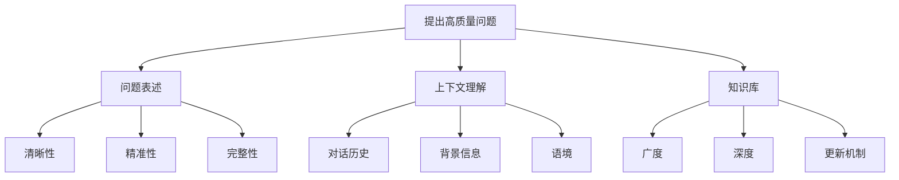

# AIGC从入门到实战：进阶：如何提问以获得高质量答案，解决复杂问题

## 1. 背景介绍

### 1.1 问题的由来

在人工智能和自然语言处理领域的快速发展中,大型语言模型(LLM)的出现为人机交互带来了革命性的变化。无论是在工作、学习还是日常生活中,人们越来越多地依赖于这些智能助手来获取信息、解决问题和完成任务。然而,与这些智能系统进行高质量的交互并非易事,提出明确、精准的问题对于获得有价值的答案至关重要。

随着人工智能技术的不断演进,人们对于智能助手的期望也在不断提高。单纯的查询和简单问答已经不能满足复杂场景下的需求,用户希望能够与智能助手进行更深入、更富有洞见的交流,共同探讨和解决棘手的问题。因此,掌握提出高质量问题的技巧,成为了充分利用人工智能系统、获取有价值答复的关键。

### 1.2 研究现状

目前,已有一些研究关注于如何提高人机交互的质量,主要集中在以下几个方面:

1. **问题表述优化**: 探讨如何更清晰、更精准地表达问题,避免歧义和模糊性,帮助智能系统准确理解用户的需求。

2. **交互模式创新**: 研究新型的人机交互模式,如多轮对话、上下文理解等,使得交互过程更加自然、流畅。

3. **知识库构建**: 构建涵盖广泛领域的知识库,为智能系统提供更加丰富的背景知识,从而能够给出更加准确、深入的答复。

4. **评估指标改进**: 改进评估指标,更好地衡量答复的质量,为智能系统的持续优化提供反馈和指导。

然而,这些研究大多集中在系统端的优化,而忽视了用户端提问技巧的重要性。高质量的问题不仅能够帮助智能系统更好地理解用户需求,还能够引导系统给出更有价值的答复。因此,研究如何提出高质量问题,对于充分发挥人工智能系统的潜力至关重要。

### 1.3 研究意义

掌握提出高质量问题的技巧,对于个人、组织乃至整个社会都有着重要的意义:

1. **个人层面**: 有助于个人更高效地利用人工智能系统,获取所需的信息和解决方案,提高工作和学习效率。

2. **组织层面**: 能够帮助组织内部员工更好地利用智能助手,促进知识共享和协作,提高整体工作效率。

3. **社会层面**: 随着人工智能系统在各个领域的广泛应用,提高人机交互质量有助于释放人工智能的全部潜力,为社会发展注入新的动力。

因此,研究如何提出高质量问题,不仅是人工智能领域的重要课题,也是一个具有广泛意义的跨学科研究方向。

### 1.4 本文结构

本文将系统地介绍如何提出高质量问题,以获得更有价值的答复,解决复杂问题。文章将从以下几个方面进行阐述:

1. **核心概念与联系**: 阐释提出高质量问题所涉及的核心概念,如问题表述、上下文理解、知识库等,并探讨它们之间的关联。

2. **核心算法原理与具体操作步骤**: 介绍提出高质量问题所需遵循的核心算法原理,并详细解释具体的操作步骤。

3. **数学模型和公式详细讲解与举例说明**: 对相关的数学模型和公式进行推导和讲解,并结合实际案例进行说明。

4. **项目实践:代码实例和详细解释说明**: 提供实际的代码实现,并对关键部分进行详细的解释和分析。

5. **实际应用场景**: 探讨提出高质量问题技巧在不同领域的应用场景,如教育、医疗、客户服务等。

6. **工具和资源推荐**: 推荐相关的学习资源、开发工具、论文等,为读者提供进一步学习和实践的途径。

7. **总结:未来发展趋势与挑战**: 总结研究成果,展望未来发展趋势,并分析可能面临的挑战。

8. **附录:常见问题与解答**: 列出一些常见问题,并给出解答,帮助读者更好地理解和掌握相关知识。

通过全面、深入的阐述,本文旨在为读者提供一个系统的指南,帮助他们掌握提出高质量问题的技巧,从而更好地利用人工智能系统,解决复杂问题。

## 2. 核心概念与联系

在探讨如何提出高质量问题之前,我们需要先了解一些核心概念,并分析它们之间的联系。

### 2.1 问题表述

问题表述是提出高质量问题的基础。一个优秀的问题表述应该具备以下三个特点:

1. **清晰性**: 问题应该使用简单、直白的语言表达,避免含糊不清或模棱两可的措辞,确保智能系统能够准确理解问题的本质。

2. **精准性**: 问题应该聚焦于特定的主题或需求,而不是过于笼统或宽泛。精准的问题有助于智能系统给出更加针对性的答复。

3. **完整性**: 问题应该包含足够的背景信息和上下文,使智能系统能够全面理解问题的来龙去脉,从而给出更加全面的解答。

### 2.2 上下文理解

上下文理解对于提出高质量问题至关重要。智能系统需要能够理解问题所处的上下文,包括:

1. **对话历史**: 了解之前的对话内容,以便更好地捕捉问题的语境和连贯性。

2. **背景信息**: 掌握问题所涉及的背景知识,如领域、场景等,有助于智能系统做出更加准确的解释和推理。

3. **语境**: 理解问题所处的语境,包括提问者的身份、目的等,有助于智能系统给出更加贴切的答复。

### 2.3 知识库

知识库为智能系统提供了广博的知识储备,是回答高质量问题的重要基础。一个优秀的知识库应该具备以下特点:

1. **广度**: 涵盖广泛的领域和主题,确保智能系统能够应对各种类型的问题。

2. **深度**: 在每个领域都有足够的深度,提供详细的信息和见解,而不仅仅是浅尽皮毛。

3. **更新机制**: 具有持续更新的机制,确保知识库的内容始终保持最新,与时俱进。

这三个核心概念相互关联、相辅相成,共同构建了提出高质量问题的基础框架。优秀的问题表述有助于智能系统准确理解问题本身;上下文理解则让智能系统能够把握问题的语境和背景;而丰富的知识库为智能系统提供了回答问题所需的知识储备。只有三者有机结合,才能最终实现提出高质量问题、获得有价值答复的目标。

## 3. 核心算法原理与具体操作步骤

### 3.1 算法原理概述

提出高质量问题的核心算法原理可以概括为三个关键步骤:

1. **问题优化**: 通过一系列规则和技巧,优化问题的表述,使其更加清晰、精准和完整。

2. **上下文捕捉**: 从对话历史、背景信息和语境中捕捉问题所处的上下文,为智能系统提供更全面的理解基础。

3. **知识匹配**: 在知识库中匹配相关的知识,为智能系统回答问题提供所需的信息和见解。

这三个步骤相互依赖、环环相扣,共同构建了提出高质量问题的完整流程。下面将详细介绍每个步骤的具体操作步骤。

### 3.2 算法步骤详解

#### 3.2.1 问题优化

问题优化旨在通过一系列规则和技巧,提高问题表述的清晰性、精准性和完整性。具体步骤如下:

1. **去除模糊语义**: 消除问题中含糊不清或模棱两可的措辞,使用简单直白的语言表达。

2. **聚焦核心需求**: 确定问题的核心需求,去除不相关的细节,使问题更加精准和聚焦。

3. **补充背景信息**: 根据需要,补充问题所需的背景信息和上下文,使问题更加完整和全面。

4. **结构优化**: 优化问题的结构和组织,使其更加清晰有条理。

5. **语义标注**: 对问题中的关键词进行语义标注,帮助智能系统更好地理解问题的含义。

经过这一系列优化步骤,问题的表述将变得更加清晰、精准和完整,为智能系统提供更好的理解基础。

#### 3.2.2 上下文捕捉

上下文捕捉旨在从对话历史、背景信息和语境中捕捉问题所处的上下文,为智能系统提供更全面的理解基础。具体步骤如下:

1. **对话历史分析**: 分析之前的对话内容,捕捉问题所处的语境和连贯性。

2. **背景信息提取**: 从问题所涉及的领域和场景中提取相关的背景信息。

3. **语境推理**: 根据提问者的身份、目的等信息,推理出问题所处的语境。

4. **上下文建模**: 将捕捉到的对话历史、背景信息和语境信息进行建模,形成统一的上下文表示。

5. **上下文融合**: 将上下文表示与问题表述相融合,为智能系统提供更加全面的理解基础。

通过上下文捕捉,智能系统不仅能够理解问题本身,还能够把握问题所处的语境和背景,从而给出更加贴切和有见地的答复。

#### 3.2.3 知识匹配

知识匹配旨在在知识库中匹配相关的知识,为智能系统回答问题提供所需的信息和见解。具体步骤如下:

1. **语义理解**: 对优化后的问题进行语义理解,提取关键词和概念。

2. **知识检索**: 在知识库中检索与问题相关的知识条目。

3. **相关性评估**: 评估检索到的知识条目与问题的相关性,筛选出最相关的知识。

4. **知识融合**: 将多个相关知识条目进行融合,形成完整的知识表示。

5. **答复生成**: 基于融合后的知识表示,生成对问题的答复。

通过知识匹配,智能系统能够从庞大的知识库中精准地检索出与问题相关的知识,并将这些知识融合起来,生成高质量的答复。

### 3.3 算法优缺点

#### 3.3.1 优点

1. **提高答复质量**: 通过优化问题表述、捕捉上下文和匹配相关知识,算法能够帮助智能系统更好地理解问题,从而提高答复的质量和见解深度。

2. **适应性强**: 算法可以应用于各种领域和场景,具有良好的通用性和扩展性。

3. **模块化设计**: 算法采用模块化设计,各个步骤相对独立,便于维护和优化。

4. **可解释性**: 算法的各个步骤都具有一定的可解释性,有助于理解智能系统的决策过程。

#### 3.3.2 缺点

1. **依赖知识库质量**: 算法的效果在很大程度上依赖于知识库的质量,如果知识库存在缺陷或不完整,将影响答复的质量。

2. **上下文捕捉困难**: 捕捉问题所处的上下文是一个挑战,