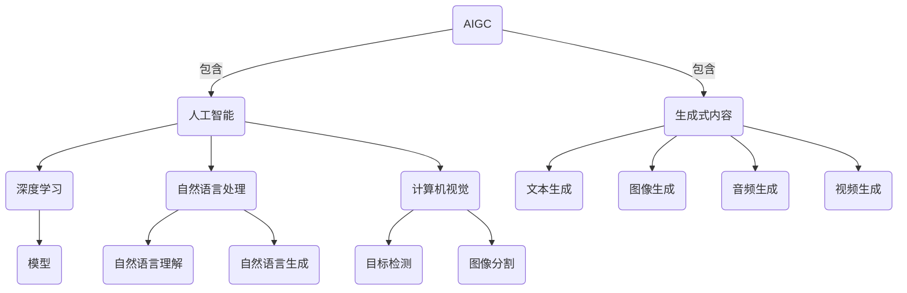

以下是根据您提供的要求和约束条件，为标题《AIGC原理与代码实例讲解》撰写的技术博客文章正文内容：

# AIGC原理与代码实例讲解

## 1. 背景介绍

### 1.1 问题的由来

在当今的数字时代，人工智能(AI)和生成式内容(GC)技术正在迅速发展,对各行各业产生深远影响。AIGC(AI Generated Content,人工智能生成内容)作为两者的结合,已成为热门话题和研究前沿。随着深度学习、自然语言处理等技术的不断进步,AIGC系统能够生成逼真的文本、图像、视频、音频等多种形式的内容,在内容创作、营销、教育、娱乐等领域展现出巨大潜力。

然而,AIGC技术的发展也带来了诸多挑战和争议。如何确保生成内容的质量、原创性和准确性?如何避免滥用AIGC系统制造虚假信息和有害内容?如何保护知识产权和版权?如何规范AIGC系统的使用和监管?这些问题都亟待解决。

### 1.2 研究现状  

目前,AIGC技术主要基于深度学习模型,如Transformer、GPT、DALL-E等。这些模型通过训练海量数据,学习内容模式和语义关联,从而能够生成看似合理的内容。不同模型针对不同类型的内容生成,如GPT擅长文本生成,DALL-E擅长图像生成。

研究人员一直在努力提高AIGC模型的生成质量、多样性和控制能力。例如,通过设计更复杂的网络结构、优化训练策略、引入人类反馈等方式,使生成内容更加逼真、连贯和符合预期。同时,也有研究关注AIGC系统的解释性、可控性和公平性,以减少潜在的偏见和风险。

### 1.3 研究意义

AIGC技术的发展将深刻影响内容创作和消费方式,带来巨大的经济和社会价值。它能够极大提高内容生产效率,降低成本,为企业和个人提供新的商业模式和创收渠道。同时,AIGC也可用于辅助创作、自动化任务、数据增强等,提升工作效率和质量。

此外,AIGC技术在教育、医疗、科研等领域也大有可为。例如,生成个性化学习资源、医疗报告、科研论文等,提高相关服务的可及性和质量。

当然,AIGC技术的发展也带来了一些潜在风险和伦理挑战,需要相关政策法规、技术手段和社会共识来规范和约束。只有合理利用AIGC技术,并有效管控其负面影响,才能真正释放其价值。

### 1.4 本文结构

本文将全面介绍AIGC的核心概念、算法原理、数学模型、代码实现,以及实际应用场景和发展趋势。内容包括:

- 核心概念与联系
- 核心算法原理与具体操作步骤
- 数学模型和公式的详细讲解与案例分析  
- 代码实例和详细解释说明
- 实际应用场景分析
- 工具和资源推荐
- 未来发展趋势与挑战探讨
- 常见问题解答

通过对AIGC技术的深入剖析,读者能够全面了解其工作原理,掌握相关算法和实现方法,并了解其应用前景和潜在挑战,为未来的研究和应用奠定基础。

## 2. 核心概念与联系

AIGC(AI Generated Content)是人工智能(AI)和生成式内容(GC)技术的结合。

人工智能技术包括:

- 深度学习(DL): 训练神经网络模型从数据中学习特征和模式。
- 自然语言处理(NLP): 实现计算机理解和生成自然语言,包括自然语言理解(NLU)和自然语言生成(NLG)。
- 计算机视觉(CV): 使计算机能够获取、处理和理解数字图像和视频,如目标检测、图像分割等。

生成式内容技术可生成多种形式的内容,如文本、图像、音频、视频等。

AIGC系统通常基于深度学习模型,利用NLP、CV等技术从大规模数据中学习内容模式,再结合NLG等生成新的内容。不同模型专注于不同类型内容的生成。

AIGC技术的核心是设计高效的深度学习模型,从海量数据中学习内容的语义和结构信息,并能够根据上下文和任务要求,生成符合预期的新内容。这一过程涉及多个AI子领域的理论和方法,如表示学习、序列建模、多模态融合、生成对抗网络等,需要多学科的知识和技能。

## 3. 核心算法原理与具体操作步骤

AIGC系统的核心算法通常基于Transformer等序列到序列(Seq2Seq)模型,结合自注意力(Self-Attention)机制和掩码语言模型(Masked Language Model)等技术。以下是一种典型的AIGC文本生成算法的原理和步骤。

### 3.1 算法原理概述

该算法基于Transformer解码器(Decoder),对输入的上下文(如文本前缀)进行条件生成,输出目标序列(如文章续写)。

算法流程:

1. 将输入编码为向量表示
2. 通过Transformer解码器进行自回归生成
3. 对每个时间步生成的token概率进行采样
4. 将采样结果作为下一步的输入,重复上述过程
5. 终止条件满足时,输出最终生成序列

其中,Transformer解码器是一种基于自注意力机制的序列建模网络,能够有效捕获序列中的长程依赖关系。

### 3.2 算法步骤详解

1. **输入编码**

   将输入序列(如文本前缀)通过词嵌入层映射为词向量序列,并添加位置编码,作为Transformer解码器的输入。

2. **Transformer解码器**

   Transformer解码器包含多个解码器层,每层由多头自注意力子层和前馈网络子层组成。

   - 多头自注意力机制能够捕获序列中每个位置与其他位置的关系,形成序列的上下文表示。
   - 前馈网络对每个位置的表示进行非线性映射,提取更高级的特征。

   通过层与层之间的残差连接和层归一化,模型可以更好地训练。

3. **掩码语言模型**

   在训练时,模型以掩码语言模型的方式工作。对输入序列中的部分token进行掩码,模型需要根据上下文预测被掩码的token。

   这种方式使模型能够同时利用左右上下文信息,提高生成质量。

4. **生成采样**

   在生成时,对解码器每个时间步输出的token概率分布进行采样,得到下一个token。

   常用的采样策略包括贪婪搜索、topk采样、nucleus采样等,可控制生成的多样性和质量。

5. **终止条件**

   当达到最大生成长度、出现特殊终止token或满足其他条件时,停止生成,输出最终序列。

### 3.3 算法优缺点

**优点**:

- 基于Transformer的自注意力机制,能够有效捕获长程依赖关系,生成质量较高。
- 通过掩码语言模型训练,可利用双向上下文信息,提高生成的连贯性。
- 可通过采样策略控制生成的多样性和质量权衡。
- 具有很强的泛化能力,可应用于多种类型的序列生成任务。

**缺点**:

- 需要大量的数据和计算资源进行预训练,训练和推理成本较高。
- 生成的内容可能存在不连贯、矛盾、事实错误等问题,缺乏全局一致性。
- 存在潜在的安全隐患,如生成有害、歧视性或虚假信息的风险。
- 对于开放域的生成任务,生成质量和多样性仍有提升空间。

### 3.4 算法应用领域

基于Transformer解码器的AIGC算法可广泛应用于以下领域:

- 文本生成: 文章写作、对话系统、机器翻译、文案创作等。
- 代码生成: 自动生成程序代码、代码补全等。
- 多模态生成: 结合计算机视觉等技术,生成图文、视频字幕等多模态内容。
- 任务辅助: 通过提示生成,辅助问答、总结、规划等任务。
- 数据增强: 自动生成训练数据,扩充数据集。
- 创意创作: 辅助小说、诗歌等创意写作。

通过进一步改进和创新,该算法在更多领域具有广阔的应用前景。

## 4. 数学模型和公式详细讲解与举例说明

AIGC系统通常基于Transformer等序列建模网络,其核心是自注意力(Self-Attention)机制。本节将详细介绍自注意力机制的数学原理和公式推导过程。

### 4.1 数学模型构建

自注意力机制的目标是对输入序列中的每个元素计算一个注意力向量,作为其在当前序列中的表示。该注意力向量是所有其他元素对该元素的注意力权重的加权和。

设输入序列为 $\boldsymbol{X} = (x_1, x_2, \dots, x_n)$,其中 $x_i \in \mathbb{R}^{d_x}$ 表示第 $i$ 个元素的 $d_x$ 维向量表示。我们希望计算每个元素 $x_i$ 的注意力向量 $\boldsymbol{z}_i$。

首先,我们将输入序列 $\boldsymbol{X}$ 线性映射为查询(Query)、键(Key)和值(Value)向量:

$$\begin{aligned}
\boldsymbol{Q} &= \boldsymbol{X} \boldsymbol{W}^Q \\
\boldsymbol{K} &= \boldsymbol{X} \boldsymbol{W}^K \\
\boldsymbol{V} &= \boldsymbol{X} \boldsymbol{W}^V
\end{aligned}$$

其中 $\boldsymbol{W}^Q \in \mathbb{R}^{d_x \times d_q}$、$\boldsymbol{W}^K \in \mathbb{R}^{d_x \times d_k}$、$\boldsymbol{W}^V \in \mathbb{R}^{d_x \times d_v}$ 分别是查询、键和值的线性映射矩阵,  $d_q$、$d_k$、$d_v$ 分别是查询、键和值向量的维度。

接下来,我们计算查询向量 $\boldsymbol{q}_i$ 与所有键向量 $\boldsymbol{k}_j$ 的点积,并对结果进行缩放和软最大化,得到注意力权重向量 $\boldsymbol{\alpha}_i$:

$$\boldsymbol{\alpha}_i = \mathrm{softmax}\left(\frac{\boldsymbol{q}_i \boldsymbol{K}^\top}{\sqrt{d_k}}\right)$$

其中,缩放因子 $\sqrt{d_k}$ 是为了防止点积结果过大导致梯度消失或爆炸。

最后,将注意力权重向量 $\boldsymbol{\alpha}_i$ 与值向量 $\boldsymbol{V}$ 相乘,得到注意力向量 $\boldsymbol{z}_i$:

$$\boldsymbol{z}_i = \boldsymbol{\alpha}_i \boldsymbol{V}$$

注意力向量 $\boldsymbol{z}_i$ 即为输入序列第 $i$ 个元素的表示,它是所有其他元素的值向量 $\boldsymbol{v}_j$ 根据注意力权重 $\alpha_{ij}$ 的加权和。

### 4.2 公式推导过程

现在让我们来推导自注意力机制中注