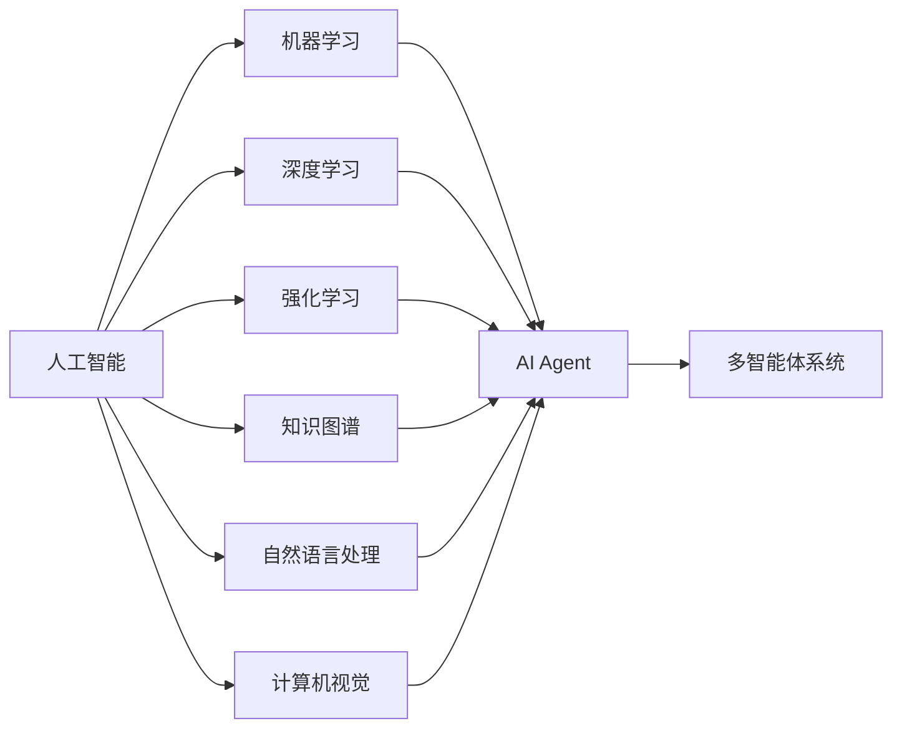

# AI人工智能 Agent：在推进数字化中的应用

作者：禅与计算机程序设计艺术 / Zen and the Art of Computer Programming

关键词：人工智能、智能 Agent、数字化转型、机器学习、深度学习、强化学习、多智能体系统

## 1. 背景介绍

### 1.1 问题的由来

在数字化时代，企业和组织面临着前所未有的机遇和挑战。数字化转型已成为企业生存和发展的关键。人工智能（Artificial Intelligence，AI）作为推动数字化转型的重要技术之一，正在深刻影响和重塑各行各业。其中，AI Agent 作为人工智能的重要分支，在推进数字化进程中扮演着越来越重要的角色。

### 1.2 研究现状

近年来，AI Agent 技术取得了长足的进步。从早期的规则型 Agent，到基于机器学习的智能 Agent，再到如今的多智能体系统，AI Agent 的应用领域不断拓展，能力不断增强。许多研究机构和企业都在 AI Agent 领域投入大量资源，力图在这一前沿技术上取得突破。

### 1.3 研究意义

研究 AI Agent 在推进数字化中的应用，对于企业数字化转型具有重要意义。一方面，AI Agent 可以帮助企业实现业务流程自动化，提高运营效率；另一方面，AI Agent 可以辅助决策，优化资源配置，创造新的商业模式和价值。深入探索 AI Agent 技术，对于抢占数字经济时代的制高点至关重要。

### 1.4 本文结构

本文将围绕 AI Agent 在推进数字化中的应用展开论述。第2部分介绍 AI Agent 的核心概念及其与其他技术的联系；第3部分重点阐述 AI Agent 的核心算法原理和具体操作步骤；第4部分从数学角度对 AI Agent 的模型和公式进行详细讲解；第5部分通过代码实例演示 AI Agent 的实现；第6部分探讨 AI Agent 的实际应用场景；第7部分推荐 AI Agent 领域的学习资源和开发工具；第8部分总结全文并展望 AI Agent 的未来发展趋势与挑战；第9部分为常见问题解答。

## 2. 核心概念与联系

AI Agent 是一种智能实体，它能感知环境，并根据环境做出自主决策和行动，以完成特定目标。从广义上讲，AI Agent 包括软件 Agent 和硬件 Agent（如机器人）。本文主要聚焦软件层面的 AI Agent。

AI Agent 与人工智能的其他分支如机器学习、深度学习、强化学习等有着密切联系。机器学习赋予了 Agent 从数据中学习和优化的能力；深度学习则使 Agent 能够处理非结构化数据，拥有感知和认知能力；强化学习让 Agent 能够在复杂环境中不断探索和优化策略。此外，AI Agent 还与知识图谱、自然语言处理、计算机视觉等技术高度关联。

在实际应用中，AI Agent 经常以多智能体系统（Multi-Agent System，MAS）的形式存在。MAS 由多个 Agent 组成，通过协作与竞争来解决复杂问题。MAS 能够在分布式环境下高效运行，具有鲁棒性和可扩展性。

总的来说，AI Agent 融合了人工智能的多个分支，是一项复合型技术。理解 AI Agent 与其他技术的联系，有助于我们更好地设计和应用 AI Agent 系统。



## 3. 核心算法原理 & 具体操作步骤

### 3.1 算法原理概述

AI Agent 的核心算法包括机器学习算法、深度学习算法、强化学习算法等。机器学习算法如决策树、支持向量机、朴素贝叶斯等，可用于 Agent 的分类、回归、聚类等任务；深度学习算法如卷积神经网络（CNN）、循环神经网络（RNN）等，赋予 Agent 处理图像、语音、文本等非结构化数据的能力；强化学习算法如 Q-Learning、SARSA、DQN 等，则让 Agent 能在复杂环境中学习最优策略。

### 3.2 算法步骤详解

以 Q-Learning 为例，其核心步骤如下：

1. 初始化 Q 表，即状态-动作值函数 Q(s,a)，表示在状态 s 下采取动作 a 的期望回报。初始值可设为0。
2. Agent 根据当前状态 s，采用 ε-贪心策略选择动作 a。以 ε 的概率随机选择动作，否则选择 Q 值最大的动作。
3. Agent 执行动作 a，环境进入新状态 s'，并返回奖励 r。 
4. 更新 Q 表：
$Q(s,a) \leftarrow Q(s,a) + \alpha [r + \gamma \max_{a'} Q(s',a') - Q(s,a)]$
其中，α 为学习率，γ 为折扣因子。
5. 重复步骤2-4，直到满足终止条件（如达到最大训练轮数）。

### 3.3 算法优缺点

Q-Learning 的优点在于：
- 简单易实现，适用于离散状态和动作空间
- 能够收敛到最优策略
- 不需要环境模型，属于无模型学习

缺点包括：
- 状态和动作空间过大时，Q表难以存储和更新
- 难以处理连续状态和动作空间
- 探索和利用的平衡问题

针对这些问题，研究者提出了多种改进算法，如 DQN、DDPG、A3C 等，极大地拓展了强化学习的应用范围。

### 3.4 算法应用领域

强化学习算法在 AI Agent 领域有广泛应用，如智能游戏 Agent、自动驾驶、机器人控制、推荐系统等。这些场景往往涉及复杂的决策过程，需要 Agent 在动态环境中学习和优化策略。

## 4. 数学模型和公式 & 详细讲解 & 举例说明

### 4.1 数学模型构建

AI Agent 可用马尔可夫决策过程（Markov Decision Process，MDP）来建模。MDP 由以下元素构成：
- 状态空间 $\mathcal{S}$
- 动作空间 $\mathcal{A}$
- 转移概率 $\mathcal{P}$，$\mathcal{P}(s'|s,a)$ 表示在状态 s 下执行动作 a 后进入状态 s' 的概率
- 奖励函数 $\mathcal{R}$，$\mathcal{R}(s,a)$ 表示在状态 s 下执行动作 a 后获得的即时奖励
- 折扣因子 $\gamma \in [0,1]$，表示未来奖励的重要程度

Agent 的目标是学习一个策略 $\pi(a|s)$，使得期望累积奖励最大化：

$$\max_{\pi} \mathbb{E}\left[\sum_{t=0}^{\infty} \gamma^t \mathcal{R}(s_t,a_t)\right]$$

其中，$s_t$ 和 $a_t$ 分别表示 t 时刻的状态和动作。

### 4.2 公式推导过程

在 Q-Learning 中，我们定义状态-动作值函数：

$$Q^{\pi}(s,a) = \mathbb{E}\left[\sum_{k=0}^{\infty} \gamma^k \mathcal{R}(s_{t+k},a_{t+k})|s_t=s,a_t=a,\pi\right]$$

它表示在状态 s 下采取动作 a，并在之后都遵循策略 $\pi$ 的期望累积奖励。

最优状态-动作值函数 $Q^*(s,a)$ 满足贝尔曼最优方程：

$$Q^*(s,a) = \mathcal{R}(s,a) + \gamma \sum_{s' \in \mathcal{S}} \mathcal{P}(s'|s,a) \max_{a'} Q^*(s',a')$$

Q-Learning 的目标就是逼近 $Q^*(s,a)$。根据样本 $(s,a,r,s')$，我们可以更新 Q 值：

$$Q(s,a) \leftarrow Q(s,a) + \alpha [r + \gamma \max_{a'} Q(s',a') - Q(s,a)]$$

可以证明，在适当的条件下，Q 值能收敛到 $Q^*(s,a)$。

### 4.3 案例分析与讲解

考虑一个简单的迷宫问题。Agent 需要在迷宫中找到宝藏，同时避开陷阱。我们可以将迷宫划分为若干状态，每个状态对应一个位置。Agent 在每个状态下有4个可选动作：上、下、左、右。如果走到宝藏位置，Agent 将获得正奖励；如果走到陷阱位置，将获得负奖励；其他情况下奖励为0。

我们可以用 Q-Learning 来训练这个 Agent。初始时，Q 值都为0。Agent 通过反复探索迷宫，更新 Q 表，逐步学习到最优路径。在学习过程中，Agent 需要平衡探索和利用，即在尝试新路径和选择已知的好路径之间权衡。ε-贪心策略就是一种常用的平衡方式。

### 4.4 常见问题解答

**Q：Q-Learning 能否处理部分可观测环境？**

A：传统的 Q-Learning 假设环境是完全可观测的，即 Agent 能够获得环境的完整状态信息。对于部分可观测环境，我们可以考虑使用基于记忆的 Q-Learning 变体，如 DRQN（Deep Recurrent Q-Network）。DRQN 引入了循环神经网络来处理历史观测信息，从而更好地适应部分可观测环境。

**Q：如何设置 Q-Learning 的超参数？**

A：Q-Learning 的超参数主要包括学习率 α、折扣因子 γ、探索率 ε 等。一般来说，学习率决定了每次更新的幅度，过大可能导致振荡，过小则收敛速度慢；折扣因子决定了未来奖励的重要程度，过大可能难以收敛，过小则短视；探索率决定了探索新动作的概率，过大则学习效率低，过小则可能陷入局部最优。在实践中，我们通常需要对超参数进行调优，以获得最佳性能。

## 5. 项目实践：代码实例和详细解释说明

### 5.1 开发环境搭建

本项目使用 Python 3 和 PyTorch 进行开发。首先，安装必要的依赖库：

```bash
pip install torch numpy matplotlib
```

### 5.2 源代码详细实现

下面是一个简单的 Q-Learning Agent 的 Python 实现：

```python
import numpy as np
import matplotlib.pyplot as plt

class QLearningAgent:
    def __init__(self, state_size, action_size, learning_rate=0.1, discount_factor=0.9, epsilon=0.1):
        self.state_size = state_size
        self.action_size = action_size
        self.learning_rate = learning_rate
        self.discount_factor = discount_factor
        self.epsilon = epsilon
        self.q_table = np.zeros((state_size, action_size))

    def act(self, state):
        if np.random.rand() < self.epsilon:
            return np.random.choice(self.action_size)
        else:
            return np.argmax(self.q_table[state])

    def learn(self, state, action, reward, next_state):
        q_value = self.q_table[state, action]
        max_q_value = np.max(self.q_table[next_state])
        new_q_value = (1 - self.learning_rate) * q_value + self.learning_rate * (reward + self.discount_factor * max_q_value)
        self.q_table[state, action] = new_q_value

def train(agent, env, num_episodes=1000):
    rewards = []
    for episode in range(num_episodes):
        state = env.reset()
        total_reward = 0
        done = False
        while not done:
            action = agent.act(state)
            next_state, reward, done = env.step(action)
            agent.learn(state, action, reward, next_state)
            state = next_state
            total_reward += reward
        rewards.append(total_reward)
        print(f"Episode {episode+1}: Reward = {total_reward}")
    return rewards

def plot_rewards(rewards):
    plt.plot(rewards)