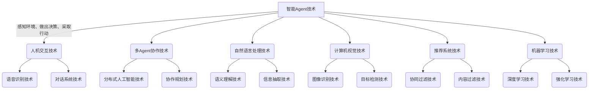
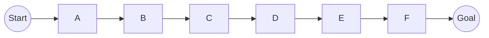

以下是根据您的要求撰写的技术博客文章正文：

# AI人工智能 Agent：在新零售中的应用

## 1. 背景介绍

### 1.1 问题的由来

随着互联网和移动互联网技术的快速发展,消费者的购物习惯和消费模式发生了翻天覆地的变化。传统的线下实体零售商店面临着巨大的挑战,很多实体店陷入了经营困境。与此同时,电子商务的兴起为消费者带来了极大的便利,但也存在着信息不对称、虚拟与现实脱节等问题。

为了应对这一严峻形势,新零售(New Retail)应运而生。新零售是将线上线下、虚拟与现实相结合,利用大数据、人工智能等新兴技术,重塑商品生产、流通和消费的全过程,为消费者提供全新的购物体验。在新零售模式下,人工智能技术扮演着至关重要的角色,尤其是智能Agent技术的应用备受关注。

### 1.2 研究现状

智能Agent作为人工智能领域的一个热门研究方向,近年来取得了长足的进展。Agent被赋予一定的自主性、反应性、主动性和社会性等特征,能够感知环境、做出决策并采取行动,与人类或其他Agent进行交互协作。

在新零售场景中,智能Agent可以扮演多种角色,如虚拟购物助理、智能推荐系统、库存管理Agent等。研究人员致力于开发出更加人性化、智能化的Agent系统,以提升消费者的购物体验,优化企业的运营效率。

### 1.3 研究意义

智能Agent在新零售中的应用具有重要的理论意义和实践价值:

- 理论意义:推动人工智能、多Agent系统、人机交互等领域的基础研究,探索Agent技术在复杂场景中的应用;
- 实践价值:提高企业运营效率,降低成本;改善消费者体验,增强消费者粘性;推动零售业数字化智能化转型。

### 1.4 本文结构  

本文将全面介绍智能Agent在新零售中的应用。首先阐述核心概念及其内在联系,然后深入探讨Agent核心算法原理、数学模型和实现细节,并通过实例分析在新零售场景下的具体应用。最后总结发展趋势与面临的挑战。

## 2. 核心概念与联系

在新零售场景中,智能Agent技术与其他人工智能技术密切相关,形成了一个有机的技术体系,为消费者带来智能化、个性化的购物体验。

上图展示了智能Agent技术与其他技术之间的内在联系。智能Agent作为核心技术,需要与人机交互、多Agent协作、自然语言处理、计算机视觉、推荐系统、机器学习等多种技术相结合,才能在新零售场景中发挥作用。

## 3. 核心算法原理与具体操作步骤

### 3.1 算法原理概述

智能Agent通常采用基于目标的理性Agent架构,按照"感知-决策-行动"的循环过程运作。该架构的核心在于如何根据感知到的环境状态,选择最优的行动序列以达成既定目标。

常见的智能Agent决策算法有:

1. **基于规则的系统**:依赖人工设计的规则来指导Agent行为
2. **经典搜索算法**:通过搜索行动空间寻找最优行动序列,如A*、IDA*等
3. **基于目标的Agent**:将问题建模为马尔可夫决策过程(MDP),使用价值迭代、策略迭代等方法求解
4. **基于效用的Agent**:引入效用函数,根据行动的期望效用值进行决策
5. **基于学习的Agent**:利用机器学习技术,从数据中学习最优决策策略,如深度强化学习

上述算法各有特点,在不同应用场景具有不同的适用性。

### 3.2 算法步骤详解

以基于学习的Agent为例,通常采用深度强化学习算法,其核心步骤如下:

1. **构建环境模型**
   - 将问题形式化为马尔可夫决策过程(MDP)
   - 定义状态空间$\mathcal{S}$、行动空间$\mathcal{A}$、奖励函数$\mathcal{R}$和状态转移概率$\mathcal{P}$
   
2. **设计Agent网络结构**
   - 通常采用Actor-Critic架构
   - Actor网络$\pi_\theta(a|s)$输出行动概率
   - Critic网络$V_\phi(s)$评估状态价值
   
3. **训练强化学习模型**
   - 使用时序差分目标$r_t + \gamma V_{\phi'}(s_{t+1})$更新Critic网络
   - 使用策略梯度$\nabla_\theta J(\theta)=\mathbb{E}_{\pi_\theta}[\nabla_\theta\log\pi_\theta(a_t|s_t)A_t]$更新Actor网络
   - 采用经验回放、目标网络等技术提高训练稳定性
   
4. **Agent与环境交互**
   - Agent根据当前状态$s_t$,从Actor网络采样行动$a_t \sim \pi_\theta(a|s_t)$
   - 环境转移到下一状态$s_{t+1}$,Agent获得奖励$r_t$
   - 将$(s_t, a_t, r_t, s_{t+1})$存入经验池,用于模型训练
   
5. **策略评估与改进**
   - 定期评估当前策略在环境中的表现
   - 根据评估结果调整训练超参数、奖励函数等
   - 直至模型收敛,输出最终的Agent策略$\pi_\theta^*$

通过上述步骤,Agent可以从环境中学习到最优的决策策略,指导其在新零售场景中采取合理行动。

### 3.3 算法优缺点

基于强化学习的智能Agent算法具有以下优缺点:

**优点**:

- 无需人工设计复杂规则,可自主从环境中学习获取知识
- 具有很强的通用性和泛化能力,能够应对复杂动态环境
- 理论基础扎实,有效性和收敛性有理论保证
- 可以通过设计合理的奖励函数,将人类偏好融入Agent决策过程

**缺点**:

- 需要大量的环境交互数据进行训练,训练过程计算开销大
- 存在样本效率低下的问题,学习曲线平缓
- 奖励函数的设计对算法性能影响很大,需要领域知识
- 缺乏可解释性,决策过程存在"黑箱"问题

总的来说,基于强化学习的Agent算法具有广阔的应用前景,但也面临诸多挑战需要解决。

### 3.4 算法应用领域

智能Agent技术在新零售场景下可应用于多个领域:

- **虚拟购物助理**: 基于自然语言处理和对话系统技术,为用户提供智能问答、购物推荐等服务
- **智能库存管理**: 基于预测分析和优化算法,实现精细化的库存调度和补货策略
- **智能物流调度**: 通过多Agent协作,优化物流调度路线,提高配送效率
- **无人售货终端**: 集成计算机视觉、支付等功能,实现自助购物和结算
- **营销决策辅助**: 分析用户行为数据,为营销人员提供决策支持
- **供应链优化**: 利用Agent技术优化供应链的各个环节,降低运营成本

## 4. 数学模型和公式详细讲解与举例说明

### 4.1 数学模型构建

智能Agent算法通常基于**马尔可夫决策过程(Markov Decision Process, MDP)**数学模型。MDP是一种离散时间的随机控制过程,用于描述Agent与环境的交互过程。

MDP可以使用五元组$(\mathcal{S}, \mathcal{A}, \mathcal{P}, \mathcal{R}, \gamma)$来表示:

- $\mathcal{S}$是状态空间的集合
- $\mathcal{A}$是行动空间的集合  
- $\mathcal{P}(s_{t+1}|s_t,a_t)$是状态转移概率,表示在状态$s_t$执行行动$a_t$后,转移到状态$s_{t+1}$的概率
- $\mathcal{R}(s_t,a_t)$是奖励函数,表示在状态$s_t$执行行动$a_t$后获得的即时奖励
- $\gamma \in [0, 1)$是折现因子,用于权衡即时奖励和长期累积奖励的重要性

Agent的目标是找到一个策略$\pi: \mathcal{S} \rightarrow \mathcal{A}$,使得期望的累积折现奖励最大化:

$$
J(\pi) = \mathbb{E}_\pi\left[\sum_{t=0}^\infty \gamma^t r_t\right]
$$

其中$r_t = \mathcal{R}(s_t, a_t)$是在时刻$t$获得的即时奖励。

### 4.2 公式推导过程

在基于价值的强化学习算法中,我们定义状态价值函数$V^\pi(s)$为在状态$s$下执行策略$\pi$所能获得的期望累积奖励:

$$
V^\pi(s) = \mathbb{E}_\pi\left[\sum_{t=0}^\infty \gamma^t r_t \big| s_0 = s\right]
$$

同理,我们定义状态-行动价值函数$Q^\pi(s,a)$为在状态$s$下执行行动$a$,之后再执行策略$\pi$所能获得的期望累积奖励:

$$
Q^\pi(s,a) = \mathbb{E}_\pi\left[\sum_{t=0}^\infty \gamma^t r_t \big| s_0 = s, a_0 = a\right]
$$

利用贝尔曼方程,可以将$V^\pi(s)$和$Q^\pi(s,a)$分别表示为:

$$
\begin{aligned}
V^\pi(s) &= \sum_{a \in \mathcal{A}} \pi(a|s) \sum_{s' \in \mathcal{S}} \mathcal{P}(s'|s,a) \left[ \mathcal{R}(s,a) + \gamma V^\pi(s')\right] \\
Q^\pi(s,a) &= \sum_{s' \in \mathcal{S}} \mathcal{P}(s'|s,a) \left[ \mathcal{R}(s,a) + \gamma \sum_{a' \in \mathcal{A}} \pi(a'|s')Q^\pi(s',a')\right]
\end{aligned}
$$

通过对$V^\pi(s)$或$Q^\pi(s,a)$求解,即可得到在策略$\pi$下的最优状态价值函数或状态-行动价值函数,从而指导Agent的决策行为。

### 4.3 案例分析与讲解

考虑一个简单的网格世界(Gridworld)环境,如下图所示:

Agent的目标是从起点(Start)到达终点(Goal)。每一步行动都会获得-1的奖励,到达终点则获得+10的奖励。使用Q-Learning算法训练一个Agent,求解最优的状态-行动价值函数$Q^*(s,a)$。

Q-Learning算法的更新规则为:

$$
Q(s_t,a_t) \leftarrow Q(s_t,a_t) + \alpha \left[ r_t + \gamma \max_{a'}Q(s_{t+1},a') - Q(s_t,a_t)\right]
$$

其中$\alpha$是学习率,$\gamma$是折现因子。

我们初始化$Q(s,