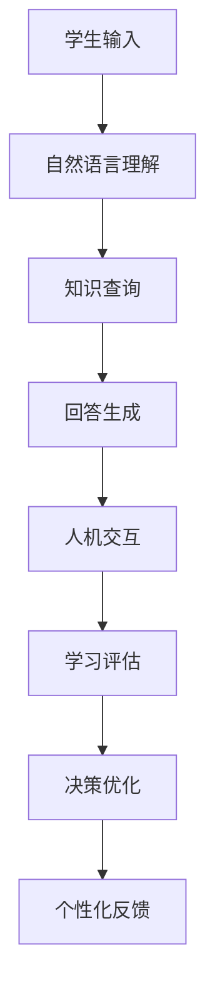

# AI人工智能 Agent：对教育的影响

## 1. 背景介绍

### 1.1 问题的由来

近年来,人工智能(AI)技术的快速发展对各行各业产生了深远影响,教育领域也不例外。传统的教育模式正面临着前所未有的挑战和机遇。随着智能代理(AI Agent)等新兴技术的兴起,教育领域正在发生深刻的变革。

传统教育模式存在诸多弊端,例如:

1. **教学资源分布不均**:优质教育资源往往集中在大城市和发达地区,偏远地区教育资源匮乏。
2. **教学方式单一**:以教师课堂讲授为主,缺乏个性化教学和互动性。
3. **课程内容滞后**:课程更新速度跟不上知识爆炸的步伐。
4. **评估方式僵化**:评估方式单一,难以全面考查学生的能力。

为了应对这些挑战,人工智能技术在教育领域的应用备受关注。智能代理(AI Agent)作为人工智能的一种重要体现,正在为教育领域带来全新的可能性。

### 1.2 研究现状

目前,智能代理在教育领域的应用研究主要集中在以下几个方面:

1. **智能教学助手**:利用自然语言处理、知识图谱等技术,开发智能教学助手,为学生提供个性化辅导和答疑解惑。
2. **智能课程推荐系统**:基于学生的学习数据和偏好,为学生推荐合适的课程和学习资源。
3. **智能评估系统**:利用机器学习算法,对学生的作业、测试等进行自动评分和反馈,减轻教师的工作负担。
4. **虚拟教师**:通过计算机视觉、语音识别等技术,构建具有一定交互能力的虚拟教师,为学生提供辅导和指导。

### 1.3 研究意义

智能代理在教育领域的应用具有重要的理论和实践意义:

1. **理论意义**:推动人工智能技术在教育领域的深入应用,促进教育理论和教学模式的创新。
2. **实践意义**:提高教育质量和效率,缓解教师压力,促进教育资源的均衡配置。
3. **社会意义**:推动教育公平,为更多人提供优质教育资源,助力教育现代化进程。

### 1.4 本文结构

本文将全面探讨智能代理在教育领域的应用。首先介绍智能代理的核心概念和技术原理,然后详细阐述其在教育领域的具体应用场景和实现方法,包括智能教学助手、课程推荐系统、评估系统和虚拟教师等。接着分析智能代理在教育领域应用的优势和挑战,并对未来发展趋势进行展望。最后,本文将总结全文要点,并就常见问题提供解答。

## 2. 核心概念与联系

智能代理(AI Agent)是一种能够感知环境、处理信息、做出决策并采取行动的自主系统。它是人工智能领域的核心概念之一,体现了人工智能系统的自主性和智能性。

在教育领域,智能代理可以扮演多种角色,如智能教学助手、课程推荐系统、评估系统和虚拟教师等。这些智能代理系统需要集成多种人工智能技术,包括:

1. **自然语言处理(NLP)**:用于理解和生成自然语言,实现人机交互。
2. **知识图谱**:构建结构化知识库,存储和管理教育知识。
3. **机器学习**:利用学生数据训练模型,实现个性化教学和自动评估。
4. **计算机视觉**:识别学生的面部表情和动作,实现虚拟教师的交互能力。
5. **决策理论**:根据学生的学习情况和反馈,做出适当的教学决策。

这些技术相互配合,共同赋予智能代理在教育领域的应用能力。下面将详细介绍智能代理在教育领域的具体应用。

## 3. 核心算法原理 & 具体操作步骤

### 3.1 算法原理概述

智能代理在教育领域的应用涉及多种算法和技术,其核心算法原理包括:

1. **自然语言处理算法**:用于理解和生成自然语言,实现人机交互。常用算法有序列到序列模型(Seq2Seq)、注意力机制(Attention Mechanism)、BERT等。

2. **知识图谱构建算法**:从结构化和非结构化数据中提取知识实体和关系,构建知识图谱。常用算法有远程监督(Distant Supervision)、知识嵌入(Knowledge Embedding)等。

3. **推荐系统算法**:根据学生的历史数据和偏好,推荐合适的课程和学习资源。常用算法有协同过滤(Collaborative Filtering)、矩阵分解(Matrix Factorization)等。

4. **机器学习算法**:用于学生行为建模、自动评估等任务。常用算法有决策树(Decision Tree)、支持向量机(SVM)、深度学习模型等。

5. **计算机视觉算法**:识别学生的面部表情、手势等,实现虚拟教师的交互能力。常用算法有目标检测(Object Detection)、人体姿态估计(Human Pose Estimation)等。

6. **决策理论算法**:根据学生的学习情况和反馈,做出适当的教学决策。常用算法有马尔可夫决策过程(MDP)、强化学习(Reinforcement Learning)等。

这些算法原理相互配合,共同赋予智能代理在教育领域的应用能力。下面将详细介绍其具体操作步骤。

### 3.2 算法步骤详解

以智能教学助手为例,其核心算法步骤如下:

1. **学生输入**:学生通过文本、语音等方式向智能教学助手提出问题或求助。

2. **自然语言理解**:利用自然语言处理算法(如BERT)对学生的输入进行语义理解,提取关键信息。

3. **知识查询**:根据理解的语义,在知识图谱中查询相关知识,获取答案素材。

4. **回答生成**:将查询到的知识通过自然语言生成算法(如Seq2Seq)组织成自然语言回答。

5. **人机交互**:将生成的回答呈现给学生,根据学生的反馈进行多轮交互,直至满足学生的需求。

6. **学习评估**:根据交互过程中的数据,利用机器学习算法对学生的学习情况进行评估。

7. **决策优化**:利用强化学习等决策理论算法,根据评估结果优化教学策略。

8. **个性化反馈**:为学生提供个性化的学习建议和反馈,促进学习效果的提升。

该流程充分利用了自然语言处理、知识图谱、机器学习等人工智能技术,实现了智能化的教学交互和个性化辅导。

### 3.3 算法优缺点

上述算法在智能教学助手等场景中具有以下优点:

1. **交互性强**:能够与学生进行自然语言交互,提高教学的互动性和亲和力。
2. **个性化教学**:通过学习数据分析,能够为每个学生提供个性化的教学方案。
3. **知识覆盖广**:基于知识图谱,能够涵盖广泛的教育知识领域。
4. **持续优化**:利用强化学习等技术,能够不断优化教学策略。

但也存在一些不足之处:

1. **知识库构建困难**:构建高质量的教育知识图谱是一项艰巨的工程。
2. **语义理解有偏差**:自然语言处理技术尚不完全成熟,存在语义理解偏差的风险。
3. **缺乏教学情景感知**:目前难以完全感知教学情景,如学生的注意力、情绪等。
4. **缺乏深度交互能力**:虚拟教师的交互能力仍有局限性,难以替代真人教师。

### 3.4 算法应用领域

上述算法不仅可应用于智能教学助手,在教育领域还有广泛的应用前景:

1. **课程推荐系统**:利用协同过滤、矩阵分解等推荐算法,为学生推荐合适的课程和学习资源。

2. **自动评估系统**:利用机器学习算法对学生的作业、测试等进行自动评分和反馈,减轻教师的工作负担。

3. **个性化学习路径规划**:根据学生的知识水平、学习能力等,规划个性化的学习路径。

4. **教学质量分析**:分析教师的教学行为、学生的学习效果等,为教学质量评估和改进提供依据。

5. **教育大数据分析**:通过对海量教育数据的分析,发现教育规律,为教育决策提供支持。

总之,智能代理相关算法在教育领域具有广阔的应用前景,有望推动教育领域的智能化革新。

## 4. 数学模型和公式 & 详细讲解 & 举例说明

在智能代理的教育应用中,数学模型和公式扮演着重要角色。下面将详细介绍其中的几个核心模型和公式。

### 4.1 数学模型构建

#### 4.1.1 知识图谱嵌入模型

知识图谱是智能教学助手等系统的核心知识库,知识图谱嵌入模型能够将知识实体和关系映射到低维连续向量空间,便于计算和推理。

常用的知识图谱嵌入模型包括TransE、TransH、TransR等,它们的目标函数可表示为:

$$J = \sum_{(h,r,t) \in \mathcal{S}} \sum_{(h',r',t') \in \mathcal{S'}} [\gamma + d(h + r, t) - d(h' + r', t')]_+$$

其中:
- $\mathcal{S}$ 表示知识图谱中的三元组facts集合
- $\mathcal{S'}$ 表示负采样的三元组集合
- $h, r, t$ 分别表示头实体、关系、尾实体的嵌入向量
- $d(\cdot)$ 表示距离函数,如$L_1$范数或$L_2$范数
- $\gamma$ 是超参数,控制正负样本的间隔

通过优化该目标函数,可以学习出实体和关系的嵌入向量表示,用于知识推理和问答等任务。

#### 4.1.2 推荐系统模型

智能课程推荐系统的核心是协同过滤模型,基于学生的历史行为数据预测其对课程的偏好程度。

常用的协同过滤模型包括基于邻域的方法和基于模型的方法。其中,基于模型的方法通常采用矩阵分解的思路,将学生-课程评分矩阵 $R$ 分解为两个低维矩阵的乘积:

$$R \approx P^T Q$$

其中 $P$ 表示学生的隐语义向量,编码了学生的兴趣;$Q$ 表示课程的隐语义向量,编码了课程的主题。通过优化如下目标函数来学习 $P$ 和 $Q$:

$$\min_{P,Q} \sum_{(u,i) \in \kappa} (r_{ui} - p_u^Tq_i)^2 + \lambda(||P||^2_F + ||Q||^2_F)$$

其中 $\kappa$ 表示已观测的评分集合,$\lambda$ 为正则化系数。学习完成后,对于任意一对学生 $u$ 和课程 $i$,其预测评分为 $\hat{r}_{ui} = p_u^Tq_i$,从而可以推荐出最合适的课程。

### 4.2 公式推导过程

以知识图谱嵌入模型TransE为例,介绍其公式推导过程:

TransE模型的基本思想是,对于一个三元组 $(h,r,t)$,其头实体 $h$ 和尾实体 $t$ 的嵌入向量之间应该由关系 $r$ 的嵌入向量连接,即:

$$h + r \approx t$$

基