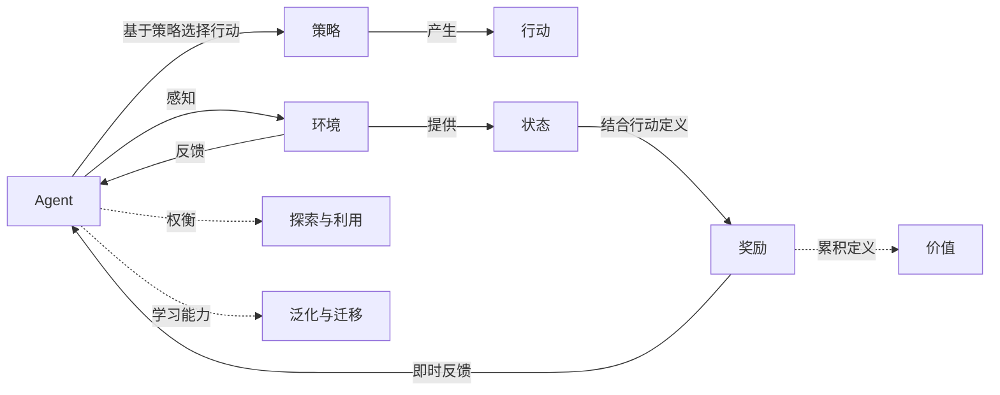

# AI人工智能 Agent：高级概念剖析

关键词：人工智能、智能Agent、强化学习、深度学习、神经网络

## 1. 背景介绍 
### 1.1 问题的由来
人工智能（Artificial Intelligence，AI）是计算机科学领域最具前景和挑战性的研究方向之一。它旨在研究如何让计算机模拟甚至超越人类的智能，实现感知、认知、决策等高级功能。其中，智能Agent（Intelligent Agent）是人工智能领域的一个重要概念和研究对象。

智能Agent是一种能够感知环境、做出决策并采取行动的自主实体。它能根据环境的变化动态调整自己的行为，以实现特定的目标。智能Agent广泛应用于机器人、自动驾驶、智能助理、游戏AI等领域。然而，如何设计和实现高效、鲁棒的智能Agent仍面临诸多挑战。

### 1.2 研究现状
目前，智能Agent的研究主要集中在以下几个方面：

1. **架构设计**：主要研究如何设计Agent的内部结构和组件，以支持感知、决策、学习等功能。常见的架构包括反应型、认知型、混合型等。

2. **学习算法**：研究如何让Agent通过与环境的交互来学习和优化策略。主要的学习范式包括监督学习、无监督学习、强化学习等。其中，深度强化学习将深度学习与强化学习相结合，取得了显著进展。

3. **知识表示**：探讨如何在Agent中表示和组织领域知识，以支持推理和决策。常用的知识表示方法包括逻辑、本体、概率图模型等。

4. **多Agent系统**：研究多个Agent之间如何协作、竞争和通信，以完成复杂任务或实现群体智能。涉及博弈论、机制设计、群体智能等理论。

总的来说，智能Agent研究已取得长足进展，但在通用智能、可解释性、安全性等方面仍存在不少挑战。

### 1.3 研究意义
智能Agent研究对人工智能的发展具有重要意义：

1. 推动人工智能在实际场景中的应用，如机器人、智能助理、自动驾驶等。

2. 促进对智能行为的理解和建模，为认知科学、神经科学等学科提供新视角。 

3. 探索通用人工智能（AGI）的实现路径，即创造出具有人类水平智能的系统。

4. 应对未来智能系统可能带来的安全和伦理挑战，确保其可控性和友好性。

### 1.4 本文结构
本文将从以下几个方面深入剖析智能Agent的高级概念：

- 第2部分介绍智能Agent的核心概念及其相互联系。 
- 第3部分讨论几种主要的Agent架构和算法。
- 第4部分系统阐述智能Agent中的数学模型和关键公式。
- 第5部分给出一些典型的智能Agent开发实例。
- 第6部分分析智能Agent在实际场景中的应用。
- 第7部分推荐相关的学习资源和开发工具。
- 第8部分总结全文并展望智能Agent的未来发展方向。

## 2. 核心概念与联系
智能Agent涉及一系列核心概念，它们相互关联、协同作用，共同定义了智能Agent系统的特性和行为模式。下面我们对其中的几个关键概念进行梳理。

### 2.1 Agent
Agent是智能Agent系统的核心，它是一个能够感知环境并做出行动的自主实体。从功能上看，一个Agent通常包含以下几个模块：

- **感知模块**：负责获取环境状态信息，可以是各种传感器数据，如视觉、听觉、触觉等。
- **决策模块**：根据感知信息和内部状态，计算下一步要执行的行动。这是Agent智能的关键体现。
- **执行模块**：负责执行决策模块给出的行动指令，对环境施加影响。
- **学习模块**：根据环境反馈，调整Agent的策略和知识，使其行为不断优化。
- **记忆模块**：存储Agent在交互过程中获得的知识和经验，供决策和学习使用。

这些模块相互配合，使Agent能够自主地感知、决策、行动和学习，表现出智能行为。

### 2.2 环境
环境是Agent所处的外部世界，提供Agent赖以生存和运作的条件。从形式化的角度看，环境可以用一个六元组来描述：
$$
E = \langle S, A, f, R, \gamma, I\rangle
$$
其中，$S$是环境状态空间，$A$是Agent的行动空间，$f: S \times A \mapsto S$是状态转移函数，$R: S \times A \mapsto \mathbb{R}$是奖励函数，$\gamma \in [0,1]$是折扣因子，$I$是初始状态分布。

环境可以分为以下几类：

- **完全可观测/部分可观测**：是否Agent能完整地感知环境状态。
- **静态/动态**：环境状态是否随时间自主变化。
- **离散/连续**：状态和行动空间是离散还是连续的。
- **单Agent/多Agent**：环境中是否存在多个交互的Agent。

不同类型的环境对Agent的感知、决策和学习提出了不同的要求。

### 2.3 状态、行动与策略
在与环境交互的过程中，Agent需要根据当前环境状态选择合适的行动。形式化地，t时刻环境状态为$s_t \in S$，Agent选择的行动为$a_t \in A$。

Agent的决策通常基于一个策略函数$\pi: S \mapsto A$，即根据状态决定采取的行动。一个好的策略能最大化Agent获得的长期累积奖励。

### 2.4 奖励与价值
奖励信号$r_t = R(s_t, a_t)$表示Agent在t时刻采取行动$a_t$后获得的即时奖励，它反映了行动的好坏。Agent的目标就是最大化累积奖励$G_t$：
$$
G_t = \sum_{k=0}^{\infty} \gamma^k r_{t+k}
$$
其中$\gamma$是折扣因子，使未来的奖励有递减的影响。

一个状态的价值$V^{\pi}(s)$定义为从该状态开始，遵循策略$\pi$能获得的期望累积奖励：
$$
V^{\pi}(s) = \mathbb{E}_{\pi}[G_t | s_t = s]
$$
类似地，状态-行动对的价值$Q^{\pi}(s,a)$定义为在状态s下采取行动a，然后遵循策略$\pi$的期望累积奖励。

### 2.5 探索与利用
探索（Exploration）和利用（Exploitation）是Agent面临的一个关键权衡。探索是尝试新的行动以发现可能更好的策略，利用则是基于当前已知采取最优行动以获得最大奖励。

常见的探索策略包括$\epsilon$-贪婪、上置信区间（UCB）、汤普森采样等。平衡探索和利用能够使Agent在有限的交互中找到接近最优的策略。

### 2.6 泛化与迁移
泛化（Generalization）是指Agent将在一些状态上学到的知识应用到未见过的状态上的能力。迁移学习（Transfer Learning）则是把在一个任务上学到的知识迁移到另一个相关任务中以加速学习的过程。

泛化和迁移对于提高Agent的学习效率和适应能力至关重要，是实现通用人工智能的关键。

### 概念联系图
下图展示了上述核心概念之间的联系：



## 3. 核心算法原理 & 具体操作步骤

智能Agent的实现依赖于多种架构和算法，下面我们重点介绍几种主流范式。

### 3.1 算法原理概述

#### 3.1.1 基于规则的方法

这类方法使用一系列if-then规则来决定Agent的行为，如:
```
if 状态A then 行动X
else if 状态B then 行动Y 
...
```
基于规则的系统简单直观，但难以适应复杂动态环境，且rule的获取和维护成本高。

#### 3.1.2 基于搜索的方法

将问题抽象为状态空间搜索问题，使用启发式搜索算法如A*在状态空间中搜索从初始状态到目标状态的最优路径，路径对应Agent的行动序列。

搜索方法能够系统地探索解空间，但在状态和行动空间很大时会遇到维数灾难。

#### 3.1.3 基于规划的方法 

通过规划算法如STRIPS自动地生成达到目标的行动序列。一个规划问题包含初始状态、目标状态、可用行动及其前置/效果。

规划方法能自动求解，但同样面临状态爆炸问题，且很难处理不确定性和部分可观测性。

#### 3.1.4 基于学习的方法

通过机器学习算法从数据或与环境的交互中学习最优策略，而不需要显式地定义规则或搜索空间。

主要包括监督学习（从专家提供的示例中学习）、无监督学习（从数据中发现模式）、强化学习（从奖励信号中学习）等。基于学习的方法是当前智能Agent研究的主流。

### 3.2 算法步骤详解

下面以强化学习中的Q学习算法为例，详细说明其步骤。

Q学习的核心思想是学习一个Q函数$Q(s,a)$，表示在状态s下采取行动a的期望累积奖励。最优策略即为在每个状态下选择Q值最大的行动：
$$
\pi^*(s) = \arg \max_a Q^*(s,a)
$$

Q学习算法的具体步骤如下：

1. 初始化Q函数，常用的方法是令所有$Q(s,a)=0$。

2. 重复以下步骤直到收敛或达到指定的训练轮数：

   a. 根据当前策略（如$\epsilon$-贪婪）选择一个行动$a_t$。一般初期多探索，后期多利用。
   
   b. 执行行动$a_t$，观察环境反馈的下一状态$s_{t+1}$和奖励$r_t$。
   
   c. 根据下面的Q学习更新公式更新$Q(s_t, a_t)$：
   $$
   Q(s_t, a_t) \leftarrow Q(s_t, a_t) + \alpha [r_t + \gamma \max_a Q(s_{t+1}, a) - Q(s_t, a_t)]
   $$
   其中$\alpha \in (0,1]$是学习率，$\gamma \in [0,1]$是折扣因子。
   
   d. $s_t \leftarrow s_{t+1}$。

3. 返回学到的Q函数和贪婪策略。

Q学习算法有很好的收敛性保证，能够在不知道环境模型的情况下通过试错学习找到最优策略。

### 3.3 算法优缺点

Q学习的主要优点包括：

- 简单易实现，对环境模型没有要求。
- 有良好的理论保证，异步更新条件下能收敛到最优。
- 通过值函数近似等手段可以扩展到大规模状态空间。

但Q学习也有一些局限性：

- 离散的状态和行动空间，对连续空间需要进行离散化。
- 探索策略的选择需要权衡，纯贪婪策略可能导致局部最优。
- 样本效率不高，需要大量的与环境交互。
- 对部分可观测环境、非平稳环境等特殊情况处理有限。

### 3.4 算法应用领域

Q学习及其变种在很多领域得到应用，如：

- 智能体游戏，如Atari视频游戏、围棋等。
- 机器人控制，如Walking Robot等。
- 自动驾驶中的决策控制。
- 推荐系统、广告投放等。

除Q学习外，其他如Sarsa、Policy Gradient、Actor-