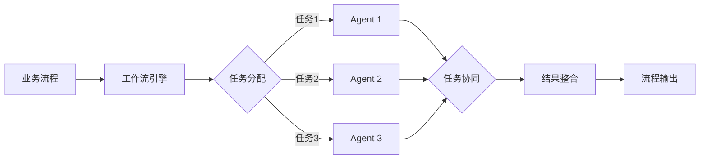

# AI人工智能代理工作流 AI Agent WorkFlow：在人力资源管理中的应用

关键词：人工智能、智能代理、工作流、人力资源管理、自动化

## 1. 背景介绍
### 1.1  问题的由来
在当今快速发展的商业环境中,企业面临着日益激烈的竞争压力。为了保持竞争优势,提高运营效率和生产力至关重要。人力资源管理(HRM)作为企业管理的核心职能之一,在优化人力资源配置、提升员工绩效方面发挥着关键作用。然而,传统的人力资源管理方式往往存在流程繁琐、效率低下等问题,难以满足现代企业的发展需求。
### 1.2  研究现状
近年来,人工智能(AI)技术的快速发展为解决上述难题提供了新的思路。通过将AI技术应用于人力资源管理领域,可以实现业务流程的自动化和智能化,从而大幅提升HRM的效率和质量。目前,已有不少研究探索了AI在人力资源管理中的应用,如智能招聘系统[1]、员工绩效预测[2]、智能薪酬管理[3]等。这些研究表明,AI技术在HRM领域具有广阔的应用前景。
### 1.3  研究意义  
本文聚焦于一个尚未得到充分研究的课题——AI人工智能代理工作流在人力资源管理中的应用。AI代理工作流是一种基于智能代理技术的工作流管理方法,通过将工作流程中的任务分配给不同的AI代理来实现自动化和智能化。本文将深入探讨AI代理工作流的核心概念、关键技术、实现原理,并结合人力资源管理的具体场景,讨论其应用价值和发展前景。这对于推动人力资源管理的智能化升级,提升企业管理水平具有重要意义。
### 1.4  本文结构
本文的结构安排如下:第2部分介绍AI代理工作流的核心概念;第3部分阐述其核心算法原理和操作步骤;第4部分建立数学模型并给出详细推导;第5部分通过代码实例演示其实现过程;第6部分分析其在人力资源管理中的应用场景;第7部分推荐相关工具和学习资源;第8部分总结全文,展望未来发展方向,并指出面临的挑战;第9部分列出常见问题解答。

## 2. 核心概念与联系
AI代理工作流的核心是智能代理(Intelligent Agent)和工作流(Workflow)这两个概念。智能代理是一种能够感知环境、进行推理决策并采取行动的自主计算实体[4]。它具有自主性、社会性、反应性、主动性等特征。将多个智能代理组织起来协同完成特定任务,就形成了多智能代理系统(Multi-agent System)[5]。

工作流是对业务流程的抽象、建模和自动化执行。它将业务流程分解为一系列相互关联的活动,并明确规定活动的执行顺序、条件、角色等,从而实现业务流程的标准化和自动化[6]。

AI代理工作流即是将智能代理技术引入工作流管理,通过将工作流程中的任务分配给不同的智能代理来执行,实现流程自动化和决策智能化。各智能代理根据自身能力和任务需求,对任务进行分解、协同和调度,动态适应流程变化,从而提升工作流执行效率和质量。

下图展示了AI代理工作流的基本架构:



业务流程经过建模后在工作流引擎中执行,引擎将流程任务分配给不同的智能Agent。各Agent根据任务需求进行处理,通过协同机制共同完成任务,并将结果反馈给引擎。引擎对结果进行整合,最终输出流程结果。

## 3. 核心算法原理 & 具体操作步骤
### 3.1  算法原理概述
AI代理工作流的核心是任务在智能Agent间的分配、协同与调度。其关键算法包括:
1. 任务分解与分配算法:将工作流任务分解为原子任务,并根据Agent能力将任务分配给适当的Agent。常见算法有匹配算法、拍卖算法、启发式算法等。
2. 任务协同算法:协调各Agent的工作,解决资源冲突、同步执行顺序等问题。常见算法有Contract Net协议、Publish-Subscribe模式等。
3. 任务调度算法:根据任务优先级、依赖关系、资源限制等因素,对任务执行顺序进行调度优化。常见算法有启发式调度、遗传算法、蚁群算法等。
### 3.2  算法步骤详解
以下以一种基于Contract Net协议的任务分配与协同算法为例,说明其详细步骤:
1. 管理者Agent(MA)将工作流任务分解为多个子任务,形成任务集T={t1,t2,...,tn}。
2. MA向所有工作Agent(WA)发布任务招标信息,包括任务描述、所需能力等。
3. 各WA根据自身能力对任务进行投标,并将投标信息发送给MA。
4. MA根据投标信息使用匹配算法(如加权二部图匹配)将任务分配给最优WA,形成任务-WA映射关系。
5. 被分配任务的WA开始执行任务。如任务间存在依赖,则通过消息传递等方式进行同步协调。
6. 任务完成后,WA将结果返回给MA。MA对结果进行校验和整合。
7. 所有任务完成后,MA输出最终结果,流程结束。

该算法的伪代码如下:
```
function ContractNetWorkflow(Workflow w)
    TaskSet T = decompose(w)  // 任务分解
    publish(T)  // 任务招标
    BidSet B = collectBids(T)  // 收集投标
    Assignment A = matchTasks(T,B)  // 任务分配
    executeAssignment(A)  // 任务执行
    Result R = integrateResults(A)  // 结果整合
    return R
end function
```
### 3.3  算法优缺点
该算法的优点是:
1. 充分发挥智能Agent的自主性和协同性,实现任务的自动分配和执行。
2. 任务分配考虑了Agent的实际能力,可提高任务执行质量。
3. 多Agent并行执行任务,可提升整体效率。
4. 算法具有良好的适应性和鲁棒性,能够处理动态变化的任务和环境。

算法的缺点包括:
1. 算法复杂度较高,实现难度大。当Agent和任务数量较多时,计算开销大。
2. Agent间的通信和协同开销大,可能影响系统性能。
3. 任务分解和Agent能力描述的准确性直接影响算法效果,需要大量知识工程工作。
### 3.4  算法应用领域
该算法可广泛应用于需要多主体协同完成复杂任务的领域,如:
1. 智能制造中的生产调度、供应链协同等。
2. 智慧城市中的交通调度、应急指挥等。
3. 电子商务中的自动化交易、客服等。
4. 人力资源管理中的员工协作、流程自动化等。

## 4. 数学模型和公式 & 详细讲解 & 举例说明
### 4.1  数学模型构建
为了对AI代理工作流进行形式化描述和优化求解,需要构建相应的数学模型。以下以任务分配问题为例介绍模型构建过程。

定义如下符号:
- $T=\{t_1,t_2,...,t_n\}$:由$n$个任务组成的任务集。
- $A=\{a_1,a_2,...,a_m\}$:由$m$个Agent组成的Agent集。
- $c_{ij}$:将任务$i$分配给Agent$j$的效益成本。
- $x_{ij}$:决策变量,1表示将任务$i$分配给Agent$j$,0表示不分配。

目标是找到一个任务分配方案,使得总效益最大化:

$$\max \sum_{i=1}^n \sum_{j=1}^m c_{ij} x_{ij}$$

约束条件为:
1. 每个任务只能分配给一个Agent:

$$\sum_{j=1}^m x_{ij} = 1, \forall i \in \{1,2,...,n\}$$

2. 每个Agent的任务数不能超过其能力$k_j$:

$$\sum_{i=1}^n x_{ij} \leq k_j, \forall j \in \{1,2,...,m\}$$

3. 变量取值限制:

$$x_{ij} \in \{0,1\}, \forall i \in \{1,2,...,n\}, \forall j \in \{1,2,...,m\}$$

这是一个典型的整数规划问题,可以使用匈牙利算法、蚁群算法等启发式算法求解。
### 4.2  公式推导过程
以下以匈牙利算法为例,说明其求解上述任务分配问题的过程。

匈牙利算法是一种组合优化算法,用于求解二分图的最大权完美匹配问题。其核心思想是通过不断修改权值矩阵,使得每个任务和Agent都能获得分配,同时保证总效益最大化。

算法流程如下:
1. 构造n×m的效益矩阵C,其中$C_{ij}=c_{ij}$。
2. 对矩阵C的每一行进行归一化处理:

$$C_{ij} = C_{ij} - \min_j C_{ij}, \forall i \in \{1,2,...,n\}$$

3. 对矩阵C的每一列进行归一化处理:

$$C_{ij} = C_{ij} - \min_i C_{ij}, \forall j \in \{1,2,...,m\}$$

4. 使用匈牙利算法在归一化后的矩阵C中寻找最大权完美匹配,得到任务分配方案。

匈牙利算法的时间复杂度为$O(n^3)$,其中n为任务数和Agent数的最大值。
### 4.3  案例分析与讲解
下面以一个简单的例子说明匈牙利算法的应用。

假设有3个任务{t1,t2,t3}和3个Agent{a1,a2,a3},效益矩阵C为:

$$C=\begin{bmatrix}
   3 & 5 & 4\\
   2 & 3 & 6\\
   4 & 3 & 5
\end{bmatrix}$$

对C进行行归一化:

$$C=\begin{bmatrix}
   0 & 2 & 1\\
   0 & 1 & 4\\
   1 & 0 & 2
\end{bmatrix}$$

再对C进行列归一化:

$$C=\begin{bmatrix}
   0 & 2 & 0\\
   0 & 1 & 3\\
   1 & 0 & 1
\end{bmatrix}$$

使用匈牙利算法求解,得到最优匹配为:
- t1分配给a1
- t2分配给a3  
- t3分配给a2

总效益为3+6+5=14,即为最大值。
### 4.4  常见问题解答
1. 如何处理任务和Agent数量不等的情况?
   - 可以引入虚拟任务或虚拟Agent,使得任务和Agent数量相等。将虚拟任务分配给Agent或虚拟Agent获得任务的效益定义为0。
2. 如何求解更大规模的问题?
   - 对于大规模问题,可以考虑使用近似算法,如贪心算法、遗传算法等,在可接受的时间内求得次优解。
3. 如何考虑任务之间的依赖关系?
   - 可以引入任务依赖图,在任务分配时考虑拓扑序关系。可以将强依赖任务捆绑为一个大任务进行分配。
4. 如何进行在线任务分配?
   - 在线任务分配需要考虑任务动态到达的情况。可以使用竞价机制实现实时任务分配。

## 5. 项目实践：代码实例和详细解释说明
### 5.1  开发环境搭建
本项目使用Python语言进行开发,需要安装以下库:
- NumPy:数值