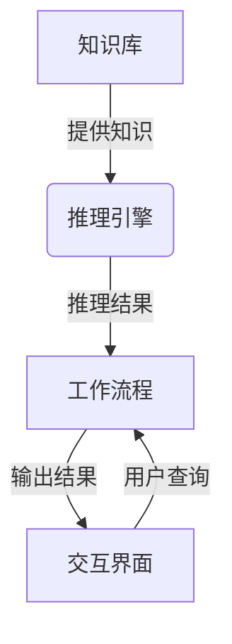
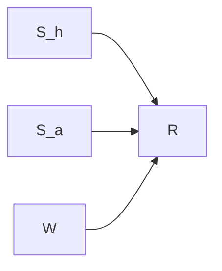

# AI人工智能代理工作流AI Agent WorkFlow：智能代理在重大事件预测系统中的应用

## 1. 背景介绍

### 1.1 问题的由来

在当今瞬息万变的世界中,重大事件的发生往往造成深远的影响,及时准确地预测和应对这些事件对于政府、企业和个人来说都至关重要。然而,由于事件发生的复杂性和不确定性,传统的预测方法往往效果有限。随着人工智能技术的不断发展,智能代理(Intelligent Agent)作为一种新兴的预测和决策支持系统,展现出巨大的潜力。

### 1.2 研究现状

近年来,智能代理在重大事件预测领域受到了广泛关注。研究人员提出了多种基于机器学习、知识图谱、复杂网络等技术的智能代理模型,并取得了一定的成果。然而,由于事件预测涉及多个领域的复杂知识,现有的智能代理模型仍然存在一些不足,如知识表示能力有限、推理能力不强等。

### 1.3 研究意义

构建一个高效、可靠的智能代理系统,能够帮助决策者及时发现潜在的风险,制定应对策略,从而减少重大事件带来的损失。同时,智能代理技术的发展也将推动相关领域的理论研究和技术创新,为解决其他复杂问题提供新的思路。

### 1.4 本文结构

本文将首先介绍智能代理在重大事件预测中的核心概念和技术,包括知识表示、推理引擎、工作流程等。然后详细阐述智能代理的核心算法原理和数学模型,并通过实例说明其具体实现过程。接下来,探讨智能代理在实际应用中的场景,并给出相关工具和资源的推荐。最后,总结研究成果,分析未来发展趋势和面临的挑战。

## 2. 核心概念与联系

智能代理在重大事件预测系统中扮演着关键角色,其核心概念包括:

1. **知识库(Knowledge Base)**: 存储与事件相关的结构化知识,包括实体、关系、规则等,是智能代理进行推理的基础。

2. **推理引擎(Reasoning Engine)**: 基于知识库中的知识,利用逻辑规则和算法进行复杂推理,得出事件发生的可能性及其影响。

3. **工作流程(Workflow)**: 定义了智能代理在事件预测过程中的各个步骤,包括数据采集、知识融合、推理判断、结果输出等。

4. **交互界面(Interactive Interface)**: 为用户提供友好的交互方式,输入查询条件,显示预测结果和解释。

这些核心概念相互关联,共同构建了一个完整的智能代理系统。其中,知识库和推理引擎是系统的核心部分,工作流程则规范了系统的运行过程,交互界面则提供了与用户的连接。

## 3. 核心算法原理 & 具体操作步骤

### 3.1 算法原理概述

智能代理在重大事件预测中的核心算法主要包括两个部分:

1. **知识融合算法**: 将来自多个异构数据源的信息进行清洗、抽取、融合,构建统一的知识库。

2. **推理算法**: 基于知识库中的知识,利用规则推理、机器学习等技术,对事件发生的可能性及其影响进行预测和分析。

其中,知识融合算法确保了知识库的完整性和准确性,为推理算法提供了可靠的知识基础。推理算法则利用这些知识,通过复杂的推理过程,得出预测结果。

### 3.2 算法步骤详解

#### 3.2.1 知识融合算法

1. **数据采集**: 从新闻报道、社交媒体、政府公报等多个数据源采集与事件相关的原始数据。

2. **数据清洗**: 对原始数据进行去重、去噪、格式化等预处理,提高数据质量。

3. **实体抽取**: 利用命名实体识别技术,从文本数据中抽取出与事件相关的实体,如人物、地点、组织等。

4. **关系抽取**: 基于语义分析和模式匹配等方法,识别实体之间的关系,如"就职于"、"位于"等。

5. **知识融合**: 将抽取出的实体、关系以及相关的规则知识融合到统一的知识库中,构建知识图谱。

6. **知识库优化**: 通过知识库完整性检查、冗余去除等方式,优化知识库的质量和效率。

#### 3.2.2 推理算法

1. **规则推理**: 基于知识库中的规则,利用逻辑推理技术(如前向链接、后向链接等),推导出事件发生的可能性。

2. **机器学习**: 将知识库中的数据作为训练集,利用机器学习算法(如决策树、神经网络等)构建事件预测模型。

3. **因果分析**: 分析事件发生的原因和影响,建立因果关系图,辅助决策制定。

4. **不确定性处理**: 针对存在不确定性的知识,采用模糊逻辑、贝叶斯网络等技术进行推理。

5. **结果融合**: 将基于规则推理、机器学习、因果分析等多种方法得到的预测结果进行融合,提高预测的准确性和可靠性。

### 3.3 算法优缺点

#### 优点:

1. **知识驱动**: 利用结构化的知识库,能够捕获事件发生的深层次因果关系,提高预测的解释性。

2. **多策略融合**: 结合了规则推理、机器学习等多种推理策略,能够充分利用不同类型的知识,提高预测的准确性。

3. **可解释性强**: 能够给出预测结果的依据和推理过程,便于人工审核和决策参考。

#### 缺点:

1. **知识获取成本高**: 构建高质量的知识库需要大量的人工努力,成本较高。

2. **推理效率有待提高**: 复杂的推理过程可能导致计算效率低下,难以满足实时性要求。

3. **难以处理未知知识**: 对于知识库中不存在的新情况,推理能力会受到限制。

### 3.4 算法应用领域

智能代理在重大事件预测系统中的应用前景广阔,可以覆盖多个领域:

1. **政治事件预测**: 预测选举结果、政策变化、社会运动等政治事件。

2. **经济事件预测**: 预测股市波动、贸易形势、企业并购等经济事件。

3. **安全事件预测**: 预测自然灾害、恐怖袭击、网络攻击等安全事件。

4. **社会事件预测**: 预测人口迁移、疫情传播、舆情走向等社会事件。

5. **技术事件预测**: 预测新兴技术发展趋势、产品创新等技术事件。

## 4. 数学模型和公式 & 详细讲解 & 举例说明

### 4.1 数学模型构建

在智能代理的推理算法中,我们可以将事件预测问题建模为一个概率推理问题。假设事件 $E$ 的发生与一组证据 $\mathbf{e} = \{e_1, e_2, \ldots, e_n\}$ 有关,我们的目标是计算 $P(E|\mathbf{e})$,即在给定证据的条件下,事件 $E$ 发生的概率。

根据贝叶斯定理,我们有:

$$P(E|\mathbf{e}) = \frac{P(E)P(\mathbf{e}|E)}{P(\mathbf{e})}$$

其中:

- $P(E)$ 是事件 $E$ 的先验概率,可以基于历史数据或专家知识估计得到。
- $P(\mathbf{e}|E)$ 是在事件 $E$ 发生的条件下,观测到证据 $\mathbf{e}$ 的概率,称为似然函数。
- $P(\mathbf{e})$ 是证据 $\mathbf{e}$ 的边缘概率,作为归一化常数。

由于直接计算 $P(\mathbf{e})$ 通常很困难,我们可以利用贝叶斯网络对其进行近似。贝叶斯网络是一种基于图模型的概率推理工具,它将变量之间的条件独立性用有向无环图进行表示,从而简化了计算复杂度。

在贝叶斯网络中,节点表示随机变量,有向边表示变量之间的条件依赖关系。对于一个给定的贝叶斯网络 $\mathcal{B}$,联合概率分布可以factorized为:

$$P(\mathbf{X}) = \prod_{i=1}^n P(X_i|Pa(X_i))$$

其中 $\mathbf{X} = \{X_1, X_2, \ldots, X_n\}$ 是网络中的所有随机变量, $Pa(X_i)$ 表示 $X_i$ 的父节点集合。

通过构建合适的贝叶斯网络模型,我们可以有效地计算出 $P(E|\mathbf{e})$,从而实现对事件发生概率的预测。

### 4.2 公式推导过程

下面我们以一个简单的例子,推导如何利用贝叶斯网络计算事件发生概率。假设我们要预测一场足球比赛的结果 $R$ (输或赢),已知的证据包括:

- 主队实力 $S_h$
- 客队实力 $S_a$
- 天气情况 $W$

我们可以构建如下的贝叶斯网络模型:

根据贝叶斯网络的factorization性质,我们有:

$$\begin{aligned}
P(R, S_h, S_a, W) &= P(R|S_h, S_a, W)P(S_h)P(S_a)P(W) \\
                  &= P(R|S_h, S_a, W)P(S_h)P(S_a)P(W)
\end{aligned}$$

我们想要计算的是 $P(R|S_h, S_a, W)$,根据贝叶斯定理:

$$P(R|S_h, S_a, W) = \frac{P(R, S_h, S_a, W)}{P(S_h, S_a, W)}$$

将第一步的结果代入,我们得到:

$$P(R|S_h, S_a, W) = \frac{P(R|S_h, S_a, W)P(S_h)P(S_a)P(W)}{\sum_R P(R|S_h, S_a, W)P(S_h)P(S_a)P(W)}$$

其中分母项是对 $R$ 的所有可能取值求和,作为归一化常数。

通过这种方式,我们可以利用贝叶斯网络高效地计算出事件发生的条件概率,从而实现对事件的预测。

### 4.3 案例分析与讲解

现在,我们以 2016 年美国总统大选为例,说明如何利用智能代理系统对选举结果进行预测。

首先,我们需要构建一个知识库,其中包含与选举相关的实体、关系和规则知识。例如:

- 实体: 候选人(Hillary Clinton, Donald Trump)、州、党派、新闻媒体等。
- 关系: 候选人的政策立场、州的政治倾向、媒体的政治偏好等。
- 规则: 如果一个州在上一次大选中投票支持某个党派,那么这次大选中该州有较高概率继续支持该党派。

接下来,我们可以利用知识融合算法,从新闻报道、社交媒体、民意调查等数据源中抽取相关信息,并将其融合到知识库中。

在推理阶段,我们可以结合规则推理和机器学习两种策略:

1. **规则推理**: 基于知识库中的规则,如"如果一个州的经济状况良好,该州有较高概率支持现任总统所属党派"、"如果一个州的人口结构年轻化,该州有较高概率支持民主党"等,推导出每个州支持不同候选人的可能性。

2. **机器学习**: 将知识库中的数据作为训练集,利用分