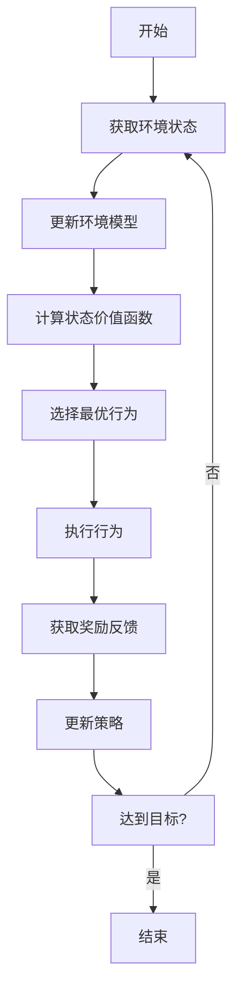

# AI人工智能代理工作流AI Agent WorkFlow：智能代理在金融系统中的应用

## 1. 背景介绍

### 1.1 问题的由来

在当今快节奏的数字时代，金融服务行业面临着前所未有的挑战和机遇。传统的金融服务模式已经无法满足客户日益增长的需求和期望。客户希望获得更加个性化、高效和智能化的金融服务体验。与此同时，金融机构也需要提高运营效率、降低成本并遵守日益严格的监管要求。

为了应对这些挑战,人工智能(AI)技术的引入为金融服务带来了全新的发展机遇。AI智能代理作为一种新兴的技术,正在改变金融服务的提供方式。智能代理可以作为虚拟助手、智能交易顾问或风险管理系统,为客户提供个性化的金融咨询和服务,同时也能够提高金融机构的运营效率和风险管理能力。

### 1.2 研究现状  

近年来,AI智能代理在金融领域的应用研究和实践取得了长足的进展。一些领先的金融机构已经开始探索和采用智能代理技术,以提升客户体验、优化业务流程和降低运营成本。

例如,一些大型银行已经推出基于智能代理的虚拟助手,为客户提供7*24小时的账户查询、交易服务和常见问题解答等服务。保险公司也在使用智能代理系统来自动处理索赔申请、核保流程等,提高了工作效率和准确性。另外,一些资产管理公司正在探索使用智能交易代理来进行算法交易,以获得更好的投资回报。

然而,尽管取得了一些进展,但AI智能代理在金融领域的应用仍处于初级阶段。许多关键技术问题有待解决,例如如何确保智能代理的决策公平性和可解释性、如何保护客户隐私和数据安全、如何有效管理和监控智能代理系统等。此外,相关法律法规和监管政策也需要与时俱进地更新,以适应AI技术的快速发展。

### 1.3 研究意义

AI智能代理在金融领域的应用具有重要的理论意义和实践价值:

- 理论意义:
  - 推动AI技术在金融领域的创新应用,促进金融科技(FinTech)的发展
  - 探索AI智能代理在复杂金融场景中的决策机理和行为模式
  - 研究AI系统的公平性、可解释性、隐私保护等关键技术问题

- 实践价值:
  - 提高金融服务的效率和质量,为客户提供更加个性化和智能化的体验
  - 优化金融机构的业务流程,降低运营成本和风险
  - 推动金融行业的数字化转型,增强竞争力和创新能力

### 1.4 本文结构

本文将全面探讨AI智能代理在金融系统中的应用。首先介绍智能代理的核心概念和关键技术,然后详细阐述其在不同金融场景(如银行、保险、投资等)中的应用,包括具体算法、数学模型、系统架构和实现细节。此外,还将分析智能代理系统在金融领域面临的挑战和未来发展趋势,并给出相关的解决方案和建议。

最后,本文将通过一个实际的金融智能代理项目案例,展示其在实践中的应用效果和收益。总的来说,本文将为读者提供AI智能代理在金融领域应用的全景图,有助于促进该领域的技术创新和实践应用。

## 2. 核心概念与联系

在探讨AI智能代理在金融系统中的应用之前,我们首先需要理解智能代理的核心概念及其与其他相关技术的联系。

### 2.1 智能代理的定义

智能代理(Intelligent Agent)是一种能够感知环境、持续规划和执行行动以实现预定目标的自主系统。根据Russell和Norvig在《人工智能:一种现代的方法》一书中的定义,智能代理可以形式化地表示为:

$$
\text{Agent} = \text{Function}(PercepSequence, Choice)
$$

其中,PercepSequence表示代理从环境获取的感知序列,Choice表示代理做出的行为选择。智能代理的目标是找到一个映射函数,将感知序列映射到合理的行为选择上,从而实现预期目标。

### 2.2 智能代理的关键属性

一个理想的智能代理应当具备以下几个关键属性:

- **自主性(Autonomy)**: 能够在没有人工干预的情况下,自主地感知环境、规划行动并执行任务。
- **反应性(Reactivity)**: 能够及时感知环境的变化,并相应地调整自身行为。
- **主动性(Pro-activeness)**: 不仅被动响应环境变化,还能够根据自身目标主动采取行动。
- **社会性(Social ability)**: 能够与人类或其他代理进行协作、协调和交互。

### 2.3 智能代理的分类

根据智能代理的架构和功能,可以将其分为以下几种类型:

1. **简单反射代理(Simple Reflex Agent)**: 基于当前感知的条件-行为规则做出决策,没有任何历史记录或环境模型。
2. **基于模型的反射代理(Model-based Reflex Agent)**: 除了条件-行为规则外,还维护了一个环境的内部状态模型,用于预测行为的后果。
3. **基于目标的代理(Goal-based Agent)**: 具有确定的目标,能够根据目标和环境状态进行规划和决策。
4. **实用型代理(Utility-based Agent)**: 在决策时,不仅考虑目标的达成情况,还会权衡行为的效用(Utility)。
5. **学习型代理(Learning Agent)**: 能够从过去的经验中学习,不断优化自身的决策机制。

### 2.4 智能代理与相关技术的联系

智能代理技术与人工智能的多个分支领域密切相关,例如:

- **机器学习(Machine Learning)**: 许多智能代理都采用机器学习算法(如深度学习、强化学习等)来获取知识和优化决策。
- **自然语言处理(Natural Language Processing)**: 智能代理通常需要与人类进行自然语言交互,因此需要NLP技术。
- **规划与推理(Planning and Reasoning)**: 智能代理需要对环境状态进行推理,并规划出实现目标的行动序列。
- **多智能体系统(Multi-Agent System)**: 研究多个智能代理如何相互协作、竞争和协调。
- **机器人技术(Robotics)**: 机器人系统本质上也是一种智能代理,需要感知、规划和行动。

总的来说,智能代理是人工智能领域的一个关键概念,将多种AI技术有机结合,为构建自主、智能的系统提供了一种通用模型和框架。

## 3. 核心算法原理与具体操作步骤

### 3.1 算法原理概述

智能代理的核心算法原理是根据感知到的环境状态,结合内部的知识库和目标函数,通过一定的决策机制选择最优行为,并执行相应的动作。这个过程可以形式化地表示为:

$$
\pi^* = \underset{\pi}{\operatorname{argmax}}\ \mathbb{E}[R_t|\pi]
$$

其中,$\pi$表示代理的策略(Policy),即一个从状态到行为的映射函数。$R_t$表示在时间t时刻获得的奖励(Reward)。$\pi^*$是一个最优策略,能够最大化代理在执行过程中获得的累计奖励的期望值。

不同类型的智能代理在具体的算法实现上会有所不同,但都遵循这一基本原理。比较经典的算法有:

- **反射代理**: 采用基于规则的条件-行为映射,如果-则语句。
- **基于模型的代理**: 利用马尔可夫决策过程(MDP)对环境建模,通过价值迭代或策略迭代等方法求解最优策略。
- **基于目标的代理**: 采用启发式搜索、A*算法等规划算法,生成实现目标的行动序列。
- **实用型代理**: 基于期望效用理论,权衡行为的成本和收益,选择期望效用最大的行为。
- **学习型代理**: 利用监督学习、强化学习等机器学习算法,从环境中学习最优策略。

### 3.2 算法步骤详解

以一个基于模型的智能代理为例,其核心算法步骤如下:

1. **获取环境状态**: 通过各种传感器获取当前环境的状态信息,如位置、时间、事件等。
2. **更新环境模型**: 基于获取的状态信息,更新内部维护的环境模型(如MDP模型)。
3. **计算状态价值函数**: 利用动态规划等算法,计算每个状态的价值函数(Value Function),表示从该状态出发能获得的最大期望奖励。
4. **选择最优行为**: 根据价值函数,选择能够使期望奖励最大化的最优行为。
5. **执行行为**: 将选择的行为输出到执行器,对环境产生影响。
6. **获取奖励反馈**: 从环境获取执行该行为后的奖励反馈。
7. **更新策略**: 根据获得的奖励,调整策略函数(Policy),以使下次能够做出更好的决策。
8. **达到目标?**: 检查是否已经达到预设的目标状态。如果达到,算法结束;否则返回步骤1,重复上述过程。

### 3.3 算法优缺点

上述基于模型的智能代理算法具有以下优缺点:

**优点**:

- 显式地对环境进行建模,能够更好地捕捉环境的动态特性。
- 基于价值函数或策略函数的优化,可以保证找到最优或近似最优的解。
- 算法通用性强,可以应用于各种决策场景。

**缺点**:

- 需要对环境进行精确建模,对环境的先验知识要求较高。
- 价值函数或策略函数的计算复杂度较高,尤其是在大规模状态空间下。
- 算法的收敛性和最优性无法在所有情况下保证。
- 算法设计和参数调优需要一定的专业知识和经验。

### 3.4 算法应用领域

智能代理算法在许多领域都有广泛的应用,包括:

- 机器人导航与控制
- 自动驾驶与交通管理
- 游戏AI与对抗性决策
- 智能制造与过程控制
- 网络安全与入侵检测
- 金融投资与风险管理
- ......

在金融领域,智能代理算法可以应用于多个场景,例如:

- 投资组合优化与自动交易
- 客户服务与智能助理
- 风险监控与欺诈检测
- 反洗钱与合规管理
- 营销与推荐系统
- ......

我们将在后续章节中详细介绍智能代理在这些金融场景中的具体应用。

## 4. 数学模型和公式详细讲解与举例说明

在前面的章节中,我们已经介绍了智能代理的基本概念和核心算法思想。现在,我们将更深入地探讨智能代理系统中所采用的数学模型和公式,并通过具体案例进行讲解和说明。

### 4.1 数学模型构建

#### 4.1.1 马尔可夫决策过程(MDP)

马尔可夫决策过程(Markov Decision Process, MDP)是智能代理系统中最常用的数学模型。一个MDP可以用一个五元组来表示:

$$
\langle \mathcal{S}, \mathcal{A}, \mathcal{P}, \mathcal{R}, \gamma \rangle
$$

其中:

- $\mathcal{S}$是有限的状态集合
- $\mathcal{A}$是有限的行为集合
- $\mathcal{P}$是状态转移概率函数,定义为$\mathcal{P