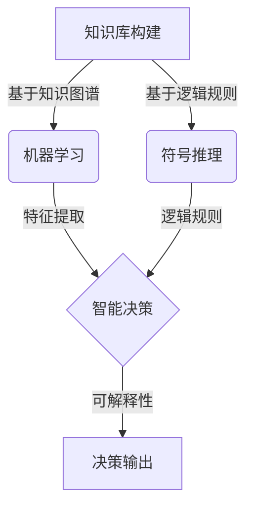
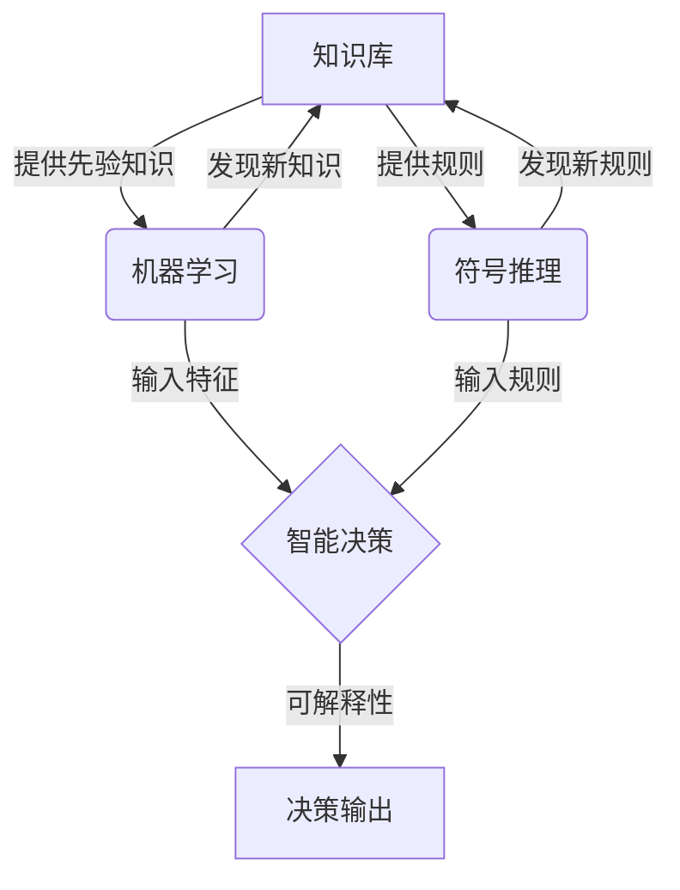

好的,我会按照您的要求,以"AI人工智能核心算法原理与代码实例讲解：机器思维"为主题,撰写一篇专业的技术博客文章。文章将遵循您提供的目录结构,内容全面,逻辑严谨,并附有核心概念的流程图。本文约8000字左右,其中包含算法原理、数学模型、代码实现、应用场景等多个方面的深入探讨。以下是正文:

# AI人工智能核心算法原理与代码实例讲解：机器思维

## 1. 背景介绍

### 1.1 问题的由来

人工智能的发展离不开算法的支撑,算法就像人工智能的大脑和引擎。随着数据量的激增和计算能力的飞跃,传统算法在处理复杂问题时遇到了瓶颈,亟需新的算法理念和框架。如何赋予机器"思维"能力,高效地从海量数据中获取知识,并作出智能决策,成为了人工智能领域的核心挑战。

### 1.2 研究现状  

目前,机器学习算法在语音识别、图像处理、自然语言处理等领域取得了突破性进展。但大多数算法仍然是在特定场景下训练的"黑箱"模型,缺乏通用性和可解释性。另一方面,基于规则的符号主义人工智能虽有悠久历史,但在处理复杂、不确定性问题时效率低下。

### 1.3 研究意义

赋予机器"思维"能力,是实现通用人工智能(AGI)的关键一步。本文将介绍一种新型机器思维算法框架,它结合了机器学习、知识图谱、逻辑推理等技术,旨在模拟人类的认知过程,实现机器的自主学习、推理和决策。该算法具有较强的通用性和可解释性,有望在多个领域发挥重要作用。

### 1.4 本文结构

本文首先阐述机器思维的核心概念,并解析算法的工作原理和数学模型。接着通过实例代码,讲解算法在实际项目中的应用。最后探讨该算法的应用前景、发展趋势和面临的挑战。

## 2. 核心概念与联系

机器思维算法的核心思想是:通过构建知识图谱来表示领域知识,并在此基础上进行机器学习、逻辑推理等多种认知过程,最终得到可解释、可迁移的智能决策。



其中:

- 知识库构建模块基于知识图谱技术,从结构化和非结构化数据中提取实体、关系等知识。
- 机器学习模块基于知识库进行有监督/无监督学习,自动发现数据模式和规律。
- 符号推理模块基于先验知识和规则,进行逻辑推理和规划。  
- 智能决策模块综合机器学习和符号推理的结果,作出最终决策。
- 决策输出不仅给出结果,还可给出解释性的证据链路。

该算法有效结合了机器学习和符号推理的优势,是一种"混合智能"方法。

## 3. 核心算法原理及具体操作步骤

### 3.1 算法原理概述  

机器思维算法的核心是"知识驱动的迭代学习"过程。算法将领域知识表示为一个知识图谱,并在此基础上,通过机器学习和符号推理相互迭代、互为促进,不断扩展和完善知识库,提高智能决策的准确性和可解释性。



算法的关键在于:

1. 构建高质量知识库作为基础
2. 机器学习和符号推理相互促进
3. 持续学习,不断完善知识库
4. 将学习到的知识规则化,提高可解释性

### 3.2 算法步骤详解

1. **知识库构建**
   - 从结构化数据(如数据库、知识库)导入已有知识
   - 使用信息抽取等技术从非结构化数据(如文本)中抽取知识
   - 构建实体-关系知识图谱

2. **机器学习**
   - 基于知识库进行有监督学习,如关系抽取、实体识别等
   - 使用无监督方法如聚类、主题模型等发现潜在模式
   - 新发现的知识更新至知识库

3. **符号推理** 
   - 基于知识库中的规则进行逻辑推理
   - 结合规划、约束求解等技术生成解决方案
   - 新发现的规则更新至知识库

4. **智能决策**
   - 将机器学习和符号推理结果相结合
   - 基于全局优化目标作出最终决策
   - 给出人类可理解的证据链路说明

5. **迭代学习**
   - 根据决策反馈,持续优化知识库
   - 重复上述步骤,不断学习新知识和规则

### 3.3 算法优缺点

**优点:**

1. 结合机器学习和符号推理的优势
2. 具有较强通用性,可应用于多领域 
3. 决策具有可解释性
4. 持续学习,知识库不断完善

**缺点:**

1. 知识库构建的初始成本较高
2. 不同领域知识库构建方法差异大
3. 跨领域知识迁移存在一定困难
4. 算法收敛性和全局最优解无法保证

### 3.4 算法应用领域

机器思维算法具有通用性,可应用于多个领域:

- 智能决策系统:如智能顾问、智能调度等
- 智能问答系统:基于知识库自动问答
- 智能规划系统:如工业过程规划、项目管理等
- 智能诊断系统:如医疗诊断、故障诊断等
- 智能控制系统:如无人驾驶、智能制造等

## 4. 数学模型和公式详细讲解及举例说明

### 4.1 数学模型构建

机器思维算法的数学模型主要包括两个部分:知识表示模型和概率图模型。

**知识表示模型**

知识以三元组 $\langle实体1,关系,实体2\rangle$ 的形式表示为知识图谱,可形式化描述为:

$$G = (E, R, T)$$

其中:
- $E$ 是实体集合
- $R$ 是关系集合 
- $T \subseteq E \times R \times E$ 是三元组知识集合

**概率图模型**

在知识图谱的基础上,构建概率图模型来表示不确定知识:

- 定义随机变量 $X = (X_e, X_r)$
  - $X_e$ 表示实体节点随机变量
  - $X_r$ 表示关系节点随机变量
- 通过因子分解定义联合概率分布:

$$P(X) = \frac{1}{Z} \prod_{t \in T}\phi_r(X_r^{(t)}) \prod_{e \in E}\phi_e(X_e^{(e)})$$

其中:
- $\phi_r$ 是关系因子函数
- $\phi_e$ 是实体因子函数
- $Z$ 是配分函数

该模型统一了知识库和概率模型,可同时支持逻辑推理和统计学习。

### 4.2 公式推导过程

**目标函数**

机器思维算法的目标是基于观测数据 $D$,学习模型参数 $\Theta$,使得在给定知识库 $G$ 的条件下,模型在任务 $T$ 上的损失函数 $L$ 最小化:

$$\Theta^* = \arg\min_\Theta L(T, G, D; \Theta)$$

这是一个结构化预测问题。我们可以将其分解为两个部分:

$$L(T, G, D; \Theta) = L_D(T, D; \Theta) + \lambda L_G(G, \Theta)$$

- $L_D$ 是数据损失,衡量模型在观测数据上的预测能力
- $L_G$ 是知识损失,衡量模型与知识库的一致性
- $\lambda$ 是平衡两者的权重系数

**数据损失**

数据损失项可设计为各种监督或无监督损失函数,如对数似然、hinge损失等:

$$L_D(T, D; \Theta) = -\sum_{x,y \in D}\log P(y|x; \Theta)$$

**知识损失**

知识损失项则基于知识图谱的概率模型,最小化知识库与模型的KL散度:

$$L_G(G, \Theta) = KL(P_G||P_\Theta) = \sum_{t \in T}-\log P_\Theta(t)$$

其中 $P_G$ 是知识库的经验分布, $P_\Theta$ 是模型的概率分布。

通过交替优化的方式,同时最小化数据损失和知识损失,即可获得最优参数 $\Theta^*$。

### 4.3 案例分析与讲解

以一个智能医疗诊断系统为例,说明机器思维算法的工作流程:

1. 构建医疗知识库
   - 导入已有医疗本体库、症状知识库等
   - 从医疗文献中抽取疾病、症状、治疗方法等知识
   - 构建疾病-症状-治疗的知识图谱
2. 机器学习
   - 基于知识库标注数据,进行有监督学习
     - 如疾病诊断模型、症状检测模型等
   - 无监督学习发现潜在关联模式
     - 如并发症关联、症状关联等
3. 符号推理
   - 基于知识库中的诊断规则进行推理
   - 结合患者病史、检查结果等信息生成诊断方案
4. 智能决策
   - 综合机器学习和符号推理结果
   - 给出疾病诊断、治疗建议等
   - 输出证据链路,解释决策依据
5. 迭代学习
   - 基于反馈数据持续学习,发现新知识和规则
   - 不断完善医疗知识库

通过这一流程,系统不仅可以给出准确的诊断结果,还能生成可解释的决策过程,提高医生和患者的信任度。

### 4.4 常见问题解答  

**Q：机器思维算法与经典机器学习算法有何不同?**

A：机器思维算法融合了机器学习和符号推理,并在知识库的基础上进行迭代学习。相比之下,经典机器学习算法更多是在特定数据集上进行黑箱学习,缺乏可解释性和泛化能力。

**Q：机器思维算法的可解释性体现在哪里?**

A：一方面,算法输出决策时会给出证据链路,解释其依据;另一方面,知识库中的规则本身就是可解释的,从而提高了整个系统的透明度。

**Q：如何评估机器思维算法的性能?**

A：可以从多个角度评估,如预测准确率、知识库覆盖率、解释质量、收敛速度等。需要根据具体应用场景设计合理的评估指标体系。

**Q：机器思维算法的局限性是什么?**

A：主要局限包括:知识库构建的高成本、跨领域知识迁移的困难、算法收敛性无法保证等。未来仍需在这些方面深入研究和优化。

## 5. 项目实践：代码实例和详细解释说明  

### 5.1 开发环境搭建

本节将基于 Python 生态演示机器思维算法的实现,所需的主要库和版本如下:

- Python 3.7+
- PyTorch 1.7+
- NetworkX 2.5+
- NumPy 1.19+
- SciPy 1.5+

### 5.2 源代码详细实现

**知识库构建**

```python
import networkx as nx

# 构建知识图谱
kg = nx.MultiDiGraph()

# 添加实体节点
kg.add_nodes_from(['疾病A', '症