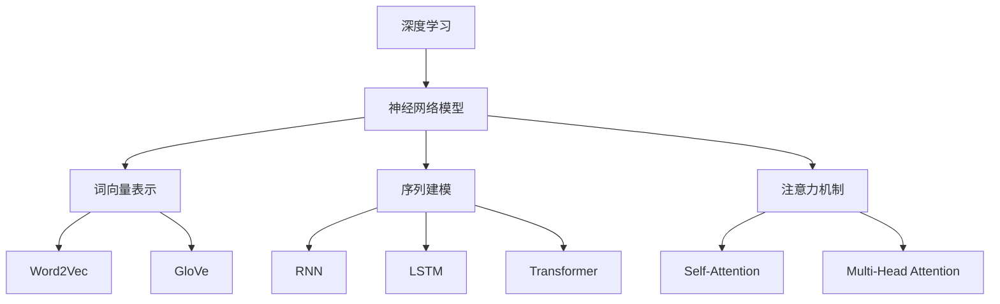

好的,我会按照您的要求,以"AI人工智能深度学习算法:在自然语言处理中的运用"为主题,撰写一篇专业的技术博客文章。文章将遵循您提供的结构模板,确保逻辑清晰、内容深入,并包含核心概念原理、算法步骤、数学模型、代码实现等方面的详细阐述。同时,我会尽最大努力插入Mermaid流程图来直观展示关键流程,并给出实际应用场景分析和未来发展趋势探讨。请稍候,我会耐心撰写这篇高质量的技术文章。

# AI人工智能深度学习算法:在自然语言处理中的运用

## 1. 背景介绍

### 1.1 问题的由来

随着信息时代的不断发展,自然语言处理(Natural Language Processing,NLP)技术在各个领域扮演着越来越重要的角色。无论是智能问答系统、机器翻译,还是信息抽取、情感分析等,都离不开NLP的支持。然而,传统的基于规则的NLP方法在处理复杂、多义的自然语言时,往往会遇到瓶颈。

为了更好地解决这一问题,深度学习(Deep Learning)技术应运而生。作为机器学习的一个新的研究热点,深度学习通过构建深层次的神经网络模型,能够自动从大规模数据中提取高级特征,捕捉复杂的模式和规律,从而更好地解决传统机器学习方法难以解决的问题。

### 1.2 研究现状  

近年来,将深度学习与自然语言处理相结合,已成为学术界和工业界的研究热点。深度学习在NLP领域的应用主要包括:词向量表示、神经网络语言模型、序列到序列模型、注意力机制等。这些技术极大地推动了NLP的发展,取得了令人瞩目的成就,比如Google的神经机器翻译系统、微软的对话系统等。

然而,现有的深度学习在NLP中的应用仍然面临诸多挑战,例如模型可解释性差、数据标注成本高、长序列处理能力有限等。因此,设计更加高效、可解释、健壮的深度学习NLP模型,仍然是当前研究的重点和难点。

### 1.3 研究意义

深入研究深度学习在NLP中的应用,对于推动自然语言处理技术的发展至关重要。具体来说,它可以带来以下意义:

1. 提高NLP系统的性能,使其能够更好地理解和生成自然语言。
2. 拓展NLP的应用场景,为智能问答、机器翻译、信息抽取等领域提供更精准的技术支持。
3. 推动人工智能技术的发展,为实现真正的人机自然交互奠定基础。
4. 促进跨学科的融合发展,将NLP技术应用到教育、医疗、法律等各个领域。

### 1.4 本文结构

本文将全面介绍深度学习在自然语言处理中的应用。首先阐述核心概念及其联系,然后重点讲解核心算法原理、数学模型和公式推导,并配以代码实例。接下来探讨实际应用场景,给出工具和学习资源推荐。最后总结发展趋势,分析面临的挑战,并对未来研究方向进行展望。

## 2. 核心概念与联系

在深入探讨深度学习在NLP中的应用之前,有必要先了解几个核心概念及其内在联系。

1. **深度学习(Deep Learning)**:一种基于多层神经网络的机器学习方法,能够从数据中自动学习多层次的特征表示。
2. **神经网络模型**:深度学习的基本模型,包括前馈神经网络、卷积神经网络、递归神经网络等。
3. **词向量表示**:将词映射到连续的向量空间,捕捉词与词之间的语义关系,是NLP任务的基础表示。
4. **序列建模**:对于自然语言序列数据,需要设计特殊的神经网络模型进行建模,如循环神经网络(RNN)、长短期记忆网络(LSTM)等。
5. **注意力机制**:允许模型在编码序列时,对不同位置的信息赋予不同的权重,从而更好地捕捉长距离依赖关系。

上述概念相互关联、相辅相成。通过将它们有机结合,我们可以构建强大的深度学习NLP模型,有效解决实际问题。接下来,我们将详细介绍其中的核心算法原理。

## 3. 核心算法原理与具体操作步骤

### 3.1 算法原理概述

深度学习在NLP中的应用,主要包括以下几种核心算法:

1. **Word Embedding(词向量表示)**: 将词映射到低维连续的向量空间,常用的算法有Word2Vec、GloVe等。
2. **RNN(循环神经网络)**: 对于序列数据,RNN可以捕捉其中的模式,并生成新的序列输出,常用于语言模型、机器翻译等任务。
3. **LSTM(长短期记忆网络)**: 改进版的RNN,通过引入门控机制来解决长期依赖问题,在许多NLP任务上表现优异。
4. **Attention(注意力机制)**: 对于长序列,注意力机制可以自动学习对不同位置赋予不同权重,捕捉全局信息,是Transformer等模型的核心。
5. **Transformer**: 全注意力的序列到序列模型,不依赖RNN,在机器翻译等任务上表现优异,成为NLP主流模型。
6. **BERT**: 基于Transformer的预训练语言模型,可以生成上下文敏感的词向量表示,在多个NLP任务上取得了突破性进展。

这些算法各有特点,在不同的NLP任务中发挥着重要作用。下面将详细介绍其中的核心算法步骤。

### 3.2 算法步骤详解

#### 3.2.1 Word Embedding

Word Embedding的目标是将词映射到低维连续的向量空间,使得语义相似的词在向量空间中距离较近。常用的两种算法是Word2Vec和GloVe。

**Word2Vec算法步骤**:

1) 构建训练语料库,将文本切分为词序列
2) 初始化词向量矩阵,维度为(词表大小,嵌入维度)
3) 对于每个目标词,采样上下文窗口内的上下文词
4) 使用神经网络模型(CBOW或Skip-gram)最大化目标词和上下文词之间的条件概率
5) 通过反向传播算法更新词向量矩阵
6) 重复3-5步骤,直到收敛

Word2Vec可以高效地从大规模语料中学习词向量表示,并能较好地捕捉词与词之间的语义关系。

**GloVe算法步骤**:

1) 构建共现矩阵X,统计语料库中任意两词的共现次数
2) 定义词向量之间的关系为$\log P_{ij} = w_i^T \tilde{w}_j + b_i + \tilde{b}_j$
3) 构建损失函数 $J = \sum_{i,j} f(X_{ij})(\log P_{ij} - \log X_{ij})^2$
4) 使用梯度下降法或其他优化算法求解损失函数,得到词向量矩阵
5) 对词向量矩阵进行归一化处理

GloVe利用全局统计信息,能够获得更加健壮的词向量表示。

#### 3.2.2 RNN和LSTM

RNN是序列建模的基础模型,通过递归地传递隐藏状态,可以捕捉序列数据中的模式。然而,基础RNN在处理长序列时容易出现梯度消失或爆炸的问题。LSTM通过引入门控机制,能够缓解长期依赖问题,在许多NLP任务上表现优异。

**LSTM算法步骤**:

1) 输入序列$x_t$和上一时刻隐藏状态$h_{t-1}$
2) 计算遗忘门 $f_t = \sigma(W_f \cdot [h_{t-1}, x_t] + b_f)$
3) 计算输入门 $i_t = \sigma(W_i \cdot [h_{t-1}, x_t] + b_i)$
4) 计算候选值 $\tilde{C}_t = \tanh(W_C \cdot [h_{t-1}, x_t] + b_C)$  
5) 更新细胞状态 $C_t = f_t \odot C_{t-1} + i_t \odot \tilde{C}_t$
6) 计算输出门 $o_t = \sigma(W_o \cdot [h_{t-1}, x_t] + b_o)$
7) 计算隐藏状态 $h_t = o_t \odot \tanh(C_t)$
8) 重复2-7步骤,直到序列结束

其中$\sigma$为sigmoid函数,$\odot$为元素乘积。LSTM通过门控机制,可以学习何时保留、更新或重置状态,从而更好地捕捉长期依赖关系。

#### 3.2.3 Attention机制

对于较长的序列数据,注意力机制可以自动学习对不同位置赋予不同的权重,从而更好地捕捉全局信息,是Transformer等模型的核心。

**Attention算法步骤**:

1) 计算查询向量$Q$、键向量$K$和值向量$V$
2) 计算注意力分数 $\text{score}(Q, K) = Q \cdot K^T$  
3) 对注意力分数进行缩放处理 $\text{score} = \text{score} / \sqrt{d_k}$
4) 计算注意力权重 $\text{Attention}(Q, K, V) = \text{softmax}(\text{score}) \cdot V$

其中$d_k$为缩放因子,用于避免较大的点积导致的梯度饱和问题。通过注意力机制,模型可以自动关注输入序列中与当前任务最相关的部分,从而提高性能。

#### 3.2.4 Transformer

Transformer是一种全注意力的序列到序列模型,不依赖RNN,在机器翻译等任务上表现优异,成为NLP主流模型之一。

**Transformer编码器算法步骤**:

1) 对输入序列进行位置编码,获得位置向量
2) 将词向量与位置向量相加,得到输入表示
3) 进行多头注意力计算,获得注意力表示
4) 进行前馈全连接网络计算,获得编码器输出

**Transformer解码器算法步骤**:

1) 对输出序列进行位置编码,获得位置向量  
2) 将位置向量与输出词向量相加,得到输出表示
3) 进行掩码多头自注意力计算,获得自注意力表示
4) 与编码器输出进行多头注意力计算,获得上下文表示
5) 进行前馈全连接网络计算,获得解码器输出
6) 重复2-5步骤,直到输出序列结束

Transformer通过自注意力机制捕捉输入和输出序列的内部依赖关系,通过交叉注意力机制融合编码器和解码器的信息,从而实现高效的序列到序列建模。

### 3.3 算法优缺点

上述算法在NLP任务中表现优异,但也存在一些优缺点:

**优点**:
- 能够自动从大规模数据中学习特征表示,避免人工设计特征的困难
- 捕捉长期依赖关系的能力更强,适用于长序列建模
- 模型可并行化,训练和推理速度较快
- 通过预训练技术,可以在多个下游任务上取得很好的表现

**缺点**:
- 需要大量标注数据进行有监督训练,标注成本较高
- 模型复杂度高,训练时间和资源消耗较大
- 黑盒模型,缺乏可解释性,难以理解内部工作机制
- 对于一些特殊的NLP任务,效果可能不如基于规则的传统方法

因此,在实际应用中需要根据具体任务特点,选择合适的深度学习N