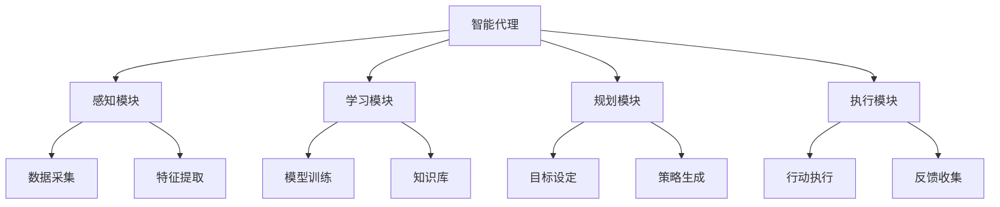
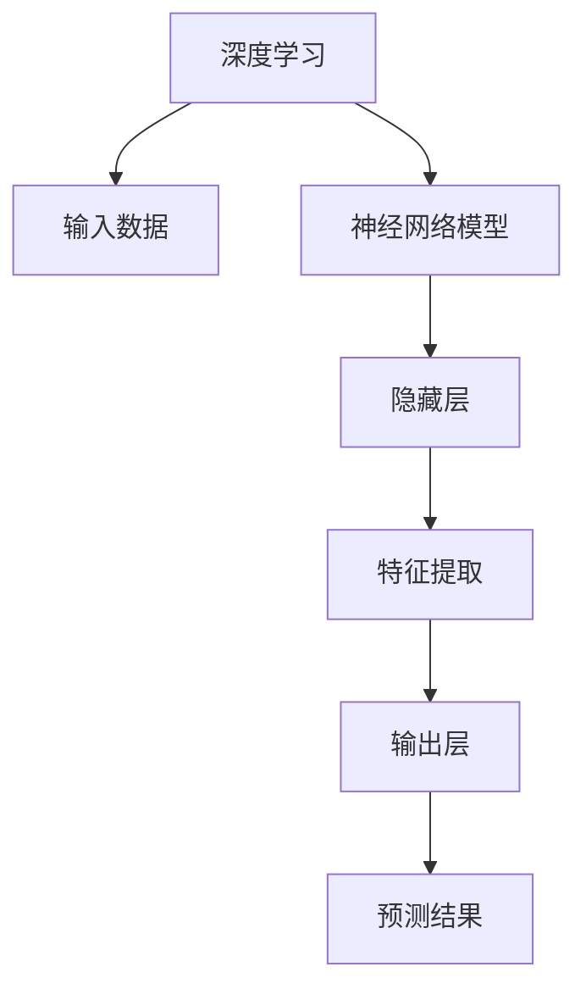
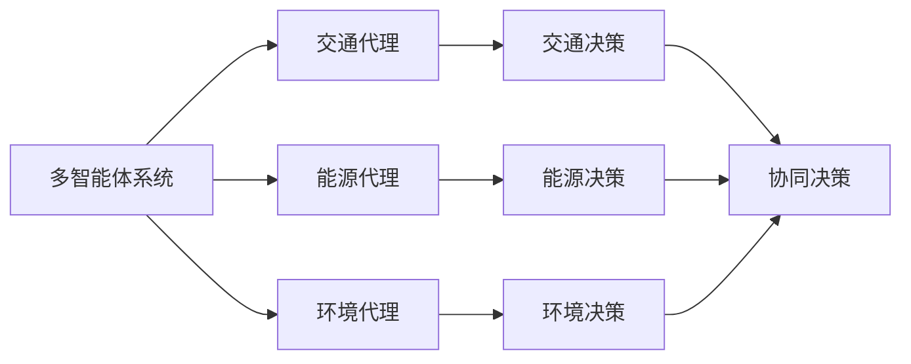
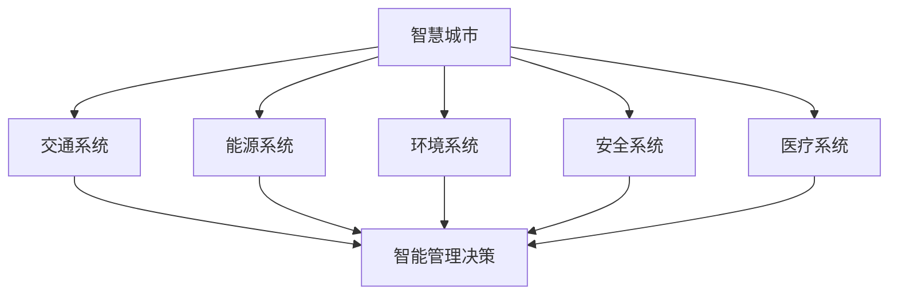
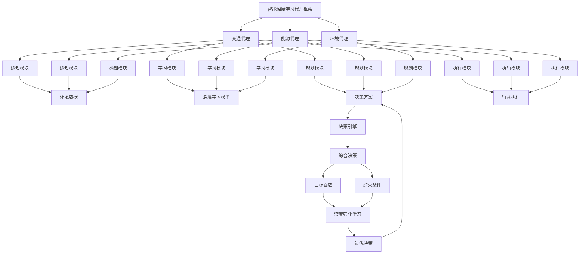

# AI人工智能深度学习算法：智能深度学习代理在智慧城市中的实践

## 1. 背景介绍

### 1.1 问题的由来

随着城市化进程的不断加快,城市面临着日益严峻的挑战,如交通拥堵、环境污染、能源消耗等。传统的城市管理方式已经难以应对这些复杂的问题。因此,迫切需要一种新型的解决方案来构建智慧、高效、可持续的城市。智慧城市(Smart City)的概念应运而生,它利用先进的信息通信技术(ICT)来整合城市的各种资源和服务,从而优化城市运营,提高生活质量。

在智慧城市的建设中,人工智能(AI)和深度学习(Deep Learning)技术扮演着关键角色。深度学习算法能够从海量数据中自动学习特征表示,捕捉复杂的模式和规律,为智能决策提供有力支持。然而,如何有效地将深度学习技术应用于智慧城市的各个领域,仍然是一个巨大的挑战。

### 1.2 研究现状

近年来,研究人员致力于将深度学习技术应用于智慧城市的各个领域,取得了一定进展。例如,在交通领域,深度学习技术被用于交通流量预测、路径规划、无人驾驶等;在环境领域,深度学习技术被用于空气质量监测、噪音检测等;在能源领域,深度学习技术被用于能源需求预测、能源系统优化等。

然而,现有的研究大多集中于单一领域的特定任务,缺乏一种综合性的方法来解决智慧城市的复杂问题。此外,大多数研究都是基于模拟数据或受控环境进行的,缺乏在真实城市环境中的验证和应用。

### 1.3 研究意义

本文旨在提出一种基于深度学习的智能代理(Intelligent Agent)框架,用于解决智慧城市中的复杂问题。该框架将多个深度学习模型有机结合,形成一个统一的智能决策系统,能够在考虑多个目标和约束条件的情况下,为城市管理提供智能化的解决方案。

该框架不仅能够处理单一领域的任务,还能够跨领域协同决策,实现城市资源的整体优化。此外,该框架将在真实的城市环境中进行验证和应用,以评估其实际性能和可扩展性。

通过本研究,我们希望为智慧城市的建设提供一种创新的人工智能解决方案,推动城市向更加智能、高效和可持续的方向发展。

### 1.4 本文结构

本文的结构安排如下:

1. 背景介绍
2. 核心概念与联系
3. 核心算法原理与具体操作步骤
4. 数学模型和公式详细讲解与举例说明
5. 项目实践:代码实例和详细解释说明
6. 实际应用场景
7. 工具和资源推荐
8. 总结:未来发展趋势与挑战
9. 附录:常见问题与解答

## 2. 核心概念与联系

在介绍本文的核心内容之前,我们先来了解一些基本概念及其相互关系。

### 2.1 智能代理

智能代理(Intelligent Agent)是一种自主的软件实体,能够感知环境、学习知识、制定计划并采取行动,以实现预定目标。在智慧城市的背景下,智能代理需要整合多个领域的信息和知识,并协调不同系统之间的交互,从而为城市管理提供智能化的决策支持。

### 2.2 深度学习

深度学习(Deep Learning)是一种基于人工神经网络的机器学习技术,能够从大量数据中自动学习特征表示,捕捉复杂的模式和规律。在智慧城市的背景下,深度学习技术可以应用于各个领域,如交通流量预测、能源需求预测、环境监测等。

### 2.3 多智能体系统

多智能体系统(Multi-Agent System)是由多个智能代理组成的分布式系统,每个代理都具有自主性和局部决策能力。在智慧城市的背景下,多智能体系统可以用于协调不同领域的智能代理,实现跨领域的协同决策和资源优化。

### 2.4 智慧城市

智慧城市(Smart City)是一种新型的城市发展模式,它利用先进的信息通信技术来整合城市的各种资源和服务,优化城市运营,提高生活质量。智慧城市涵盖了多个领域,如交通、能源、环境、安全、医疗等,需要采用智能化的方式进行管理和决策。

通过上述概念的介绍,我们可以看到智能代理、深度学习、多智能体系统和智慧城市之间存在密切的联系。本文将围绕这些核心概念,提出一种基于深度学习的智能代理框架,用于解决智慧城市中的复杂问题。

## 3. 核心算法原理与具体操作步骤

### 3.1 算法原理概述

本文提出的智能深度学习代理框架,是一种基于深度学习和多智能体系统的综合性解决方案。该框架由多个智能代理组成,每个代理负责特定领域的任务,如交通代理、能源代理、环境代理等。每个代理都包含感知模块、学习模块、规划模块和执行模块,能够自主地感知环境、学习知识、制定计划并采取行动。

框架的核心是一个基于深度学习的决策引擎,它将各个代理的输出进行综合,并考虑城市的整体目标和约束条件,生成最优的决策方案。该决策引擎采用了一种新颖的深度强化学习算法,能够在复杂的城市环境中进行有效的学习和决策。

### 3.2 算法步骤详解

智能深度学习代理框架的工作流程如下:

1. **环境感知**:各个智能代理通过传感器和数据采集系统,获取所在领域的环境数据,如交通流量、能源消耗、空气质量等。

2. **特征提取**:智能代理的感知模块对采集的原始数据进行预处理和特征提取,提取出有用的特征向量,作为深度学习模型的输入。

3. **模型训练**:智能代理的学习模块基于提取的特征向量,利用深度学习算法(如卷积神经网络、递归神经网络等)训练领域特定的预测模型。

4. **决策生成**:智能代理的规划模块根据预测模型的输出,结合领域知识和约束条件,生成初步的决策方案。

5. **综合决策**:框架的决策引擎将各个智能代理生成的决策方案进行综合,考虑城市的整体目标和约束条件,利用深度强化学习算法生成最优的综合决策方案。

6. **行动执行**:智能代理的执行模块根据决策引擎生成的最优决策方案,通过执行器(如交通信号控制系统、能源管理系统等)采取相应的行动。

7. **反馈收集**:智能代理收集行动执行后的反馈数据,用于评估决策效果,并将反馈数据输入到感知模块,形成闭环控制。

8. **模型更新**:基于反馈数据,智能代理的学习模块对预测模型进行在线更新,以适应环境的变化。同时,决策引擎也会根据反馈数据,调整深度强化学习算法的参数和策略。

上述步骤在智能深度学习代理框架中循环执行,实现持续的环境感知、学习和决策,从而为智慧城市的管理提供智能化的支持。

### 3.3 算法优缺点

**优点**:

1. **综合性**:该框架能够将多个领域的智能代理有机结合,实现跨领域的协同决策和资源优化。

2. **自适应性**:框架中的深度学习模型和强化学习算法能够根据环境变化进行在线更新,提高决策的适应性。

3. **可扩展性**:框架采用模块化设计,新的智能代理可以方便地集成到系统中,具有良好的可扩展性。

4. **智能化**:基于深度学习和强化学习技术,框架能够自主学习和决策,提供智能化的解决方案。

**缺点**:

1. **复杂性**:框架涉及多个领域的知识和技术,如深度学习、强化学习、多智能体系统等,系统复杂度较高。

2. **数据需求**:训练深度学习模型和强化学习算法需要大量的高质量数据,对数据采集和处理提出了较高的要求。

3. **计算资源**:深度学习和强化学习算法计算量大,需要强大的计算资源支持,如GPU集群等。

4. **决策冲突**:不同智能代理的决策可能存在冲突,需要通过决策引擎进行协调和权衡。

### 3.4 算法应用领域

智能深度学习代理框架可以应用于智慧城市的多个领域,包括但不限于:

1. **交通管理**:通过交通代理,框架可以预测交通流量、规划路径、控制信号灯等,缓解交通拥堵。

2. **能源管理**:通过能源代理,框架可以预测能源需求、优化能源分配、调度可再生能源等,提高能源利用效率。

3. **环境监测**:通过环境代理,框架可以监测空气质量、噪音水平、垃圾分布等,为环境治理提供决策支持。

4. **公共安全**:通过安全代理,框架可以预测犯罪热点、规划巡逻路线、识别安全隐患等,提高城市安全水平。

5. **医疗卫生**:通过医疗代理,框架可以预测疾病传播、优化医疗资源分配、提供个性化健康建议等。

6. **城市规划**:框架可以综合考虑交通、能源、环境等多个因素,为城市规划提供智能化的决策支持。

通过上述应用,智能深度学习代理