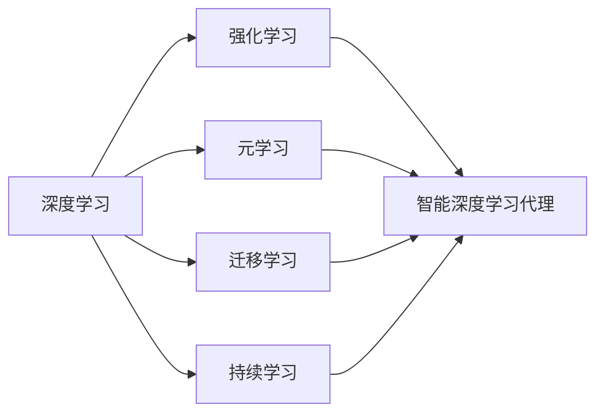

# AI人工智能深度学习算法：智能深度学习代理的学习与适应的算法框架

关键词：人工智能、深度学习、智能代理、强化学习、元学习、迁移学习、持续学习

## 1. 背景介绍

### 1.1 问题的由来

随着人工智能技术的快速发展,传统的深度学习算法在处理复杂任务和动态环境时逐渐暴露出一些局限性。固定的模型结构和训练范式难以适应不断变化的需求和场景。因此,如何设计一种能够自主学习、持续进化、灵活适应的智能深度学习代理,成为了人工智能领域亟待解决的关键问题之一。

### 1.2 研究现状

目前,学术界和工业界都在积极探索智能深度学习代理的实现途径。强化学习、元学习、迁移学习、持续学习等前沿技术受到广泛关注,并在智能代理的构建中得到应用。一些代表性的研究成果包括 DeepMind 的 AlphaGo 系列算法、OpenAI 的 GPT 语言模型、谷歌的 AutoML 等。这些工作在特定领域取得了瞩目的进展,但在通用智能和自主学习方面还有很大的提升空间。

### 1.3 研究意义

研究智能深度学习代理的学习与适应算法,对于推动人工智能从"弱人工智能"向"强人工智能"演进具有重要意义。一方面,它有助于突破传统深度学习的瓶颈,实现更加灵活、高效、鲁棒的智能系统;另一方面,它为探索类人的学习和思维机制提供了新的视角和途径,加深了我们对智能本质的理解。同时,智能代理技术在智慧城市、自动驾驶、智能制造等领域也有广阔的应用前景。

### 1.4 本文结构

本文将围绕智能深度学习代理的学习与适应算法展开深入探讨。第2部分介绍相关的核心概念;第3部分阐述算法原理和操作步骤;第4部分建立数学模型并给出公式推导;第5部分通过代码实例说明算法的具体实现;第6部分分析实际应用场景;第7部分推荐相关工具和资源;第8部分总结全文并展望未来;第9部分列举常见问题与解答。

## 2. 核心概念与联系

智能深度学习代理涉及多个前沿的人工智能概念和技术,主要包括:

- 深度学习(Deep Learning):一种基于多层神经网络的机器学习方法,能够从海量数据中自动提取高层特征。它为智能代理的感知、决策等核心模块提供了有力支撑。

- 强化学习(Reinforcement Learning):一种试错式学习范式,通过智能体与环境的交互获得奖励反馈,不断优化策略以最大化长期回报。它赋予了智能代理自主学习和适应环境的能力。

- 元学习(Meta Learning):又称"学会学习",旨在学习一种通用的学习算法,使智能体能够快速适应新的任务和环境。元学习增强了智能代理的泛化和迁移能力。

- 迁移学习(Transfer Learning):将已学习的知识迁移到新的相关任务中,避免从头开始训练。迁移学习提高了智能代理的学习效率和鲁棒性。

- 持续学习(Continual Learning):在连续的任务或数据流中不断学习和积累知识,同时克服灾难性遗忘问题。持续学习使智能代理具备终身学习的能力。

这些概念相互交织,构成了智能深度学习代理的理论和技术基础。深度学习为感知和建模奠定基础,强化学习实现策略的自主优化,元学习和迁移学习提升泛化和适应能力,持续学习支持知识的持续积累和演化。它们协同作用,共同推动智能代理的学习和进化。

## 3. 核心算法原理 & 具体操作步骤

### 3.1 算法原理概述

智能深度学习代理的核心算法融合了深度学习和强化学习,并引入元学习、迁移学习、持续学习等机制,以实现自主学习和适应。其基本原理可概括为:通过深度神经网络对环境进行建模和抽象,生成状态表征;基于状态采取行动,获得环境反馈,形成轨迹数据;利用强化学习算法优化策略网络,使长期累积奖励最大化;在学习过程中,利用元学习调整优化算法,实现快速适应;同时,采用迁移学习和持续学习,在不同任务间复用知识,连续积累和更新经验。

### 3.2 算法步骤详解

1. 环境建模:利用深度神经网络(如 CNN、RNN)对原始的观测数据(如图像、文本)进行特征提取和抽象,生成紧凑的状态表征向量。

2. 策略生成:根据当前状态,通过另一个深度神经网络(策略网络)生成动作概率分布,并根据分布采样得到具体动作。

3. 环境交互:智能体执行动作,环境根据动作转移到下一个状态,并返回即时奖励。重复多次交互,得到轨迹数据(状态-动作-奖励序列)。

4. 策略优化:采用策略梯度等强化学习算法,根据轨迹数据计算梯度,通过反向传播更新策略网络参数,提升策略的期望长期回报。

5. 元学习更新:在策略优化过程中,同时调整学习率、优化器超参数等,使智能体能够快速适应新的任务和环境变化。常用的元学习算法包括 MAML、Reptile 等。

6. 知识迁移:在不同但相关的任务之间,复用已学习的特征提取器、策略网络结构,减少冷启动所需的数据量和训练时间。

7. 持续学习:在连续的任务流或数据流中,增量式地学习和整合新知识,同时通过正则化、记忆回放等方法缓解灾难性遗忘。

8. 模型评估:在新的任务或环境中评测智能体的表现,分析泛化和适应能力,并据此改进元学习和迁移学习策略。

以上步骤循环迭代,使智能代理不断学习、优化、进化,逐步提升在复杂环境中的决策和适应能力。

### 3.3 算法优缺点

优点:
- 端到端的学习范式,无需人工设计特征和规则,自动从数据中提取知识。
- 强化学习使智能体能够通过试错不断优化策略,具有自主学习能力。
- 元学习和迁移学习提升了智能体的泛化和适应能力,加速了学习进程。
- 持续学习支持在连续数据流中不断积累和更新知识,实现持续进化。

缺点:
- 深度强化学习通常需要大量的交互数据和训练时间,样本效率较低。
- 元学习和迁移学习在任务差异较大时效果有限,泛化能力有待提高。
- 持续学习中的灾难性遗忘问题尚未完全解决,长期记忆机制有待完善。
- 算法的可解释性和可控性相对较弱,存在一定的安全隐患。

### 3.4 算法应用领域

智能深度学习代理的学习与适应算法可应用于多个领域,包括:

- 智能游戏 AI:通过自主学习和适应,创造更加智能、合理的游戏 NPC 和对战策略。
- 自动驾驶:学习驾驶策略,适应复杂多变的道路环境,提高自动驾驶的安全性和鲁棒性。
- 智能推荐:根据用户行为和反馈持续优化推荐策略,提供个性化的内容和服务。
- 智能客服:通过多轮对话学习用户意图,自主生成恰当的回复,改善用户体验。
- 智能制造:学习生产调度和设备控制策略,动态适应工况变化,提高生产效率和产品质量。

## 4. 数学模型和公式 & 详细讲解 & 举例说明

### 4.1 数学模型构建

我们以马尔可夫决策过程(MDP)为基础,构建智能深度学习代理的数学模型。一个 MDP 由以下元素组成:

- 状态空间 $\mathcal{S}$:所有可能的状态集合。
- 动作空间 $\mathcal{A}$:所有可能的动作集合。
- 转移概率 $\mathcal{P}(s'|s,a)$:在状态 $s$ 下执行动作 $a$ 后转移到状态 $s'$ 的概率。
- 奖励函数 $\mathcal{R}(s,a)$:在状态 $s$ 下执行动作 $a$ 获得的即时奖励。
- 折扣因子 $\gamma \in [0,1]$:未来奖励的折扣系数,用于平衡即时奖励和长期奖励。

智能体的目标是学习一个策略 $\pi(a|s)$,使得在状态 $s$ 下选择动作 $a$ 的概率最大化期望累积奖励:

$$J(\pi) = \mathbb{E}_{\tau \sim \pi}[\sum_{t=0}^{\infty} \gamma^t \mathcal{R}(s_t,a_t)]$$

其中,$\tau$ 表示一条轨迹 $(s_0,a_0,s_1,a_1,...)$,$t$ 为时间步。

### 4.2 公式推导过程

为了优化策略,我们采用策略梯度算法。根据策略梯度定理,策略 $\pi_{\theta}$ 关于参数 $\theta$ 的梯度为:

$$\nabla_{\theta} J(\pi_{\theta}) = \mathbb{E}_{\tau \sim \pi_{\theta}}[\sum_{t=0}^{\infty} \nabla_{\theta} \log \pi_{\theta}(a_t|s_t) Q^{\pi_{\theta}}(s_t,a_t)]$$

其中,$Q^{\pi_{\theta}}(s_t,a_t)$ 为状态-动作值函数,表示在状态 $s_t$ 下执行动作 $a_t$ 并继续遵循策略 $\pi_{\theta}$ 的期望累积奖励:

$$Q^{\pi_{\theta}}(s_t,a_t) = \mathbb{E}_{\tau \sim \pi_{\theta}}[\sum_{k=0}^{\infty} \gamma^k \mathcal{R}(s_{t+k},a_{t+k})]$$

在实际应用中,我们通过蒙特卡洛估计来近似梯度:

$$\nabla_{\theta} J(\pi_{\theta}) \approx \frac{1}{N} \sum_{i=1}^N \sum_{t=0}^{T} \nabla_{\theta} \log \pi_{\theta}(a_{i,t}|s_{i,t}) \hat{Q}_{i,t}$$

其中,$N$ 为采样的轨迹数量,$T$ 为每条轨迹的长度,$\hat{Q}_{i,t}$ 为第 $i$ 条轨迹第 $t$ 步的累积奖励估计:

$$\hat{Q}_{i,t} = \sum_{k=t}^{T} \gamma^{k-t} \mathcal{R}(s_{i,k},a_{i,k})$$

根据梯度估计,我们可以使用随机梯度上升来更新策略网络参数:

$$\theta \leftarrow \theta + \alpha \nabla_{\theta} J(\pi_{\theta})$$

其中,$\alpha$ 为学习率。

### 4.3 案例分析与讲解

我们以 CartPole 平衡杆游戏为例,说明如何应用智能深度学习代理的算法。

在 CartPole 游戏中,一根杆子通过一个关节连接在一个小车上,小车可以在一个轨道上左右移动。游戏开始时,杆子是垂直平衡的。智能体的任务是通过左右移动小车,使杆子尽可能长时间地保持平衡状态。

我们将游戏环境建模为一个 MDP:
- 状态 $s$:小车位置、速度,杆子角度、角速度。
- 动作 $a$:向左或向右推动小车。
- 奖励 $r