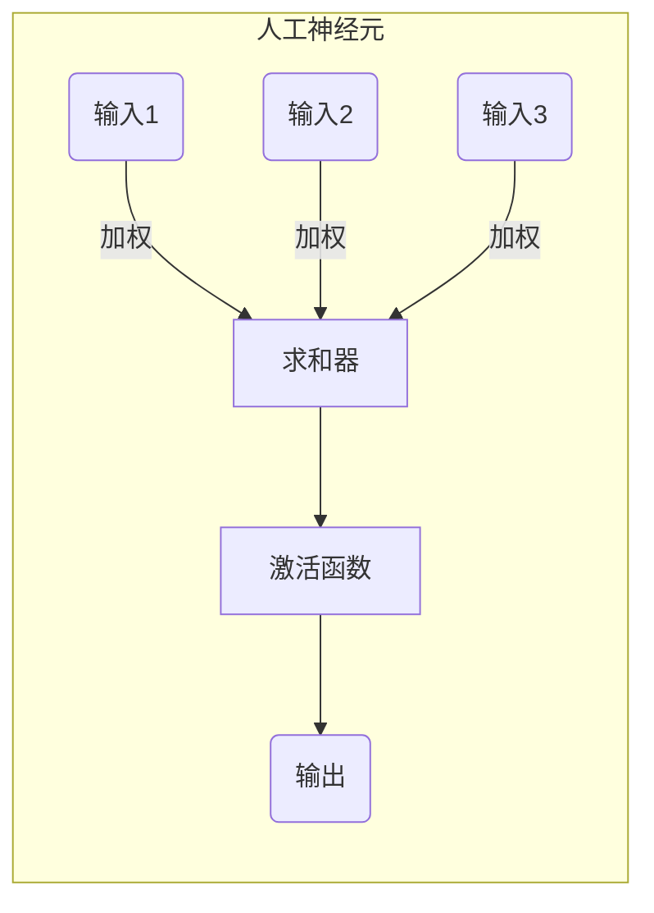

# AI人工智能深度学习算法：神经网络的复杂性与能力

## 1. 背景介绍

### 1.1 问题的由来

人工智能的发展历经多个阶段,从早期的专家系统到现代的深度学习,其核心一直是模拟人类大脑的信息处理能力。神经网络作为深度学习的基础模型,其灵感来源于生物神经系统的工作原理,旨在通过构建数学模型来模拟神经元之间的连接和信息传递过程。

随着数据量的激增和计算能力的提高,深度神经网络展现出了强大的模式识别和预测能力,在计算机视觉、自然语言处理、推荐系统等领域取得了令人瞩目的成就。然而,神经网络的内部机理仍然存在诸多未解之谜,它们的复杂性和"黑箱"特性使得可解释性和可靠性成为了亟待解决的问题。

### 1.2 研究现状

近年来,神经网络的可解释性和可靠性受到了广泛关注。研究人员通过多种方法试图揭示神经网络内部的工作机制,例如:

1. **可视化技术**: 通过可视化神经元激活模式和特征图,帮助理解神经网络如何捕捉和表示输入数据的不同特征。
2. **注意力机制**: 引入注意力机制,使神经网络能够自适应地关注输入数据的不同部分,从而提高模型的可解释性。
3. **神经网络压缩**: 通过剪枝、量化等技术,减小神经网络的规模和复杂度,提高其可解释性和效率。
4. **符号推理与神经网络融合**: 将符号推理与神经网络相结合,试图构建具有更强解释能力的混合智能系统。

然而,这些方法仍然存在一定局限性,无法完全揭示神经网络的内在复杂性和决策过程。

### 1.3 研究意义

深入理解神经网络的复杂性和能力,对于提高人工智能系统的可靠性、安全性和可解释性至关重要。只有充分认识到神经网络的局限性和潜在风险,我们才能更好地利用它们的强大功能,并采取必要的措施来确保其安全和可控。

此外,揭示神经网络内部机理的研究,也将为设计新型神经网络架构、改进训练算法等提供理论基础和实践指导,推动人工智能技术的持续创新和发展。

### 1.4 本文结构

本文将从以下几个方面深入探讨神经网络的复杂性和能力:

1. 介绍神经网络的核心概念和基本原理,阐述其与生物神经系统的联系。
2. 详细分析神经网络的核心算法原理,包括前向传播、反向传播等,并讨论其优缺点和应用领域。
3. 构建数学模型,推导神经网络的核心公式,并通过案例分析加深理解。
4. 提供实际代码实现,展示神经网络模型的训练和预测过程,并对代码进行解读和分析。
5. 探讨神经网络在各个领域的应用场景,并展望其未来发展方向。
6. 介绍相关的学习资源、开发工具和论文,为读者提供进一步学习和研究的参考。
7. 总结神经网络的研究成果,分析其面临的挑战,并对未来的发展趋势进行展望。
8. 附录部分回答一些常见的问题,帮助读者更好地理解和掌握神经网络。

## 2. 核心概念与联系

神经网络是一种受生物神经系统启发而设计的数学模型,旨在模拟人脑的信息处理过程。它由大量互连的节点(神经元)组成,这些节点通过加权连接进行信息传递和处理。

神经网络的基本单元是人工神经元,它接收来自其他神经元或外部输入的信号,对这些信号进行加权求和,然后通过一个激活函数产生输出信号,传递给下一层神经元或作为最终输出。

神经网络通过组合大量这样的人工神经元,形成复杂的网络结构。根据神经元的连接方式和层次排列,神经网络可以分为多种类型,如前馈神经网络、卷积神经网络、递归神经网络等。

神经网络的训练过程是通过调整神经元之间连接的权重来实现的,目标是使网络能够从训练数据中学习到潜在的模式和规律。常用的训练算法包括反向传播算法、优化算法(如梯度下降)等。

神经网络与生物神经系统存在一些相似之处,例如:

1. **分层结构**: 神经网络通常由多层神经元组成,类似于生物神经系统的分层结构。
2. **连接权重**: 神经元之间的连接权重类似于生物神经元之间的突触强度。
3. **激活函数**: 激活函数模拟了生物神经元的兴奋性和阈值特性。
4. **学习能力**: 神经网络通过训练数据进行学习,类似于生物神经系统通过经验进行学习和适应。

然而,神经网络也存在一些显著的区别和局限性,例如:

1. **简化模型**: 神经网络是对生物神经系统的极度简化,忽略了许多复杂的生物学细节。
2. **静态结构**: 神经网络的结构通常是固定的,而生物神经系统具有动态重构和可塑性。
3. **局部连接**: 神经网络中的神经元通常只与相邻层的神经元连接,而生物神经系统具有更加复杂的全局连接。
4. **离散更新**: 神经网络的更新是离散的,而生物神经系统的信息传递是连续的。

尽管存在这些差异,神经网络仍然是模拟人脑信息处理能力的有效工具,并在多个领域取得了卓越的成就。随着研究的不断深入,我们对神经网络的理解将不断加深,从而有望设计出更加先进和人性化的人工智能系统。

## 3. 核心算法原理与具体操作步骤

### 3.1 算法原理概述

神经网络的核心算法原理包括前向传播和反向传播两个阶段。

**前向传播**是指将输入数据通过神经网络层层传递,得到最终的输出。在这个过程中,每个神经元根据其输入和连接权重,计算加权和,并通过激活函数产生输出,传递给下一层神经元。

**反向传播**则是根据输出与期望值之间的误差,计算每个神经元对该误差的贡献,并相应地调整连接权重,使得网络能够逐步减小误差,提高预测精度。这个过程从输出层开始,沿着网络反向传播,更新每个神经元的权重。

通过不断地前向传播和反向传播,神经网络可以逐步学习到输入数据与期望输出之间的映射关系,从而实现模式识别、预测等任务。

### 3.2 算法步骤详解

1. **初始化**:
   - 根据神经网络的结构,随机初始化每个神经元之间的连接权重。
   - 设置超参数,如学习率、批量大小等。

2. **前向传播**:
   - 将输入数据传递给输入层。
   - 对于每一层的每个神经元:
     - 计算加权和: $\sum_{i} w_i x_i + b$,其中 $w_i$ 是连接权重, $x_i$ 是上一层神经元的输出, $b$ 是偏置项。
     - 通过激活函数(如 Sigmoid、ReLU 等)计算输出: $y = f(\sum_{i} w_i x_i + b)$。
     - 将输出传递给下一层的神经元。
   - 得到输出层的输出,即网络的最终预测结果。

3. **计算损失**:
   - 根据预测结果和期望输出,计算损失函数的值,如均方误差、交叉熵等。

4. **反向传播**:
   - 从输出层开始,计算每个神经元对损失函数的梯度。
   - 对于每一层的每个神经元:
     - 计算输出误差项: $\delta_j = \frac{\partial L}{\partial y_j}$,其中 $L$ 是损失函数, $y_j$ 是该神经元的输出。
     - 计算权重梯度: $\frac{\partial L}{\partial w_{ij}} = \delta_j x_i$,其中 $x_i$ 是上一层神经元的输出。
     - 计算偏置梯度: $\frac{\partial L}{\partial b_j} = \delta_j$。
     - 将误差项传递给上一层: $\delta_i = \frac{\partial L}{\partial x_i} = \sum_j \frac{\partial L}{\partial y_j} \frac{\partial y_j}{\partial x_i} = \sum_j \delta_j w_{ij}$。

5. **更新权重**:
   - 使用优化算法(如梯度下降)根据梯度更新每个连接权重: $w_{ij} = w_{ij} - \eta \frac{\partial L}{\partial w_{ij}}$,其中 $\eta$ 是学习率。
   - 更新偏置项: $b_j = b_j - \eta \frac{\partial L}{\partial b_j}$。

6. **重复步骤 2-5**,直到满足停止条件(如最大迭代次数、损失函数收敛等)。

通过上述算法,神经网络可以逐步调整连接权重,使得输出结果逐渐接近期望值,从而实现对输入数据的学习和预测。

### 3.3 算法优缺点

**优点**:

1. **强大的拟合能力**: 神经网络具有非线性映射能力,可以拟合任意复杂的函数,解决非线性问题。
2. **并行处理**: 神经网络的结构天然支持并行计算,可以利用GPU等硬件加速训练和推理过程。
3. **泛化能力**: 经过适当的正则化,神经网络可以在训练数据有限的情况下,对未见过的新数据进行有效的推广。
4. **端到端学习**: 神经网络可以直接从原始数据中自动学习特征表示,无需人工设计特征。

**缺点**:

1. **黑箱性质**: 神经网络的内部机理复杂,难以解释其决策过程,缺乏可解释性。
2. **数据饥渴**: 训练高质量的神经网络通常需要大量的标注数据,获取和标注数据的成本高昂。
3. **过拟合风险**: 神经网络容易过度拟合训练数据,导致在新数据上的泛化能力下降。
4. **敏感的超参数**: 神经网络的性能高度依赖于超参数(如学习率、正则化强度等)的选择,需要大量的调参工作。

### 3.4 算法应用领域

神经网络由于其强大的模式识别和预测能力,在多个领域得到了广泛应用:

1. **计算机视觉**: 卷积神经网络在图像分类、目标检测、语义分割等视觉任务中表现出色。
2. **自然语言处理**: 递归神经网络、transformer等模型在机器翻译、文本生成、情感分析等任务中发挥重要作用。
3. **推荐系统**: 神经网络可以学习用户偏好和物品特征,为用户提供个性化推荐。
4. **金融预测**: 神经网络可以捕捉复杂的金融时间序列模式,用于股票预测、风险评估等。
5. **医疗诊断**: 神经网络可以从医学影像数据中学习特征,辅助疾病诊断和治疗方案制定。
6. **语音识别**: 神经网络在语音信号处理和语音识别领域取得了突破性进展。
7. **游戏AI**: 深度强化学习算法基于神经网络,在棋类游戏、视频游戏等领域展现出超人的表现。

随着算法和硬件的不断发展,神经网络的应用范围将越来越广泛,在更多领域发挥重要作用。

## 4. 数学模型和公式详细讲解与举