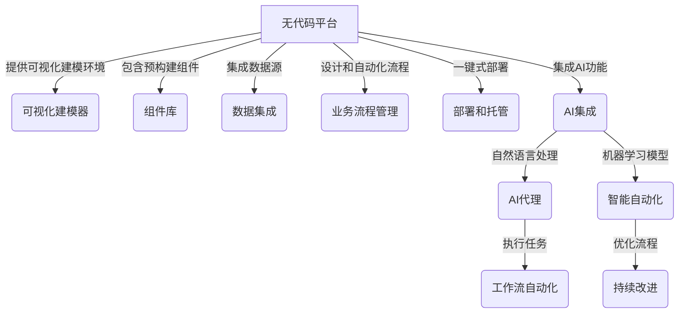

以下是标题为《AI代理工作流便捷性：无代码平台的应用前景》的技术博客文章正文内容：

# AI代理工作流便捷性：无代码平台的应用前景

## 1. 背景介绍

### 1.1 问题的由来

在当今快节奏的数字时代,企业和组织面临着不断增长的需求,需要快速构建和部署各种应用程序和工作流程来支持业务运营。然而,传统的软件开发过程往往耗时耗力,需要大量的人力和资源投入。这给企业带来了巨大的挑战,迫使它们寻求更加高效和经济的解决方案。

无代码平台(No-Code Platforms)的出现为解决这一问题提供了一种创新的方法。无代码平台允许用户使用可视化工具和拖放界面构建应用程序和工作流程,而无需编写任何代码。这种方法大大降低了开发的复杂性,缩短了上市时间,并使非技术人员也能参与到应用程序构建过程中。

### 1.2 研究现状

近年来,无代码平台的发展取得了长足进步。越来越多的企业和组织开始采用无代码平台来加速应用程序开发,提高效率和灵活性。然而,尽管无代码平台提供了许多优势,但它们也面临着一些挑战和限制。

一个主要挑战是无代码平台通常缺乏定制化和扩展性。由于它们依赖于预构建的组件和模板,因此可能难以满足特定的业务需求或复杂的用例。此外,无代码平台可能会产生供应商锁定的风险,使组织难以在不同平台之间迁移应用程序。

另一个挑战是无代码平台可能会限制应用程序的性能和可扩展性。由于缺乏对底层代码的控制,无代码应用程序可能无法达到与传统编码应用程序相同的性能水平。

### 1.3 研究意义

尽管存在上述挑战,无代码平台仍然具有巨大的潜力,可以彻底改变企业和组织构建和部署应用程序的方式。通过降低开发复杂性和成本,无代码平台可以使更多的人参与到应用程序构建过程中,促进创新和提高生产力。

本文旨在探讨无代码平台在企业中的应用前景,特别关注AI代理工作流的便捷性。我们将深入研究无代码平台的核心概念和原理,分析其优缺点,并探讨如何将其与AI技术相结合,以进一步提高工作流程的自动化和智能化水平。

### 1.4 本文结构

本文将按以下结构展开:

1. 背景介绍
2. 核心概念与联系
3. 核心算法原理与具体操作步骤
4. 数学模型和公式详细讲解与举例说明
5. 项目实践:代码实例和详细解释说明
6. 实际应用场景
7. 工具和资源推荐
8. 总结:未来发展趋势与挑战
9. 附录:常见问题与解答

## 2. 核心概念与联系

无代码平台是一种基于可视化开发环境的应用程序构建解决方案。它允许用户使用拖放界面和预构建的组件来创建应用程序,而无需编写任何代码。这种方法大大降低了开发的复杂性,使非技术人员也能参与到应用程序构建过程中。

无代码平台通常包括以下核心概念和组件:

1. **可视化建模器(Visual Modeler)**: 这是无代码平台的核心组件,提供了一个拖放式的界面,允许用户通过拖放预构建的组件来设计和构建应用程序的用户界面、数据模型和业务逻辑。

2. **组件库(Component Library)**: 无代码平台通常包含一个预构建的组件库,其中包含各种UI元素(如按钮、表单、图表等)、数据连接器、业务逻辑模块等。用户可以从这个库中选择并组合不同的组件来构建应用程序。

3. **数据集成(Data Integration)**: 无代码平台通常提供了与各种数据源(如数据库、Web服务、云存储等)集成的功能,允许用户轻松访问和操作数据。

4. **业务流程管理(Business Process Management)**: 许多无代码平台包括了业务流程管理(BPM)功能,允许用户设计和自动化各种业务流程和工作流程。

5. **部署和托管(Deployment and Hosting)**: 无代码平台通常提供了一键式部署和托管功能,使用户可以轻松地将构建的应用程序部署到云或本地环境中。

6. **AI集成(AI Integration)**: 最新的无代码平台开始与AI技术相结合,引入了各种AI功能,如自然语言处理、机器学习模型等,以提高应用程序的智能化水平。

无代码平台与AI代理工作流的结合,可以进一步提高工作流程的自动化和智能化水平。AI代理可以通过自然语言处理和机器学习技术来理解和执行各种任务,而无代码平台则提供了一种快速构建和部署这些AI代理的方式。

通过将AI代理与无代码平台相结合,企业和组织可以更加高效地自动化各种重复性任务和流程,提高生产力和效率。同时,AI代理还可以通过持续学习和优化来不断改进工作流程,实现真正的智能自动化。

## 3. 核心算法原理与具体操作步骤

### 3.1 算法原理概述

无代码平台的核心算法原理是基于模型驱动的方法(Model-Driven Approach)。这种方法将应用程序的各个层面(如用户界面、数据模型、业务逻辑等)抽象为可视化模型,并通过这些模型来生成最终的应用程序代码。

无代码平台通常采用以下步骤来构建应用程序:

1. **模型设计**: 用户通过可视化建模器设计应用程序的各个模型,包括用户界面模型、数据模型、业务逻辑模型等。

2. **模型转换**: 无代码平台将用户设计的模型转换为底层的应用程序代码或配置文件。

3. **代码生成**: 基于转换后的模型,无代码平台生成最终的应用程序代码或配置文件。

4. **部署和运行**: 生成的应用程序代码或配置文件被部署到目标环境中运行。

这种模型驱动的方法使得无代码平台能够自动化应用程序构建的整个过程,从而大大提高了开发效率和灵活性。同时,由于模型和代码之间存在明确的映射关系,因此无代码平台也能够支持应用程序的维护和升级。

### 3.2 算法步骤详解

无代码平台的核心算法可以分为以下几个主要步骤:

1. **模型解析**: 无代码平台首先需要解析用户通过可视化建模器设计的模型。这通常涉及到解析模型的结构和元素,并将其转换为内部表示形式。

2. **模型验证**: 在生成代码之前,无代码平台需要验证模型的完整性和正确性。这可能包括检查模型中是否存在缺失或冲突的元素,以及验证模型是否符合预定义的规则和约束。

3. **模型转换**: 经过验证的模型需要转换为底层的代码或配置文件。这通常涉及到将模型元素映射到相应的代码构造,并生成相应的代码片段。

4. **代码组装**: 转换后的代码片段需要组装成完整的应用程序代码或配置文件。这可能需要处理代码之间的依赖关系,以及插入必要的框架代码或库。

5. **代码优化**: 为了提高生成代码的性能和质量,无代码平台可能会对生成的代码进行优化,如删除冗余代码、重构代码结构等。

6. **部署和运行**: 最后,生成的应用程序代码或配置文件被打包并部署到目标环境中运行。

在整个过程中,无代码平台还需要处理各种边缘情况和错误,并提供相应的错误处理和日志记录机制。

### 3.3 算法优缺点

无代码平台的核心算法具有以下优点:

1. **提高开发效率**: 通过可视化建模和自动代码生成,无代码平台大大加快了应用程序的构建速度,缩短了上市时间。

2. **降低复杂性**: 无代码平台隐藏了底层代码的复杂性,使非技术人员也能参与到应用程序构建过程中。

3. **提高一致性**: 由于模型和代码之间存在明确的映射关系,无代码平台可以确保应用程序的一致性和可维护性。

4. **支持迭代开发**: 无代码平台支持快速迭代和原型开发,使得应用程序可以根据需求的变化快速进行调整和更新。

然而,无代码平台的核心算法也存在一些缺点:

1. **定制化和扩展性有限**: 由于依赖于预构建的组件和模板,无代码平台可能难以满足特定的业务需求或复杂的用例。

2. **性能和可扩展性受限**: 由于缺乏对底层代码的控制,无代码应用程序可能无法达到与传统编码应用程序相同的性能水平。

3. **供应商锁定风险**: 无代码平台可能会产生供应商锁定的风险,使组织难以在不同平台之间迁移应用程序。

4. **安全性和隐私问题**: 无代码平台可能会引入一些安全性和隐私问题,如数据泄露、漏洞利用等,需要采取适当的安全措施。

### 3.4 算法应用领域

无代码平台的核心算法可以应用于各种领域,包括但不限于:

1. **企业应用程序开发**: 无代码平台可以用于快速构建各种企业应用程序,如客户关系管理(CRM)系统、供应链管理系统、人力资源管理系统等。

2. **移动应用程序开发**: 无代码平台可以用于构建跨平台的移动应用程序,支持iOS、Android等多种平台。

3. **Web应用程序开发**: 无代码平台可以用于构建各种Web应用程序,如电子商务网站、内容管理系统、社交网络等。

4. **物联网(IoT)应用程序开发**: 无代码平台可以用于构建物联网应用程序,连接和管理各种物联网设备。

5. **业务流程自动化**: 无代码平台可以用于设计和自动化各种业务流程和工作流程,提高效率和生产力。

6. **低代码开发**: 无代码平台也可以与低代码开发相结合,提供更高级别的定制化和扩展性。

总的来说,无代码平台的核心算法为各种应用程序的快速构建和部署提供了一种高效的解决方案,适用于广泛的领域和场景。

## 4. 数学模型和公式详细讲解与举例说明

### 4.1 数学模型构建

无代码平台的核心算法可以建模为一个函数映射过程,将用户设计的模型转换为最终的应用程序代码或配置文件。我们可以将这个过程表示为以下数学模型:

$$
f: M \rightarrow C
$$

其中:

- $M$ 表示用户设计的模型集合,包括用户界面模型、数据模型、业务逻辑模型等。
- $C$ 表示生成的应用程序代码或配置文件集合。
- $f$ 是一个函数,将模型集合 $M$ 映射到代码或配置文件集合 $C$。

这个函数 $f$ 可以进一步分解为多个子函数,分别对应无代码平台算法的不同