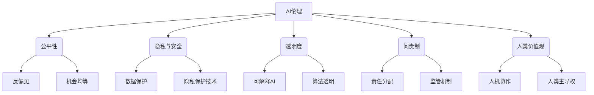

# AI伦理 原理与代码实例讲解

## 1. 背景介绍

### 1.1 问题的由来

随着人工智能(AI)技术的快速发展和广泛应用,AI系统对我们的生活产生了深远影响。然而,AI系统的设计和使用也带来了一些令人担忧的伦理问题,如隐私保护、公平性、透明度和问责制等。这些问题引发了社会对AI伦理的广泛关注和讨论。

AI系统通常是基于大量数据进行训练和优化,但这些数据可能存在隐含的偏见和歧视,导致AI系统在决策过程中表现出不公平。此外,AI系统的"黑箱"特性使其难以解释和理解,缺乏透明度,这可能会引发用户的不信任和担忧。

此外,AI系统的决策和行为可能会对个人和社会产生重大影响,但目前缺乏明确的问责机制来规范AI系统的开发和使用。这些问题凸显了制定AI伦理准则和规范的紧迫性。

### 1.2 研究现状

近年来,AI伦理已成为学术界和产业界的热门研究领域。许多组织和机构已经提出了AI伦理原则和指南,如欧盟的"可信赖AI伦理准则"、IEEE的"AI系统伦理原则"等。这些原则旨在为AI系统的开发和使用提供伦理指导。

然而,将这些抽象的伦理原则转化为具体的技术实践和解决方案仍然是一个巨大的挑战。目前,研究人员正在探索各种技术方法来解决AI伦理问题,如公平机器学习、可解释AI、隐私保护技术等。但这些方法还处于初级阶段,需要进一步完善和发展。

### 1.3 研究意义

解决AI伦理问题对于促进AI技术的可持续发展和社会接受度至关重要。通过研究和实践AI伦理原则,我们可以:

1. 提高AI系统的公平性和透明度,减少歧视和偏见,增强用户对AI系统的信任。
2. 保护个人隐私和数据安全,遵守相关法律法规。
3. 明确AI系统开发和使用的责任归属,建立问责机制。
4. 促进AI技术的负责任发展,实现人类和AI的共同繁荣。

总的来说,AI伦理研究有助于构建一个更加公平、透明、可信赖的AI生态系统,确保AI技术的发展符合人类的价值观和伦理准则。

### 1.4 本文结构

本文将从以下几个方面深入探讨AI伦理的原理和实践:

1. 介绍AI伦理的核心概念和原则,阐述它们之间的关系。
2. 详细解释AI伦理中的核心算法原理和具体操作步骤。
3. 建立数学模型,推导相关公式,并通过案例分析进行详细讲解。
4. 提供代码实例,并对其进行详细解释和分析。
5. 探讨AI伦理在实际应用场景中的作用和影响。
6. 推荐相关学习资源、开发工具和论文等。
7. 总结AI伦理的未来发展趋势和面临的挑战。

通过全面而深入的分析,本文旨在为读者提供对AI伦理原理和实践的深刻理解。

## 2. 核心概念与联系

AI伦理涉及多个核心概念,这些概念相互关联,构成了AI伦理的理论基础。以下是一些关键概念及其联系:

1. **公平性(Fairness)**: 确保AI系统在决策过程中不存在任何形式的歧视或偏见,为所有个体提供公平的机会。公平性包括反偏见和机会均等两个方面。

2. **隐私与安全(Privacy & Security)**: 保护个人隐私和数据安全是AI伦理的重要原则。这包括数据保护措施和隐私保护技术的应用。

3. **透明度(Transparency)**: AI系统应该具有可解释性和算法透明度,让用户了解其内部工作原理和决策过程。这有助于增强用户对AI系统的信任。

4. **问责制(Accountability)**: 明确AI系统开发和使用过程中的责任归属,建立相应的监管机制和问责制度。

5. **人类价值观(Human Values)**: AI系统的设计和使用应该符合人类的价值观和伦理准则,实现人机协作,确保人类对AI的主导权。

这些核心概念相互关联,共同构成了AI伦理的理论框架。在实践中,我们需要平衡和协调这些概念之间的关系,以实现AI系统的伦理和负责任的发展。

## 3. 核心算法原理 & 具体操作步骤

### 3.1 算法原理概述

为了解决AI伦理中的公平性、隐私保护和可解释性等问题,研究人员提出了多种算法和技术方法。这些算法的核心原理包括:

1. **公平机器学习(Fair Machine Learning)**: 通过对训练数据进行去偏差处理、修改模型目标函数或约束条件等方式,减少机器学习模型中的偏见和歧视。

2. **差分隐私(Differential Privacy)**: 在数据处理过程中添加噪声,使得单个记录的存在或缺失对最终结果的影响很小,从而保护个人隐私。

3. **可解释AI(Explainable AI)**: 开发可解释的机器学习模型,使模型的决策过程和推理逻辑对人类可解释和理解。常用方法包括特征重要性分析、模型可视化等。

4. **联邦学习(Federated Learning)**: 在不集中存储个人数据的情况下,通过协作式训练实现机器学习模型的优化,保护数据隐私。

这些算法原理为解决AI伦理问题提供了技术基础,但将它们应用于实践仍需要具体的操作步骤和方法。

### 3.2 算法步骤详解

以公平机器学习算法为例,其典型的操作步骤如下:

1. **数据审计**: 对训练数据进行审计,识别潜在的偏见和歧视因素。常用方法包括统计测试、可视化分析等。

2. **数据预处理**: 根据审计结果,对训练数据进行去偏差处理,如重新采样、特征转换等。

3. **算法选择**: 选择适合的公平机器学习算法,如预测后校准、adversarial debiasing等。

4. **模型训练**: 将去偏差后的数据输入公平机器学习算法,训练模型。

5. **公平性评估**: 使用公平性指标(如统计率差异、等式得分等)评估模型的公平性表现。

6. **模型调优**: 根据评估结果,调整算法参数或采用其他去偏技术,重复训练和评估,直至达到满意的公平性水平。

7. **模型部署**: 将经过公平性优化的模型部署到实际应用场景中。

8. **持续监控**: 持续监控模型在实际应用中的公平性表现,必要时进行重新训练和优化。

这一系列步骤确保了机器学习模型在训练和应用过程中的公平性,但也增加了算法的复杂性和计算开销。因此,在实践中需要权衡公平性和其他因素(如模型性能、效率等)之间的平衡。

### 3.3 算法优缺点

公平机器学习等AI伦理算法具有以下优点:

1. 有助于减少AI系统中的偏见和歧视,提高决策的公平性。
2. 增强了AI系统的透明度和可解释性,提高用户的信任度。
3. 保护个人隐私和数据安全,符合相关法律法规。
4. 促进AI技术的负责任发展,实现人类和AI的共同繁荣。

然而,这些算法也存在一些缺点和挑战:

1. 算法复杂度高,计算开销大,可能影响模型的性能和效率。
2. 公平性和其他目标(如准确性、泛化能力等)之间存在权衡关系,需要进行平衡。
3. 缺乏统一的公平性定义和评估标准,不同算法和应用场景可能有不同的公平性要求。
4. 一些算法(如差分隐私)可能会引入噪声,影响模型的准确性。
5. 算法的有效性和可靠性需要在实际应用中进一步验证和优化。

因此,在应用AI伦理算法时,需要全面考虑其优缺点,根据具体场景选择合适的算法和参数设置,并进行持续的监控和优化。

### 3.4 算法应用领域

AI伦理算法可以应用于多个领域,以解决不同类型的伦理问题:

1. **金融领域**: 在贷款审批、保险定价等场景中,公平机器学习算法可以减少基于种族、性别等因素的歧视。

2. **人力资源领域**: 在招聘、晋升等过程中,公平机器学习算法可以确保机会均等,避免偏见和歧视。

3. **医疗健康领域**: 在疾病诊断、治疗方案制定等场景中,公平机器学习算法可以消除基于年龄、种族等因素的偏见,提供公平的医疗服务。

4. **司法领域**: 在量刑、假释等决策中,公平机器学习算法可以减少对特定群体的不公正对待。

5. **教育领域**: 在学生录取、成绩评估等过程中,公平机器学习算法可以消除基于社会经济地位等因素的偏见。

6. **社交媒体领域**: 在内容推荐、广告投放等场景中,公平机器学习算法可以避免算法偏见,提供公平的服务。

7. **其他领域**: AI伦理算法还可以应用于交通、零售、房地产等多个领域,解决相关的伦理问题。

总的来说,任何涉及机器学习算法的决策场景都可能存在潜在的偏见和歧视风险,因此都需要应用AI伦理算法来确保公平性和透明度。

## 4. 数学模型和公式 & 详细讲解 & 举例说明

### 4.1 数学模型构建

为了量化和优化AI系统的公平性,我们需要建立相应的数学模型。一种常用的公平性模型是基于个体公平和群体公平两个层面:

**个体公平(Individual Fairness)**:

对于任意两个相似的个体 $x_i$ 和 $x_j$,模型对它们的预测结果应该相似,即:

$$
d(x_i, x_j) \leq \tau \Rightarrow d(f(x_i), f(x_j)) \leq \epsilon
$$

其中,
- $d(x_i, x_j)$ 表示个体 $x_i$ 和 $x_j$ 之间的相似度;
- $\tau$ 是相似度阈值;
- $f(x_i)$ 和 $f(x_j)$ 分别表示模型对 $x_i$ 和 $x_j$ 的预测结果;
- $d(f(x_i), f(x_j))$ 表示预测结果之间的差异;
- $\epsilon$ 是允许的最大差异。

**群体公平(Group Fairness)**:

对于任意两个群体 $G_1$ 和 $G_2$,模型对它们的预测结果的统计量(如平均值、方差等)应该相似,即:

$$
D(P(f(X)|X \in G_1), P(f(X)|X \in G_2)) \leq \delta
$$

其中,
- $P(f(X)|X \in G_i)$ 表示群体 $G_i$ 中个体的预测结果分布;
- $D(\cdot, \cdot)$ 是两个分布之间的距离或差异度量;
- $\delta$ 是允许的最大差异。

通过优化这些公平性目标,我们可以减少模型中的偏见和歧视。但在实践中,个体公平