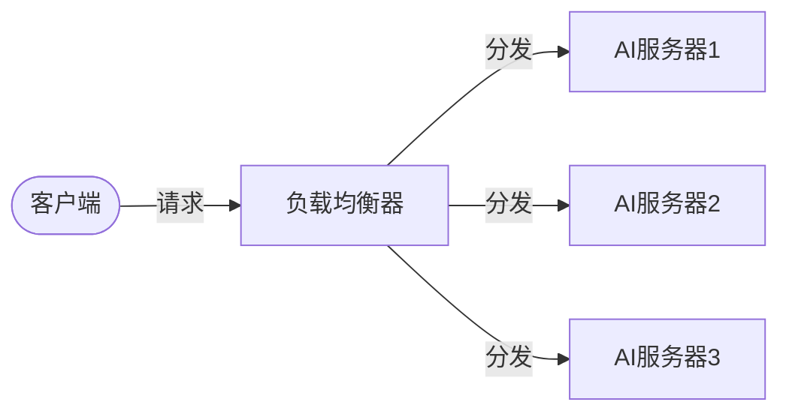

以下是《AI系统负载均衡原理与代码实战案例讲解》的文章正文:

# AI系统负载均衡原理与代码实战案例讲解

## 1. 背景介绍

### 1.1 问题的由来

在当今快速发展的数字时代,人工智能(AI)系统的应用越来越广泛,从语音助手到自动驾驶汽车,AI无处不在。随着用户数量和请求数量的急剧增加,单个AI服务器很容易达到其处理能力的极限,导致响应延迟、系统崩溃等问题。为了确保AI系统的高可用性、可扩展性和性能,有必要引入负载均衡机制来合理分配请求负载。

### 1.2 研究现状 

目前,已有多种负载均衡算法和技术用于传统的Web服务器集群,如轮询(Round Robin)、最少连接(Least Connections)、IP哈希(IP Hash)等。然而,AI系统具有其独特的特点,如计算密集型任务、异构硬件加速等,使得传统的负载均衡方案可能无法完全满足AI系统的需求。因此,开发专门针对AI系统的负载均衡解决方案就显得尤为重要。

### 1.3 研究意义

通过研究AI系统负载均衡原理并提供实战案例,可以帮助AI系统架构师和开发人员更好地理解和应用负载均衡技术,从而提高AI系统的整体性能、可靠性和可扩展性。同时,高效的负载均衡机制也有助于优化资源利用率,降低运营成本。此外,本文还将探讨AI负载均衡在不同场景下的挑战和未来发展趋势,为该领域的持续创新提供参考。

### 1.4 本文结构

本文将从以下几个方面全面介绍AI系统负载均衡:

1. 核心概念与联系
2. 核心算法原理与具体操作步骤 
3. 数学模型和公式详细讲解与案例分析
4. 项目实践:代码实例和详细解释
5. 实际应用场景分析
6. 工具和学习资源推荐
7. 未来发展趋势与挑战探讨
8. 常见问题解答

## 2. 核心概念与联系

在深入探讨AI系统负载均衡的细节之前,我们先来了解一些核心概念:

- **负载均衡器(Load Balancer)**: 一种用于分发网络流量或应用程序负载的设备或软件,通常位于客户端和服务器之间。它根据预定义的策略将传入的请求分发到一组后端服务器上。

- **AI服务集群**: 由多个AI服务器节点组成的集群,用于处理AI相关的计算密集型任务,如深度学习推理、自然语言处理等。集群中的节点可能具有不同的硬件配置(CPU、GPU等)以满足不同的计算需求。

- **负载均衡算法**: 用于确定如何在AI服务集群中分发请求的策略或规则。不同的算法考虑不同的因素,如服务器负载、网络状况、请求类型等,从而实现不同的优化目标(如最小响应时间、最大吞吐量等)。

- **会话保持(Session Persistence)**: 确保来自同一客户端的请求被路由到同一台服务器的机制。这在某些场景下很重要,如涉及状态管理的Web应用程序。

- **健康检查(Health Check)**: 负载均衡器定期检查后端服务器的运行状况,如果发现某台服务器发生故障,则将其从服务池中临时移除,从而避免将请求路由到故障节点。

- **自动扩缩容(Auto Scaling)**: 根据实际负载情况自动调整AI服务集群的大小。在高峰期可以添加更多节点来处理请求,而在空闲期则可以减少节点数量以节省资源。

上述概念相互关联,共同构建了一个完整的AI系统负载均衡解决方案。接下来,我们将深入探讨其核心算法原理和实现细节。

## 3. 核心算法原理与具体操作步骤

负载均衡算法是AI系统负载均衡解决方案的核心部分。本节将介绍几种常用的负载均衡算法,并详细阐述它们的原理、操作步骤、优缺点和适用场景。

### 3.1 算法原理概述

#### 3.1.1 轮询(Round Robin)

轮询算法是最简单也是最常见的负载均衡算法之一。它按照循环顺序将请求依次分发到每个AI服务器节点上。具有良好的负载分布性能,但无法考虑服务器的实际负载情况。

#### 3.1.2 加权轮询(Weighted Round Robin)

加权轮询是轮询算法的一种扩展,它为每个服务器分配一个权重值,具有较高权重的服务器将获得更多的请求。这种算法可以根据服务器的硬件配置(如CPU、GPU等)进行负载分配,但仍然无法实时反映服务器的动态负载变化。

#### 3.1.3 最小连接(Least Connections)

最小连接算法将请求分发给当前已建立的连接数最少的服务器。它可以较好地平衡服务器的负载,但可能会导致某些服务器长期处于高负载状态,而其他服务器则长期空闲。

#### 3.1.4 最短响应时间(Shortest Response Time)

最短响应时间算法根据服务器的实时响应时间来选择合适的目标服务器。它可以有效地将请求分发到响应最快的服务器上,从而提高整体系统的响应速度。但是,这种算法需要持续监控每个服务器的响应时间,开销较大。

#### 3.1.5 AI负载感知算法

上述算法主要考虑服务器的连接数或响应时间,但对于AI系统来说,还需要考虑服务器的实际计算负载。AI负载感知算法通过监控GPU利用率、内存使用情况等指标,将请求分发到当前负载最小的服务器上,从而充分利用硬件资源,提高整体吞吐量。

### 3.2 算法步骤详解

以下以AI负载感知算法为例,详细阐述其具体操作步骤:

1. **初始化**: 获取AI服务集群中所有服务器节点的硬件规格信息(如GPU数量、内存大小等),并为每个节点分配一个初始权重。

2. **实时监控**: 持续监控每个服务器节点的实时负载指标,包括GPU利用率、内存使用情况等。可以使用像Prometheus这样的监控工具来收集这些指标数据。

3. **动态权重调整**: 根据监控数据,动态调整每个服务器节点的权重值。例如,可以使用如下公式计算权重:

   $$
   \text{Weight}_i = \frac{1}{\alpha \times \text{GPU Utilization}_i + \beta \times \text{Memory Utilization}_i + \gamma}
   $$

   其中,\\(\alpha\\)、\\(\beta\\)、\\(\gamma\\)是可配置的参数,用于控制不同指标对权重的影响程度。权重值越大,表示该节点的可用资源越多,将获得更多的请求分配。

4. **请求分发**: 当有新的请求到达时,根据当前的服务器权重值,使用加权轮询或其他适当的算法将请求分发到合适的服务器节点上。

5. **会话保持**: 对于需要保持会话状态的请求(如Web应用程序),可以使用IP哈希或类似的机制,确保来自同一客户端的请求被路由到同一台服务器。

6. **健康检查**: 定期检查每个服务器节点的运行状态。如果发现某个节点发生故障,则将其从服务池中临时移除,避免将请求路由到故障节点。

7. **自动扩缩容**: 根据整体系统负载的变化,自动添加或移除服务器节点。当系统负载较高时,可以启动更多的AI服务器来分担负载;当系统负载较低时,则可以关闭部分服务器节点以节省资源。

8. **监控和报警**: 持续监控整个系统的运行状况,包括请求处理延迟、吞吐量等关键指标。当发生异常情况时,触发相应的报警机制,以便及时采取措施。

上述步骤可以根据具体的系统需求和约束条件进行调整和优化。接下来,我们将讨论这些算法的优缺点和适用场景。

### 3.3 算法优缺点

每种负载均衡算法都有其优缺点,没有一种算法可以完美地适用于所有场景。下面我们对上述几种算法进行比较分析:

- **轮询(Round Robin)**:
  - 优点:实现简单,负载分布均匀
  - 缺点:无法考虑服务器的实际负载情况,可能导致负载不均衡

- **加权轮询(Weighted Round Robin)**:
  - 优点:可以根据服务器硬件配置进行加权分配
  - 缺点:权重是静态的,无法实时反映服务器的动态负载变化

- **最小连接(Least Connections)**:
  - 优点:可以较好地平衡服务器的连接负载
  - 缺点:可能导致某些服务器长期处于高负载状态,而其他服务器空闲

- **最短响应时间(Shortest Response Time)**:
  - 优点:可以将请求分发到响应最快的服务器,提高整体响应速度
  - 缺点:需要持续监控每个服务器的响应时间,开销较大

- **AI负载感知算法**:
  - 优点:可以根据服务器的实时计算负载进行分配,充分利用硬件资源
  - 缺点:需要持续监控多个负载指标,实现复杂度较高

### 3.4 算法应用领域

不同的负载均衡算法适用于不同的应用场景,具体取决于系统的优化目标和约束条件。

- **轮询(Round Robin)**:适用于服务器硬件配置相对均衡,且请求类型相对简单的场景。
- **加权轮询(Weighted Round Robin)**:适用于服务器硬件配置存在差异,但请求类型相对简单的场景。
- **最小连接(Least Connections)**:适用于需要考虑服务器连接负载,且请求处理时间相对较短的Web应用场景。
- **最短响应时间(Shortest Response Time)**:适用于对响应时间要求较高,且服务器硬件配置存在差异的场景。
- **AI负载感知算法**:适用于AI系统中,需要充分利用异构硬件资源(如GPU)、优化吞吐量和响应时间的场景。

在实际应用中,可以根据具体需求组合使用多种算法,形成混合策略。例如,可以先使用AI负载感知算法进行初步分发,然后在具有相似负载的服务器组内使用最短响应时间算法进行二次分发。

## 4. 数学模型和公式详细讲解与举例说明

在上一节中,我们介绍了AI负载感知算法的具体操作步骤,其中包括动态权重调整的公式计算。现在,让我们深入探讨这个数学模型的构建过程和公式推导细节。

### 4.1 数学模型构建

在AI负载感知算法中,我们需要根据服务器的实时负载情况动态调整其权重值,从而实现合理的请求分发。为了量化服务器的负载程度,我们选择了三个关键指标:GPU利用率、内存使用情况和一个可配置的常数项。

假设我们有n个AI服务器节点,记为\\(S_1, S_2, \dots, S_n\\)。对于第i个服务器节点\\(S_i\\),我们定义其权重\\(W_i\\)如下:

$$
W_i = \frac{1}{\alpha \times \text{GPU Utilization}_i + \beta \times \text{Memory Utilization}_i + \gamma}
$$

其中,\\(\alpha\\)、\\(\beta\\)、\\(\gamma\\)是可配置的参数,用于控制不同指标对权重的影响程度。

- \\(\text{GPU Utilization}_i\\)表示第i个服务器节点的GPU利用率,取值范围为[0, 1]。