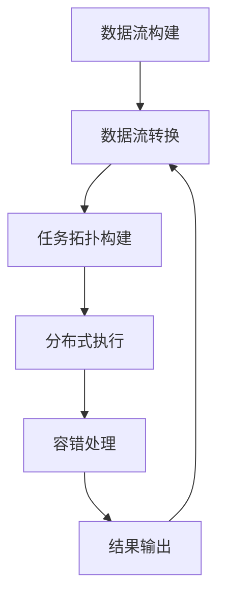

# Apache Flink

## 1. 背景介绍

### 1.1 问题的由来

在当今数据密集型时代，实时数据处理和分析已成为许多企业和组织的关键需求。传统的批处理系统无法满足对实时性和低延迟的需求,而流式处理系统应运而生。Apache Flink 作为一种新兴的分布式流处理框架,旨在解决大规模数据流的实时计算问题。

随着物联网、社交媒体、电子商务等领域的快速发展,海量的数据源源不断地产生,这些数据具有连续不断、高速持久的特点。如何高效地处理这些数据流,并从中获取有价值的信息和见解,成为了当前数据处理领域的重大挑战。

### 1.2 研究现状

Apache Flink 作为一种先进的分布式流处理框架,已经在学术界和工业界得到了广泛的关注和应用。它提供了高吞吐量、低延迟和高容错性等优势,可以实现对无界数据流的实时处理和分析。

目前,Flink 已经被许多知名公司和组织采用,如 Uber、Netflix、Alibaba、Tencent 等,用于构建实时数据处理管道、实时数据分析系统和机器学习应用程序。同时,Flink 也是 Apache 软件基金会的顶级项目之一,拥有活跃的开源社区和持续的开发和维护。

### 1.3 研究意义

深入研究 Apache Flink 具有重要的理论和实践意义:

1. **实时数据处理能力**:Flink 能够高效地处理连续不断的数据流,满足实时性和低延迟的需求,这对于许多时间敏感型应用程序(如实时监控、实时决策、实时推荐等)至关重要。

2. **统一批流处理**:Flink 提供了统一的批处理和流处理编程模型,使得开发人员可以使用相同的API 和代码来处理有界数据集和无界数据流,提高了开发效率和代码可维护性。

3. **高性能和可扩展性**:Flink 采用了高度优化的执行引擎和资源管理策略,能够在大规模分布式环境下提供高吞吐量和低延迟的数据处理能力。

4. **容错性和一致性**:Flink 实现了基于检查点和状态管理的容错机制,能够在发生故障时自动恢复并保证精确一次的处理语义。

5. **丰富的库和API**:Flink 提供了丰富的库和API,支持各种数据源、数据格式,以及机器学习、图计算等高级分析功能,极大地扩展了其应用范围。

通过深入研究 Apache Flink,我们可以更好地理解和掌握实时数据处理的理论和实践,为构建高性能、可扩展和容错的实时数据处理系统提供指导和支持。

### 1.4 本文结构

本文将全面介绍 Apache Flink 的核心概念、架构原理、算法实现、数学模型、实践案例和应用场景等内容。文章结构如下:

1. 背景介绍
2. 核心概念与联系
3. 核心算法原理与具体操作步骤
4. 数学模型和公式详细讲解与举例说明
5. 项目实践:代码实例和详细解释说明
6. 实际应用场景
7. 工具和资源推荐
8. 总结:未来发展趋势与挑战
9. 附录:常见问题与解答

## 2. 核心概念与联系

Apache Flink 是一个分布式的、有状态的流处理框架,它集成了流处理、批处理、事件驱动应用程序和机器学习等多种功能。Flink 的核心概念包括:

1. **流(Stream)**: 流是一个无界、持续不断的数据序列,可以来自各种数据源,如消息队列、文件、网络流量等。

2. **数据流编程模型(Stream Processing Model)**: Flink 采用数据流编程模型,将数据流抽象为无限的数据集合,并提供了丰富的转换操作(如过滤、映射、聚合等)来处理这些数据流。

3. **有状态计算(Stateful Computation)**: Flink 支持有状态的流处理,可以维护和存储数据流的状态信息,从而实现更复杂的计算逻辑,如窗口操作、连接操作等。

4. **分布式执行引擎(Distributed Execution Engine)**: Flink 采用了分布式执行引擎,能够自动将数据流任务分割并并行执行在集群环境中,提高了计算效率和吞吐量。

5. **容错机制(Fault Tolerance)**: Flink 实现了基于检查点(Checkpoint)和状态管理的容错机制,能够在发生故障时自动恢复计算状态,保证数据处理的一致性和精确一次语义。

6. **窗口(Window)**: Flink 提供了多种窗口类型(如滚动窗口、滑动窗口、会话窗口等),用于对无界数据流进行切分和聚合计算。

7. **时间语义(Time Semantics)**: Flink 支持事件时间(Event Time)和处理时间(Processing Time)两种时间语义,用于处理数据流中的时间信息。

8. **可扩展性(Scalability)**: Flink 能够在大规模分布式环境下运行,并提供了自动资源分配和弹性伸缩等功能,确保系统的高可用性和可扩展性。

这些核心概念相互关联、互为支撑,共同构建了 Flink 作为一个强大的分布式流处理框架的基础。

## 3. 核心算法原理与具体操作步骤

### 3.1 算法原理概述

Apache Flink 的核心算法原理主要包括以下几个方面:

1. **数据流模型(Data Stream Model)**: Flink 将无界数据流抽象为一系列的数据元素序列,并提供了丰富的转换操作(如过滤、映射、聚合等)来处理这些数据流。这种数据流模型是 Flink 实现流处理的基础。

2. **有状态计算(Stateful Computation)**: Flink 支持有状态的流处理,可以维护和存储数据流的状态信息。这种有状态计算能力使得 Flink 可以实现更复杂的计算逻辑,如窗口操作、连接操作等。

3. **分布式执行引擎(Distributed Execution Engine)**: Flink 采用了分布式执行引擎,能够自动将数据流任务分割并并行执行在集群环境中,提高了计算效率和吞吐量。执行引擎的核心组件包括 JobManager、TaskManager、Task 等。

4. **容错机制(Fault Tolerance)**: Flink 实现了基于检查点(Checkpoint)和状态管理的容错机制,能够在发生故障时自动恢复计算状态,保证数据处理的一致性和精确一次语义。

5. **窗口操作(Window Operation)**: Flink 提供了多种窗口类型(如滚动窗口、滑动窗口、会话窗口等),用于对无界数据流进行切分和聚合计算。窗口操作是 Flink 实现流处理的重要算法。

6. **时间语义(Time Semantics)**: Flink 支持事件时间(Event Time)和处理时间(Processing Time)两种时间语义,用于处理数据流中的时间信息。正确处理时间语义对于实现准确的流处理至关重要。

7. **资源调度和管理(Resource Scheduling and Management)**: Flink 提供了自动资源分配和弹性伸缩等功能,能够在大规模分布式环境下高效地调度和管理计算资源,确保系统的高可用性和可扩展性。

这些核心算法原理相互配合、环环相扣,共同构建了 Flink 作为一个强大的分布式流处理框架的算法基础。

### 3.2 算法步骤详解

Apache Flink 的核心算法步骤可以概括为以下几个阶段:

1. **数据流构建(Data Stream Construction)**

   - 从各种数据源(如消息队列、文件、网络流量等)获取数据流
   - 使用 Flink 提供的 API 构建数据流对象(如 DataStream、DataSet 等)
   - 指定数据流的时间语义(事件时间或处理时间)

2. **数据流转换(Data Stream Transformation)**

   - 对数据流应用各种转换操作,如过滤(filter)、映射(map)、聚合(reduce)等
   - 实现所需的业务逻辑和数据处理功能
   - 支持有状态计算,如窗口操作(window)、连接操作(join)等

3. **任务拓扑构建(Task Topology Construction)**

   - Flink 根据数据流转换操作构建逻辑执行计划(Logical Execution Plan)
   - 将逻辑执行计划转换为物理执行计划(Physical Execution Plan)
   - 生成分布式任务拓扑(Task Topology),包括多个并行的任务(Task)

4. **分布式执行(Distributed Execution)**

   - JobManager 将任务拓扑分发到集群中的 TaskManager
   - TaskManager 执行分配的任务,并进行数据流计算
   - 支持数据并行处理,提高计算效率和吞吐量

5. **容错处理(Fault Tolerance)**

   - 定期生成检查点(Checkpoint),保存计算状态
   - 发生故障时,从最近的检查点恢复计算状态
   - 保证精确一次(Exactly-once)的处理语义

6. **结果输出(Result Output)**

   - 将计算结果输出到指定的接收器(Sink),如文件系统、数据库、消息队列等
   - 支持多种输出格式和目标系统

这些步骤循环执行,形成 Flink 的核心算法流程。通过这一系列高效、容错的算法步骤,Flink 能够实现对无界数据流的实时、分布式处理和分析。

### 3.3 算法优缺点

Apache Flink 作为一种先进的分布式流处理框架,其核心算法具有以下优点:

1. **高吞吐量和低延迟**: Flink 采用了高度优化的执行引擎和资源管理策略,能够在大规模分布式环境下提供高吞吐量和低延迟的数据处理能力。

2. **有状态计算能力**: Flink 支持有状态的流处理,可以维护和存储数据流的状态信息,实现更复杂的计算逻辑,如窗口操作、连接操作等。

3. **容错性和一致性**: Flink 实现了基于检查点和状态管理的容错机制,能够在发生故障时自动恢复并保证精确一次的处理语义。

4. **统一批流处理**: Flink 提供了统一的批处理和流处理编程模型,使得开发人员可以使用相同的 API 和代码来处理有界数据集和无界数据流,提高了开发效率和代码可维护性。

5. **可扩展性和弹性**: Flink 能够在大规模分布式环境下运行,并提供了自动资源分配和弹性伸缩等功能,确保系统的高可用性和可扩展性。

6. **丰富的库和 API**: Flink 提供了丰富的库和 API,支持各种数据源、数据格式,以及机器学习、图计算等高级分析功能,极大地扩展了其应用范围。

然而,Flink 的核心算法也存在一些不足之处:

1. **学习曲线陡峭**: Flink 作为一个复杂的分布式系统,其核心算法和概念相对较难掌握,存在一定的学习曲线。

2. **内存消耗较大**: Flink 的有状态计算和容错机制需要维护大量的状态信息,因此对内存的消耗较大,需要合理规划和管理内存资源。

3. **调优和监控复杂**: Flink 作为一个分布式系统,其性能调优和监控相对复杂,需要深入了解系统内部原理和参数配置。

4. **社区支持有限**:虽然 Flink 拥有活跃的开源社区,但与 Apache Spark 等成熟项目相比,其社区支持和资源相对有限。

5. **与其他系统集成**: Flink 与其他大数据生态系统(如 Hadoop、Spark 等)的集成和