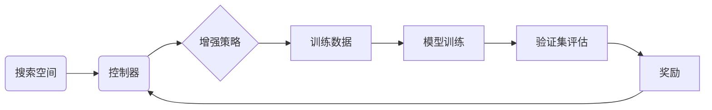

# AutoAugment原理与代码实例讲解

## 1. 背景介绍

### 1.1 问题的由来
深度学习在计算机视觉、自然语言处理等领域取得了巨大成功,但训练高质量的深度神经网络通常需要大量的标注数据。然而,人工标注数据非常耗时耗力,因此如何在有限的标注数据上提升模型性能,成为一个亟待解决的问题。数据增强(Data Augmentation)是解决该问题的重要手段之一,它通过对已有数据进行变换,生成新的训练样本,从而扩充训练集,提高模型的泛化能力。

### 1.2 研究现状
传统的数据增强方法主要包括几何变换(如旋转、平移、缩放)、颜色变换(如亮度、对比度调整)等,但这些方法都是人工设计的,难以找到最优的增强策略。近年来,学者们开始探索自动化的数据增强方法,其中AutoAugment是一种代表性的算法。AutoAugment利用强化学习,自动搜索数据增强策略,取得了优于人工设计的效果。

### 1.3 研究意义
AutoAugment的提出具有重要意义:
1. 它使得数据增强策略的设计自动化,减少了人工调参的工作量。 
2. 通过学习得到的增强策略往往优于人工设计,能够更好地提升模型性能。
3. AutoAugment可以看作是AutoML(自动机器学习)在数据增强领域的应用,有助于推动AutoML技术的发展。

### 1.4 本文结构
本文将详细介绍AutoAugment的原理和代码实现。第2部分介绍AutoAugment涉及的核心概念;第3部分阐述AutoAugment的算法原理;第4部分给出AutoAugment的数学模型;第5部分提供AutoAugment的代码实例;第6部分讨论AutoAugment的应用场景;第7部分推荐相关工具和资源;第8部分总结全文,并展望AutoAugment的未来发展。

## 2. 核心概念与联系
在介绍AutoAugment之前,我们先明确几个核心概念:

- 数据增强(Data Augmentation):通过对原始数据进行变换,生成新的训练样本,扩充数据集的方法。常见的变换包括几何变换、颜色变换等。
- 搜索空间(Search Space):指所有可能的数据增强操作及其参数的组合。搜索空间越大,可选的增强策略就越多。
- 增强策略(Augmentation Policy):指从搜索空间中选取的一组数据增强操作及其参数。每个策略包含多个子策略(Sub-policy),每个子策略包含2个操作。
- 强化学习(Reinforcement Learning):一种机器学习范式,通过智能体(Agent)与环境交互,根据反馈的奖励学习最优策略。
- 控制器(Controller):在AutoAugment中,控制器是一个RNN网络,它根据奖励生成增强策略。

AutoAugment的核心思想是:将寻找最优增强策略看作一个离散优化问题,利用强化学习中的策略梯度方法进行搜索。控制器根据当前策略对模型进行训练,并获得反馈奖励(如验证集准确率),然后基于奖励更新控制器参数,进而生成更优的策略。

## 3. 核心算法原理 & 具体操作步骤

### 3.1 算法原理概述
AutoAugment的算法流程可概括为:
1. 定义搜索空间,包含多种图像增强操作(如平移、旋转等)。
2. 初始化RNN控制器,随机生成增强策略。 
3. 根据当前策略对原始数据进行增强,得到增强后的数据集。
4. 在增强数据上训练模型,并在验证集上评估性能,将评估指标(如准确率)作为奖励反馈给控制器。
5. 控制器基于奖励更新参数,生成新的增强策略。
6. 重复步骤3-5,直到找到最优策略或达到预设的搜索次数。

### 3.2 算法步骤详解
下面详细说明每个步骤:

**步骤1:定义搜索空间**
搜索空间包含多种常见的图像增强操作,如:
- ShearX/Y:沿x/y方向剪切
- TranslateX/Y:沿x/y方向平移
- Rotate:旋转
- AutoContrast:自适应调整对比度
- Invert:反转颜色
- Equalize:直方图均衡化
- Solarize:过曝
- Posterize:色彩位数减少
- Contrast:调整对比度
- Color:调整颜色饱和度
- Brightness:调整亮度
- Sharpness:调整锐度
- Cutout:随机遮挡

每个操作都有一定的参数范围,如旋转角度在[-30,30]度之间。搜索空间定义了这些操作及其参数的所有可能组合。

**步骤2:初始化控制器**
控制器是一个循环神经网络(RNN),它的输出是离散的增强操作和连续的参数。具体地,控制器输出5个离散变量:
- 第1个操作的id
- 第1个操作的概率
- 第1个操作的幅度
- 第2个操作的id
- 第2个操作的概率
每个离散变量都对应一个softmax分布。

**步骤3:数据增强**
根据控制器输出的策略,对原始数据进行增强。每个策略包含5个子策略,每个子策略包含2个操作。对每个训练样本,随机选择一个子策略,依次执行其中的2个操作。

**步骤4:模型训练和评估**
使用增强后的数据训练模型,并在验证集上评估模型性能。将验证集准确率作为奖励。

**步骤5:策略更新**
控制器基于奖励更新参数,使用REINFORCE算法计算梯度:
$$\nabla_{\theta} J(\theta)=\mathbb{E}_{\pi_{\theta}}[R \cdot \nabla_{\theta} \log \pi_{\theta}(a)]$$
其中$\theta$是控制器参数,$\pi_{\theta}$是策略,$a$是动作,$R$是奖励。

然后用梯度上升法更新控制器参数:
$$\theta \leftarrow \theta+\alpha \nabla_{\theta} J(\theta)$$

**步骤6:迭代搜索**
重复步骤3-5,直到找到满意的策略或达到最大迭代次数。

### 3.3 算法优缺点
AutoAugment的优点:
1. 自动搜索增强策略,减少人工设计工作。
2. 学习到的策略通常优于人工设计。
3. 可以适用于不同的数据集和模型。

缺点:
1. 搜索耗时较长,需要大量计算资源。
2. 搜索空间设计需要经验,不同任务的最优搜索空间可能不同。
3. 在小数据集上效果可能不明显。

### 3.4 算法应用领域
AutoAugment主要应用于计算机视觉领域,如图像分类、目标检测、语义分割等。此外,其思想也可以扩展到其他领域,如语音识别、自然语言处理等。

## 4. 数学模型和公式 & 详细讲解 & 举例说明

### 4.1 数学模型构建
AutoAugment可以看作一个条件概率模型:
$$P(O_1,M_1,P_1,O_2,P_2|D,\theta)$$
其中$O_1,O_2$是增强操作的id,$M_1$是第1个操作的幅度,$P_1,P_2$是两个操作的概率,$D$是原始数据集,$\theta$是控制器参数。

这个条件概率可以进一步分解为:
$$P(O_1,M_1,P_1,O_2,P_2|D,\theta)=P(O_1|D,\theta)P(M_1|O_1,D,\theta)P(P_1|O_1,M_1,D,\theta)P(O_2|O_1,M_1,P_1,D,\theta)P(P_2|O_1,M_1,P_1,O_2,D,\theta)$$

每个因子都对应控制器输出的一个离散变量。

### 4.2 公式推导过程
AutoAugment的目标是最大化验证集准确率$R$,即:
$$\max_{\theta} \mathbb{E}_{O_1,M_1,P_1,O_2,P_2 \sim \pi_{\theta}}[R(D_{aug})]$$
其中$\pi_{\theta}$是由控制器参数$\theta$定义的策略,$D_{aug}$是增强后的数据集。

根据策略梯度定理,上式的梯度为:
$$\nabla_{\theta} J(\theta)=\mathbb{E}_{\pi_{\theta}}[R(D_{aug}) \cdot \nabla_{\theta} \log \pi_{\theta}(O_1,M_1,P_1,O_2,P_2)]$$

将$\log \pi_{\theta}(O_1,M_1,P_1,O_2,P_2)$展开:
$$\log \pi_{\theta}(O_1,M_1,P_1,O_2,P_2)=\log P(O_1|D,\theta)+\log P(M_1|O_1,D,\theta)+\log P(P_1|O_1,M_1,D,\theta)+\log P(O_2|O_1,M_1,P_1,D,\theta)+\log P(P_2|O_1,M_1,P_1,O_2,D,\theta)$$

每个概率项都可以通过控制器的输出计算。

### 4.3 案例分析与讲解
下面以图像分类任务为例,说明AutoAugment的数学模型。

假设搜索空间包含5个操作:平移、旋转、剪切、自适应对比度、Cutout。控制器的输出为:
- $O_1=1$ (选择平移操作)
- $M_1=0.2$ (平移幅度为0.2)
- $P_1=0.8$ (平移操作的概率为0.8)
- $O_2=4$ (选择Cutout操作) 
- $P_2=0.5$ (Cutout操作的概率为0.5)

则数据增强过程为:对每个训练样本,以0.8的概率进行平移(幅度为0.2),以0.5的概率进行Cutout。增强后的数据用于训练分类模型,在验证集上评估准确率,得到奖励R。

控制器基于奖励计算梯度:
$$\nabla_{\theta} J(\theta)=R \cdot (\nabla_{\theta} \log P(O_1=1|D,\theta)+\nabla_{\theta} \log P(M_1=0.2|O_1=1,D,\theta)+\nabla_{\theta} \log P(P_1=0.8|O_1=1,M_1=0.2,D,\theta)+\nabla_{\theta} \log P(O_2=4|O_1=1,M_1=0.2,P_1=0.8,D,\theta)+\nabla_{\theta} \log P(P_2=0.5|O_1=1,M_1=0.2,P_1=0.8,O_2=4,D,\theta))$$

然后用梯度上升法更新控制器参数$\theta$,生成新的增强策略。

### 4.4 常见问题解答
**Q1:AutoAugment的搜索空间是如何设计的?**
A1:搜索空间包含多种常见的图像增强操作,如几何变换、颜色变换等。每个操作都有一定的参数范围。搜索空间的设计需要根据任务和数据的特点进行调整,过大的搜索空间会增加搜索难度,过小的搜索空间可能遗漏最优策略。

**Q2:AutoAugment的训练过程需要多长时间?**
A2:AutoAugment的训练时间较长,因为每次策略更新都需要在增强数据上训练模型。搜索过程可能需要数十上百个GPU日。为了加速搜索,可以采用代理任务、迁移学习等技术。

**Q3:AutoAugment学到的策略是否可以迁移到其他数据集?**
A3:通常可以迁移,但效果可能会有所下降。不同数据集的最优增强策略可能有差异,因此在新数据集上fine-tune策略是有必要的。

## 5. 项目实践：代码实例和详细解释说明

### 5.1 开发环境搭建
实现AutoAugment需要以下依赖:
- Python