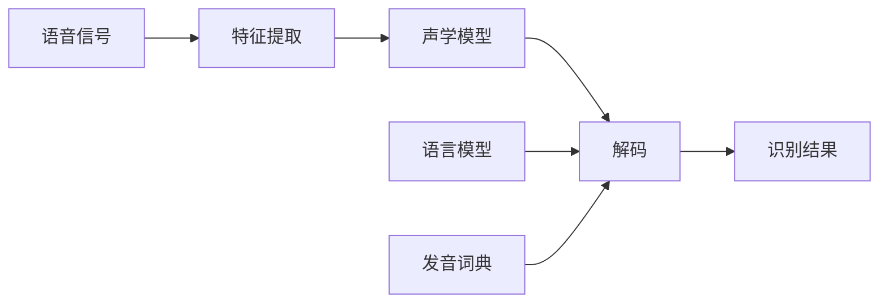

# Automatic Speech Recognition (ASR)原理与代码实例讲解

关键词：语音识别、声学模型、语言模型、解码、深度学习

## 1. 背景介绍
### 1.1  问题的由来
语音识别(Automatic Speech Recognition, ASR)是一项让机器能够理解人类语音并转换成相应文本的技术。随着人工智能的快速发展,语音交互已成为人机交互的重要方式之一。语音识别在智能助理、语音搜索、语音输入等领域有广泛应用,因此语音识别技术的研究具有重要意义。

### 1.2  研究现状
传统的语音识别系统主要基于隐马尔可夫模型(HMM)和高斯混合模型(GMM)。近年来,深度学习的兴起为语音识别带来了革命性的变化。越来越多的研究开始使用深度神经网络(DNN)、卷积神经网络(CNN)、循环神经网络(RNN)等模型来构建声学模型。同时,语言模型也从n-gram统计模型发展到基于RNN的神经语言模型。端到端的语音识别方法,如CTC、RNN-Transducer等,也受到了广泛关注。

### 1.3  研究意义
语音识别技术的发展有助于实现更自然、更智能的人机交互方式。它可以帮助残障人士、不方便打字的用户更便捷地使用计算机和移动设备。语音识别在智能家居、车载系统、医疗辅助等领域也有重要应用价值。此外,语音识别技术的进步也推动了语音合成、语音翻译等相关技术的发展。

### 1.4  本文结构
本文将全面介绍语音识别的原理和代码实现。第2部分介绍语音识别的核心概念;第3部分讲解语音识别的核心算法原理和步骤;第4部分给出相关的数学模型和公式推导;第5部分提供详细的代码实例;第6部分探讨语音识别的实际应用场景;第7部分推荐语音识别相关的工具和学习资源;第8部分总结全文并展望语音识别技术的未来发展趋势与挑战;第9部分的附录解答了一些常见问题。

## 2. 核心概念与联系
语音识别的目标是将语音信号转换为相应的文本。其核心概念包括:

- 声学模型(Acoustic Model):用于将语音特征映射到音素或者词的概率。常用的声学模型有GMM-HMM和基于DNN的模型。

- 语言模型(Language Model):刻画词序列的概率分布。常见的有n-gram模型和RNN语言模型。语言模型可以帮助识别正确的词序列。

- 发音词典(Pronunciation Lexicon):定义了词和音素序列的映射关系。

- 特征提取(Feature Extraction):将语音信号转换为特征序列,如MFCC、Fbank等。

- 解码(Decoding):利用声学模型和语言模型,在特征序列上搜索得到概率最大的词序列,常用的有Viterbi解码。

下图展示了这些概念在语音识别流程中的关系:

## 3. 核心算法原理 & 具体操作步骤
### 3.1  算法原理概述
现代语音识别系统的主要步骤如下:
1. 特征提取:将语音信号转换为特征序列如MFCC
2. 声学模型计算:用声学模型计算每一帧特征的音素或词的后验概率 
3. 解码:在特征序列上搜索,找到后验概率最大的词序列,同时利用语言模型评估词序列的先验概率
4. 识别结果:解码得到的词序列即为识别结果

### 3.2  算法步骤详解

#### 3.2.1 特征提取
语音信号是一个非平稳的时间序列。为了便于建模,通常将其划分为一个个短时帧,每帧约20-30ms。然后对每帧提取特征,常用的特征有:
- MFCC(Mel-Frequency Cepstral Coefficients):梅尔频率倒谱系数,考虑了人耳的听觉特性
- Fbank(Log Mel-Filter Bank):对梅尔频谱取对数后的特征

提取步骤为:
1. 预加重:对语音信号进行高通滤波
2. 分帧:将语音信号划分为帧
3. 加窗:每帧乘以汉明窗以增加平滑性 
4. FFT:对每帧做快速傅里叶变换得到频谱
5. 梅尔滤波:将频谱通过梅尔滤波器组得到梅尔频谱
6. 取对数:对梅尔频谱取对数,得到对数梅尔频谱即Fbank特征
7. DCT:对Fbank特征做离散余弦变换,得到MFCC特征

#### 3.2.2 声学模型
声学模型用于计算每帧特征的音素或词的后验概率。HMM是最常用的声学模型,其中每个状态可以是GMM或DNN。

对于GMM-HMM,声学模型的计算公式为:

$$p(o_t|q_t=j)=\sum_{m=1}^Mc_{jm}\mathcal{N}(o_t;\mu_{jm},\Sigma_{jm})$$

其中$o_t$为$t$时刻的特征向量,$q_t$为$t$时刻的HMM状态,$M$为GMM的混合数, $c_{jm},\mu_{jm},\Sigma_{jm}$分别为第$j$个状态第$m$个高斯分量的权重、均值和协方差矩阵。

对于DNN-HMM,声学模型的计算公式为:

$$p(o_t|q_t=j)=\frac{exp(a_j^Th_t)}{\sum_{i=1}^Nexp(a_i^Th_t)}$$

其中$h_t$为$t$时刻DNN最后一层的输出,$a_j$为第$j$个状态的softmax参数,$N$为状态总数。

#### 3.2.3 语言模型
N-gram语言模型刻画了词序列$w_1,w_2,...,w_L$的概率:

$$P(w_1,w_2,...,w_L)=\prod_{l=1}^LP(w_l|w_{l-1},...,w_{l-n+1})$$

$P(w_l|w_{l-1},...,w_{l-n+1})$可以通过数据集中n-gram的频次估计得到。

RNN语言模型通过RNN建模词序列的条件概率:

$$P(w_1,w_2,...,w_L)=\prod_{l=1}^LP(w_l|w_1,w_2,...,w_{l-1})$$

$$=\prod_{l=1}^LP(w_l|h_{l-1})$$

其中$h_l$为$l$步RNN的隐藏层状态。

#### 3.2.4 解码
解码的目标是找到后验概率最大的词序列$\hat{W}$:

$$\hat{W}=\arg\max_WP(W|O)$$

$$=\arg\max_WP(O|W)P(W)$$

其中$P(O|W)$由声学模型计算,$P(W)$由语言模型计算。精确解码是NP难问题,因此通常使用近似的搜索算法如Viterbi解码。

Viterbi解码在语音特征序列上搜索,同时在HMM状态和词的空间上扩展。搜索过程中,每个时间步保留搜索得到的K个最优词序列,直到搜索完整个语音。最后回溯得到最优词序列作为识别结果。

### 3.3  算法优缺点
优点:
- 声学模型和语言模型可以分别训练,更加灵活
- 在大规模数据集上训练,识别准确率较高
- 许多开源工具如Kaldi已经实现了完整的HMM语音识别流程

缺点:
- 特征提取、声学模型和语言模型分别优化,非端到端训练
- 需要发音词典等语言学资源,适应新领域需要重新准备
- 解码速度慢,难以实现实时识别

### 3.4  算法应用领域
- 语音输入法:将语音实时转换为文字,提高输入效率
- 语音助手:如Apple Siri、Amazon Alexa等,可以通过语音指令控制
- 语音搜索:支持直接用语音进行搜索,免去打字
- 会议记录:自动将会议内容转换为文字记录
- 医疗辅助:医生可以通过语音录入病历,减轻工作负担

## 4. 数学模型和公式 & 详细讲解 & 举例说明
### 4.1  数学模型构建
从概率角度看,语音识别就是给定语音特征序列$O=o_1,o_2,...,o_T$,找到使后验概率$P(W|O)$最大的词序列$\hat{W}$:

$$\hat{W}=\arg\max_WP(W|O)$$

利用贝叶斯公式,可以将后验概率$P(W|O)$分解为:

$$P(W|O)=\frac{P(O|W)P(W)}{P(O)}$$

$P(O)$与$W$无关,因此:

$$\hat{W}=\arg\max_WP(O|W)P(W)$$

$P(O|W)$称为声学模型,$P(W)$称为语言模型。

声学模型$P(O|W)$可以通过HMM刻画。设$Q=q_1,q_2,...,q_T$为HMM状态序列,则:

$$P(O|W)=\sum_QP(O|Q,W)P(Q|W)$$

$$=\sum_Q\prod_{t=1}^Tp(o_t|q_t,W)P(q_t|q_{t-1},W)$$

其中$p(o_t|q_t,W)$为声学模型,$P(q_t|q_{t-1},W)$为HMM状态转移概率。

语言模型$P(W)$可以通过n-gram模型或RNN语言模型刻画。以2-gram为例:

$$P(W)=P(w_1,w_2,...,w_L)$$

$$=\prod_{l=1}^LP(w_l|w_{l-1})$$

### 4.2  公式推导过程

下面以基于DNN-HMM的声学模型为例,推导训练和解码中的关键公式。

DNN-HMM的声学模型为:

$$p(o_t|q_t=j)=\frac{exp(a_j^Th_t)}{\sum_{i=1}^Nexp(a_i^Th_t)}$$

其中$h_t$为$t$时刻DNN最后一层的输出,$a_j$为第$j$个状态的softmax参数。

DNN的训练目标是最小化交叉熵损失:

$$L=-\sum_{t=1}^T\sum_{j=1}^Nz_{tj}lna_j^Th_t$$

其中$z_{tj}$为$t$时刻状态$j$的标签。利用反向传播算法和随机梯度下降可以优化DNN参数。

解码时,给定语音特征序列$O=o_1,o_2,...,o_T$,目标是找到使后验概率最大的词序列$\hat{W}$和对应的状态序列$\hat{Q}$:

$$(\hat{W},\hat{Q})=\arg\max_{W,Q}P(W,Q|O)$$

$$=\arg\max_{W,Q}\frac{P(O|Q,W)P(Q|W)P(W)}{P(O)}$$

$$=\arg\max_{W,Q}P(O|Q,W)P(Q|W)P(W)$$

利用Viterbi算法可以高效地解决上述优化问题。定义Viterbi变量:

$$\delta_t(j)=\max_{q_1,...,q_{t-1}}P(q_1,...,q_{t-1},q_t=j,o_1,...,o_t|W)$$

表示在$t$时刻状态为$j$且观测为$o_1,...,o_t$的前提下,状态序列$q_1,...,q_{t-1}$的最大概率。

Viterbi算法的递推公式为:

$$\delta_{t+1}(k)=\max_j\delta_t(j)P(q_{t+1}=k|q_t=j,W)p(o_{t+1}|q_{t+1}=k,W)$$

初始值为:

$$\delta_1(j)=P(q_1=j|W)p(o_1|q_1=j,W)$$

最终的最优状态序列可以通过回溯得到。

### 4.3  案例分析与讲解
下面以一个简单的例子说明语音识