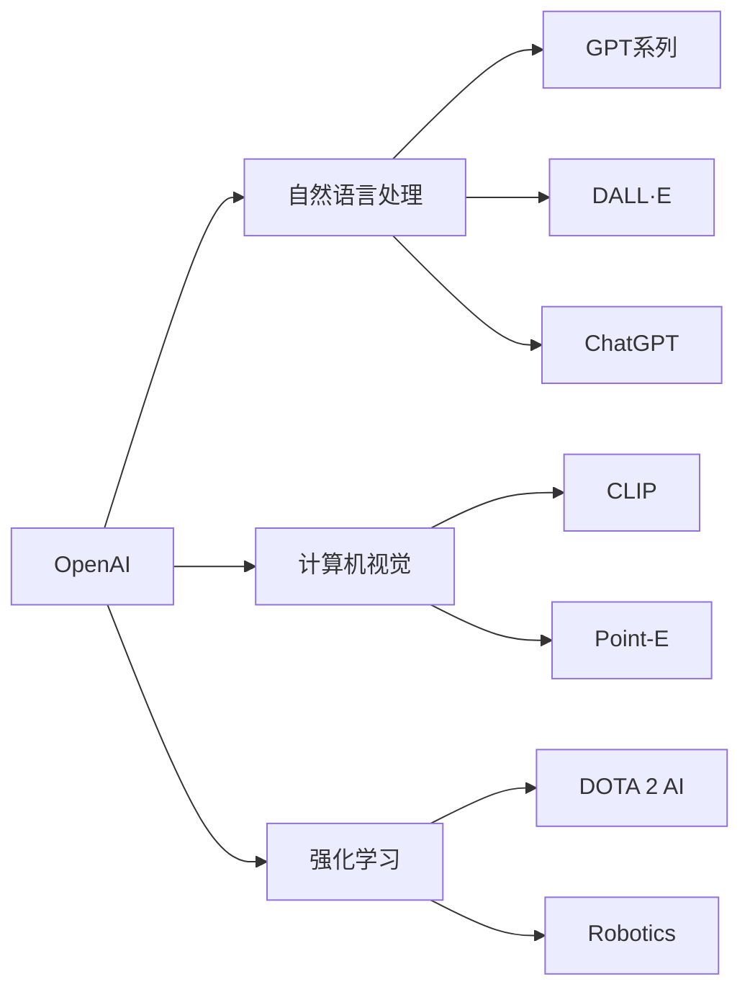
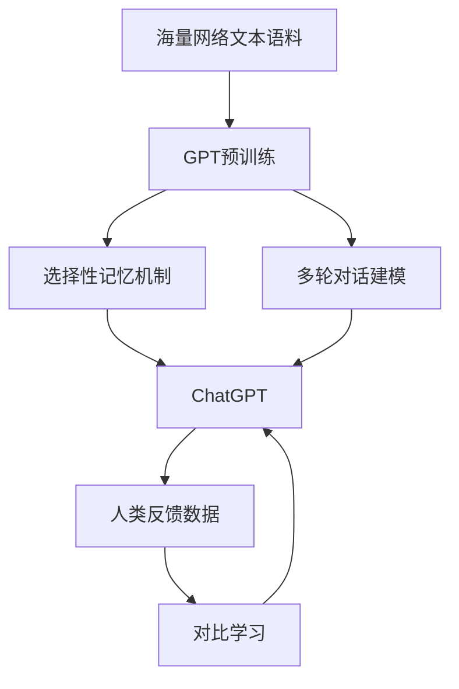

# ChatGPT背后的推手——OpenAI

## 1. 背景介绍

### 1.1 问题的由来
人工智能(Artificial Intelligence, AI)自1956年达特茅斯会议提出以来，经历了几次起起伏伏的发展历程。近年来，随着深度学习等技术的突破，AI再次迎来了爆发式增长。在众多AI公司中，OpenAI以其开创性的研究和引领性的成果脱颖而出，尤其是其推出的大型语言模型ChatGPT更是引发了全球范围内的广泛关注和讨论。

### 1.2 研究现状
目前，OpenAI已发展成为全球顶尖的AI研究机构之一。他们在自然语言处理(NLP)、计算机视觉、强化学习等多个领域取得了重大突破。尤其是近期推出的ChatGPT，以其出色的语言理解和生成能力，展现了通用人工智能(AGI)的巨大潜力，受到业界和公众的广泛关注。各大科技公司纷纷加大对AI领域的投入，AI技术正加速走向成熟和商业化。

### 1.3 研究意义
深入研究OpenAI的发展历程和技术成果，对于理解人工智能的前沿进展、发展趋势以及对社会和产业的影响具有重要意义。OpenAI的成功经验可为其他AI公司提供宝贵借鉴，同时其面临的挑战也引发了关于AI安全、伦理等方面的思考和讨论。展望未来，OpenAI有望引领人工智能迈向更高的台阶，加速智能时代的到来。

### 1.4 本文结构
本文将从以下几个方面深入剖析OpenAI的发展和影响：
- 介绍OpenAI的起源、发展历程和主要里程碑
- 分析OpenAI在人工智能领域的核心技术突破和代表性成果 
- 重点介绍ChatGPT的原理、性能、应用前景以及局限性
- 探讨OpenAI对人工智能产业格局和未来发展的影响
- 分享OpenAI的成功经验以及面临的机遇和挑战
- 展望人工智能技术的发展趋势和OpenAI的未来角色定位

## 2. 核心概念与联系

在深入分析OpenAI之前，有必要先明确几个核心概念：

- 人工智能(Artificial Intelligence)：让机器具备类似人类智能的能力，包括感知、学习、推理、规划、决策等。
- 机器学习(Machine Learning)：让计算机系统通过数据和经验自动改进性能的方法，是实现AI的主要途径。
- 深度学习(Deep Learning)：基于深度神经网络的机器学习方法，在语音识别、图像识别、自然语言处理等领域取得重大突破。
- 强化学习(Reinforcement Learning)：智能体通过与环境的交互，根据反馈调整策略，不断提升性能的学习范式。
- 自然语言处理(Natural Language Processing)：赋予计算机处理、理解和生成人类语言的能力。
- 生成式预训练模型(Generative Pre-trained Transformer)：通过海量语料预训练得到的语言模型，具备强大的语言理解和生成能力，GPT系列是代表。

OpenAI的研究涉及上述多个领域，尤其擅长利用深度学习、强化学习、迁移学习等前沿技术，构建大规模语言模型、多模态模型，在 NLP、计算机视觉、robotics 等方向取得了引领性成果。而 ChatGPT 则集成了 OpenAI 在 NLP 领域的多项技术积累，代表了语言模型的一大进步。

下图展示了 OpenAI 主要研究方向和代表性成果之间的逻辑联系：



可以看出，OpenAI 在三大领域均有布局，并形成了诸多有影响力的成果。而这些看似独立的方向，实则相互借鉴、融合，最终指向通用人工智能的长远目标。

## 3. 核心算法原理 & 具体操作步骤

### 3.1 算法原理概述
OpenAI的诸多突破性成果，很大程度得益于其在算法方面的创新。这里重点介绍GPT(Generative Pre-trained Transformer)算法，它是OpenAI在NLP领域的核心技术，奠定了ChatGPT等一系列产品的基础。

GPT本质上是一种语言模型(Language Model)，即以无监督的方式从海量文本语料中学习词语之间的关联规律，从而具备语言理解和生成能力。相比传统的循环神经网络(RNN)语言模型，GPT基于Transformer结构，通过自注意力机制(Self-Attention)实现了更长距离的信息捕捉和并行计算，极大地提升了建模能力和训练效率。

GPT训练过程可分为两个阶段：预训练(Pre-training)和微调(Fine-tuning)。预训练阶段在超大规模语料上进行自回归式学习，通过优化下一词预测任务，获得通用的语言理解和生成能力。微调阶段则在特定任务的小样本数据上，通过监督学习方式对模型进行调优，使其适应具体应用场景。

### 3.2 算法步骤详解
以下详细介绍GPT的训练步骤：

1. 语料准备：收集大规模高质量的无标注文本语料，覆盖广泛的主题域。
2. 文本预处理：对语料进行清洗(如去除特殊字符)、分词、构建词表等，将文本转化为数值化的输入。
3. 搭建模型：构建多层Transformer Encoder结构，设置关键参数如隐藏层维度、注意力头数、层数等。
4. 预训练任务定义：通常采用自回归语言建模任务，即根据前缀词预测下一个词。损失函数通常为交叉熵。
5. 模型训练：采用Adam、AdaFactor等优化器，设置合适的学习率和批大小。在超大规模语料上训练若干轮次直至收敛。
6. 微调与应用：在下游任务数据上微调模型，常见任务如文本分类、问答、摘要等。也可作为zero-shot/few-shot learner直接应用。

以ChatGPT为例，它在GPT-3的基础上，通过引入人类反馈、对比学习等技术，针对对话交互场景进行了优化。其训练流程可总结如下图：



### 3.3 算法优缺点
GPT的优势在于：
- 通过预训练获得强大的语言理解和生成能力，可灵活应对各类NLP任务。
- 基于Transformer结构，具备长距离建模和并行计算效率的优势。
- 引入注意力机制，赋予模型更强的特征提取和语义理解能力。

但GPT也存在一些局限：
- 模型参数量巨大，训练和推理成本高昂，难以部署到资源受限场景。 
- 面临"胡言乱语"、"幻觉"等问题，生成内容可能与事实不符。
- 学习到训练数据中的偏见，可能产生不恰当言论，带来安全隐患。

### 3.4 算法应用领域
得益于其强大的语言理解和生成能力，GPT已在如下领域得到广泛应用：

- 智能问答：通过语义理解和知识检索，构建聊天机器人、智能客服等应用。
- 内容创作：机器写作、广告文案、剧本创作等，提高内容生产效率。  
- 信息抽取：从非结构化文本中提取结构化知识，如实体、关系、事件等。
- 机器翻译：将GPT作为预训练模型，大幅提升翻译质量，实现零样本翻译。
- 语言理解：文本分类、情感分析、语义匹配、自然语言推理等基础NLP任务。

未来，GPT有望进一步拓展到多模态、认知推理、交互学习等方向，为实现通用人工智能铺平道路。

## 4. 数学模型和公式 & 详细讲解 & 举例说明

### 4.1 数学模型构建
GPT的核心是Transformer的Encoder结构，假设模型有$L$层，每层的隐藏层维度为$D$，词表大小为$V$，输入序列长度为$n$。

首先将离散的词转化为连续的词向量，记为$X \in \mathbb{R}^{n \times D}$。然后将其与位置编码$P \in \mathbb{R}^{n \times D}$相加，得到输入表示$H^0$：

$$
H^0 = X + P
$$

接下来通过$L$层Transformer的Encoder层迭代更新隐藏状态。第$l$层的计算过程为：

$$
\begin{aligned}
A^l &= \text{SelfAttention}(H^{l-1}) \\
H^l &= \text{LayerNorm}(\text{FFN}(A^l) + A^l)
\end{aligned}
$$

其中$\text{SelfAttention}$是自注意力计算，$\text{FFN}$是前馈神经网络，$\text{LayerNorm}$是层归一化。

最后一层的输出$H^L$经过线性变换和softmax归一化，得到下一词的概率分布$P$：

$$
P = \text{softmax}(H^L W^T)
$$

其中$W \in \mathbb{R}^{V \times D}$是词表嵌入矩阵。

模型训练时，目标是最大化真实下一词的概率，即最小化交叉熵损失：

$$
\mathcal{L} = -\sum_{i=1}^n \log P(x_i|x_{<i})
$$

其中$x_i$是第$i$个位置的真实词，$x_{<i}$是之前的词序列。

### 4.2 公式推导过程
这里重点推导自注意力的计算公式。自注意力的本质是将序列的每个位置与其他所有位置进行比较，得到权重分布，然后加权求和得到该位置的新表示。

具体来说，自注意力分为三步：

1. 计算Query、Key、Value矩阵：

$$
\begin{aligned}
Q &= H W_Q \\
K &= H W_K \\
V &= H W_V
\end{aligned}
$$

其中$W_Q, W_K, W_V \in \mathbb{R}^{D \times D_k}$是可学习的参数矩阵，$D_k$是注意力的维度。

2. 计算注意力权重：

$$
\text{Attention}(Q, K, V) = \text{softmax}(\frac{QK^T}{\sqrt{D_k}})V
$$

先将$Q$与$K^T$做点积，得到各个位置之间的相似度分数，然后除以$\sqrt{D_k}$缩放，经过softmax归一化得到注意力权重分布。

3. 加权求和：
将注意力权重与$V$矩阵相乘，得到加权求和的结果，即为新的序列表示：

$$
\text{SelfAttention}(H) = \text{Attention}(HW_Q, HW_K, HW_V)
$$

实际应用中，GPT采用了多头注意力(Multi-head Attention)，即将$Q,K,V$划分为多个子空间，分别进行自注意力计算，最后拼接得到输出。这样可以让模型从不同子空间学习到不同的注意力模式，提高建模能力。

### 4.3 案例分析与讲解
下面以一个简单的例子直观展示GPT的工作原理。假设我们有以下输入序列：

```
the cat sat on the mat
```

经过词表映射，转化为如下数值序列：

```
[2, 34, 678, 23, 2, 987]
```

然后添加位置编码，输入Transformer的Encoder。在第一层自注意力中，序列的每个位置会关注到其他位置，学习到上下文信息。例如`cat`这个词会关注到`the`和`sat`，从而推断出`cat`可能是一个名词主语。

接下来经过多层Transformer