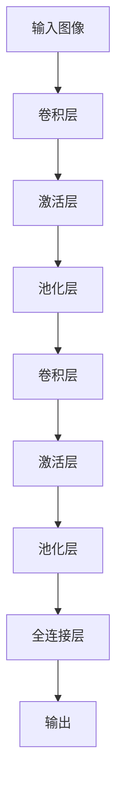
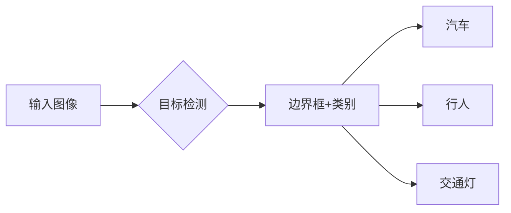
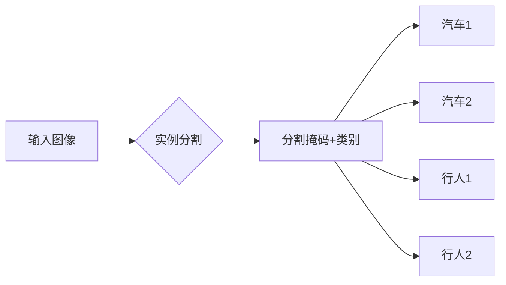
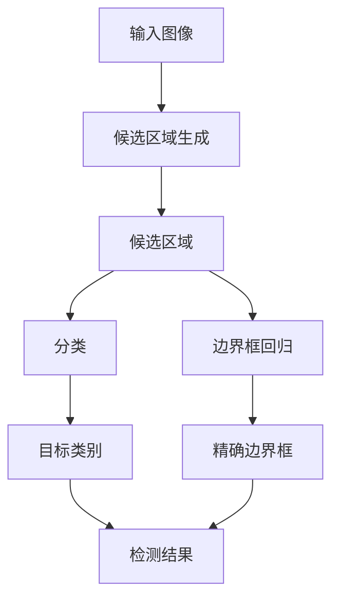
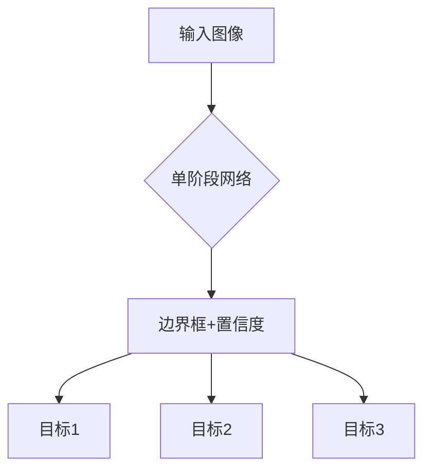
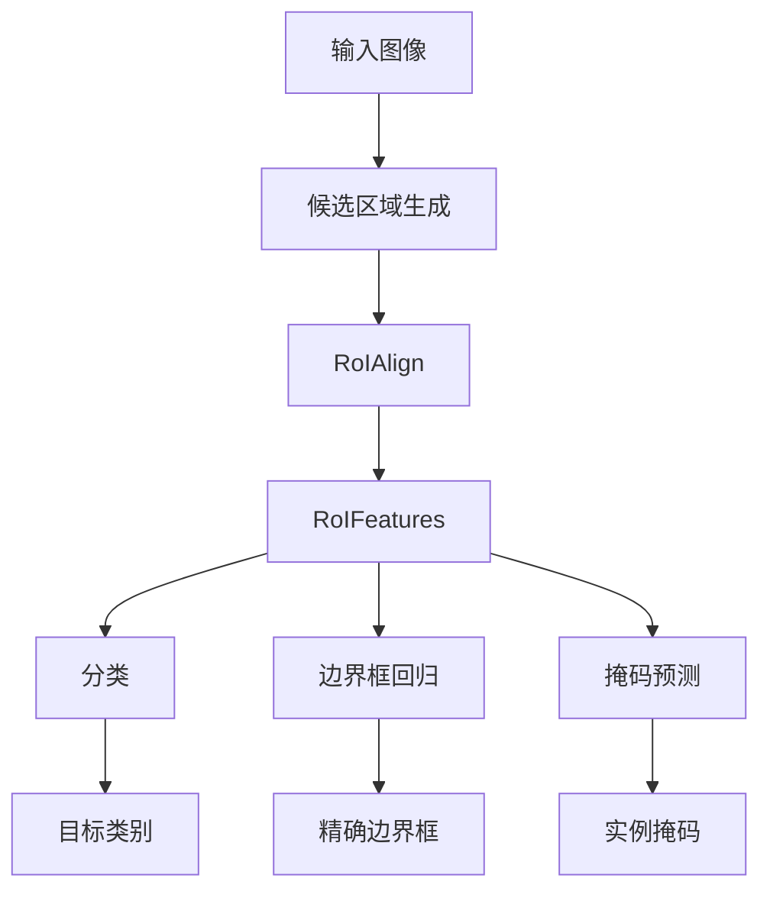
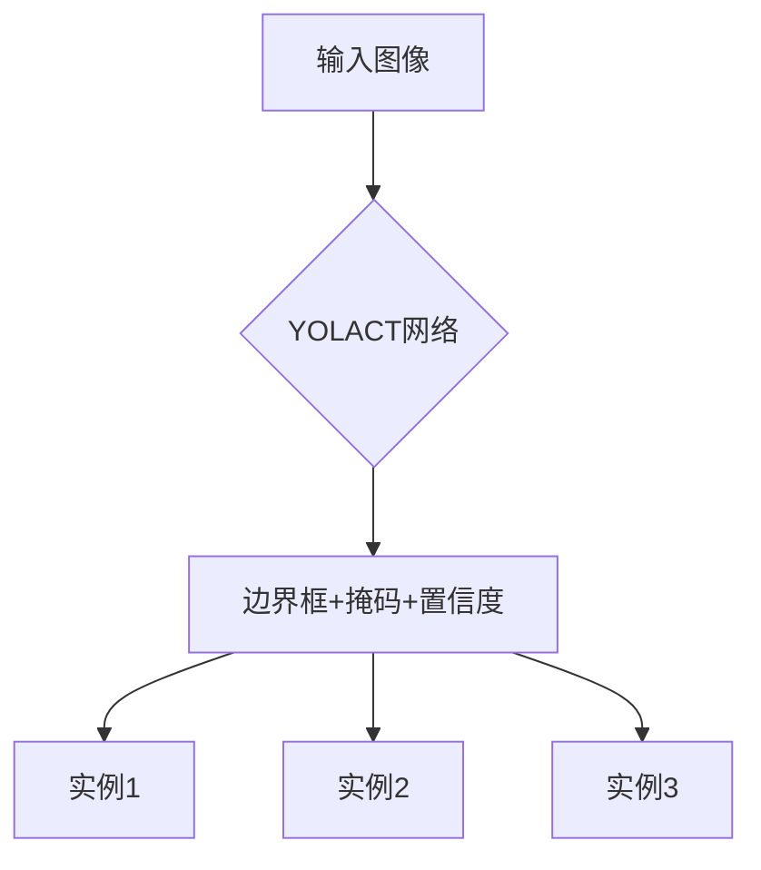

好的，我会按照要求撰写这篇技术博客文章。

# Computer Vision Techniques 原理与代码实战案例讲解

## 1. 背景介绍

### 1.1 问题的由来

在当今数字时代,图像和视频数据的产生和传播速度前所未有地快。从社交媒体上的自拍照片到安防监控录像,从航拍影像到医学影像扫描,图像和视频数据无处不在。然而,如何高效、准确地从这些海量视觉数据中提取有价值的信息,一直是计算机视觉领域的核心挑战。

传统的图像处理方法主要依赖于人工设计的特征提取算子,例如霍夫变换、Harris角点检测等,这些方法需要大量的领域知识和人工参与。随着深度学习技术的兴起,计算机视觉领域发生了革命性的变化。卷积神经网络(CNN)可以自主学习图像的特征表示,大大提高了视觉任务的性能,推动了计算机视觉技术在多个领域的落地应用。

### 1.2 研究现状  

近年来,计算机视觉技术取得了长足的进步,在图像分类、目标检测、实例分割、3D重建等任务上,深度学习模型的性能已经超越了人类水平。随着模型规模和训练数据的不断增长,计算机视觉的应用领域也在不断扩展,包括自动驾驶、机器人视觉、医疗影像分析等前沿领域。

然而,现有的计算机视觉模型也存在一些局限性:

1. **数据饥渴**:深度神经网络对大规模标注数据的需求巨大,而高质量的标注数据获取成本很高。
2. **泛化能力差**:在分布偏移或出现对抗样本时,模型的性能会显著下降,缺乏鲁棒性。
3. **可解释性低**:神经网络是一个黑盒模型,其内部工作机理并不透明,缺乏可解释性。
4. **效率低下**:大型神经网络的计算和存储开销巨大,在终端设备上的应用受到限制。

因此,如何设计出数据高效、泛化性强、可解释且高效的计算机视觉模型,是当前研究的重点和挑战。

### 1.3 研究意义

计算机视觉技术的突破将为人工智能系统赋予"视觉"能力,从而推动智能系统在多个领域的应用,对经济和社会产生深远的影响:

1. **智能驾驶**:视觉感知是自动驾驶系统的"眼睛",是实现无人驾驶的关键。
2. **智能制造**:机器人视觉可大幅提高工业生产的自动化和智能化水平。
3. **智能医疗**:医疗影像分析可提高疾病的早期检测和诊断准确性。
4. **智能安防**:视频结构化分析能够实现智能监控、行为分析等安防功能。
5. **智能零售**:视觉识别技术可应用于无人商店、数字化货架等零售场景。

因此,推动计算机视觉技术的创新与突破,对于建设智能社会、提高生产效率和生活质量,具有重要的现实意义。

### 1.4 本文结构

本文将系统介绍计算机视觉的核心技术、算法原理、数学模型以及实战案例,内容安排如下:

- 第2章介绍计算机视觉的核心概念,如CNN、目标检测、实例分割等。
- 第3章重点讲解目标检测和实例分割算法的原理和具体操作步骤。
- 第4章推导目标检测和实例分割任务中常用的数学模型和公式。
- 第5章提供开源代码实战案例,并对代码进行详细解释和分析。
- 第6章介绍计算机视觉技术在自动驾驶、机器人视觉等领域的应用场景。
- 第7章推荐相关的学习资源、开发工具和论文。
- 第8章总结计算机视觉的发展趋势和面临的挑战。
- 第9章列出常见的问题和解答。

## 2. 核心概念与联系

计算机视觉是一个跨学科的研究领域,涉及模式识别、图像处理、计算机图形学、机器学习等多个领域的理论和技术。本节将介绍计算机视觉的几个核心概念。

### 2.1 卷积神经网络

卷积神经网络(Convolutional Neural Network, CNN)是深度学习在计算机视觉领域的核心模型,其灵感来源于生物视觉系统的神经结构。CNN由多个卷积层和池化层交替组成,用于自动学习图像的层次特征表示。



CNN的关键创新在于引入了卷积运算和权值共享机制,使得网络能够有效地捕获图像的局部模式和层次结构信息。经过大规模数据的训练,CNN可以自动学习多尺度、位移不变的视觉特征表示,在图像分类、目标检测等任务上取得了卓越的性能。

### 2.2 目标检测

目标检测(Object Detection)是计算机视觉的一个核心任务,旨在从图像或视频中定位并识别出感兴趣的目标实例。目标检测算法需要同时回答"图像中有什么"和"它们在哪里"这两个问题。



目标检测在许多应用场景中扮演着重要角色,如安防监控、自动驾驶、机器人视觉等。常见的目标检测算法包括基于区域的全卷积网络(R-CNN)、单阶段检测器(YOLO、SSD)等。

### 2.3 实例分割

实例分割(Instance Segmentation)是目标检测的一个延伸和加强,不仅需要识别出目标的类别和位置,还需要对每个目标实例精确分割出它的像素掩码。实例分割是一项更加细粒度和困难的视觉任务。



实例分割技术可广泛应用于自动驾驶(精确识别道路上的目标)、增强现实(准确分割前景和背景)、视频分析(跟踪和分割运动目标)等领域。常见的实例分割算法有Mask R-CNN、YOLACT等。

### 2.4 其他视觉任务

除了上述核心任务,计算机视觉还包括图像分类、语义分割、3D重建、视频理解、人脸识别等多个子领域和任务。这些视觉任务相互关联,往往会结合使用,共同支撑更加复杂的人工智能应用。

- **图像分类**:将图像划分到预定义的类别中,如识别图像中是否包含猫或狗。
- **语义分割**:对图像中的每个像素点进行分类,标注出属于不同语义类别的区域。
- **3D重建**:从一个或多个视角的2D图像中估计并重建出3D物体的形状和结构。
- **视频理解**:从视频序列中检测、识别和理解运动目标,并预测其未来运动轨迹。
- **人脸识别**:从图像或视频中检测和识别出人脸身份。

这些视觉任务的研究进展将进一步扩展计算机视觉的应用领域,推动智能系统的发展。

## 3. 核心算法原理与具体操作步骤

在上一节中,我们介绍了计算机视觉的核心概念,本节将重点讲解目标检测和实例分割这两个核心任务的算法原理和具体操作步骤。

### 3.1 算法原理概述

#### 3.1.1 目标检测算法

目标检测算法可分为基于区域的两阶段算法和单阶段算法两大类:

**基于区域的两阶段算法**

这类算法先生成一组候选区域,然后对每个候选区域进行目标分类和边界框回归,典型代表有R-CNN系列算法。



1) 第一阶段生成候选区域,通常使用选择性搜索(Selective Search)等算法。
2) 第二阶段对每个候选区域提取特征,使用分类器判断是否包含目标,并进行边界框回归获取精确的目标位置。

**单阶段算法**

这类算法将候选区域生成和目标分类回归合并为一个统一的网络,端到端地直接预测目标位置和类别,如YOLO、SSD等。



1) 将整个输入图像划分为密集的默认框。
2) 对每个默认框同时预测目标分数和边界框回归参数。
3) 使用非极大值抑制(NMS)去除重复的检测框。

相比两阶段算法,单阶段算法计算效率更高,但检测精度通常较低。

#### 3.1.2 实例分割算法

实例分割算法在目标检测的基础上,增加了对每个实例的像素级掩码的预测,常见的解决方案有:

**Mask R-CNN**

Mask R-CNN在Faster R-CNN的基础上,为每个候选区域增加了一个分支网络,并行地预测实例掩码。



1) 使用Faster R-CNN生成候选区域和RoI特征。
2) 将RoI特征分别输入分类、回归和掩码预测三个并行的子网络。
3) 融合三个分支的输出作为最终的实例分割结果。

**YOLACT**

YOLACT将实例分割问题转化为一个并行的实例掩码预测问题,使用全卷积网络直接预测每个实例的掩码。



1) 将输入图像划分为密集的默认框。
2) 对每个默认框并行预测目标分数、边界框回归和实例掩码。
3) 使用非极大值抑制获得最终的实例分割结果。

相比Mask R-CNN,YOLACT计算更加高效,但检测精度略低。实例分割算法的发展正朝着更高效、更精确的方向不断演进。

### 3.2 算法步骤详解

接下来,我们将详细解析目标检测算法YOLO和实例分割算法Mask R-CNN的具体操作步骤。

#### 3.2.1 YOLO目标检测算法

YOLO(You Only Look Once)是一种流行的单阶段目标检测算法,其最新版本为YOLOv5。我们以YOLOv5为例,介绍YOLO算法的具体步骤。

**Step 1. 网络架构**

YOLOv5采用了一种新的网络架构Focus,通过切片和逐点相加的方式,将输入图像分成多个尺度特征,并融合到主干网络中。

```mermaid
graph TD
    A[输入图像] --> B[Focus模块]