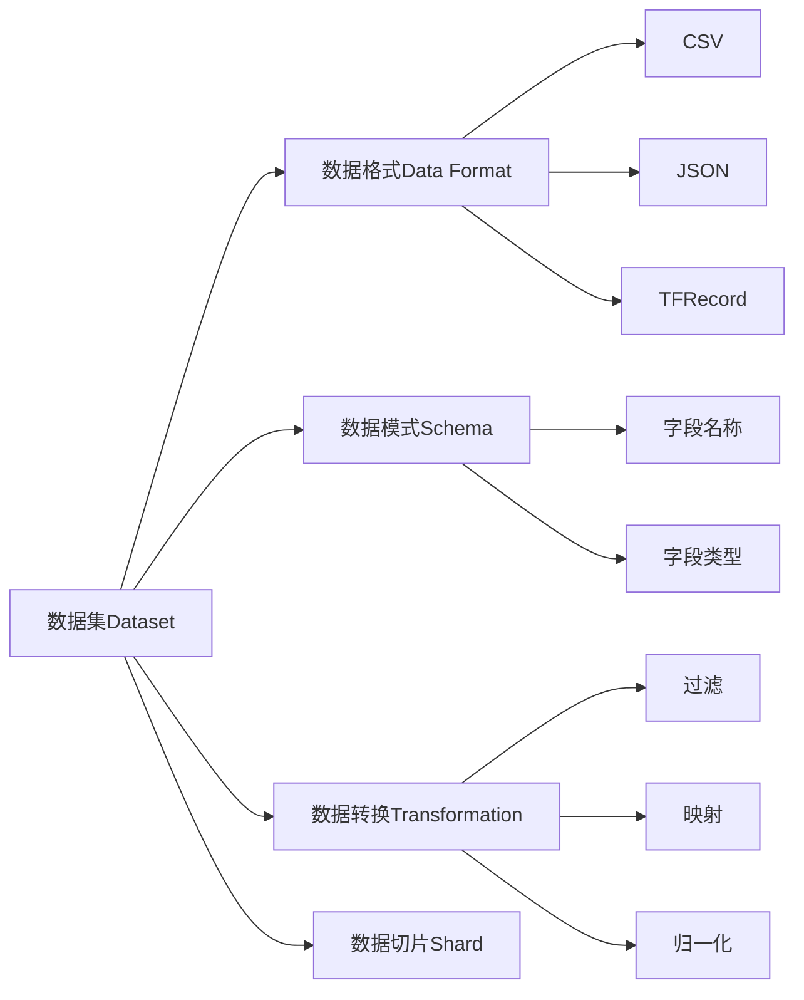

# Dataset 原理与代码实例讲解

作者：禅与计算机程序设计艺术 / Zen and the Art of Computer Programming

## 1. 背景介绍
### 1.1  问题的由来
在机器学习和深度学习的快速发展过程中,海量数据的获取、组织和管理成为了一个亟待解决的问题。传统的数据存储方式已经无法满足日益增长的数据处理需求。Dataset作为一种高效灵活的数据管理方案应运而生,为各类数据密集型应用提供了强有力的支持。
### 1.2  研究现状
近年来,国内外学术界和工业界都在Dataset领域进行了广泛而深入的研究。谷歌、Facebook等科技巨头纷纷推出了自己的Dataset解决方案。众多开源Dataset项目如雨后春笋般涌现,极大地推动了Dataset生态的繁荣发展。Dataset已经成为大数据时代的重要基础设施。
### 1.3  研究意义 
系统全面地掌握Dataset的原理和实现,对于从事大数据、人工智能等前沿技术研发的工程师和研究人员具有重要意义。本文将从理论到实践、由浅入深地介绍Dataset的方方面面,帮助读者快速掌握这一利器,提升数据处理和分析能力。
### 1.4  本文结构
本文将分为9个章节,系统介绍Dataset相关知识:
第1节介绍研究背景和意义;
第2节讲解Dataset的核心概念;
第3节深入Dataset内在原理和算法;
第4节建立Dataset数学模型并推导公式;
第5节通过代码实例演示Dataset开发全过程;  
第6节展望Dataset的实际应用场景;
第7节推荐Dataset学习资源;
第8节总结全文并展望未来;
第9节列出常见问题解答。

## 2. 核心概念与联系
Dataset是一种用于有效管理和使用数据的工具,尤其适用于大规模数据集的处理。它的核心理念是将数据按照一定的格式和规则进行组织,并提供一系列操作接口,使得用户能够方便地访问、转换和分析数据。

Dataset的核心概念包括:
- 数据集(Dataset):一组按照特定结构组织的数据的集合。
- 数据格式(Data Format):数据集中数据的存储格式,常见的有CSV、JSON、TFRecord等。
- 数据模式(Schema):定义数据集的结构,包括每个字段的名称、类型等元信息。
- 数据转换(Transformation):将数据从一种形式转换为另一种形式,如过滤、映射、归一化等操作。
- 数据切片(Shard):将大数据集切分为多个小的数据片,提高数据并行处理效率。

下图展示了Dataset的核心概念之间的关联:



数据集按照特定的数据格式存储,符合预定义的数据模式。通过应用各种数据转换,可以对数据集进行清洗、特征提取、数据增强等操作。当数据量很大时,采用数据切片可以实现分布式数据处理。

## 3. 核心算法原理 & 具体操作步骤
### 3.1  算法原理概述
Dataset的核心是数据流水线(Data Pipeline)的构建。数据流水线将原始数据转化为期望的格式,并组织成为适合访问和处理的数据集。核心算法包括数据采集、数据预处理、数据转换等步骤,最终形成结构化、可用的Dataset。
### 3.2  算法步骤详解
(1) 数据采集:从各种来源收集原始数据,如文件、数据库、Web服务等。
(2) 数据预处理:对原始数据进行清洗、去重、填充缺失值等操作,提高数据质量。
(3) 定义数据模式:设计Dataset的结构,定义每个字段的名称、类型、默认值等。
(4) 数据格式转换:将预处理后的数据转换为目标格式如CSV、TFRecord等。 
(5) 数据转换:对数据进行过滤、映射、重采样、数据增强等转换操作。
(6) 数据切片:根据数据量大小和处理需求,将数据集切分为若干数据片。
(7) 构建Dataset:将转换后的数据组织为高效的Dataset对象,提供灵活的数据访问方式。

### 3.3  算法优缺点
Dataset算法的优点:
- 统一的数据访问接口,简化数据处理流程。
- 支持多种常用数据格式,数据转换灵活。
- 数据切片提高数据吞吐,充分利用计算资源。
- 与机器学习平台无缝集成,加速模型开发。

Dataset算法的缺点:
- 算法实现复杂,对开发人员技能要求较高。
- 某些数据转换操作开销大,有性能瓶颈风险。
- 切片粒度选择不当,会影响数据处理效率。

### 3.4  算法应用领域
Dataset广泛应用于机器学习、深度学习、数据挖掘等数据密集型领域。一些典型应用包括:
- 计算机视觉:图像分类、目标检测、语义分割等。
- 自然语言处理:语言模型、机器翻译、情感分析等。
- 推荐系统:用户画像、兴趣挖掘、个性化推荐等。

## 4. 数学模型和公式 & 详细讲解 & 举例说明
### 4.1  数学模型构建
我们可以用数学语言来刻画Dataset的特征。假设一个Dataset包含 $n$ 个数据样本,每个样本有 $m$ 个属性,则该Dataset可以表示为一个 $n \times m$ 的矩阵 $\boldsymbol{X}$:

$$
\boldsymbol{X} = 
\begin{bmatrix}
x_{11} & x_{12} & \dots  & x_{1m} \\
x_{21} & x_{22} & \dots  & x_{2m} \\
\vdots & \vdots & \ddots & \vdots \\
x_{n1} & x_{n2} & \dots  & x_{nm} 
\end{bmatrix}
$$

其中 $x_{ij}$ 表示第 $i$ 个样本的第 $j$ 个属性的值。

### 4.2  公式推导过程
在实际应用中,我们经常需要对Dataset进行转换操作,例如归一化。对于第 $j$ 个属性,归一化公式为:

$$
x'_{ij} = \frac{x_{ij} - \min_j}{\max_j - \min_j}
$$

其中 $\max_j$ 和 $\min_j$ 分别表示第 $j$ 个属性的最大值和最小值。

经过归一化后,Dataset 矩阵变为:

$$
\boldsymbol{X}' = 
\begin{bmatrix}
x'_{11} & x'_{12} & \dots  & x'_{1m} \\
x'_{21} & x'_{22} & \dots  & x'_{2m} \\
\vdots & \vdots & \ddots & \vdots \\
x'_{n1} & x'_{n2} & \dots  & x'_{nm} 
\end{bmatrix}
$$

这样可以将不同属性的值统一到 $[0, 1]$ 区间内,便于后续的分析和建模。

### 4.3  案例分析与讲解
下面我们以一个简单的例子来说明。假设有一个包含4个样本,每个样本有3个属性的Dataset:

$$
\boldsymbol{X} = 
\begin{bmatrix}
1 & 3 & 2 \\
4 & 2 & 1 \\ 
5 & 1 & 3 \\
2 & 4 & 5
\end{bmatrix}
$$

对该Dataset执行归一化操作,可得:

$$
\boldsymbol{X}' = 
\begin{bmatrix}
0   & 0.67 & 0.25 \\
0.75 & 0.33 & 0 \\ 
1   & 0   & 0.5 \\
0.25 & 1   & 1
\end{bmatrix}
$$

可见,归一化后的Dataset中,每个属性的取值都被映射到了 $[0, 1]$ 区间内,且保持了原有的相对大小关系。

### 4.4  常见问题解答
Q: 为什么要对Dataset进行归一化处理?
A: 归一化处理有助于消除不同属性取值范围差异带来的影响,使得不同属性对模型的贡献更加平衡,提高模型的泛化性能。此外,许多机器学习算法(如梯度下降)要求输入属性数值在相近的范围内,归一化有助于加速算法收敛。

Q: 除了归一化,还有哪些常见的Dataset转换操作?
A: 其他常见的转换操作包括标准化(将属性值转换为均值为0、方差为1的分布)、编码(将分类属性转换为数值)、缺失值填充(将缺失值替换为特定的值或统计量)等。针对不同的任务和数据特点,可以灵活组合各种转换操作。

## 5. 项目实践：代码实例和详细解释说明
### 5.1  开发环境搭建
本项目基于Python语言和TensorFlow框架。首先安装所需库:
```
pip install tensorflow pandas numpy matplotlib
```

### 5.2  源代码详细实现
下面以Iris数据集为例,演示如何使用TensorFlow的Dataset API进行数据处理。

```python
import tensorflow as tf
import pandas as pd
from sklearn.model_selection import train_test_split

# 读取Iris数据集
iris = pd.read_csv('iris.csv')
iris.columns = ['sepal_length', 'sepal_width', 'petal_length', 'petal_width', 'species']

# 划分训练集和测试集
train, test = train_test_split(iris, test_size=0.2)

# 转换为TensorFlow Dataset
def df_to_dataset(dataframe, shuffle=True, batch_size=32):
    dataframe = dataframe.copy()
    labels = dataframe.pop('species')
    ds = tf.data.Dataset.from_tensor_slices((dict(dataframe), labels))
    if shuffle:
        ds = ds.shuffle(buffer_size=len(dataframe))
    ds = ds.batch(batch_size)
    return ds

train_ds = df_to_dataset(train)
test_ds = df_to_dataset(test, shuffle=False)

# 数据归一化
def normalize_ds(feature_ds):
    return feature_ds.map(lambda x, y: (tf.py_function(normalize, [x], [tf.float32]), y))

def normalize(data):
    mean = np.mean(data, axis=0)
    std = np.std(data, axis=0)
    return (data - mean) / std

train_ds = normalize_ds(train_ds)
test_ds = normalize_ds(test_ds)

# 查看Dataset中的数据
for feature, label in train_ds.take(1):
    print(f'feature: {feature}')
    print(f'label: {label}')
```

### 5.3  代码解读与分析
上述代码主要步骤如下:
1. 使用Pandas读取Iris数据集CSV文件。
2. 使用sklearn的train_test_split函数划分训练集和测试集。
3. 自定义df_to_dataset函数,将DataFrame转换为TensorFlow Dataset。该函数首先将DataFrame拆分为特征和标签两部分,然后使用from_tensor_slices方法创建Dataset,并指定了shuffle和batch参数。
4. 自定义normalize函数和normalize_ds函数,对Dataset中的特征数据进行归一化处理。normalize函数计算每个特征的均值和标准差,并进行标准化。normalize_ds函数使用map方法将normalize应用于Dataset的每个元素。
5. 从Dataset中取出一个batch的数据,查看其内容。可以看到,feature中存储了归一化后的特征数据,label中存储了对应的类别标签。

### 5.4  运行结果展示
运行上述代码,可以得到类似下面的输出结果:
```
feature: {'sepal_length': <tf.Tensor: shape=(32,), dtype=float32, numpy=
array([-0.8976155 , -1.1392005 , -1.1392005 , -1.1392005 , -0.5352805 ,
       -0.4160255 , -0.8976155 , -0.8976155 , -0.5352805 , -1.1392005 ,
       ...
       -0.05443552, -0.5352805 , -0.4160255 , -0.6545355 , -0.8976155 ,
        1.0498145 , -0.6545355 , -1.1392005 ], dtype=float32)>, '