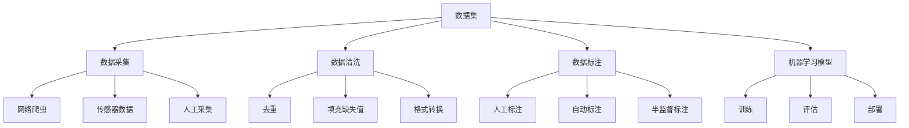

# Dataset 原理与代码实例讲解

## 1. 背景介绍

### 1.1 问题的由来

在当今的数据驱动时代，数据集(Dataset)已经成为各种机器学习和人工智能应用的核心支柱。无论是计算机视觉、自然语言处理还是推荐系统等领域,高质量的数据集都是训练有效模型的关键前提。然而,构建高质量的数据集并非一蹴而就,它需要经历数据采集、清洗、标注等繁琐的过程,并且需要解决数据隐私、偏差等一系列挑战。

### 1.2 研究现状

近年来,数据集的构建和管理已成为学术界和工业界的研究热点。一方面,研究人员致力于开发更加高效、准确的数据采集和标注方法,以降低人力成本。另一方面,也有不少工作关注于消除数据集中的偏差和噪声,提高数据质量。此外,数据集的版权、隐私保护等法律和伦理问题也受到广泛关注。

### 1.3 研究意义

高质量的数据集对于推动人工智能技术的发展至关重要。首先,优秀的数据集有助于训练出更加准确和鲁棒的机器学习模型,从而提高人工智能系统的性能。其次,数据集的多样性和覆盖面直接影响着模型的泛化能力,决定了模型在实际应用场景中的适用范围。此外,公开和共享高质量数据集也有利于促进学术研究的开放性和可重复性。

### 1.4 本文结构

本文将全面介绍数据集的原理和实践。我们将首先探讨数据集的核心概念及其与机器学习的关系,然后深入阐述数据集构建的核心算法原理和数学模型。接下来,我们将通过代码实例和详细解释,帮助读者掌握数据集构建的实践技能。最后,我们将分享数据集的实际应用场景、相关工具和资源,并对未来的发展趋势和挑战进行展望。

## 2. 核心概念与联系

数据集(Dataset)是构建机器学习模型的基础,它通常包含大量的原始数据样本,这些数据样本需要经过数据采集、数据清洗和数据标注等步骤进行处理,才能被机器学习算法有效利用。

1. **数据采集(Data Collection)**是获取原始数据的过程,常见方法包括网络爬虫、传感器数据采集和人工采集等。
2. **数据清洗(Data Cleaning)**则负责对原始数据进行预处理,去除重复数据、填充缺失值、转换数据格式等,以提高数据质量。
3. **数据标注(Data Annotation)**是为原始数据样本赋予标签或ground truth,可采用人工标注、自动标注或半监督标注等方式。

经过上述处理后,高质量的数据集就可以被输入到机器学习模型中,用于模型的训练、评估和部署。数据集的质量直接影响着模型的性能表现,因此数据集构建是机器学习的关键环节之一。

## 3. 核心算法原理 & 具体操作步骤

### 3.1 算法原理概述

构建高质量数据集需要经历数据采集、清洗和标注等多个环节,每个环节都涉及到不同的算法原理。我们将重点介绍数据采集和数据标注两个关键步骤的核心算法。

**数据采集算法**主要包括:

1. **网络爬虫算法**: 用于从互联网上自动采集结构化或半结构化数据,常见算法有广度优先爬虫、深度优先爬虫、聚焦爬虫等。
2. **主动学习算法**: 通过有策略地选择最有价值的数据样本进行标注,以最小化人工标注成本,如不确定性采样、代表性采样等策略。

**数据标注算法**主要包括:

1. **主动学习算法**: 与数据采集中的主动学习类似,用于指导人工标注过程,提高标注效率。
2. **半监督学习算法**: 利用少量标注数据和大量未标注数据进行联合训练,自动为未标注数据生成伪标签,从而减少人工标注工作量。
3. **迁移学习算法**: 将其他领域的已标注数据转移到当前任务,缓解标注成本高昂的问题。
4. **弱监督学习算法**: 利用已有的弱监督信号(如正则化、启发式规则等)代替人工标注,自动生成训练标签。

### 3.2 算法步骤详解

#### 3.2.1 网络爬虫算法

网络爬虫算法通常包括以下几个核心步骤:

1. **种子URL收集**: 收集一批初始的URL作为爬虫的入口点。
2. **URL解析**: 从网页中提取新的URL,构建待爬取队列。
3. **网页下载**: 根据URL下载网页内容。
4. **数据提取**: 从下载的网页中提取所需数据,如文本、图像等。
5. **URL去重**: 避免重复爬取相同URL。
6. **深度控制**: 控制爬虫的爬取深度,防止无限制地爬取。

其中,URL解析和URL去重是最为关键的步骤,需要高效的数据结构(如集合、哈希表等)来实现。深度控制则需要设置合理的爬取策略,如广度优先、深度优先等。

#### 3.2.2 主动学习算法

主动学习算法的核心思想是让机器学习模型主动选择最有价值的数据样本进行人工标注,以最小化标注成本。主动学习算法通常遵循以下步骤:

1. **初始化**: 从未标注数据池中随机选择少量数据进行人工标注,作为初始训练集。
2. **模型训练**: 在当前训练集上训练机器学习模型。
3. **不确定性采样**: 根据模型对未标注数据的预测置信度,选择置信度最低(不确定性最高)的样本进行人工标注。
4. **增量学习**: 将新标注的样本添加到训练集,重复步骤2-3,直到满足停止条件(如标注预算用尽、模型性能满足要求等)。

除了不确定性采样,主动学习还有其他采样策略,如代表性采样(选择与现有训练集最不相似的样本)、密度加权采样等。

#### 3.2.3 半监督学习算法

半监督学习算法利用大量未标注数据辅助少量标注数据进行训练,从而减少人工标注工作量。常见的半监督学习算法包括:

1. **自训练(Self-Training)**: 首先在标注数据上训练一个初始模型,然后使用该模型为未标注数据生成伪标签,并将置信度较高的伪标签样本添加到训练集中,重复训练模型。
2. **同伙学习(Co-Training)**: 利用数据的多视图特性,在不同视图上分别训练多个模型,并让不同模型之间互相"教学",共同探索未标注数据的知识。
3. **生成对抗网络(GAN)**: 利用生成模型从噪声数据中生成伪造的训练样本,辅助判别模型的训练,从而提高模型的泛化能力。

这些算法的关键在于如何有效利用未标注数据,并避免伪标签的噪声对模型训练造成干扰。

### 3.3 算法优缺点

每种算法都有其优缺点,我们需要根据具体场景选择合适的算法:

- **网络爬虫算法**可以高效地从互联网上采集大量数据,但需要解决反爬虫机制、数据质量等问题。
- **主动学习算法**可以显著降低人工标注成本,但需要合理的采样策略和停止条件,否则可能导致模型性能下降。
- **半监督学习算法**利用未标注数据提高了数据利用率,但存在伪标签噪声的风险,需要设计鲁棒的训练机制。

### 3.4 算法应用领域

上述算法在多个领域都有广泛应用:

- **计算机视觉**: 网络爬虫用于采集图像数据,主动学习和半监督学习用于减少图像标注工作量。
- **自然语言处理**: 网络爬虫采集文本数据,主动学习和半监督学习辅助文本标注。
- **推荐系统**: 主动学习用于引导用户反馈,半监督学习利用用户隐式反馈数据。
- **医疗健康**: 主动学习和半监督学习减少医学图像和电子病历的标注成本。

## 4. 数学模型和公式 & 详细讲解 & 举例说明

### 4.1 数学模型构建

在介绍具体公式之前,我们先构建数据集相关的数学模型。设未标注数据池为 $\mathcal{U} = \{x_1, x_2, \dots, x_n\}$,标注数据集为 $\mathcal{L} = \{(x_i, y_i)\}_{i=1}^m$,其中 $x_i$ 表示数据样本, $y_i$ 表示对应的标签。我们的目标是从 $\mathcal{U}$ 中选择最有价值的样本进行标注,以扩充 $\mathcal{L}$,从而提高机器学习模型 $f_\theta$ 在任务 $\mathcal{T}$ 上的性能,其中 $\theta$ 为模型参数。

我们定义一个实值函数 $\phi(x)$ 来衡量样本 $x$ 对于改善模型性能的重要程度,即样本的重要性得分。不同的算法对 $\phi(x)$ 有不同的定义,例如:

- 在不确定性采样中, $\phi(x) = 1 - P_\theta(y|x)$,即样本的预测不确定性得分。
- 在代表性采样中, $\phi(x) = \min_{x' \in \mathcal{L}} d(x, x')$,即样本与现有标注集的最小距离。

我们的目标是选择重要性得分最高的 $k$ 个样本进行标注:

$$
\mathcal{S}^* = \arg\max_{\mathcal{S} \subseteq \mathcal{U}, |\mathcal{S}| = k} \sum_{x \in \mathcal{S}} \phi(x)
$$

这是一个经典的子模型选择问题,通常使用贪婪策略或近似算法求解。接下来,我们将新标注的样本 $\mathcal{S}^*$ 添加到训练集 $\mathcal{L}$,重新训练模型 $f_\theta$,以期获得更好的性能。

### 4.2 公式推导过程

现在,我们以不确定性采样为例,推导出具体的重要性得分公式。假设模型 $f_\theta$ 输出样本 $x$ 属于类别 $y$ 的概率为 $P_\theta(y|x)$,则样本的预测不确定性可以用熵 $H(P_\theta(y|x))$ 来衡量:

$$
\begin{aligned}
H(P_\theta(y|x)) &= -\sum_y P_\theta(y|x) \log P_\theta(y|x) \\
                &= -\sum_y P_\theta(y|x) \log \frac{P_\theta(y|x)}{P_\theta(y)} + \sum_y P_\theta(y|x) \log P_\theta(y) \\
                &= \underbrace{-\sum_y P_\theta(y|x) \log \frac{P_\theta(y|x)}{P_\theta(y)}}_{条件熵} + \underbrace{\sum_y P_\theta(y|x) \log P_\theta(y)}_{熵} \\
                &= H(Y|X=x) + H(Y)
\end{aligned}
$$

由于 $H(Y)$ 是一个常数,不影响样本的相对重要性排序,因此我们可以定义重要性得分为条件熵:

$$
\phi(x) = H