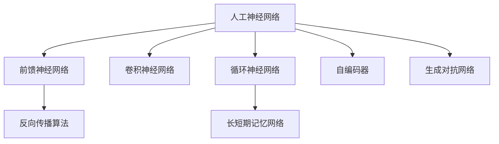

# Deep Learning原理与代码实例讲解

## 1. 背景介绍
### 1.1  问题的由来
近年来,人工智能技术飞速发展,其中最引人注目的当属深度学习(Deep Learning)。深度学习作为机器学习的一个重要分支,通过构建多层神经网络,模拟人脑学习和思考的过程,在图像识别、语音识别、自然语言处理等领域取得了突破性进展。然而,对于很多初学者来说,深度学习的原理和实现过程似乎充满神秘感。本文将从原理到实践,全面讲解深度学习的核心概念和代码实现,帮助读者快速入门这一前沿技术。

### 1.2  研究现状
目前,深度学习已经成为学术界和工业界的研究热点。从最初的感知机,到如今的卷积神经网络(CNN)、循环神经网络(RNN)、生成对抗网络(GAN)等各种网络结构层出不穷。谷歌、微软、百度等科技巨头纷纷投入巨资,在深度学习领域展开激烈竞争。同时,PyTorch、TensorFlow等深度学习框架的出现,大大降低了深度学习模型的开发门槛,推动了深度学习在各行各业的应用。

### 1.3  研究意义
深度学习作为人工智能的核心技术之一,对于推动人类社会进步具有重要意义。一方面,深度学习在计算机视觉、语音识别、自然语言处理等领域的应用,极大提高了机器感知和理解世界的能力,为人机交互、智能家居、无人驾驶等应用场景奠定了基础。另一方面,深度学习强大的特征提取和抽象能力,可以应用于医疗诊断、金融风控、工业质检等众多领域,提升生产效率,创造巨大经济价值。因此,深入研究深度学习技术,对于个人成长和社会发展都具有重要意义。

### 1.4  本文结构
本文将分为以下几个部分展开讲解:
- 第二部分介绍深度学习的核心概念及其内在联系。
- 第三部分详细讲解深度学习的核心算法原理和具体操作步骤。  
- 第四部分介绍深度学习常用的数学模型和公式,并结合案例进行详细讲解。
- 第五部分通过代码实例,演示如何使用Python和PyTorch实现经典的深度学习模型。
- 第六部分总结深度学习的实际应用场景及未来发展趋势。
- 第七部分推荐深度学习的学习资源、开发工具和相关论文。
- 第八部分对全文进行总结,并展望深度学习未来的发展方向和挑战。
- 第九部分列举深度学习常见的问题,并给出解答。

## 2. 核心概念与联系
深度学习的核心概念包括:

1. 人工神经网络(Artificial Neural Network):模仿生物神经网络,由大量神经元节点组成的计算模型。
2. 前馈神经网络(Feedforward Neural Network):信息单向传播,没有反馈回路的人工神经网络。
3. 反向传播算法(Backpropagation):通过损失函数的梯度下降,调整网络权重参数的训练算法。
4. 卷积神经网络(Convolutional Neural Network):一种结构类似视觉皮层的前馈神经网络,主要用于图像识别。
5. 循环神经网络(Recurrent Neural Network):一种适合处理序列数据的神经网络,在语音识别、机器翻译等领域广泛应用。
6. 长短期记忆网络(Long Short-Term Memory):一种特殊的RNN,通过门控单元缓解了梯度消失问题,能够学习长期依赖关系。
7. 自编码器(Autoencoder):一种无监督学习算法,将输入数据编码为低维表示,再解码恢复原始数据。
8. 生成对抗网络(Generative Adversarial Network):由生成器和判别器组成,通过两个网络的博弈生成逼真的样本数据。

下图展示了这些核心概念之间的联系:

可以看出,人工神经网络是深度学习的基础,其他各种网络结构都是在此基础上的延伸和变种。前馈神经网络采用反向传播算法进行训练优化。CNN和RNN分别针对图像和序列数据进行特殊设计。自编码器和GAN则主要用于无监督学习和生成任务。理解这些概念之间的内在联系,有助于我们更好地把握深度学习的全貌。

## 3. 核心算法原理 & 具体操作步骤
### 3.1  算法原理概述
深度学习的核心是通过构建多层神经网络,自动学习数据的层次化特征表示。网络的基本组成单元是神经元,每个神经元接收一组输入,通过加权求和和非线性变换得到输出。多个神经元按层级连接,形成前馈神经网络的基本结构。网络的训练过程通过反向传播算法,利用损失函数的梯度信息,自动调整各层权重参数,使得网络输出与真实标签尽可能接近。

### 3.2  算法步骤详解
以最简单的三层前馈神经网络为例,详细讲解深度学习算法的执行步骤:

输入层:接收原始数据$\boldsymbol{x}$,维度为$n$。

隐藏层:共$m$个神经元,激活函数为$f$,权重矩阵为$\boldsymbol{W}_{1} \in \mathbb{R}^{m \times n}$,偏置向量为$\boldsymbol{b}_{1} \in \mathbb{R}^{m}$。隐藏层输出$\boldsymbol{a}$计算公式为:

$$
\boldsymbol{a} = f(\boldsymbol{W}_{1}\boldsymbol{x} + \boldsymbol{b}_{1})
$$

输出层:共$k$个神经元,激活函数为$g$,权重矩阵为$\boldsymbol{W}_{2} \in \mathbb{R}^{k \times m}$,偏置向量为$\boldsymbol{b}_{2} \in \mathbb{R}^{k}$。输出层输出$\boldsymbol{\hat{y}}$计算公式为:

$$
\boldsymbol{\hat{y}} = g(\boldsymbol{W}_{2}\boldsymbol{a} + \boldsymbol{b}_{2})
$$

损失函数:衡量网络预测输出与真实标签的差异,常用均方误差和交叉熵函数。以均方误差为例,其计算公式为:

$$
J(\boldsymbol{W},\boldsymbol{b}) = \frac{1}{2}\sum_{i=1}^{N}(\boldsymbol{\hat{y}}^{(i)} - \boldsymbol{y}^{(i)})^2
$$

反向传播:从输出层开始,逐层计算损失函数对各参数的梯度,并根据梯度下降算法更新参数。设学习率为$\eta$,则权重$\boldsymbol{W}$和偏置$\boldsymbol{b}$的更新公式为:

$$
\begin{aligned}
\boldsymbol{W} &:= \boldsymbol{W} - \eta \frac{\partial J}{\partial \boldsymbol{W}} \\
\boldsymbol{b} &:= \boldsymbol{b} - \eta \frac{\partial J}{\partial \boldsymbol{b}}
\end{aligned}
$$

重复迭代上述前向传播和反向传播过程,直到损失函数收敛或达到预设的训练轮数。

### 3.3  算法优缺点
深度学习算法的主要优点包括:

1. 强大的特征学习能力,可以自动提取高层抽象特征。
2. 端到端的训练方式,直接从原始数据中学习,减少了人工特征工程。 
3. 在大数据场景下表现出色,训练数据越多,模型性能越好。
4. 模型具有一定的泛化能力,可以应用于新的未知数据。

同时,深度学习算法也存在一些局限性:

1. 模型训练需要大量标注数据,获取成本较高。
2. 参数众多,训练时间长,计算资源要求高。
3. 模型的可解释性较差,容易成为"黑箱"。
4. 模型对参数初始化、网络结构设计较为敏感。

### 3.4  算法应用领域
深度学习算法在诸多领域取得了瞩目成就,主要应用场景包括:

- 计算机视觉:图像分类、目标检测、语义分割等
- 语音识别:语音转文本、说话人识别等  
- 自然语言处理:机器翻译、情感分析、文本生成等
- 推荐系统:个性化推荐、广告点击率预估等
- 生物信息:蛋白质结构预测、药物分子筛选等
- 金融科技:风险控制、反欺诈、量化交易等

随着深度学习理论的不断发展和计算能力的持续提升,未来有望在更广泛的领域发挥重要作用。

## 4. 数学模型和公式 & 详细讲解 & 举例说明
### 4.1  数学模型构建
深度学习的数学模型可以用层级结构的计算图来表示。对于$L$层的前馈神经网络,每层$l$的计算可以抽象为:

$$
\boldsymbol{a}^{[l]} = f^{[l]}(\boldsymbol{W}^{[l]}\boldsymbol{a}^{[l-1]} + \boldsymbol{b}^{[l]})
$$

其中,$\boldsymbol{a}^{[l]}$是第$l$层的激活值,$\boldsymbol{W}^{[l]}$和$\boldsymbol{b}^{[l]}$分别是第$l$层的权重矩阵和偏置向量,$f^{[l]}$是第$l$层的激活函数。

整个前馈传播过程可以表示为:

$$
\begin{aligned}
\boldsymbol{a}^{[0]} &= \boldsymbol{x} \\
\boldsymbol{a}^{[1]} &= f^{[1]}(\boldsymbol{W}^{[1]}\boldsymbol{a}^{[0]} + \boldsymbol{b}^{[1]}) \\ 
\boldsymbol{a}^{[2]} &= f^{[2]}(\boldsymbol{W}^{[2]}\boldsymbol{a}^{[1]} + \boldsymbol{b}^{[2]}) \\
&\cdots \\
\boldsymbol{\hat{y}} &= \boldsymbol{a}^{[L]} = f^{[L]}(\boldsymbol{W}^{[L]}\boldsymbol{a}^{[L-1]} + \boldsymbol{b}^{[L]}) 
\end{aligned}
$$

反向传播过程通过链式法则计算损失函数对每层参数的梯度:

$$
\begin{aligned}
\frac{\partial J}{\partial \boldsymbol{W}^{[l]}} &= \frac{\partial J}{\partial \boldsymbol{a}^{[l]}} \frac{\partial \boldsymbol{a}^{[l]}}{\partial \boldsymbol{z}^{[l]}} \frac{\partial \boldsymbol{z}^{[l]}}{\partial \boldsymbol{W}^{[l]}} \\
\frac{\partial J}{\partial \boldsymbol{b}^{[l]}} &= \frac{\partial J}{\partial \boldsymbol{a}^{[l]}} \frac{\partial \boldsymbol{a}^{[l]}}{\partial \boldsymbol{z}^{[l]}} \frac{\partial \boldsymbol{z}^{[l]}}{\partial \boldsymbol{b}^{[l]}}
\end{aligned}
$$

其中,$\boldsymbol{z}^{[l]} = \boldsymbol{W}^{[l]}\boldsymbol{a}^{[l-1]} + \boldsymbol{b}^{[l]}$是第$l$层的加权输入。

### 4.2  公式推导过程
以均方误差损失函数为例,推导出反向传播中的梯度计算公式。

假设最后一层$L$的激活函数为恒等函数,即$f^{[L]}(z) = z$,则均方误差损失函数为:

$$
\begin{aligned}
J(\boldsymbol{W},\boldsymbol{b}) &= \frac{1}{2}\sum_{i=1}^{