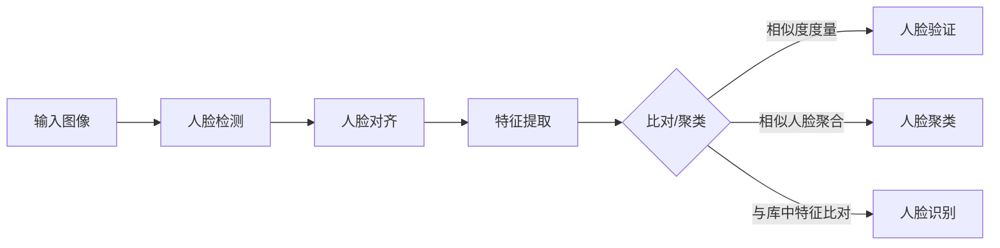

# Face Recognition原理与代码实例讲解

## 1. 背景介绍

### 1.1 问题的由来

人脸识别是计算机视觉和模式识别领域的一个重要研究课题。随着生物识别技术的不断发展,人脸识别以其直观、方便、不接触等优点成为了身份认证的重要手段之一。人脸识别在智能监控、人机交互、身份认证等诸多领域都有广泛的应用前景。

### 1.2 研究现状

目前,人脸识别技术已经取得了长足的进步。从早期的基于几何特征的方法,到基于统计学习的方法,再到如今基于深度学习的方法,人脸识别的性能不断提升。尤其是近年来,随着深度学习的兴起,卷积神经网络在人脸识别任务上展现出了巨大的优势,使得人脸识别的精度大幅提高。

### 1.3 研究意义

人脸识别技术的研究对于推动人工智能在生物特征识别领域的发展具有重要意义。一方面,人脸识别是身份认证的重要手段,在安防、金融等领域有着广泛需求;另一方面,人脸识别中的关键技术如特征提取、相似度度量等对其他模式识别任务也有重要的借鉴意义。因此,深入研究人脸识别技术,对于人工智能领域的进一步发展具有重要价值。

### 1.4 本文结构

本文将从以下几个方面对人脸识别技术进行详细阐述:

- 第2部分介绍人脸识别涉及的核心概念及其联系
- 第3部分详细讲解人脸识别的核心算法原理及具体步骤
- 第4部分给出人脸识别涉及的数学模型和公式推导
- 第5部分提供人脸识别的代码实例及详细解释
- 第6部分分析人脸识别的实际应用场景
- 第7部分推荐人脸识别相关的学习资源和开发工具
- 第8部分总结全文,并展望人脸识别技术的未来发展趋势和挑战
- 第9部分附录,回答人脸识别的一些常见问题

## 2. 核心概念与联系

人脸识别涉及的核心概念包括:

- 人脸检测(Face Detection):在图像或视频中定位人脸区域的过程。
- 人脸对齐(Face Alignment):将检测到的人脸归一化到标准姿态和大小,为后续特征提取做准备。
- 人脸表示(Face Representation):提取人脸的判别性特征,用于刻画不同人脸的差异性。常用的特征包括局部二值模式(LBP)、Gabor特征、深度学习特征等。
- 人脸比对(Face Matching):度量两张人脸的相似性,常用的度量包括欧氏距离、余弦相似度等。
- 人脸聚类(Face Clustering):将相似的人脸聚合在一起,形成不同人的人脸簇。
- 人脸验证(Face Verification):判断两张人脸是否属于同一个人。
- 人脸识别(Face Identification):在已知身份的人脸库中,判断待识别人脸属于哪个已知身份。

这些概念环环相扣,共同构成了人脸识别的核心流程。其中,人脸检测是人脸识别的前提,只有准确定位人脸,后续的特征提取和比对才有意义。人脸对齐消除了姿态、大小等因素的干扰,有利于提取鲁棒的特征。人脸表示旨在学习到判别性强的特征,使得不同人的人脸差异最大化。人脸比对则是度量人脸相似性的关键,直接影响识别的准确率。人脸聚类和验证是人脸识别的两大基本任务。

下图给出了人脸识别的核心流程示意:

## 3. 核心算法原理 & 具体操作步骤

### 3.1 算法原理概述

人脸识别的核心是学习人脸的判别性特征表示。传统方法多是手工设计特征,如LBP、Gabor等。近年来,随着深度学习的发展,卷积神经网络(CNN)逐渐成为人脸识别的主流方法。CNN通过逐层提取特征,可以自动学习到高判别力的人脸特征。

基于CNN的人脸识别流程通常包括:

1. 用带标签的人脸数据训练CNN,使其学习到判别性的人脸特征。常用的CNN结构包括VGGNet、ResNet等。
2. 用训练好的CNN对待识别人脸提取特征。提取到的特征通常是一个高维向量。
3. 用提取到的特征进行人脸比对或聚类,得到最终的识别结果。

### 3.2 算法步骤详解

下面以基于ResNet的人脸识别为例,详细讲解其步骤:

1. 人脸检测与对齐
   
使用MTCNN等算法在图像中检测人脸,并将检测到的人脸对齐到标准姿态和大小,如112x112。

2. 特征提取

将对齐后的人脸输入预训练的ResNet网络,提取其最后一层全连接层之前的特征,得到一个512维的特征向量。ResNet通过残差连接解决了深层网络的退化问题,可以有效提取判别性特征。

3. 人脸比对

通过计算两个特征向量的欧氏距离或余弦相似度,度量两张人脸的相似性。距离越小或相似度越大,说明两张人脸越可能属于同一个人。

4. 人脸聚类

使用聚类算法如k-means、DBSCAN等,将提取到的人脸特征进行聚类,将相似的人脸聚合在一起。每一个簇对应一个人的身份。

5. 人脸识别

将待识别人脸的特征与库中每个人的特征进行比对,找到相似度最高的身份作为识别结果。为提高检索效率,可先用聚类的方式缩小搜索范围。

### 3.3 算法优缺点

基于CNN的人脸识别具有如下优点:

- 通过端到端的学习,可自动提取判别性强的人脸特征,无需手工设计。
- 受姿态、光照等因素干扰小,具有较强的鲁棒性。
- 识别精度高,在大规模人脸库上表现出色。

同时也存在一些不足:

- 需要大量带标签的人脸数据进行训练,获取成本高。
- inference计算量大,对硬件要求较高。
- 对于遮挡、模糊等低质量人脸,识别精度下降明显。

### 3.4 算法应用领域

人脸识别在很多领域都有重要应用,如:

- 安防监控:通过人脸识别对场景中的人员进行身份核验,及时发现可疑人员。
- 人脸门禁:通过人脸识别代替传统的门禁卡,提高通行效率。
- 人脸考勤:通过人脸识别进行考勤签到,防止代打卡。
- 人脸支付:通过人脸识别进行身份核验,提供更便捷安全的支付方式。
- 照片管理:通过人脸识别对照片进行自动分类,方便用户管理和检索。

## 4. 数学模型和公式 & 详细讲解 & 举例说明

### 4.1 数学模型构建

人脸识别可以形式化为一个基于相似度度量的判别问题。假设有 $n$ 个已知身份,每个身份有 $m$ 张人脸图像。将这些图像表示为 $\{x_i^j\}$,其中 $i=1,2,\cdots,n$ 表示身份编号,$j=1,2,\cdots,m$ 表示同一身份下的不同人脸。

给定一张待识别的人脸 $y$,识别的目标是找到与之最相似的身份:

$$
identity(y) = \arg\max_{i} S(y, x_i^j) \quad j=1,2,\cdots,m
$$

其中 $S(·,·)$ 表示相似度度量函数,可以是欧氏距离、余弦相似度等。

为了学习判别性的人脸特征,通常使用三元组损失(Triplet Loss)作为CNN的训练目标:

$$
L = \sum_{i=1}^N \left[ \Vert f(x_i^a) - f(x_i^p)\Vert_2^2 - \Vert f(x_i^a) - f(x_i^n)\Vert_2^2 + \alpha \right]_+
$$

其中 $x_i^a$ 表示第 $i$ 个三元组的Anchor人脸,$x_i^p$ 表示与 $x_i^a$ 同一身份的Positive人脸,$x_i^n$ 表示与 $x_i^a$ 不同身份的Negative人脸。$f(·)$ 表示CNN提取的特征,$\alpha$ 是一个大于0的常数。

三元组损失使得同一身份的人脸特征距离尽可能小,不同身份的人脸特征距离尽可能大。通过最小化三元组损失,可以学习到判别性强的人脸特征。

### 4.2 公式推导过程

三元组损失的推导过程如下:

对于第 $i$ 个三元组 $(x_i^a, x_i^p, x_i^n)$,我们希望:

$$
\Vert f(x_i^a) - f(x_i^p)\Vert_2^2 + \alpha \leq \Vert f(x_i^a) - f(x_i^n)\Vert_2^2
$$

即Anchor与Positive的特征距离要比Anchor与Negative的特征距离小 $\alpha$。

将不等式变形可得:

$$
\Vert f(x_i^a) - f(x_i^p)\Vert_2^2 - \Vert f(x_i^a) - f(x_i^n)\Vert_2^2 + \alpha \leq 0
$$

为了对不满足约束的三元组进行惩罚,我们使用hinge loss,得到三元组损失的表达式:

$$
L_i = \left[ \Vert f(x_i^a) - f(x_i^p)\Vert_2^2 - \Vert f(x_i^a) - f(x_i^n)\Vert_2^2 + \alpha \right]_+
$$

其中 $[·]_+$ 表示取正部。将所有三元组的损失加和,得到最终的损失函数:

$$
L = \sum_{i=1}^N \left[ \Vert f(x_i^a) - f(x_i^p)\Vert_2^2 - \Vert f(x_i^a) - f(x_i^n)\Vert_2^2 + \alpha \right]_+
$$

最小化该损失函数,可以学习到判别性的人脸特征。

### 4.3 案例分析与讲解

下面以一个简单的例子说明三元组损失的作用。

假设我们有三个人的人脸数据,每人两张。将它们表示为 $(x_1^1, x_1^2), (x_2^1, x_2^2), (x_3^1, x_3^2)$。CNN提取的特征分别为:

$$
\begin{aligned}
f(x_1^1) &= (1.0, 0.5) \\
f(x_1^2) &= (0.8, 0.6) \\
f(x_2^1) &= (0.4, 1.0) \\
f(x_2^2) &= (0.5, 0.9) \\
f(x_3^1) &= (-0.8, -0.7) \\
f(x_3^2) &= (-0.7, -0.8)
\end{aligned}
$$

我们构造两个三元组 $(x_1^1, x_1^2, x_2^1)$ 和 $(x_2^1, x_2^2, x_3^1)$,其中前两个元素属于同一个人,第三个元素属于另一个人。

对于第一个三元组,有:

$$
\begin{aligned}
\Vert f(x_1^1) - f(x_1^2)\Vert_2^2 &= (1.0-0.8)^2 + (0.5-0.6)^2 = 0.05 \\
\Vert f(x_1^1) - f(x_2^1