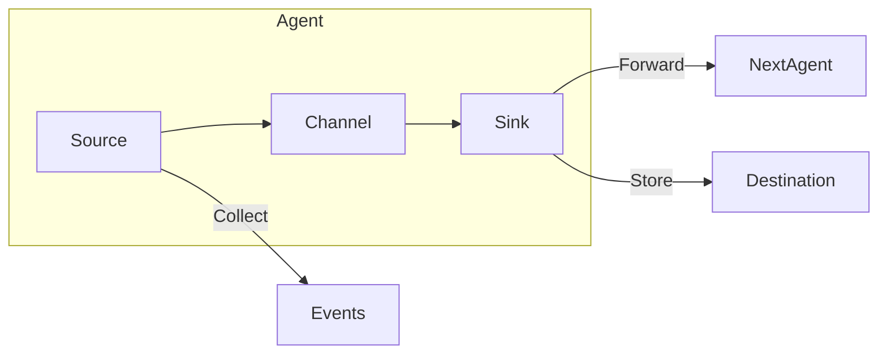
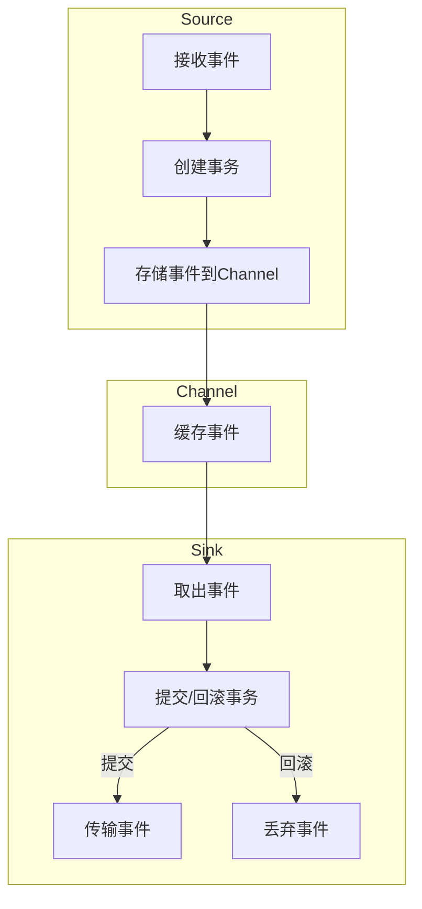
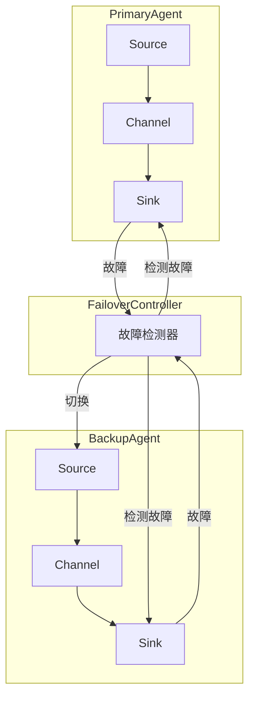
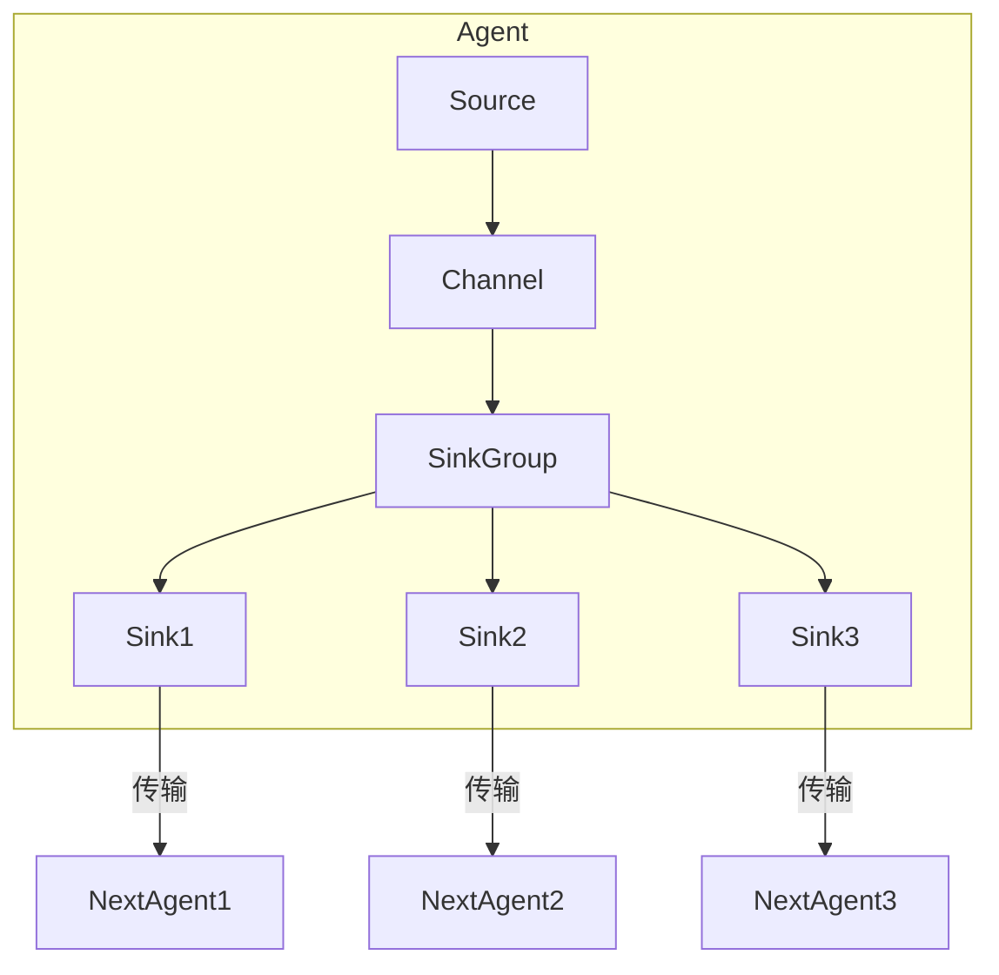
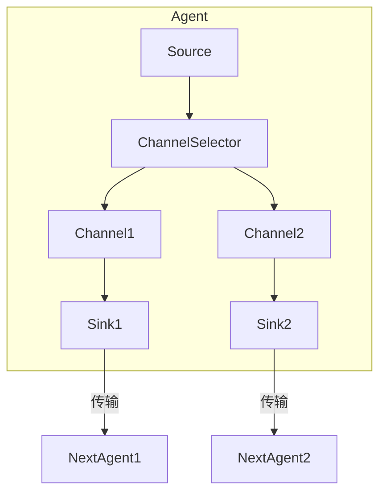

# Flume日志收集系统原理与代码实例讲解

## 1. 背景介绍

### 1.1 问题的由来

在当今大数据时代，海量的数据每时每刻都在被产生和传输。这些数据可能来自于各种不同的源头,例如Web服务器日志、应用程序日志、数据库日志、传感器数据等。有效地收集、传输和存储这些大量的数据对于数据分析和业务决策至关重要。然而,传统的日志收集方式面临着诸多挑战:

1. **数据来源分散**: 数据源头分散在不同的地理位置和异构系统中,导致数据收集困难。
2. **数据量大**: 现代应用系统产生的日志数据量巨大,传统的日志收集方式往往效率低下。
3. **实时性要求高**: 对于一些应用场景,需要实时收集和处理日志数据,以便及时发现和应对异常情况。
4. **可靠性和容错性**: 日志收集系统需要具备高可靠性和容错性,以确保数据的完整性和一致性。

为了解决这些挑战,Apache Flume应运而生。

### 1.2 研究现状

Apache Flume是一个分布式、可靠且可用的服务,用于高效地收集、聚合和移动大量的日志数据。它是Apache Hadoop生态系统中的一个重要组件,旨在为日志收集提供一个统一的解决方案。

Flume基于流式架构设计,支持从各种数据源收集数据,并将数据传输到不同的目的地(如HDFS、HBase、Kafka等)。它具有以下主要特点:

1. **简单灵活**: Flume使用简单的数据流模型,易于理解和配置。它支持各种数据源和目的地,并且可以通过插件机制进行扩展。
2. **可靠性高**: Flume提供了多种可靠性机制,如事务机制、故障转移机制等,确保数据在传输过程中不会丢失。
3. **高性能**: Flume采用了多线程和异步处理等技术,提高了数据传输效率。
4. **容错性好**: Flume支持故障自动恢复,并提供了多种备份和恢复策略。
5. **可扩展性强**: Flume可以通过添加更多的Agent节点来水平扩展,满足大规模日志收集的需求。

### 1.3 研究意义

作为Apache Hadoop生态系统中的重要组件,Flume在大数据领域发挥着重要作用。研究和掌握Flume的原理和实践对于以下方面具有重要意义:

1. **满足实时数据收集需求**: 通过Flume,可以实现对各种异构数据源的实时日志收集,为后续的数据处理和分析奠定基础。
2. **提高数据传输效率**: Flume采用了高效的数据传输机制,可以大幅提高日志收集的效率和吞吐量。
3. **保证数据完整性和可靠性**: Flume提供了多种可靠性机制,确保数据在传输过程中不会丢失或重复。
4. **实现弹性伸缩**: Flume具有良好的扩展性,可以通过添加更多Agent节点来水平扩展,满足大规模日志收集的需求。
5. **融入大数据生态系统**: 作为Hadoop生态系统的一部分,Flume可以与其他大数据组件(如HDFS、Kafka、HBase等)无缝集成,构建完整的大数据处理管道。

### 1.4 本文结构

本文将全面介绍Flume日志收集系统的原理和实践。文章主要包括以下几个部分:

1. **背景介绍**: 阐述日志收集的重要性和挑战,以及Flume的概念和特点。
2. **核心概念与联系**: 详细解释Flume的核心概念,如Agent、Source、Channel、Sink等,以及它们之间的关系。
3. **核心算法原理与具体操作步骤**: 深入剖析Flume的核心算法原理,包括事务机制、故障转移机制等,并详细介绍其具体操作步骤。
4. **数学模型和公式详细讲解与举例说明**: 构建Flume的数学模型,推导相关公式,并通过案例进行详细讲解和常见问题解答。
5. **项目实践:代码实例和详细解释说明**: 提供完整的Flume项目实践,包括开发环境搭建、源代码实现、代码解读与分析、运行结果展示等。
6. **实际应用场景**: 介绍Flume在实际生产环境中的应用场景,以及未来的应用展望。
7. **工具和资源推荐**: 推荐Flume相关的学习资源、开发工具、论文资料等。
8. **总结:未来发展趋势与挑战**: 总结Flume的研究成果,展望其未来发展趋势,并分析面临的挑战。
9. **附录:常见问题与解答**: 针对Flume的常见问题进行解答和说明。

通过本文的学习,读者可以全面掌握Flume日志收集系统的原理和实践,为大数据领域的日志收集奠定坚实基础。

## 2. 核心概念与联系

在深入探讨Flume的核心算法原理之前,我们需要先了解Flume的核心概念及它们之间的关系。Flume的核心概念包括:

1. **Event(事件)**: 表示一个数据流单元,它携带着一些字节数据。Flume的主要功能就是从源头收集事件,并将其传输到目的地。
2. **Agent(代理)**: 是一个独立的Flume进程,负责接收、存储和转发数据。每个Agent由一个Source、一个Channel和一个或多个Sink组成。
3. **Source(源头)**: 负责从外部系统收集数据,并将其存储到Channel中。Source可以是各种不同类型,如Avro Source、Syslog Source等。
4. **Channel(通道)**: 是一个可靠的事件存储器,用于缓存Source接收到的事件,直到它们被Sink消费。Channel有多种实现,如Memory Channel、File Channel等。
5. **Sink(目的地)**: 从Channel中取出事件,并将其传输到下一级Agent或最终目的地。Sink也有多种实现,如HDFS Sink、Kafka Sink等。
6. **Source/Channel/Sink组合**: 每个Agent都由一个Source、一个Channel和一个或多个Sink组成。Source将数据存储到Channel中,Sink从Channel中取出数据并将其传输到下一级Agent或最终目的地。

这些核心概念之间的关系如下所示:

在上图中,Source从外部系统收集事件,并将其存储到Channel中。Sink从Channel中取出事件,并将其转发到下一级Agent或最终目的地。整个数据流是通过多个Agent串联而成的。

需要注意的是,Flume支持多个Agent之间的链接,形成一个复杂的数据流拓扑结构。每个Agent可以有多个Source和多个Sink,从而实现数据的聚合和分发。此外,Flume还支持通过插件机制扩展各个组件的功能,以满足不同的应用场景需求。

## 3. 核心算法原理与具体操作步骤

### 3.1 算法原理概述

Flume的核心算法原理主要包括以下几个方面:

1. **事务机制**: 为了保证数据的可靠性,Flume采用了事务机制。每个事件在被Source接收、存储到Channel、被Sink取出并传输到下一级Agent或目的地时,都会被包装成一个事务。只有当整个事务成功提交后,事件才会被真正处理。
2. **故障转移机制**: 当Agent发生故障时,Flume会自动将数据流转移到备用的Agent上,以确保数据传输的连续性。这种机制通过主备Agent和故障检测器来实现。
3. **负载均衡机制**: Flume支持将数据流分发到多个下级Agent上,实现负载均衡。这种机制可以通过配置Sink组或Channel选择器来实现。
4. **数据复制和备份机制**: Flume支持将数据复制到多个目的地,或者将数据备份到本地文件系统,以提高数据的可靠性和容错性。
5. **插件机制**: Flume采用了插件机制,允许用户自定义Source、Channel、Sink等组件,以满足特定的应用场景需求。

### 3.2 算法步骤详解

下面我们将详细介绍Flume的核心算法原理和具体操作步骤:

#### 1. 事务机制

事务机制是Flume保证数据可靠性的关键。它的工作流程如下:

1. Source接收到一个事件后,会创建一个事务。
2. Source将事件存储到Channel中,并提交事务。如果提交失败,则回滚事务。
3. Sink从Channel中取出事件,并创建一个新的事务。
4. Sink处理事件,如果处理成功,则提交事务;否则回滚事务。
5. 如果事务被提交,Sink会将事件传输到下一级Agent或目的地;如果事务被回滚,则丢弃事件。

通过这种事务机制,Flume可以确保事件在整个传输过程中要么被完全处理,要么被完全丢弃,从而保证了数据的一致性和可靠性。

#### 2. 故障转移机制

Flume采用主备Agent和故障检测器来实现故障转移机制,确保数据传输的连续性。其工作流程如下:

1. 主Agent和备用Agent同时运行,备用Agent处于热备状态。
2. 故障检测器会定期检查主Agent和备用Agent的状态。
3. 如果主Agent发生故障,故障检测器会将数据流切换到备用Agent上。
4. 备用Agent成为新的主Agent,继续处理数据流。
5. 如果原主Agent恢复,它会成为新的备用Agent。

通过这种机制,Flume可以在Agent发生故障时自动切换到备用Agent,从而实现了数据传输的高可用性。

#### 3. 负载均衡机制

Flume支持将数据流分发到多个下级Agent上,实现负载均衡。这种机制可以通过配置Sink组或Channel选择器来实现。

**Sink组**

Sink组允许将事件复制到多个Sink上,从而实现负载均衡。其工作流程如下:

1. Source将事件存储到Channel中。
2. Channel将事件复制到Sink组中的所有Sink上。
3. 每个Sink将事件传输到不同的下级Agent上。

通过这种方式,Flume可以将数据流均匀地分发到多个下级Agent上,实现负载均衡。

**Channel选择器**

Channel选择器允许将事件根据某种策略分发到不同的Channel上,从而实现负载均衡。其工作流程如下:

1. Source将事件发送到Channel选择器。
2. Channel选择器根据某种策略(如负载、事件