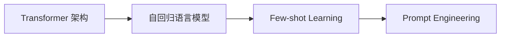

# GPT-3.5原理与代码实例讲解

## 1. 背景介绍

### 1.1 问题的由来
自从 GPT-3 问世以来,大规模语言模型的研究和应用就一直是自然语言处理领域的热点。GPT-3 展现出了令人惊叹的语言理解和生成能力,但同时也存在着计算成本高、训练难度大等问题。为了进一步提升语言模型的性能和效率,OpenAI 在 GPT-3 的基础上进行了改进,推出了 GPT-3.5 模型。

### 1.2 研究现状
目前,GPT-3.5 已经在许多自然语言处理任务上取得了优异的表现,如对话生成、文本摘要、问答系统等。不少研究者和开发者都在探索如何将 GPT-3.5 应用到更多的场景中去。同时,GPT-3.5 的训练方法和模型结构也引起了学术界的广泛关注。

### 1.3 研究意义
深入研究 GPT-3.5 的原理和实现,对于理解大规模语言模型的内在机制、改进模型性能都有重要意义。通过剖析 GPT-3.5 的技术细节,我们可以洞察其语言建模和生成的奥秘,为后续的模型优化提供启发和参考。此外,GPT-3.5 的代码实例也为开发者提供了宝贵的学习资料。

### 1.4 本文结构
本文将首先介绍 GPT-3.5 的核心概念和关键技术,然后重点剖析其底层的算法原理和数学模型。接着,我们将通过代码实例来演示如何用 PyTorch 实现 GPT-3.5 模型并进行训练和推理。最后,本文还将讨论 GPT-3.5 的应用场景、发展趋势以及面临的挑战。

## 2. 核心概念与联系

在讨论 GPT-3.5 的技术细节之前,我们有必要先了解其背后的一些核心概念:

- **Transformer 架构**:这是一种基于自注意力机制的神经网络架构,它摒弃了传统的 RNN/CNN 结构,通过 Self-Attention 实现了并行化计算,大幅提升了训练效率。GPT 系列模型都是基于 Transformer 的 Decoder 部分构建的。

- **自回归语言模型**:GPT-3.5 本质上是一个自回归(Auto-regressive)语言模型,即通过前面的 token 序列来预测下一个 token 的概率分布。这使得 GPT-3.5 能够生成连贯、流畅的文本。 

- **Few-shot Learning**:GPT-3.5 的一大特点是具备少样本学习(Few-shot Learning)能力。即通过给定少量示例,模型就能快速适应新的任务,而无需重新训练。这主要得益于其海量的预训练参数。

- **Prompt Engineering**:为了充分发挥 GPT-3.5 的能力,如何设计出高质量的 prompt 至关重要。Prompt Engineering 就是一门专门研究如何优化 prompt 的学问,它可以显著影响模型的表现。

下图展示了 GPT-3.5 的核心概念之间的联系:

可以看到,GPT-3.5 以 Transformer 为基础,通过自回归建模实现语言生成。在此基础上,引入 Few-shot Learning 来实现快速任务适应。而 Prompt Engineering 则是为模型提供高质量的输入,充分发挥其能力。

## 3. 核心算法原理 & 具体操作步骤

### 3.1 算法原理概述
GPT-3.5 的核心是基于 Transformer 的解码器(Decoder)结构。与原始的 Transformer 不同,GPT-3.5 移除了编码器(Encoder)部分,只保留了解码器。这是因为 GPT-3.5 的目标是单向语言建模,即根据前面的 token 序列预测下一个 token,而不需要考虑整个输入序列的双向信息。

在 GPT-3.5 的解码器中,每一层都由两个子层组成:Self-Attention 层和前馈神经网络(Feed-Forward Network, FFN)层。Self-Attention 负责捕捉 token 之间的依赖关系,而 FFN 则用于对特征进行非线性变换。此外,每个子层之后都会接一个残差连接(Residual Connection)和层归一化(Layer Normalization)操作,以促进梯度传播和加速收敛。

### 3.2 算法步骤详解
下面我们来详细剖析 GPT-3.5 的算法步骤:

**Step 1: 输入表示**
首先,我们需要将输入的文本序列转换为模型可以处理的张量表示。具体来说,就是将每个 token 映射为一个 d 维的词嵌入向量,然后将这些向量拼接成一个矩阵 $X \in \mathbb{R}^{n \times d}$,其中 n 为序列长度。此外,我们还需要加入位置编码(Positional Encoding)信息,以使模型能够感知 token 的顺序关系。

**Step 2: Self-Attention**
紧接着,输入表示 X 会被送入 Self-Attention 层。该层的作用是计算每个 token 与其他所有 token 之间的注意力权重,从而捕捉它们之间的依赖关系。具体计算公式如下:

$$
\begin{aligned}
Q &= XW_Q \\
K &= XW_K \\
V &= XW_V \\
A &= \text{softmax}(\frac{QK^T}{\sqrt{d_k}})V
\end{aligned}
$$

其中,$Q,K,V$ 分别表示 query、key、value 矩阵,$W_Q,W_K,W_V$ 为可学习的权重矩阵。$A$ 即为注意力矩阵,它的每一行表示对应位置的 token 与其他 token 之间的注意力分布。除以 $\sqrt{d_k}$ 是为了缓解点积结果的量级问题。

**Step 3: Feed-Forward Network**
接下来,注意力矩阵 A 会被传入 FFN 层进行非线性变换。FFN 由两层全连接网络组成,中间加了 ReLU 激活函数:

$$
\text{FFN}(x) = \max(0, xW_1 + b_1)W_2 + b_2
$$

其中,$W_1,W_2,b_1,b_2$ 都是可学习的参数。FFN 可以增强模型的表达能力,提取高层次的特征。

**Step 4: 残差连接与层归一化**
为了促进梯度的反向传播和加速训练收敛,每个子层(Self-Attention 和 FFN)之后都会接一个残差连接和层归一化操作:

$$
\begin{aligned}
x &= \text{Sublayer}(x) + x \\
x &= \text{LayerNorm}(x)
\end{aligned}
$$

其中,Sublayer 表示 Self-Attention 或 FFN 子层。LayerNorm 则对每个样本进行归一化:

$$
\text{LayerNorm}(x) = \frac{x-\text{E}[x]}{\sqrt{\text{Var}[x]+\epsilon}} * \gamma + \beta
$$

$\text{E}[x]$ 和 $\text{Var}[x]$ 分别表示均值和方差,$\epsilon$ 是一个小常数,用于防止分母为零。$\gamma$ 和 $\beta$ 是可学习的缩放和偏移参数。

**Step 5: 堆叠解码器层**
将Steps 2-4 重复堆叠 N 次,就得到了完整的 GPT-3.5 解码器结构。每一层的输出会作为下一层的输入,直到最后一层。

**Step 6: 输出与训练**
最后,我们将解码器的输出向量传入一个线性变换和 softmax 函数,以获得下一个 token 的概率分布:

$$
P(x_t|x_{<t}) = \text{softmax}(hW)
$$

其中,h 为解码器最后一层的输出,$W$ 为词表矩阵。

模型的训练目标是最大化真实 token 序列的似然概率:

$$
\mathcal{L} = -\sum_{t=1}^{n} \log P(x_t|x_{<t})
$$

我们可以使用随机梯度下降及其变体(如 Adam)来优化该损失函数,从而训练 GPT-3.5 模型。

### 3.3 算法优缺点
GPT-3.5 相比于传统的语言模型,具有以下优点:

- 并行计算能力强,训练速度快
- 可以处理任意长度的序列,不受限于固定窗口大小  
- 通过 Self-Attention 机制,可以捕捉长距离依赖关系
- 引入残差连接和层归一化,加速收敛,提升泛化性能
- 参数量大,可以在海量语料上进行预训练,具备强大的语言理解和生成能力

但同时,GPT-3.5 也存在一些局限性:

- 计算和存储开销大,对硬件要求高,难以部署到资源受限的环境中
- 容易生成毫无逻辑、自相矛盾的内容,泛化能力有待提高  
- 可能产生有偏见、有害的言论,难以控制生成内容的导向
- 缺乏常识推理能力,无法真正理解语言的深层语义

### 3.4 算法应用领域
尽管有诸多局限,GPT-3.5 还是在许多自然语言处理任务上取得了瞩目的成绩,展现出广阔的应用前景,例如:

- 文本生成:小说、新闻、诗歌、对联等
- 对话系统:聊天机器人、智能客服、虚拟助手等  
- 语言翻译:机器翻译、同传系统等
- 文本摘要:自动摘要、新闻标题生成等
- 问答系统:知识库问答、阅读理解等
- 代码生成:根据自然语言描述自动生成代码
- 其他:情感分析、文本分类、实体识别、文本纠错等

随着模型不断改进和算力提升,GPT-3.5 有望在更多领域大显身手。

## 4. 数学模型和公式 & 详细讲解 & 举例说明

本节我们将详细推导 GPT-3.5 中用到的关键公式,并给出具体的例子加以说明。

### 4.1 数学模型构建
GPT-3.5 的数学模型可以用如下公式来概括:

$$
P(x) = \prod_{t=1}^{n} P(x_t|x_{<t}) = \prod_{t=1}^{n} \frac{\exp(e(x_t)^T h_{t-1})}{\sum_{x'} \exp(e(x')^T h_{t-1})}
$$

其中,$x=(x_1,\cdots,x_n)$ 表示长度为 n 的 token 序列,$e(x)$ 表示 token $x$ 的词嵌入向量,$h_t$ 表示解码器在 t 时刻的隐状态(即 Self-Attention + FFN 的输出)。

从公式可以看出,GPT-3.5 本质上是一个自回归语言模型。它通过已生成的 token 序列 $x_{<t}$ 来预测下一个 token $x_t$ 的条件概率分布 $P(x_t|x_{<t})$。

### 4.2 公式推导过程
下面,我们来推导 Self-Attention 层的计算公式。

给定输入矩阵 $X \in \mathbb{R}^{n \times d}$,我们首先计算 query、key、value 矩阵:

$$
\begin{aligned}
Q &= XW_Q \\
K &= XW_K \\
V &= XW_V
\end{aligned}
$$

其中,$W_Q,W_K,W_V \in \mathbb{R}^{d \times d_k}$ 为可学习的权重矩阵。

然后,我们通过 query 和 key 的点积来计算注意力得分:

$$
\text{score}(q,k) = q^Tk
$$

为了让不同维度的点积结果具有相似的量级,我们通常会除以 $\sqrt{d_k}$:

$$
\text{score}(q,k) = \frac{q^Tk}{\sqrt{d_k}}
$$

接着,我们对注意力得分应用 softmax 函数,以获得归一化的注意力权重:

$$
\alpha(q,K) = \text{softmax}(\frac{qK^T}{\sqrt{d_k}}) = \frac{\exp(\frac{qK^T}{\sqrt{d_