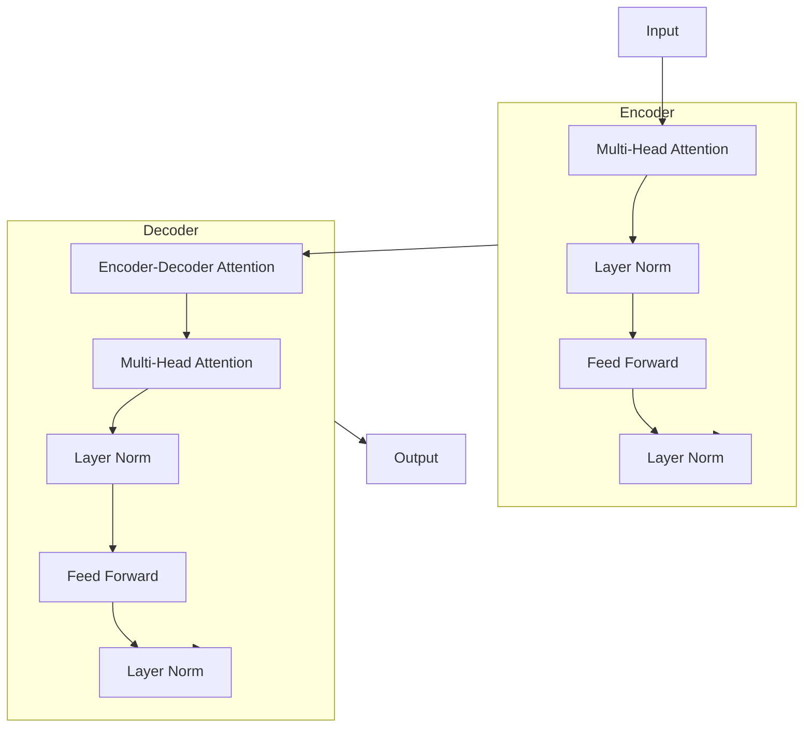

# GPT-3原理与代码实例讲解

## 1. 背景介绍

### 1.1 问题的由来

在过去几年中,自然语言处理(NLP)领域取得了长足的进步,其中一个重要的催化剂是Transformer模型的出现。Transformer凭借其强大的注意力机制和并行计算能力,在机器翻译、文本生成等任务中展现出了卓越的性能。而GPT(Generative Pre-trained Transformer)作为Transformer在生成式建模领域的一个重要延伸,通过在大规模语料库上进行预训练,学习到了丰富的语言知识,并在下游任务中发挥出了强大的迁移能力。

GPT-3作为GPT系列模型的最新力作,在模型规模和训练语料量上都取得了质的飞跃,引发了学术界和工业界的广泛关注。该模型拥有惊人的1750亿个参数,并在约5000亿词的语料库上进行了预训练,展现出了令人惊叹的泛化能力,可以在不同领域的自然语言任务中表现出色,如问答、文本生成、文本摘要等。

### 1.2 研究现状

GPT-3的出现引发了人们对大规模语言模型能力边界的热烈讨论。一方面,GPT-3在多项基准测试中表现出了媲美人类的水平,在某些任务上甚至超过了人类。这使得人们开始重新思考人工智能系统是否真的能够达到"通用人工智能"的高度。另一方面,GPT-3也暴露出了一些明显的缺陷,如缺乏常识推理能力、容易受到偏见影响、对于复杂任务的泛化能力仍然有限等,这些问题都值得进一步探讨和改进。

目前,GPT-3的研究主要集中在以下几个方面:

1. **模型优化**:通过改进模型结构、训练策略等方式,进一步提升GPT-3的性能和泛化能力。
2. **知识注入**:探索如何将结构化知识(如知识图谱)注入到GPT-3中,增强其推理和常识理解能力。
3. **可解释性**:研究GPT-3内部的工作机制,提高其可解释性和可控性。
4. **应用拓展**:将GPT-3应用到更多的自然语言处理任务中,如机器翻译、对话系统、信息检索等。

### 1.3 研究意义

GPT-3作为一个里程碑式的语言模型,其研究不仅具有重要的理论意义,也有广阔的应用前景。从理论层面来看,GPT-3的出现为我们提供了一个窗口,让我们能够更好地理解大规模语言模型的能力边界和内在机制。通过对GPT-3的深入研究,我们可以获得对语言理解、知识表示、推理能力等方面的新见解,这将推动自然语言处理领域的长足发展。

从应用层面来看,GPT-3展现出了强大的文本生成和理解能力,可以应用于多个领域,如智能写作辅助、问答系统、对话系统、内容创作等。随着GPT-3的不断优化和完善,它有望成为一个通用的语言智能基础设施,为各种语言相关的应用提供支持。此外,GPT-3也可以作为一个强大的基线模型,为其他自然语言处理任务提供有力的参考和借鉴。

### 1.4 本文结构

本文将全面介绍GPT-3的原理、实现细节和应用实践。首先,我们将介绍GPT-3的核心概念和与其他语言模型的联系。接下来,我们将深入探讨GPT-3的核心算法原理和数学模型,并通过案例分析和公式推导,帮助读者更好地理解其内在机制。

在实践部分,我们将提供GPT-3的代码实现细节,包括环境搭建、模型训练、推理过程等,并对关键代码进行解读和分析。同时,我们也将介绍GPT-3在实际应用场景中的使用案例,如智能写作辅助、问答系统等。

最后,我们将总结GPT-3的研究成果,并展望其未来的发展趋势和面临的挑战。同时,我们也将推荐一些有价值的学习资源、开发工具和相关论文,为读者提供进一步探索的途径。

## 2. 核心概念与联系

GPT-3是一种基于Transformer的大型语言模型,它继承了Transformer的核心思想,同时也吸收了之前语言模型的一些优秀设计。为了更好地理解GPT-3,我们需要先了解以下几个核心概念:

1. **自注意力机制(Self-Attention Mechanism)**
2. **Transformer模型**
3. **语言模型(Language Model)**
4. **预训练(Pre-training)**
5. **微调(Fine-tuning)**

### 2.1 自注意力机制

自注意力机制是Transformer模型的核心组件,它允许模型在计算目标输出时,同时关注输入序列中的所有位置。与传统的RNN和CNN模型不同,自注意力机制不需要按顺序处理输入序列,而是可以并行计算每个位置与其他位置的关系,从而提高了计算效率。

在自注意力机制中,每个输入位置都会被映射为一个查询(Query)、键(Key)和值(Value)向量。然后,查询向量会与所有键向量计算相似性得分,得分越高,表示该位置与查询位置的关联度越大。最后,根据这些相似性得分,对所有值向量进行加权求和,得到该位置的注意力表示。

自注意力机制的数学表达式如下:

$$\mathrm{Attention}(Q, K, V) = \mathrm{softmax}\left(\frac{QK^T}{\sqrt{d_k}}\right)V$$

其中,$Q$表示查询矩阵,$K$表示键矩阵,$V$表示值矩阵,$d_k$是缩放因子,用于防止内积值过大导致梯度消失。

自注意力机制的优点在于,它可以有效地捕获输入序列中长距离的依赖关系,并且具有并行计算的能力,这使得Transformer模型在处理长序列时表现出色。

### 2.2 Transformer模型

Transformer是一种全新的序列到序列(Sequence-to-Sequence)模型,它完全基于自注意力机制,不再使用传统的RNN或CNN结构。Transformer由编码器(Encoder)和解码器(Decoder)两个部分组成,用于将输入序列映射到目标输出序列。

编码器的作用是将输入序列映射为一系列连续的表示,这些表示捕获了输入序列中每个位置与其他位置之间的依赖关系。解码器则根据编码器的输出,生成目标输出序列。在解码器中,除了使用自注意力机制捕获目标序列内部的依赖关系外,还引入了编码器-解码器注意力机制,用于关注输入序列的不同位置,从而更好地生成目标输出。

Transformer模型的架构如下所示:

Transformer模型凭借其并行计算能力和长距离依赖捕获能力,在机器翻译、文本生成等任务中取得了卓越的成绩,成为当前自然语言处理领域的主流模型之一。

### 2.3 语言模型

语言模型(Language Model)是自然语言处理领域的一个基础任务,旨在学习一种语言的概率分布,即给定一个文本序列$x_1, x_2, \dots, x_n$,计算其概率$P(x_1, x_2, \dots, x_n)$。根据建模方向的不同,语言模型可以分为生成式语言模型和判别式语言模型。

**生成式语言模型**旨在学习文本序列的联合概率分布,即$P(x_1, x_2, \dots, x_n)$。通过链式法则,该联合概率可以分解为:

$$P(x_1, x_2, \dots, x_n) = \prod_{t=1}^n P(x_t | x_1, \dots, x_{t-1})$$

生成式语言模型的目标是最大化上述条件概率的似然函数,从而学习到一个能够很好地捕获语言规律的概率模型。

**判别式语言模型**则旨在直接建模条件概率分布$P(x_t | x_1, \dots, x_{t-1})$,而不是联合概率分布。判别式语言模型通常以分类任务的形式来训练,目标是最大化正确预测下一个词的概率。

GPT-3是一种生成式语言模型,它通过在大规模语料库上进行预训练,学习到了丰富的语言知识,并在下游任务中展现出了强大的迁移能力。

### 2.4 预训练与微调

预训练(Pre-training)和微调(Fine-tuning)是当前自然语言处理领域的一种常见范式。预训练阶段旨在在大规模无标注语料库上训练一个通用的语言模型,使其学习到丰富的语言知识。而微调阶段则是在特定的下游任务上,对预训练模型进行进一步的调整和优化,使其更好地适应该任务。

预训练和微调的优点在于,它可以有效地利用大规模无标注数据,并将预训练模型中学习到的知识迁移到下游任务中,从而提高了模型的泛化能力和性能。同时,由于预训练模型已经学习到了丰富的语言知识,因此在微调阶段只需要较少的有标注数据,就可以取得不错的效果。

GPT-3就是采用了预训练和微调的范式。在预训练阶段,GPT-3在约5000亿词的语料库上进行了自监督训练,学习到了丰富的语言知识。而在微调阶段,GPT-3可以针对不同的下游任务(如文本生成、问答等)进行微调,从而获得更好的性能表现。

## 3. 核心算法原理 & 具体操作步骤

### 3.1 算法原理概述

GPT-3的核心算法原理继承自Transformer模型,主要包括以下几个关键组件:

1. **多头自注意力机制(Multi-Head Self-Attention)**
2. **前馈神经网络(Feed-Forward Neural Network)**
3. **残差连接(Residual Connection)**
4. **层归一化(Layer Normalization)**

这些组件共同构建了Transformer的编码器(Encoder)和解码器(Decoder)结构,用于捕获输入序列中的长距离依赖关系,并生成目标输出序列。

GPT-3作为一种解码器only的Transformer模型,其核心思想是通过自回归(Auto-Regressive)的方式,根据给定的文本前缀,预测下一个最可能出现的词元(Token)。具体来说,GPT-3将输入序列$x_1, x_2, \dots, x_n$划分为多个长度为$k$的上下文窗口,例如$(x_1, \dots, x_k), (x_2, \dots, x_{k+1}), \dots, (x_{n-k+1}, \dots, x_n)$。对于每个上下文窗口,GPT-3的目标是最大化下一个词元$x_{k+1}$的条件概率$P(x_{k+1} | x_1, \dots, x_k)$。

通过在大规模语料库上进行预训练,GPT-3学习到了丰富的语言知识,并在下游任务中展现出了强大的迁移能力。在微调阶段,GPT-3可以针对不同的任务进行优化,从而获得更好的性能表现。

### 3.2 算法步骤详解

GPT-3的训练过程可以分为以下几个主要步骤:

1. **输入embedding**:将输入序列中的每个词元映射为一个固定长度的向量表示,作为模型的初始输入。

2. **位置编码(Positional Encoding)**:由于Transformer模型没有显式的递归或卷积结构,因此需要通过位置编码