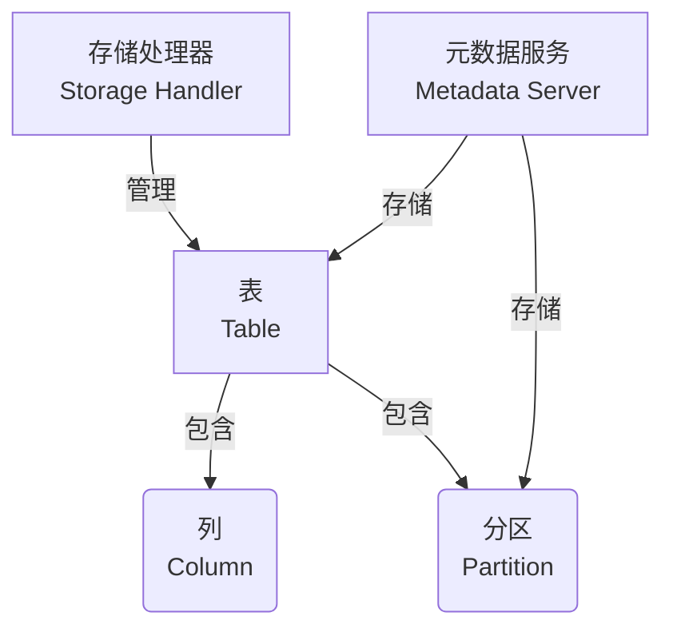

# HCatalog原理与代码实例讲解

## 1. 背景介绍

### 1.1 问题的由来

在大数据时代，数据存储和管理变得前所未有的重要和复杂。随着数据量的快速增长和多样化,传统的数据存储和管理方式已经无法满足现代大数据应用的需求。企业和组织需要一种可扩展、高效且统一的方式来管理和访问各种数据源,以支持数据分析、业务智能和其他数据密集型应用程序。

Apache Hive作为大数据生态系统中的核心组件之一,为结构化数据提供了SQL类查询接口,使用户可以使用类似SQL的语法来查询和分析存储在Hadoop分布式文件系统(HDFS)上的大规模数据集。然而,Hive只能处理存储在HDFS上的数据,无法直接访问其他数据源,如关系数据库、NoSQL数据库等。这种限制阻碍了企业整合和利用现有数据资产的能力。

为了解决这一问题,Apache Hive社区推出了HCatalog,作为Hive的一个子项目。HCatalog旨在提供一个统一的元数据服务层,使Hive、Pig、MapReduce等大数据处理框架能够无缝访问不同的数据源,包括HDFS、HBase、关系数据库等。通过HCatalog,用户可以轻松地将各种数据源集成到Hadoop生态系统中,实现数据的统一管理和访问。

### 1.2 研究现状

Apache HCatalog项目最初于2011年启动,旨在为Hadoop生态系统提供一个统一的元数据管理层。HCatalog允许用户在Hadoop集群上创建表和分区,并将这些元数据存储在Apache HCatalog元数据服务器中。这些表和分区可以映射到各种数据源,如HDFS、HBase、关系数据库等。

HCatalog提供了一个REST风格的Web服务接口,允许其他工具和应用程序与元数据服务器进行交互,以创建、读取、更新和删除表和分区元数据。此外,HCatalog还提供了一个命令行工具hcat,用于管理元数据。

目前,HCatalog已经被广泛集成到Hadoop生态系统中,包括Hive、Pig、MapReduce、Spark等流行的大数据处理框架。这些框架可以利用HCatalog来访问各种数据源,而无需了解底层数据存储的细节。

### 1.3 研究意义

HCatalog在大数据生态系统中扮演着关键角色,为企业和组织提供了以下重要意义:

1. **数据集成**:HCatalog使得企业能够将现有的数据资产(如关系数据库、NoSQL数据库等)无缝集成到Hadoop生态系统中,实现数据的统一管理和访问。这有助于企业充分利用现有数据资产,提高数据价值。

2. **元数据管理**:HCatalog提供了一个集中式的元数据管理服务,使得不同的大数据处理框架可以共享和访问相同的元数据。这简化了元数据管理,提高了数据治理和安全性。

3. **数据抽象**:HCatalog为各种数据源提供了一个统一的抽象层,使得用户无需关注底层数据存储的细节。这提高了数据访问的灵活性和可移植性。

4. **生态系统集成**:作为Hadoop生态系统的核心组件之一,HCatalog与Hive、Pig、MapReduce等流行的大数据处理框架紧密集成,为用户提供了一致的数据访问体验。

5. **提高生产力**:通过HCatalog,用户可以更高效地管理和访问各种数据源,从而提高数据分析和处理的生产力。

### 1.4 本文结构

本文将全面介绍HCatalog的原理、架构和使用方式,内容安排如下:

1. 背景介绍:阐述HCatalog的由来、现状和意义。
2. 核心概念与联系:介绍HCatalog的核心概念,如表、分区、存储处理器等,并说明它们之间的关系。
3. 核心算法原理与具体操作步骤:深入探讨HCatalog的核心算法原理,并详细讲解其操作步骤。
4. 数学模型和公式详细讲解与举例说明:介绍HCatalog中使用的数学模型和公式,并通过案例进行详细讲解。
5. 项目实践:代码实例和详细解释说明:提供HCatalog的实际代码实例,并对关键代码进行逐步解释。
6. 实际应用场景:介绍HCatalog在不同行业和场景下的实际应用。
7. 工具和资源推荐:推荐HCatalog相关的学习资源、开发工具和论文等。
8. 总结:未来发展趋势与挑战:总结HCatalog的研究成果,并探讨其未来发展趋势和面临的挑战。
9. 附录:常见问题与解答:列出HCatalog使用过程中的常见问题及解答。

## 2. 核心概念与联系

在深入探讨HCatalog的原理和实现之前,我们先介绍一些核心概念,为后续内容做铺垫。

### 2.1 表(Table)

在HCatalog中,表是组织数据的基本单元。表由一组列(Column)组成,每一列都有一个名称和数据类型。表可以存储在不同的数据源中,如HDFS、HBase或关系数据库等。

HCatalog支持以下几种表类型:

1. **托管表(Managed Table)**:表数据由HCatalog直接管理,存储在HDFS上。
2. **外部表(External Table)**:表数据存储在HDFS之外的其他数据源中,如关系数据库或NoSQL数据库。
3. **分区表(Partitioned Table)**:表数据按照一个或多个分区列进行分区存储,以提高查询效率。
4. **桶表(Bucketed Table)**:表数据根据哈希函数进行分桶存储,以优化特定查询模式的性能。

### 2.2 分区(Partition)

分区是HCatalog中一个重要的概念,用于将表数据按照某些列值进行逻辑分区存储。分区可以极大地提高查询效率,因为查询只需要扫描相关的分区,而不必扫描整个表。

在HCatalog中,分区由一个或多个分区列组成。用户可以在创建表时指定分区列,也可以在表创建后动态添加分区。每个分区都对应一个目录,其中存储着该分区的数据文件。

### 2.3 存储处理器(Storage Handler)

存储处理器是HCatalog中的一个关键组件,它提供了一个通用的接口,使HCatalog能够访问和管理各种数据源。每种数据源都有一个对应的存储处理器实现,负责将HCatalog的元数据操作转换为底层数据源的操作。

HCatalog自带了几个常用的存储处理器实现,如HDFS存储处理器、HBase存储处理器等。用户也可以根据需要开发自定义的存储处理器,以支持新的数据源。

### 2.4 元数据服务(Metadata Server)

元数据服务是HCatalog的核心组件,负责管理和存储所有表和分区的元数据信息。它提供了一个RESTful Web服务接口,供其他工具和应用程序进行元数据操作。

元数据服务使用关系数据库(如MySQL、PostgreSQL等)作为后端存储,将表和分区的元数据信息持久化存储。用户可以通过命令行工具hcat或其他客户端工具与元数据服务进行交互。

### 2.5 核心概念关系

上述核心概念之间存在着紧密的关系,如下图所示:

- 表由列和分区组成,每个表可以包含多个列和多个分区。
- 存储处理器负责管理表的数据,将HCatalog的操作转换为底层数据源的操作。
- 元数据服务负责存储和管理表和分区的元数据信息。

通过这些核心概念及其关系,HCatalog实现了对各种数据源的统一抽象和管理,为大数据生态系统提供了一个强大的元数据管理层。

## 3. 核心算法原理与具体操作步骤

### 3.1 算法原理概述

HCatalog的核心算法原理可以概括为以下几个方面:

1. **元数据管理**:HCatalog使用关系数据库作为元数据存储后端,通过元数据服务提供统一的元数据管理接口。元数据服务负责处理所有与表和分区相关的元数据操作,如创建、修改、删除等。

2. **数据抽象**:HCatalog通过存储处理器提供了一个通用的数据抽象层,将不同数据源的操作统一抽象为表和分区的操作。存储处理器负责将HCatalog的元数据操作转换为底层数据源的实际操作。

3. **分区管理**:HCatalog支持按照一个或多个列对表进行分区,以提高查询效率。分区信息存储在元数据服务中,查询时只需扫描相关分区,而不必扫描整个表。

4. **并行处理**:HCatalog利用Hadoop的分布式计算框架(如MapReduce、Tez等)对数据进行并行处理,以提高处理效率。

5. **元数据共享**:由于元数据存储在集中式的元数据服务中,因此不同的大数据处理框架(如Hive、Pig等)可以共享和访问相同的元数据,实现元数据的统一管理。

### 3.2 算法步骤详解

HCatalog的核心算法可以分为以下几个主要步骤:

#### 步骤1:元数据初始化

在使用HCatalog之前,需要先初始化元数据服务。这个步骤包括:

1. 配置元数据服务的后端存储(如关系数据库)。
2. 启动元数据服务,监听客户端的元数据操作请求。
3. 初始化存储处理器,为不同的数据源注册相应的存储处理器实现。

#### 步骤2:创建表和分区

用户可以通过命令行工具hcat或其他客户端工具创建表和分区。创建表的步骤如下:

1. 客户端向元数据服务发送创建表的请求,包括表名、列信息、表属性等。
2. 元数据服务验证请求,并将表元数据信息持久化存储到后端数据库中。
3. 如果是托管表,元数据服务还需要通知相应的存储处理器在底层数据源(如HDFS)中创建表目录。

创建分区的步骤类似,只是需要额外指定分区列和分区值。

#### 步骤3:数据操作

在创建好表和分区后,用户可以对表数据进行各种操作,如插入、更新、删除等。这些操作的具体步骤如下:

1. 客户端向元数据服务发送数据操作请求,如插入数据等。
2. 元数据服务根据请求的表名和分区信息,定位到相应的存储处理器。
3. 元数据服务将请求转发给存储处理器,存储处理器负责将请求转换为底层数据源的实际操作。
4. 存储处理器执行实际的数据操作,如在HDFS上写入数据文件等。
5. 存储处理器向元数据服务返回操作结果。

#### 步骤4:查询处理

查询处理是HCatalog的一个重要功能。查询步骤如下:

1. 客户端向元数据服务发送查询请求,包括查询语句和相关参数。
2. 元数据服务解析查询语句,确定涉及的表和分区。
3. 元数据服务从后端数据库中获取相关表和分区的元数据信息。
4. 根据元数据信息,元数据服务确定需要扫描的数据文件路径,并生成相应的输入splits。
5. 元数据服务将输入splits提交给计算框架(如MapReduce、Tez等)进行并行处理。
6. 计算框架调用相应的存储处理器读取和处理数据文件。
7. 存储处理器将处理结果返回给计算框架,计算框架进行结果汇总和输出。

### 3.3 算法优缺点

HCatalog