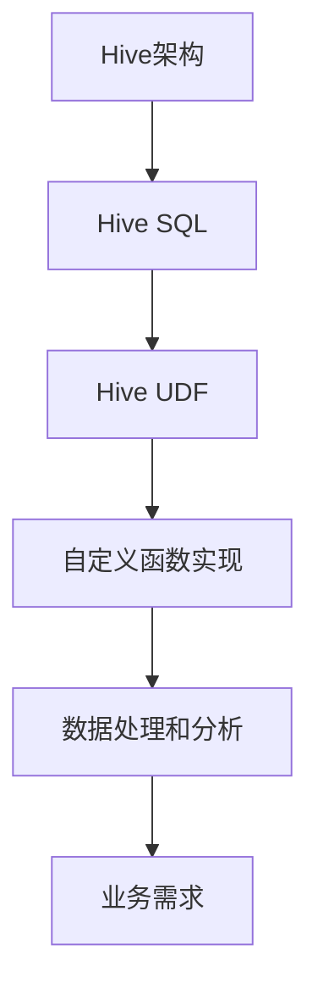

好的,我明白了您的要求。以下是根据您提供的标题和文章结构模板撰写的技术博客文章正文内容:

# Hive UDF自定义函数原理与代码实例讲解

## 1. 背景介绍

### 1.1 问题的由来

在大数据时代,海量数据的存储和处理成为了一个巨大的挑战。Apache Hive作为建立在Hadoop之上的数据仓库工具,为结构化数据的存储、查询和分析提供了强大的支持。然而,Hive内置的函数库无法满足所有场景的需求,特别是一些特殊的数据处理和分析任务。因此,用户自定义函数(User Defined Function, UDF)的需求越来越迫切。

### 1.2 研究现状  

Hive UDF允许用户使用Java编写自己的自定义函数,扩展Hive的功能,满足特定的数据处理需求。目前,Hive UDF已经得到了广泛的应用,成为Hive生态系统中不可或缺的一部分。但是,由于UDF的开发和使用涉及多个领域的知识,包括Java编程、Hive架构、大数据处理等,因此对于初学者来说,掌握UDF的原理和开发方法仍然是一个挑战。

### 1.3 研究意义

掌握Hive UDF的开发技能,对于提高大数据处理和分析的效率具有重要意义。通过自定义函数,用户可以实现特定的数据转换、清洗、聚合等操作,满足特殊的业务需求。同时,自定义函数也可以提高代码的可读性和可维护性,降低开发成本。因此,深入探讨Hive UDF的原理和实践是非常有必要的。

### 1.4 本文结构

本文将全面介绍Hive UDF的原理和实践。首先,我们将探讨UDF的核心概念和与Hive架构的联系。接下来,详细阐述UDF的算法原理和具体实现步骤。然后,我们将构建数学模型并推导公式,并通过案例分析加深理解。在此基础上,我们将提供完整的代码实例,并对其进行详细的解释和分析。最后,我们将介绍UDF的实际应用场景,推荐相关的工具和资源,并对未来的发展趋势和挑战进行展望。

## 2. 核心概念与联系

Hive UDF是Hive架构中的一个重要组成部分。Hive采用了类SQL的查询语言Hive SQL,用户可以使用Hive SQL进行数据查询和处理。当内置的Hive函数无法满足特定的需求时,用户可以通过编写自定义函数(UDF)来扩展Hive的功能。

自定义函数的实现通常使用Java语言,并遵循Hive UDF的规范和接口。开发人员需要编写Java代码,实现自定义函数的逻辑,然后将其打包并注册到Hive中。

通过自定义函数,用户可以实现各种数据处理和分析操作,如数据转换、清洗、聚合等,从而满足特定的业务需求。自定义函数不仅提高了Hive的灵活性,也增强了其处理能力,使其能够应对更加复杂的数据处理场景。

## 3. 核心算法原理与具体操作步骤  

### 3.1 算法原理概述

Hive UDF的核心算法原理是基于Hive的查询执行流程。当用户提交包含UDF的Hive SQL语句时,Hive会将SQL语句解析为查询计划,并将UDF的执行逻辑嵌入到查询计划中。在执行查询计划时,Hive会调用用户定义的UDF函数,并将计算结果作为中间结果,继续执行后续的查询操作。

UDF的算法原理可以概括为以下几个步骤:

1. 解析SQL语句,识别UDF函数调用
2. 加载UDF函数的实现类
3. 在查询计划中嵌入UDF函数的执行逻辑
4. 执行查询计划,调用UDF函数进行计算
5. 将UDF函数的计算结果作为中间结果,继续执行后续查询操作

### 3.2 算法步骤详解

1. **解析SQL语句,识别UDF函数调用**

   Hive使用自己的SQL解析器(Parser)来解析用户提交的SQL语句。在解析过程中,解析器会识别出SQL语句中使用的UDF函数,并将其标记为特殊的节点。

2. **加载UDF函数的实现类**

   对于每个被识别出的UDF函数,Hive会尝试加载其对应的实现类。实现类需要遵循Hive UDF的接口规范,并提供相应的计算逻辑。Hive会根据UDF函数的名称和参数类型,在指定的类路径中查找对应的实现类。

3. **在查询计划中嵌入UDF函数的执行逻辑**

   Hive会将SQL语句解析为查询计划(Query Plan),查询计划描述了查询的执行流程和各个阶段的操作。对于包含UDF函数的查询计划,Hive会在相应的位置嵌入UDF函数的执行逻辑,将其作为一个特殊的操作节点。

4. **执行查询计划,调用UDF函数进行计算**

   在执行查询计划时,Hive会按照计划的顺序执行各个操作节点。当遇到UDF函数的执行节点时,Hive会调用相应的UDF实现类,并传递必要的参数,执行UDF函数的计算逻辑。

5. **将UDF函数的计算结果作为中间结果,继续执行后续查询操作**

   UDF函数的计算结果会作为中间结果,被传递给后续的查询操作节点。Hive会继续执行查询计划中的其他操作,直到完成整个查询过程。

### 3.3 算法优缺点

**优点:**

1. **灵活性强**: 通过自定义函数,用户可以扩展Hive的功能,实现各种复杂的数据处理和分析操作,满足特定的业务需求。

2. **可重用性高**: 自定义函数一旦开发完成,可以在多个Hive查询中重复使用,提高代码的可维护性和可重用性。

3. **性能可控**: 自定义函数的实现代码可以针对特定的场景进行优化,提高计算效率。

**缺点:**

1. **开发成本高**: 开发自定义函数需要掌握Java编程、Hive架构和大数据处理等多方面的知识,对开发人员的技能要求较高。

2. **可移植性差**: 自定义函数的实现代码通常与特定的Hive版本和运行环境绑定,可移植性较差。

3. **调试困难**: 由于自定义函数的执行过程嵌入到Hive的查询执行流程中,调试和问题定位相对困难。

### 3.4 算法应用领域

Hive UDF可以应用于各种数据处理和分析场景,包括但不限于:

1. **数据转换**: 实现特定的数据格式转换、数据清洗等操作。

2. **数据聚合**: 实现复杂的数据聚合计算,如窗口函数、分组topN等。

3. **字符串处理**: 实现特殊的字符串操作,如正则表达式匹配、文本提取等。

4. **数学计算**: 实现复杂的数学计算和统计函数。

5. **机器学习**: 将机器学习算法封装为UDF,在Hive中进行模型训练和预测。

6. **地理空间计算**: 实现地理空间数据的处理和分析,如距离计算、几何运算等。

7. **自定义业务逻辑**: 根据特定的业务需求,实现自定义的数据处理逻辑。

## 4. 数学模型和公式详细讲解与举例说明

在开发Hive UDF时,我们经常需要构建数学模型并推导公式,以实现特定的数据处理和分析逻辑。本节将介绍一个基于欧几里得距离的聚类算法的数学模型,并详细推导相关公式,最后通过案例分析加深理解。

### 4.1 数学模型构建

假设我们需要开发一个UDF函数,用于计算给定数据集中每个数据点到所有其他数据点的平均欧几里得距离。这个函数可以用于数据聚类和异常值检测等场景。

我们将数据集表示为一个包含n个数据点的集合$S = \{x_1, x_2, \dots, x_n\}$,其中每个数据点$x_i$是一个d维向量,即$x_i = (x_{i1}, x_{i2}, \dots, x_{id})$。

对于任意一个数据点$x_i$,它到其他数据点的平均欧几里得距离可以表示为:

$$\text{AvgDist}(x_i) = \frac{1}{n-1}\sum_{j=1,j\neq i}^n \sqrt{\sum_{k=1}^d (x_{ik} - x_{jk})^2}$$

其中,$\sqrt{\sum_{k=1}^d (x_{ik} - x_{jk})^2}$表示数据点$x_i$和$x_j$之间的欧几里得距离。

我们的目标是实现一个UDF函数,对给定的数据集$S$中的每个数据点$x_i$,计算它的$\text{AvgDist}(x_i)$值。

### 4.2 公式推导过程

现在,我们来推导上述公式的具体过程。

首先,我们定义两个数据点$x_i$和$x_j$之间的欧几里得距离为:

$$\text{Dist}(x_i, x_j) = \sqrt{\sum_{k=1}^d (x_{ik} - x_{jk})^2}$$

对于任意一个数据点$x_i$,我们需要计算它到其他所有数据点的距离之和,然后除以数据点的总数减一(因为不包括$x_i$本身)。即:

$$\text{AvgDist}(x_i) = \frac{1}{n-1}\sum_{j=1,j\neq i}^n \text{Dist}(x_i, x_j)$$

将欧几里得距离的定义代入上式,我们得到:

$$\text{AvgDist}(x_i) = \frac{1}{n-1}\sum_{j=1,j\neq i}^n \sqrt{\sum_{k=1}^d (x_{ik} - x_{jk})^2}$$

这就是我们最终需要实现的公式。

### 4.3 案例分析与讲解

为了更好地理解上述数学模型和公式,我们来分析一个具体的案例。

假设我们有一个二维数据集$S = \{(1, 2), (3, 4), (5, 6), (7, 8)\}$,包含四个数据点。我们计算第一个数据点$(1, 2)$到其他数据点的平均欧几里得距离。

根据公式,我们有:

$$\begin{aligned}
\text{AvgDist}((1, 2)) &= \frac{1}{3}\Big(\sqrt{(1-3)^2 + (2-4)^2} \\
                       &+ \sqrt{(1-5)^2 + (2-6)^2} \\
                       &+ \sqrt{(1-7)^2 + (2-8)^2}\Big) \\
                      &= \frac{1}{3}(4 + 8 + 10) \\
                      &= \frac{22}{3} \approx 7.33
\end{aligned}$$

因此,数据点$(1, 2)$到其他数据点的平均欧几里得距离约为7.33。

同理,我们可以计算其他数据点的平均欧几里得距离。这个结果可以用于数据聚类、异常值检测等任务,例如将平均距离较大的数据点视为异常值或噪声数据。

### 4.4 常见问题解答

**Q: 为什么要使用欧几里得距离,而不是其他距离度量?**

A: 欧几里得距离是最常用的距离度量之一,它反映了两个数据点在空间中的直线距离。对于大多数场景,欧几里得距离可以很好地捕捉数据点之间的相似性或差异性。但是,在某些特殊情况下,其他距离度量(如曼哈顿距离、余弦相似度等)可能更加合适,需要根据具体的应用场景进行选择。

**Q: 如何处理高维数据