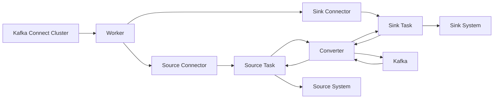

# Kafka Connect原理与代码实例讲解

## 1. 背景介绍

### 1.1 问题的由来
在大数据时代,数据的采集、传输和处理是一个非常重要且具有挑战性的问题。企业需要从各种异构数据源(如数据库、文件系统、消息队列等)实时采集数据,并将其传输到大数据平台进行存储和分析。然而,不同数据源的多样性和复杂性,以及数据量的急剧增长,使得数据集成变得越来越困难。传统的数据集成方式,如ETL(Extract-Transform-Load)已经无法满足实时性、可扩展性和容错性等方面的要求。

### 1.2 研究现状
为了解决上述问题,Apache Kafka应运而生。Kafka是一个分布式的流处理平台,提供了高吞吐、低延迟、高可靠的消息传输能力。然而,Kafka本身并不提供数据采集和传输的功能,需要借助其他工具来实现。Kafka Connect就是Kafka生态系统中的一个重要组件,它为Kafka提供了可扩展的、可靠的数据采集和传输能力。目前,越来越多的企业开始采用Kafka Connect来构建实时数据管道,实现数据的无缝集成和流转。

### 1.3 研究意义
深入研究Kafka Connect的原理和应用,对于构建高效、可靠的实时数据管道具有重要意义。通过学习Kafka Connect的架构设计、工作原理、核心概念,以及如何开发自定义Connector等,我们可以更好地利用Kafka Connect来解决数据集成问题,提升数据处理效率,实现业务价值的最大化。同时,对Kafka Connect的研究也有助于我们理解Kafka生态系统,掌握流处理技术,拓展技术视野。

### 1.4 本文结构
本文将从以下几个方面对Kafka Connect进行深入讲解：

1. 首先介绍Kafka Connect的背景知识,包括Kafka的基本概念、Kafka Connect的定位和作用。
2. 然后重点讲解Kafka Connect的核心概念和工作原理,包括Connector、Task、Worker、Converter、Transform等。
3. 接着通过一个实际的代码示例,演示如何使用Kafka Connect API开发自定义Source Connector和Sink Connector。 
4. 最后总结Kafka Connect的优缺点、适用场景,以及未来的发展趋势,并提供一些学习资源和工具推荐。

## 2. 核心概念与联系

在讲解Kafka Connect原理之前,我们需要先了解一些核心概念：

- **Kafka:** 一个分布式的流处理平台,提供了高吞吐、低延迟、高可靠的消息传输能力。
- **Connector:** Kafka Connect中的核心概念,负责数据的采集和传输。分为Source Connector和Sink Connector两种类型。
  - Source Connector:负责从外部系统采集数据,并将其传输到Kafka中。
  - Sink Connector:负责从Kafka中读取数据,并将其传输到外部系统。
- **Task:** Connector的子任务,负责数据的实际处理。每个Connector可以包含多个Task,以实现并行处理。  
- **Worker:** 运行Connector和Task的进程。Worker可以运行在独立的机器上,也可以运行在同一台机器上。
- **Converter:** 负责在Kafka Connect内部和Kafka之间进行数据格式的转换。常见的Converter有JSON、Avro等。
- **Transform:** 对采集到的数据进行转换和过滤,例如重命名字段、数据脱敏等。Transform作用于Connector。

下图展示了Kafka Connect的核心概念之间的关系：

从图中可以看出,Kafka Connect Cluster由多个Worker进程组成,每个Worker运行一个或多个Connector(Source或Sink)。每个Connector又包含一个或多个Task,负责实际的数据处理。Converter组件在Connector与Kafka之间进行数据格式转换。Source Connector从Source System采集数据到Kafka,Sink Connector从Kafka传输数据到Sink System。

## 3. 核心算法原理 & 具体操作步骤

### 3.1 算法原理概述
Kafka Connect的核心算法可以概括为"分而治之"。即将整个数据采集和传输的过程划分为多个独立的子任务(Task),每个Task负责处理一部分数据,多个Task并行执行,从而提高整体的吞吐量和效率。同时,Kafka Connect还提供了容错机制,当某个Task失败时,可以自动重启或将其分配给其他Worker执行,确保数据处理的可靠性。

### 3.2 算法步骤详解
Kafka Connect的工作流程可以分为以下几个步骤:

1. Connector配置: 用户通过REST API或配置文件定义Connector的配置信息,例如数据源类型、数据格式、并行度等。
2. Connector部署: Kafka Connect框架根据用户提供的配置信息,在Worker进程中实例化并运行Connector。
3. Task分配: Connector根据配置的并行度,将数据处理任务分解为多个Task,并将其分配给Worker进程执行。
4. 数据采集: Source Task从外部数据源采集数据,并将其转换为Kafka Connect内部的数据格式。
5. 数据传输: Source Task将采集到的数据写入Kafka的Topic中,Sink Task从Topic中读取数据。
6. 数据处理: Sink Task将读取到的数据进行转换和处理,例如过滤、聚合、重命名等。
7. 数据写入: Sink Task将处理后的数据写入外部系统,例如数据库、文件系统等。
8. 偏移量提交: Source Task定期将采集数据的偏移量提交给Kafka,以便在发生故障时能够恢复数据。

### 3.3 算法优缺点
Kafka Connect的优点包括:

- 可扩展性: 支持多个Worker进程和Task并行处理数据,可以横向扩展以提高吞吐量。
- 可靠性: 提供了容错机制和偏移量管理,确保数据处理的可靠性和一致性。
- 灵活性: 支持多种数据源和数据目标,可以通过自定义Connector扩展功能。
- 易用性: 提供了简单的REST API和配置文件,用户可以快速上手。

Kafka Connect的缺点包括:

- 增加了系统复杂度: 引入了新的组件和概念,增加了系统的复杂度和运维成本。
- 性能开销: 在数据采集和传输过程中,需要进行数据格式转换和序列化,会带来一定的性能开销。
- 不支持事务: Kafka Connect不支持端到端的事务处理,可能会导致数据不一致的问题。

### 3.4 算法应用领域
Kafka Connect主要应用于以下领域:

- 数据集成: 将不同数据源的数据实时采集到Kafka中,再传输到其他系统进行处理和分析。
- 数据迁移: 将数据从一个系统迁移到另一个系统,例如从关系数据库迁移到Hadoop。
- 数据备份: 将数据从线上系统备份到Kafka中,再备份到其他存储系统。
- 日志收集: 将应用程序的日志数据采集到Kafka中,再进行集中处理和分析。

## 4. 数学模型和公式 & 详细讲解 & 举例说明

### 4.1 数学模型构建
Kafka Connect的数据处理可以用以下数学模型来描述:

设有 $n$ 个数据源,每个数据源产生的数据记为 $D_i(i=1,2,...,n)$。Kafka Connect从这 $n$ 个数据源并行采集数据,设第 $i$ 个数据源采集的数据为 $C_i$,则有:

$$
C_i=f_i(D_i)
$$

其中,$f_i$ 表示第 $i$ 个Source Connector的数据采集函数,将原始数据 $D_i$ 转换为Kafka Connect内部的数据格式 $C_i$。

设有 $m$ 个数据目标,Kafka Connect将采集到的数据并行传输到这 $m$ 个目标,设传输到第 $j$ 个目标的数据为 $S_j$,则有:

$$
S_j=g_j(C_1,C_2,...,C_n)
$$

其中,$g_j$ 表示第 $j$ 个Sink Connector的数据处理函数,将多个Source Connector采集的数据进行转换、过滤、聚合等操作,最终传输到目标系统。

### 4.2 公式推导过程
对于第 $i$ 个数据源,假设其数据采集速率为 $v_i$ 条/秒,Source Connector的并行度为 $p_i$,则每个Source Task的数据采集速率为:

$$
v_{i,task}=\frac{v_i}{p_i}
$$

对于第 $j$ 个数据目标,假设其数据处理速率为 $w_j$ 条/秒,Sink Connector的并行度为 $q_j$,则每个Sink Task的数据处理速率为:

$$
w_{j,task}=\frac{w_j}{q_j}
$$

为了保证数据处理的实时性和可靠性,需要满足以下条件:

$$
\sum_{i=1}^{n}v_i \leq \sum_{j=1}^{m}w_j
$$

即数据采集的总速率不能超过数据处理的总速率,否则会导致数据积压和延迟。

### 4.3 案例分析与讲解
假设有一个电商系统,需要将订单数据从MySQL数据库实时同步到Elasticsearch中,以便进行订单搜索和分析。该系统的数据量为10万条/秒,MySQL和Elasticsearch的数据处理速率分别为5万条/秒和20万条/秒。

为了满足数据同步的需求,可以使用Kafka Connect构建数据管道。设计如下:

- 部署一个4节点的Kafka Connect集群,每个节点运行一个Worker进程。
- 为MySQL数据库创建一个Source Connector,并行度设置为2,每个Task负责同步5万条/秒的数据。
- 为Elasticsearch创建一个Sink Connector,并行度设置为4,每个Task负责写入5万条/秒的数据。

根据上述设计,可以计算出:

- Source Connector的总数据采集速率为:$v_1=2 \times 5=10$ 万条/秒
- Sink Connector的总数据处理速率为:$w_1=4 \times 5=20$ 万条/秒

可以看出,Source Connector的数据采集速率小于Sink Connector的数据处理速率,满足数据同步的要求。同时,Kafka Connect集群的总处理能力为40万条/秒,远大于数据源的速率,具有较好的性能冗余和扩展性。

### 4.4 常见问题解答
**问题1:** 如何选择Source Connector和Sink Connector的并行度?

**答案:** 并行度的选择需要综合考虑数据源的速率、目标系统的处理能力、可用资源等因素。一般来说,Source Connector的并行度可以根据数据源的分区数或数据量来设置,Sink Connector的并行度可以根据目标系统的写入能力来设置。同时,还要预留一定的性能冗余,以应对数据量的波动和系统故障。

**问题2:** Kafka Connect如何保证数据传输的可靠性?

**答案:** Kafka Connect提供了以下几种机制来保证数据传输的可靠性:

- 偏移量管理: Source Connector会定期将数据采集的偏移量提交给Kafka,以便在发生故障时能够恢复数据。
- 重试机制: 当数据处理出现异常时,Kafka Connect会自动重试,直到数据处理成功或达到最大重试次数。
- 死信队列: 对于无法处理的数据,Kafka Connect会将其发送到死信队列,以便后续人工处理。
- 分布式状态存储: Kafka Connect的配置信息和状态数据会存储在Kafka的内部Topic中,以实现高可用和容错。

## 5. 项目实践：代码实例和详细解释说明

接下来,我们将通过一个实际的代码示例,演示如何使用Kafka Connect API开发自定义Source Connector和Sink Connector。

### 5.1 开发环境搭建
首先,我们需要搭建Kafka Connect的开发环境。这里以Java语言为例,使用Maven作为构建工具。

1. 创建一个Maven项目,在pom.xml文件中添加以下依赖: