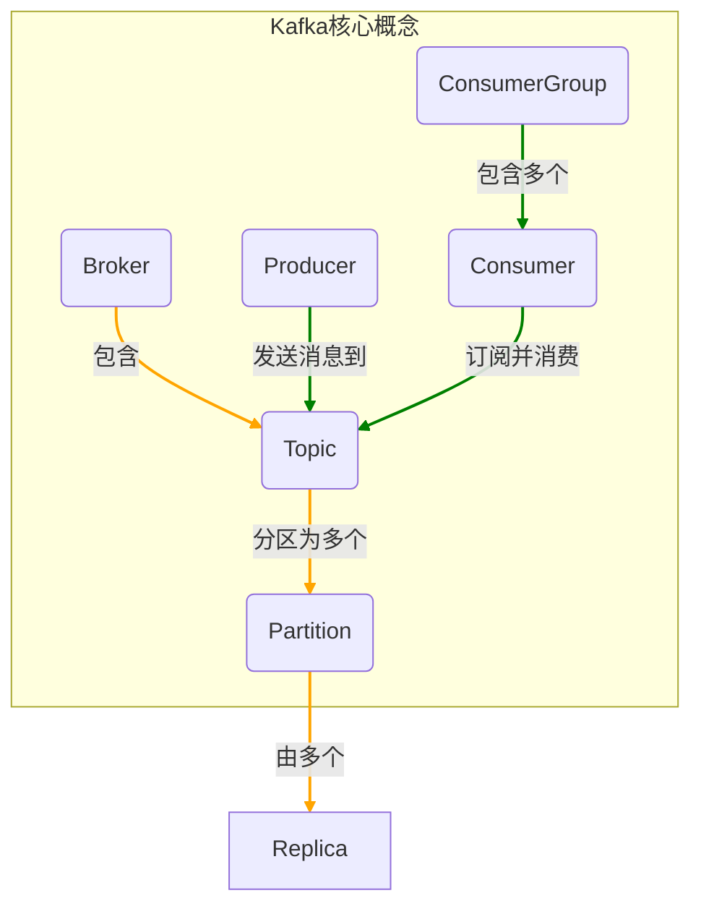
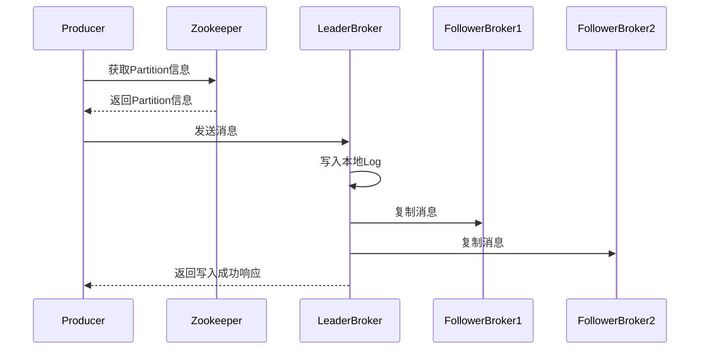
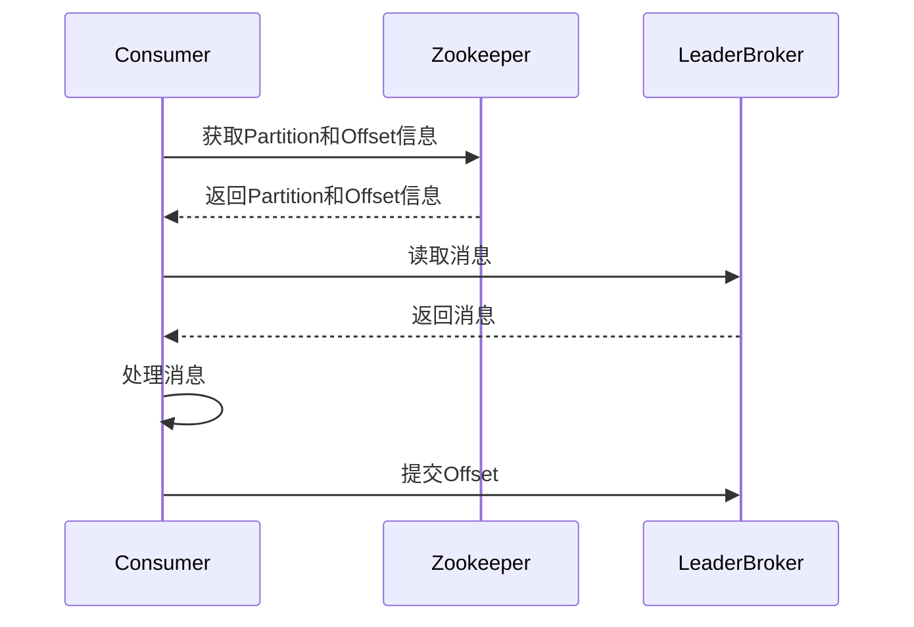
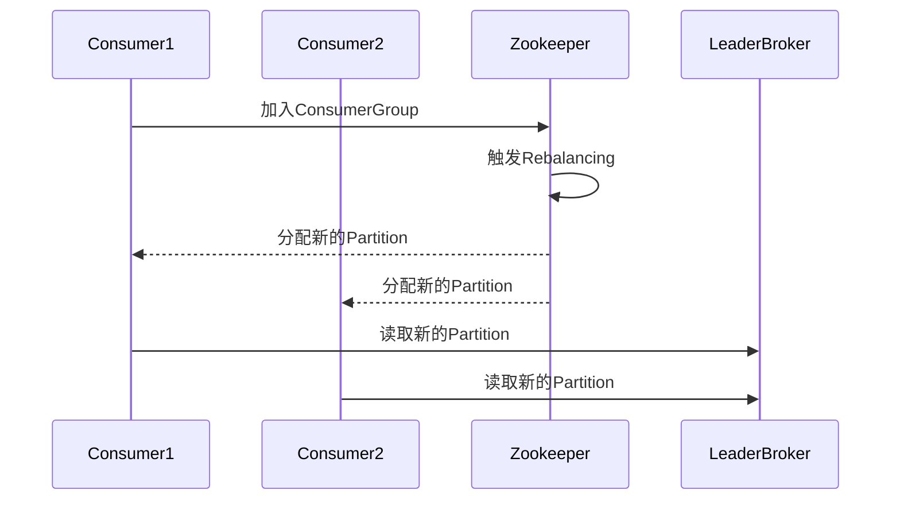

以下是根据您的要求撰写的技术博客文章《Kafka分布式消息队列原理与代码实例讲解》的正文内容：

# Kafka分布式消息队列原理与代码实例讲解

## 1. 背景介绍

### 1.1 问题的由来

在现代分布式系统中，应用程序的各个模块或服务之间需要高效可靠地进行数据交换和通信。传统的同步通信方式（如HTTP请求/响应）存在诸多局限性，例如耦合度高、可用性差、吞吐量有限等。为了解决这些问题，异步消息队列作为一种解耦、缓冲、异步通信机制应运而生。

Apache Kafka是一种分布式、分区的、多副本的、基于发布/订阅模式的分布式消息队列系统。自2011年开源以来,Kafka已经成为流行的企业消息队列的首选方案,被广泛应用于大数据系统、微服务架构、日志收集、流处理等多个领域。

### 1.2 研究现状

目前,Kafka已经成为事实上的消息队列标准,在各大公司和开源项目中被广泛使用。例如,LinkedIn将Kafka用于活动数据管道和运营数据处理;Netflix使用Kafka进行系统监控数据的实时处理;Uber使用Kafka实现基于事件的体系结构;eBay使用Kafka进行应用程序日志收集等。

除了在工业界的广泛应用,Kafka也是学术界关注的热点。研究人员对Kafka的可靠性、性能、容错性等特性进行了深入研究,并提出了一些改进方案。

### 1.3 研究意义

Kafka作为分布式消息队列系统,具有高吞吐量、低延迟、高可靠性、高容错性等优点。深入理解Kafka的原理对于构建高性能、可扩展、容错的分布式系统至关重要。本文将全面剖析Kafka的核心概念、算法原理、数学模型,并通过代码实例讲解其具体实现,为读者提供一个全景式的Kafka技术解析。

### 1.4 本文结构

本文首先介绍Kafka的核心概念和架构设计,然后深入剖析其核心算法原理和数学模型,接着通过代码实例讲解Kafka的具体实现细节。最后,探讨Kafka在实际场景中的应用,并对未来发展趋势和面临的挑战进行展望。

## 2. 核心概念与联系

Kafka的核心概念包括以下几个方面:

1. **Broker**：Kafka集群中的每个服务器节点称为Broker。一个Broker可以容纳多个Topic的Partition。

2. **Topic**：Topic是Kafka中的一个逻辑概念,用于对消息进行分类。每个Topic可以分区为多个Partition,每个Partition可以有多个Replica副本。

3. **Partition**：Topic被分区为多个Partition,每个Partition在集群中的不同Broker上存储部分数据。消息以追加的方式写入Partition,读取时按照存储的顺序读取。

4. **Replica**：为了实现容错,每个Partition会在不同的Broker上保存多个副本,其中一个作为Leader,其他作为Follower。所有的读写操作都经过Leader,Follower定期从Leader复制数据。

5. **Producer**：Producer负责向Topic发送消息。消息会被发送到Topic的某个Partition。

6. **Consumer**：Consumer负责从Topic订阅并消费消息。多个Consumer可以组成一个ConsumerGroup,组内的Consumer互不干扰,组与组之间通过消费不同的Partition来实现负载均衡。

7. **ConsumerGroup**：一个ConsumerGroup由多个Consumer组成,ConsumerGroup订阅Topic中的所有Partition,每个Partition在ConsumerGroup中仅被一个Consumer消费。

## 3. 核心算法原理 & 具体操作步骤

### 3.1 算法原理概述

Kafka的核心算法主要包括以下几个方面:

1. **分区分布式存储**:Kafka将Topic分区为多个Partition,每个Partition在集群中的不同Broker上存储部分数据。这种分区分布式存储方式可以实现水平扩展,提高吞吐量和容错性。

2. **多副本复制**:为了实现容错,每个Partition会在不同的Broker上保存多个副本,其中一个作为Leader,其他作为Follower。所有的读写操作都经过Leader,Follower定期从Leader复制数据。

3. **发布订阅模式**:Kafka采用发布/订阅模式,Producer向Topic发送消息,Consumer从Topic订阅并消费消息。这种模式实现了生产者和消费者的解耦。

4. **消费位移(Offset)管理**:Kafka为每个Consumer维护一个消费位移(Offset),用于记录该Consumer已经消费到哪个位置。通过定期提交Offset,Kafka可以实现消费恢复和重新分配等功能。

5. **零拷贝(ZeroCopy)技术**:Kafka在发送和接收消息时,采用了零拷贝技术,避免了内核空间和用户空间之间的数据拷贝,提高了I/O效率。

### 3.2 算法步骤详解

#### 3.2.1 Producer发送消息

1. Producer先从Zookeeper或Broker获取Topic的Partition信息,包括Partition的Leader位置。

2. Producer将消息发送给Partition的Leader Broker。

3. Leader Broker将消息写入本地Log文件中。

4. Leader Broker将消息复制到所有Follower Broker。

5. Leader Broker向Producer返回一个消息响应,表示消息已经写入成功。

#### 3.2.2 Consumer消费消息

1. Consumer向Zookeeper或Broker获取Topic的Partition信息,以及该Consumer所属ConsumerGroup的消费位移(Offset)信息。

2. Consumer根据Partition信息,从Leader Broker读取消息。

3. Consumer处理消息,并定期向Broker提交消费位移。

4. 如果Consumer失效,新的Consumer会从上次提交的位移处继续消费。

#### 3.2.3 Rebalancing重平衡

1. 当ConsumerGroup中的Consumer数量发生变化时,Kafka会触发Rebalancing过程。

2. Kafka为新的ConsumerGroup分配Partition,确保每个Partition只被一个Consumer消费。

3. Consumer根据新的Partition分配情况,重新读取消息。

### 3.3 算法优缺点

**优点:**

1. **高吞吐量**:分区分布式存储和零拷贝技术使Kafka具有高吞吐量。

2. **高可靠性**:多副本复制机制确保数据不会丢失。

3. **高扩展性**:可以通过增加Broker节点来扩展Kafka集群。

4. **容错性强**:Broker或Consumer失效不会影响整个系统。

5. **解耦生产和消费**:采用发布/订阅模式,实现了生产者和消费者的解耦。

**缺点:**

1. **实时性延迟**:消息在写入和复制过程中会有一定延迟。

2. **有限的消息保留期**:为了节省存储空间,Kafka只保留一定时间段内的消息。

3. **不支持事务性消息**:Kafka无法保证多个Partition上的消息原子性写入。

4. **复杂的运维管理**:需要对Zookeeper、Broker、Topic等进行配置和监控。

### 3.4 算法应用领域

Kafka作为分布式消息队列系统,可以应用于以下领域:

1. **大数据系统**:Kafka可以作为大数据系统的消息总线,实现数据的实时采集、传输和处理。

2. **微服务架构**:在微服务架构中,Kafka可以实现服务之间的异步通信和解耦。

3. **日志收集**:Kafka可以高效地收集分布式系统中的日志数据,用于监控和分析。

4. **流处理**:Kafka可以与流处理系统(如Apache Storm、Apache Spark Streaming等)集成,实现实时数据流处理。

5. **事件驱动架构**:Kafka可以作为事件总线,支持事件驱动架构的构建。

## 4. 数学模型和公式 & 详细讲解 & 举例说明

### 4.1 数学模型构建

为了评估Kafka的性能,我们构建了一个数学模型。假设Kafka集群由N个Broker组成,每个Broker有M个Partition。Producer每秒产生λ条消息,消息均匀分布到每个Partition。Consumer消费速率为μ条/秒。

**符号说明:**

- N: Broker数量
- M: 每个Broker的Partition数量
- λ: Producer每秒产生的消息数
- μ: Consumer每秒消费的消息数

**模型假设:**

1. 消息均匀分布到每个Partition。
2. 每个Partition有一个Consumer进行消费。
3. 忽略消息复制的开销。

### 4.2 公式推导过程

**1. 计算每个Partition的消息到达率**

每个Partition的消息到达率 = λ / (N * M)

**2. 计算单个Partition的消息队列长度**

根据队列论中的M/M/1模型,当消息到达率小于消费率时,消息队列长度期望值为:

$$E(n) = \frac{\rho}{1-\rho}$$

其中,ρ = λ / (N * M * μ)

**3. 计算整个Kafka集群的消息队列长度**

整个Kafka集群的消息队列长度 = N * M * E(n)

$$E(n_{total}) = \frac{N*M*\rho}{1-\rho} = \frac{N*M*\frac{\lambda}{N*M*\mu}}{1-\frac{\lambda}{N*M*\mu}} = \frac{\lambda}{\mu-\frac{\lambda}{N*M}}$$

**4. 计算消息延迟**

根据小尔延迟公式,消息延迟的期望值为:

$$E(T) = \frac{E(n)}{\lambda(1-\rho)}$$

将E(n)代入,可得:

$$E(T) = \frac{1}{\mu-\frac{\lambda}{N*M}}$$

### 4.3 案例分析与讲解

假设一个Kafka集群有3个Broker,每个Broker有4个Partition。Producer每秒产生6000条消息,Consumer每秒消费1000条消息。

**1. 计算每个Partition的消息到达率**

每个Partition的消息到达率 = 6000 / (3 * 4) = 500 (条/秒)

**2. 计算单个Partition的消息队列长度**

ρ = 500 / 1000 = 0.5

E(n) = 0.5 / (1 - 0.5) = 1

**3. 计算整个Kafka集群的消