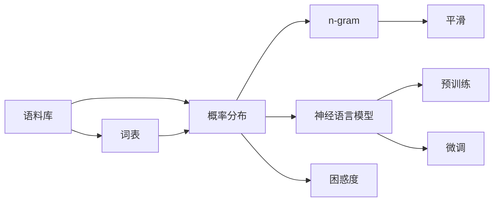

# Language Models 原理与代码实战案例讲解

## 1. 背景介绍
### 1.1 问题的由来
近年来,随着深度学习的快速发展,自然语言处理(NLP)领域取得了巨大的突破。而语言模型(Language Model)作为NLP的核心技术之一,在机器翻译、对话系统、文本生成等任务中发挥着至关重要的作用。语言模型旨在学习自然语言的概率分布,以预测下一个单词或字符,从而生成连贯、通顺的文本。

### 1.2 研究现状
目前主流的语言模型主要包括基于循环神经网络(RNN)的模型和基于Transformer的模型。其中,Transformer模型如BERT、GPT等,凭借其强大的特征提取和并行计算能力,在多个NLP任务上取得了state-of-the-art的表现。同时,预训练语言模型的出现,使得模型可以在大规模无标注语料上进行预训练,再通过少量标注数据进行微调,极大地提升了下游任务的性能。

### 1.3 研究意义  
语言模型的研究对于推动NLP技术的发展具有重要意义。一方面,语言模型可以帮助我们更好地理解和建模自然语言,揭示语言的内在规律。另一方面,语言模型为NLP下游任务提供了更加优质的文本表示,有助于提升任务性能。此外,语言模型的进步也为人机交互、知识图谱等领域带来了新的机遇和挑战。

### 1.4 本文结构
本文将围绕语言模型的原理与实践展开讨论。首先,我们将介绍语言模型的核心概念与联系。接着,重点阐述语言模型的核心算法原理与具体操作步骤。然后,我们将建立语言模型的数学模型,并给出详细的公式推导与案例分析。在项目实践部分,我们将基于Python实现语言模型,并对代码进行解读与分析。此外,本文还将探讨语言模型的实际应用场景,推荐相关的工具和学习资源。最后,我们将总结语言模型的研究现状,展望其未来发展趋势与挑战。

## 2. 核心概念与联系

语言模型的核心概念包括:

- 语料库(Corpus):构建语言模型所使用的大规模文本数据集。
- 词表(Vocabulary):语料库中所有不重复词的集合。
- 概率分布:描述词序列出现的概率。
- n-gram:由n个连续词组成的片段。
- 平滑(Smoothing):解决数据稀疏问题的技术。
- 困惑度(Perplexity):衡量语言模型性能的指标。
- 神经语言模型:基于神经网络的语言模型。
- 预训练(Pre-training):在大规模无标注语料上训练通用语言模型。
- 微调(Fine-tuning):在下游任务的标注数据上微调预训练模型。

这些概念之间存在着紧密的联系。语料库是构建语言模型的基础,其质量和规模直接影响模型的性能。词表决定了模型的词汇量,关系到模型的泛化能力。语言模型通过学习文本数据的概率分布,刻画词与词之间的相关性。n-gram是一种简单但有效的建模方式,通过统计词的共现频率来估计概率。平滑技术用于缓解数据稀疏问题,提高模型的鲁棒性。困惑度作为语言模型的评价指标,反映了模型在测试集上的预测能力。神经语言模型利用神经网络的强大拟合能力,学习词嵌入表示,捕捉词序列的长距离依赖。预训练和微调策略进一步提升了语言模型的性能和适用性。

下图展示了语言模型的核心概念与联系:



## 3. 核心算法原理 & 具体操作步骤
### 3.1 算法原理概述
语言模型的核心算法可分为统计语言模型和神经语言模型两大类。统计语言模型基于n-gram等统计方法,通过词频统计和概率估计来建模文本。而神经语言模型则利用神经网络学习词嵌入表示,刻画词之间的语义关系。下面我们将重点介绍这两类模型的原理。

### 3.2 算法步骤详解

#### 3.2.1 统计语言模型
统计语言模型的主要步骤如下:

1. 对语料进行预处理,进行分词、去除停用词等操作。
2. 构建词表,统计每个词的出现频率。
3. 选择合适的n-gram大小,例如bigram、trigram等。
4. 统计n-gram的频次,计算条件概率。
5. 使用平滑技术处理未登录词和低频词。
6. 计算语言模型的困惑度,评估模型性能。

其中,n-gram模型的条件概率计算公式为:

$P(w_n|w_1^{n-1}) = \frac{C(w_1^n)}{C(w_1^{n-1})}$

其中,$w_1^n$表示长度为n的词序列,$C(\cdot)$表示词序列的出现频次。

#### 3.2.2 神经语言模型
神经语言模型的主要步骤如下:

1. 对语料进行预处理,进行分词、构建词表等操作。
2. 将词映射为稠密向量表示,即词嵌入。
3. 选择合适的神经网络结构,如RNN、LSTM、Transformer等。
4. 将词嵌入作为神经网络的输入,学习上下文信息。
5. 在输出层使用softmax函数计算下一个词的概率分布。
6. 使用交叉熵损失函数优化模型参数。
7. 评估模型在验证集和测试集上的性能。

以LSTM为例,其前向传播过程可表示为:

$$
\begin{aligned}
i_t &= \sigma(W_i \cdot [h_{t-1}, x_t] + b_i) \\
f_t &= \sigma(W_f \cdot [h_{t-1}, x_t] + b_f) \\ 
o_t &= \sigma(W_o \cdot [h_{t-1}, x_t] + b_o) \\
\tilde{C}_t &= \tanh(W_C \cdot [h_{t-1}, x_t] + b_C) \\
C_t &= f_t * C_{t-1} + i_t * \tilde{C}_t \\
h_t &= o_t * \tanh(C_t)
\end{aligned}
$$

其中,$i_t, f_t, o_t$分别表示输入门、遗忘门和输出门,$C_t$为记忆细胞,$h_t$为隐藏状态。

### 3.3 算法优缺点

统计语言模型的优点在于:
- 简单易懂,计算效率高。
- 适用于小规模数据集。
- 可解释性强,便于分析。

缺点包括:
- 难以捕捉长距离依赖。
- 容易受到数据稀疏问题的影响。
- 泛化能力有限。

神经语言模型的优点在于:
- 可学习词的分布式表示,刻画语义信息。  
- 能够建模长距离依赖关系。
- 泛化能力强,适用于大规模语料。

缺点包括:
- 模型复杂,训练耗时。
- 可解释性较差。
- 需要大量标注数据和计算资源。

### 3.4 算法应用领域
语言模型在NLP领域有广泛的应用,主要包括:

- 机器翻译:将源语言文本转换为目标语言文本。
- 文本生成:根据上文生成连贯、通顺的文本。
- 对话系统:实现人机对话,理解用户意图并生成恰当的回复。
- 语音识别:将语音信号转换为文本。
- 信息检索:根据查询词搜索相关的文档。
- 情感分析:判断文本的情感倾向。
- 命名实体识别:从文本中识别出人名、地名、机构名等命名实体。

## 4. 数学模型和公式 & 详细讲解 & 举例说明
### 4.1 数学模型构建
语言模型的数学模型可以表示为:

给定词序列$w_1, w_2, \dots, w_T$,语言模型的目标是估计该序列的概率:

$$P(w_1, w_2, \dots, w_T) = \prod_{t=1}^T P(w_t | w_1, \dots, w_{t-1})$$

其中,$P(w_t | w_1, \dots, w_{t-1})$表示在给定前$t-1$个词的情况下,第$t$个词为$w_t$的条件概率。

对于n-gram模型,我们做了马尔可夫假设,即当前词只与前面的n-1个词相关:

$$P(w_t | w_1, \dots, w_{t-1}) \approx P(w_t | w_{t-n+1}, \dots, w_{t-1})$$

### 4.2 公式推导过程
以bigram模型为例,其条件概率可以表示为:

$$P(w_t | w_{t-1}) = \frac{P(w_{t-1}, w_t)}{P(w_{t-1})} = \frac{C(w_{t-1}, w_t)}{C(w_{t-1})}$$

其中,$C(w_{t-1}, w_t)$表示bigram $(w_{t-1}, w_t)$在语料中的出现频次,$C(w_{t-1})$表示词$w_{t-1}$在语料中的出现频次。

对于神经语言模型,我们通过最大化似然函数来估计模型参数:

$$\mathcal{L}(\theta) = \sum_{t=1}^T \log P(w_t | w_1, \dots, w_{t-1}; \theta)$$

其中,$\theta$表示模型参数。我们通过梯度下降等优化算法来最小化损失函数:

$$\mathcal{J}(\theta) = -\frac{1}{T} \mathcal{L}(\theta)$$

### 4.3 案例分析与讲解
我们以一个简单的例子来说明bigram模型的计算过程。假设我们有以下语料:

```
<s> The cat sat on the mat . </s>
<s> The dog sat on the rug . </s>
```

其中,`<s>`和`</s>`分别表示句子的开始和结束符号。

我们可以统计出如下的bigram频次:

```
(<s>, The): 2
(The, cat): 1  
(The, dog): 1
(cat, sat): 1
(dog, sat): 1
(sat, on): 2
(on, the): 2
(the, mat): 1
(the, rug): 1
(mat, .): 1
(rug, .): 1 
(., </s>): 2
```

根据频次,我们可以计算出bigram的条件概率,例如:

$$P(\text{cat} | \text{The}) = \frac{C(\text{The}, \text{cat})}{C(\text{The})} = \frac{1}{2} = 0.5$$

$$P(\text{dog} | \text{The}) = \frac{C(\text{The}, \text{dog})}{C(\text{The})} = \frac{1}{2} = 0.5$$

有了这些条件概率,我们就可以计算一个句子的概率,例如:

$$
\begin{aligned}
P(&\text{<s> The cat sat on the mat . </s>}) \\
&= P(\text{<s>}) \times P(\text{The} | \text{<s>}) \times P(\text{cat} | \text{The}) \times P(\text{sat} | \text{cat}) \\
&\quad \times P(\text{on} | \text{sat}) \times P(\text{the} | \text{on}) \times P(\text{mat} | \text{the}) \\
&\quad \times P(\text{.} | \text{mat}) \times P(\text{</s>} | \text{.}) \\
&= 1 \times 1 \times 0.5 \times 1 \times 1 \times 1 \times 1 \times 1 \times 1 \\
&= 0.5
\end{aligned}
$$

### 4.4 常见问题解答

**Q: 如何处理未登录词?**

A: 对于未登录词,我们可以使用平滑技术来估计其概率。常见的平滑方法包括加法平滑(Laplace smoothing)、折扣平滑(Good-Turing smoothing)等。例如,加法平滑将未登录词的频次初始化为一个小的常数$\alpha$,然后重