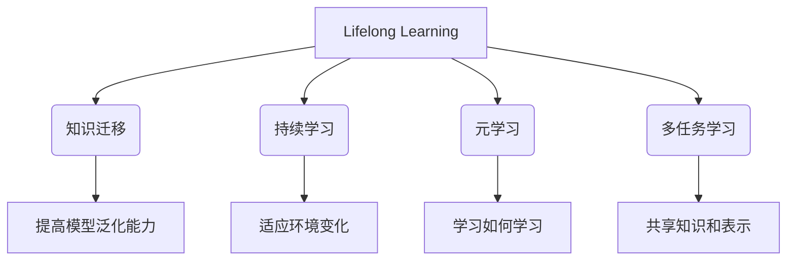
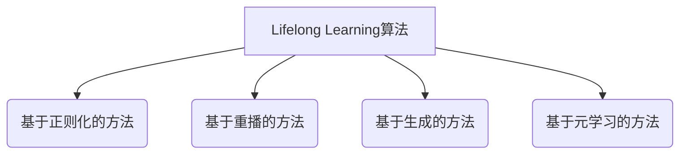

# Lifelong Learning原理与代码实例讲解

## 1. 背景介绍

### 1.1 问题的由来

在当今快速发展的技术时代，机器学习模型面临着一个巨大的挑战 —— 如何持续学习并适应不断变化的环境。传统的机器学习方法通常假设训练数据和测试数据来自同一个固定的概率分布。然而，现实世界中的数据分布往往是动态变化的,这种分布漂移现象导致模型在部署后的性能会逐渐下降。为了解决这个问题,研究人员提出了Lifelong Learning(终身学习)的概念。

### 1.2 研究现状

Lifelong Learning旨在开发能够持续学习和适应新环境的人工智能系统。这种系统不仅能够从先前的经验中学习,还能够有效地整合新知识,并将其应用于新的任务和环境中。目前,Lifelong Learning已经在多个领域得到广泛的研究和应用,例如计算机视觉、自然语言处理和机器人技术等。

### 1.3 研究意义

Lifelong Learning对于构建通用人工智能系统至关重要。通过持续学习和知识迁移,智能系统可以不断扩展其知识和技能,从而更好地适应复杂多变的环境。此外,Lifelong Learning也有助于减少重复学习的成本,提高模型的可解释性和可靠性。

### 1.4 本文结构

本文将从以下几个方面全面介绍Lifelong Learning:

1. 核心概念与联系
2. 核心算法原理与具体操作步骤
3. 数学模型和公式详细讲解及案例分析
4. 项目实践:代码实例和详细解释说明
5. 实际应用场景
6. 工具和资源推荐
7. 总结:未来发展趋势与挑战
8. 附录:常见问题与解答

## 2. 核心概念与联系

Lifelong Learning涉及多个核心概念,包括**知识迁移**、**持续学习**、**元学习**和**多任务学习**等。这些概念相互关联,共同构建了Lifelong Learning的理论基础。

1. **知识迁移(Knowledge Transfer)**: 指将已学习的知识和技能有效地应用于新的任务或领域。这有助于提高模型的泛化能力,避免从头开始学习新任务。

2. **持续学习(Continual Learning)**: 指机器学习模型能够持续地从新数据中学习,并将新获得的知识整合到已有的知识库中,而不会遗忘之前学习的内容。这使得模型能够适应动态变化的环境。

3. **元学习(Meta-Learning)**: 也称为"学习如何学习",旨在开发能够自动发现高效学习策略的算法。通过元学习,模型可以更快地适应新任务,提高学习效率。

4. **多任务学习(Multi-Task Learning)**: 指在同一个模型中同时学习多个不同但相关的任务。这种方法可以促进不同任务之间的知识共享和表示学习,提高模型的泛化能力。

这些概念相互关联,共同推动了Lifelong Learning的发展。例如,知识迁移和持续学习可以通过元学习来优化,而多任务学习则有助于提高知识迁移和持续学习的效果。

## 3. 核心算法原理与具体操作步骤

### 3.1 算法原理概述

Lifelong Learning算法的核心思想是在学习新任务的同时,保留之前学习到的知识,并将新旧知识有效地整合。为了实现这一目标,研究人员提出了多种算法框架,包括**基于正则化的方法**、**基于重播的方法**、**基于生成的方法**和**基于元学习的方法**等。

1. **基于正则化的方法**: 通过在损失函数中加入正则化项,惩罚模型在学习新任务时对旧任务知识的遗忘。常见的算法包括Elastic Weight Consolidation(EWC)和Synaptic Intelligence(SI)等。

2. **基于重播的方法**: 在学习新任务时,不断重播之前任务的数据样本,以防止旧知识被遗忘。常见的算法包括Experience Replay(ER)和Gradient Episodic Memory(GEM)等。

3. **基于生成的方法**: 使用生成模型(如生成对抗网络)生成虚拟数据,代替真实数据进行重播。这种方法可以克服数据存储和隐私问题。常见的算法包括Memory Replay GAN(MR-GAN)和Deep Generative Replay(DGR)等。

4. **基于元学习的方法**: 利用元学习算法,学习一种通用的学习策略,使模型能够快速适应新任务。常见的算法包括Model-Agnostic Meta-Learning(MAML)和Meta-Experience Replay(MER)等。

### 3.2 算法步骤详解

以下以基于正则化的Elastic Weight Consolidation(EWC)算法为例,详细介绍其具体操作步骤:

1. **初始化**: 在第一个任务上训练模型,获得初始参数 $\theta_0$。

2. **计算重要性权重**: 对于每个参数 $\theta_i$,计算其对第一个任务的重要性权重 $F_i$:

   $$F_i = \frac{1}{2}\sum_j \frac{\partial^2 \log p(y_j|\mathbf{x}_j, \theta_0)}{\partial \theta_i^2}$$

   其中 $\mathbf{x}_j$ 和 $y_j$ 分别表示第一个任务的输入和标签。

3. **学习新任务**: 在学习第二个任务时,优化目标函数为:

   $$\mathcal{L}(\theta) = \mathcal{L}_{\text{new}}(\theta) + \sum_i \frac{\lambda}{2} F_i (\theta_i - \theta_{0,i})^2$$

   其中 $\mathcal{L}_{\text{new}}(\theta)$ 是新任务的损失函数, $\lambda$ 是一个超参数,用于平衡新旧任务的重要性。第二项是EWC正则化项,它惩罚了与第一个任务相关的重要参数发生较大变化。

4. **迭代学习**: 对于后续的任务,重复步骤3,不断更新模型参数和重要性权重。

通过EWC算法,模型在学习新任务时,会尽量保留与之前任务相关的重要参数,从而实现知识迁移和持续学习。

### 3.3 算法优缺点

**优点**:

- 能够在学习新任务的同时,有效地保留之前学习到的知识。
- 算法简单,易于实现和理解。
- 可以应用于各种类型的机器学习模型。

**缺点**:

- 需要存储所有之前任务的数据或者计算出的重要性权重,存储开销较大。
- 无法很好地处理任务之间的反馈和冲突。
- 算法性能依赖于正则化超参数的选择。

### 3.4 算法应用领域

EWC算法及其变体已经在多个领域得到了成功应用,包括:

- **计算机视觉**: 用于增量学习新的物体类别,而不会遗忘之前学习到的类别。
- **自然语言处理**: 用于持续学习新的语言任务,如机器翻译、文本分类等。
- **强化学习**: 用于机器人持续学习新的技能,而不会遗忘之前学习到的技能。
- **推荐系统**: 用于持续学习用户的新兴趣,并与之前的兴趣相结合,提供个性化推荐。

## 4. 数学模型和公式详细讲解与举例说明

### 4.1 数学模型构建

在介绍具体公式之前,我们先构建一个简单的数学模型,用于说明Lifelong Learning的基本思想。

假设我们有一个机器学习模型 $f_\theta$,其中 $\theta$ 表示模型参数。我们将任务序列表示为 $\{\mathcal{T}_1, \mathcal{T}_2, \cdots, \mathcal{T}_N\}$,其中每个 $\mathcal{T}_i$ 都是一个独立的任务,具有自己的训练数据 $\mathcal{D}_i$ 和损失函数 $\mathcal{L}_i$。

我们的目标是在学习新任务 $\mathcal{T}_k$ 时,不仅要最小化当前任务的损失函数 $\mathcal{L}_k(\theta)$,还要尽量保留之前任务 $\{\mathcal{T}_1, \cdots, \mathcal{T}_{k-1}\}$ 的知识,即最小化:

$$\sum_{i=1}^{k-1} \mathcal{L}_i(\theta)$$

因此,我们可以构建一个综合目标函数:

$$\mathcal{J}(\theta) = \mathcal{L}_k(\theta) + \lambda \sum_{i=1}^{k-1} \mathcal{L}_i(\theta)$$

其中 $\lambda$ 是一个超参数,用于平衡当前任务和之前任务的重要性。

不同的Lifelong Learning算法主要在于如何近似和优化这个综合目标函数 $\mathcal{J}(\theta)$。

### 4.2 公式推导过程

接下来,我们将推导EWC算法中的核心公式。EWC算法的基本思想是,对于每个参数 $\theta_i$,我们计算其对之前任务的重要性权重 $F_i$,并在学习新任务时,惩罚这些重要参数发生较大变化。

具体来说,假设我们已经在第一个任务 $\mathcal{T}_1$ 上训练好了模型,获得了初始参数 $\theta_0$。对于每个参数 $\theta_i$,我们计算其对第一个任务的重要性权重:

$$F_i = \frac{1}{2}\sum_j \frac{\partial^2 \log p(y_j|\mathbf{x}_j, \theta_0)}{\partial \theta_i^2}$$

其中 $\mathbf{x}_j$ 和 $y_j$ 分别表示第一个任务的输入和标签。这个公式实际上是计算了参数 $\theta_i$ 对第一个任务的对数似然函数的二阶导数,反映了参数对任务的重要性。

在学习第二个任务 $\mathcal{T}_2$ 时,我们优化的目标函数为:

$$\mathcal{L}(\theta) = \mathcal{L}_2(\theta) + \sum_i \frac{\lambda}{2} F_i (\theta_i - \theta_{0,i})^2$$

其中第二项是EWC正则化项,它惩罚了与第一个任务相关的重要参数发生较大变化。通过这种方式,模型在学习新任务时,会尽量保留与之前任务相关的重要参数,从而实现知识迁移和持续学习。

### 4.3 案例分析与讲解

为了更好地理解EWC算法,我们来分析一个简单的案例。假设我们有一个二分类问题,需要判断一张图片是猫还是狗。我们先在一个数据集上训练了一个模型,能够很好地区分猫和狗。

现在,我们需要在另一个数据集上继续训练这个模型,使其能够区分汽车和卡车。如果直接在新数据集上训练,模型很可能会"遗忘"之前学习到的猫狗分类知识。

通过应用EWC算法,我们首先计算出模型中每个参数对于猫狗分类任务的重要性权重。然后,在学习汽车和卡车分类任务时,我们不仅要最小化新任务的损失函数,还要惩罚那些对猫狗分类任务很重要的参数发生较大变化。

通过这种方式,模型在学习新任务时,会尽量保留与之前任务相关的重要参数,从而实现知识迁移和持续学习,即既能够区分汽车和卡车,也能够保留区分猫狗的能力。

### 4.4 常见问题解答

**Q1: EWC算法需要存储所有之前任务的数据吗?**